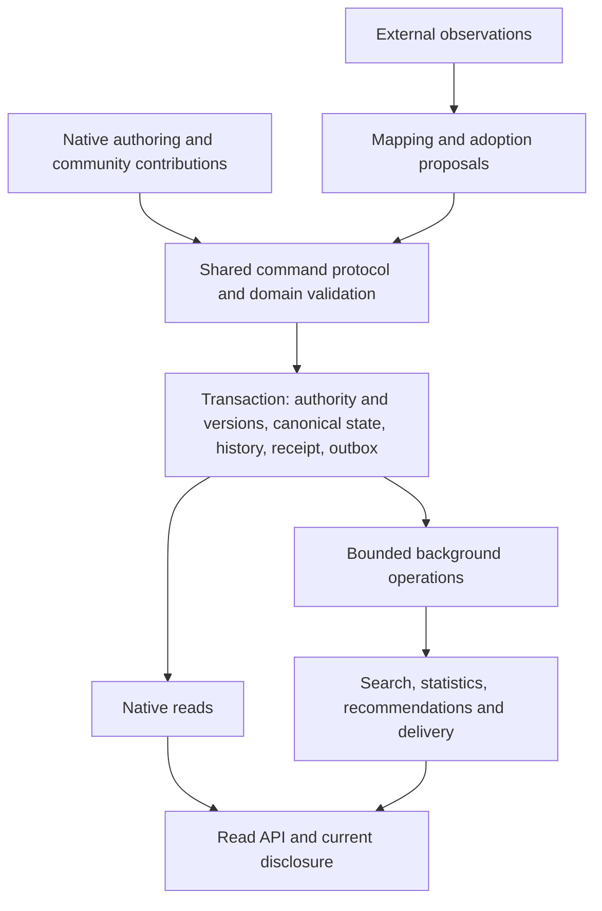

# REZICS whole-database target design

Status: selected target architecture; implementation and qualification follow the [current plan](../../plan/README.md).

This is the whole-database design authority, including private and operational state. The [execution workflow](../../plan/execution-workflow.md) owns program authority and compatibility policy; the plan owns module sequence and progress. New-system integrity, source conversion, installation, history and recovery remain required capabilities.

Read [the dictionary](data-dictionary.md), [native Work](native-work.md), [catalog model](catalog-model.md), [composition](content-composition.md), [creation](creation.md), [Graph API](relationship-graph.md), [ratings](ratings.md), [event-time discovery](event-time.md), [Hub](ai-hub.md), [design evidence](design-evidence.md), [schema coverage](../../testing/database/current-schema-map.tsv), [API coverage](../../testing/database/api-coverage.tsv), [scenarios](../../testing/database/scenarios.tsv), and [capacity](capacity.md). The [design checker](../../testing/database/check_design.py) verifies coverage and arithmetic, not SQL behavior or source conformance.

Dependency policy: a clean Git checkout contains every local design/reproduction input. Temporary directories and machine-local attachments are not dependencies. Public HTTPS references support research; inventory/calculation reproduction needs no network. The [dependency manifest](../../testing/database/dependency-manifest.json) lists local documents, schema inputs, API-owner directories and public sources.

[Schema.org and Wikidata interoperability](../semantic-interoperability.md) is a
required full-index contract. Source-model preservation and queryability cover
subjects before native domain mapping; its [additional capacity envelope](../semantic-interoperability-capacity.md)
is not included in the generated native workbook.

## 1. Selected architecture and scope

Use one PostgreSQL write authority initially, in the public schema, with owner-local identity tables and typed domain structures. Separate authored content, publication, content selection, discussion, knowledge assertions, moderation, identity control, and personal activity. Preserve real foreign keys. Keep searchable/current projections rebuildable. Keep large binary payloads in object storage and durable transport in the existing NATS JetStream direction. There is no mandatory graph database, universal Edition, global content table, or all-purpose event-sourced aggregate.

The current separation requirement is logical: owners can evolve their tables behind stable reference and capability contracts, preparing for a later database split. Cross-database deployment, distributed transactions and online relocation are not current implementation deliverables. Existing local partitions remain implementation choices; neither adding partitions nor removing a shared parent table alone proves this separation.

Use a modular application with shared protocols and implementations for references, capabilities, commands, revisions, composition and operations, specialized by domain validation. Existing tables, API routes and module sequencing are revisable implementation choices. The selected product semantics, integrity requirements and measured operating envelope determine those choices. A common abstraction is not a mandate for one parent table, universal event sourcing or application microservices.

“Complete” here means that every existing schema/API owner has a disposition; every selected domain has identity, cardinality, lifecycle, authority and query contracts; and interactions across domains have defined outcomes. It does not mean arbitrary future businesses require no new schema, nor that all upstream fields have already been qualified. Product, commerce, education and compute extensions are specified at their boundaries without creating unused runtime tables.

Selected defaults:

| Decision | Default |
| --- | --- |
| Native ownership | Publishing, music, program, software, entity, grouping, reference and distribution remain meaningful owners; content/social/platform owners are explicit. |
| User-facing kinds | Mutable classifications, presentation choices, contextual roles and workflow choices; never a single exclusive enum controlling every capability. |
| Authored text | Document identity and immutable revisions for short comments, articles, chapters, rules and other content requiring content-level history. |
| REZICS Work | Common native creative identity and continuity across domains; Work/release similarities and differences belong to the native Work contract. |
| Publication | A persistent social utterance/distribution item with an exact published manifest and its own history. |
| Content selection | A canonical slot, versioned adoption decisions, and an explicit current selection. |
| Facts | Claim, evidence, scope-specific acceptance and effective read model are separate. |
| Private state | Private account/persona control, messages, progress and credentials have dedicated tables and restricted access paths. |
| Physical references | Direct domain FKs for structural relations; a validated reference-value bridge for genuinely generic endpoints. |
| Concurrency | Local aggregate/slot version checks and shared/exclusive authorization fences; no global revision counter. |
| Growth | Logical owner/aggregate boundaries, bounded requests, staged large operations, keyset reads and partitionable child keys; physical scale-out has a separate activation gate. |

Implement the selected contracts through the plan's design/test/API gates. Use evidence to resolve gaps; do not request approval again for decisions and environment actions already authorized by the maintainer.

## 2. Coverage and responsibility map

| Domain | Owns | Must not become its authority |
| --- | --- | --- |
| Identity and addressing | Stable native identity, routing, optional scoped addresses, correction/merge resolution | Titles, slugs, source keys, content hashes |
| Account and participation | Private AuthPrincipals, credentials, public Entities, membership, representation and recovery | Imported people, credits, semantic classes or an unverified acting-identity claim |
| Access and rights | Mixed-subject role bindings, scoped delegation, ownership, restrictions, current authority and exact disclosure grants | Classification, Realm display placement, source assertions or unrelated actor/Entity privileges |
| Catalog | Native referents and domain-specific structures | One provider's schema or a social post |
| Knowledge and provenance | Definitions, typed assertions, evidence, acceptance, named forms, identifiers | Votes, audit logs or arbitrary JSON paths |
| Content and assets | Editorial lineages, immutable revisions, files, manifests, asset uses | REZICS Work identity, its adoption decisions or social-publication visibility |
| Social publishing | Publications, reviews, replies, discussions, polls | Catalog editions, facts or generic relation predicates |
| Community and presentation | Realm membership/rules, Zone pages/docks/themes, curation | Global identity, content ownership, implicit execution rights |
| Discovery and participation | Tags, judgments, ratings, following, collections, favorites, progress | Imported statistics or universal engagement counts |
| Communication | Conversations, messages, recipient notifications, delivery/read state | Public Threads or provider delivery receipts |
| Governance and correction | Reports, cases, rule-backed decisions, enforcement, reversals, merge/split cases | Content edits or source synchronization |
| Read models | Search, language indexes, counters, recommendation generations | Canonical facts, authorization or exact history |
| Operations | Outbox, intents, leases, receipts, quotas, reconciliation, recovery/erasure frontiers | Broker ACKs, timestamps or caches |

The inventory includes helper/factory schema modules and PostgreSQL guard files, not only literal table declarations. Existing source inventories and current code are not treated as evidence of fully tested coverage.

### 2.1 System flow and consistency

Observation, native adoption and publication of a selected version are distinct events. A source update does not directly rewrite every parent composition, published selection, count and notification. A policy-authorized automatic adoption uses the same command and authority boundaries as explicit authoring; it is not a bypass.

| Must hold when a command succeeds | May complete through bounded derived work |
| --- | --- |
| Identity/reference integrity, uniqueness, current authority, expected versions, valid domain transitions and complete activation | Search/ranking refresh, non-security statistics, notification delivery, reverse discovery and eligible cleanup |

Small authoritative edits and their history/receipt/outbox commit together. Large operations stage invisible pages and atomically activate a validated generation. A successful response distinguishes committed state from pending projection freshness; direct reads can show the committed result while search catches up. Authorization, audience-sensitive counts and snippets cannot depend on a stale permissive projection. Simple bounded projections may remain synchronous when measured; per-row unbounded fan-out and repeated full recomputation are not the default.

## 3. Identity, references and classification

### 3.1 Identity rules

An owner identity identifies one referent or one independently maintained platform object. A revision identifies a state of that object. An occurrence identifies a use of something in a particular structure. A source key identifies an upstream record under a particular namespace. Equal bytes, equal titles and equal identifiers claimed by sources do not establish native identity equality.

Owner means a stable logical responsibility domain. Public logical references identify that domain and native ID, not an SQL table name, database or shard. Physical placement is an adapter/routing concern. Splitting or moving storage within the same logical owner preserves reference meaning; changing the referent or its logical owner is an explicit correction/relocation decision with historical resolution, not a physical-layout shortcut. Current registries named physical owners are implementation mappings to reconcile with this contract.

An owner table keeps identity and lifecycle. Large editable structures have their own heads and versions; editing a name must not update the root or every other facet. A typed structural anchor remains when historical references depend on it; retirement changes its active capability state, not the meaning of its past revisions. Type-sensitive accepted links pin a capability witness and epoch. Current reads compare that witness with the live capability epoch and return pending/invalid when it no longer applies; they do not wait for an unbounded reverse-edge rewrite to stop treating stale links as verified. A paginated job then revalidates affected links.

Unknown classification is allowed. An unknown referent can be represented under the reference owner without fabricated Work/Release parents. Reclassification within supported capabilities preserves identity. If evidence requires a different logical owner, use an explicit correction/relocation case: preserve the original typed identity and history, establish the new owner representation, and append resolution with field-level assignments. Old IDs remain resolvable. This is not an unchecked update of a discriminator, and references or grants are not silently retargeted.

### 3.2 Generic references without a universal entity parent

Select a reference_value bridge for endpoints whose valid target set spans many owners. It contains id plus concrete nullable target FKs, exactly one present, and a unique partial index for each target alternative. Target owner and logical ID are derived, not independently writable. Targets have no FK to this bridge and can exist without a bridge row. It owns no title, lifecycle, revision, permission, counter or business capability. It stores a validated reference value, not the existence of a native entity. A non-unique expression index on the derived native UUID supports native-ID lookups and joins through generic consumer projections. It adds no separately writable identity field. Keep the per-owner target indexes as the authority for uniqueness and selective concrete-FK checks; the projection index does not replace them.

A bridge value is allocated on first generic use, reused by unique target lookup, and never retargeted. Generic links reference its PK. Direct music-track-to-recording, message-to-conversation and revision-to-document relations retain direct composite FKs. Exact version references use a separate revision_reference bridge whose alternatives reference complete owner-local revision keys. A citation discriminates identity, exact revision, occurrence, fragment and unresolved external target; only the selected alternative is present.

Adding a semantic class changes data, not the bridge. Adding a registered logical owner adds its concrete bridge alternative and validation/index plus resolver and capability registration; it does not add columns or owner-specific business implementations to every generic tag, favorite, grant or association endpoint. Changing an existing owner's physical layout changes its mapping and qualified constraints. Current inline alternatives prove concrete targets but still spread owner dependencies into consumer schemas. Replacing those generic alternatives is remaining module work, not a compatibility requirement. Domain-specific structural FKs remain explicit.

Costs are explicit: one extra lookup, a shared reference table, and an index/row per generically referenced identity. Batch hydration by owner. No global update is required when content changes. Start the bridge unpartitioned to retain per-target uniqueness; do not hash it by reference id and pretend that per-target unique constraints remain global. A future owner-routed layout must specify consumer routing keys, target uniqueness and reference resolution before activation. Cross-database FKs are not promised. A live relocation protocol is required only if that deployment scope is later elected; this program can rebuild its development/test state without dual-read or legacy transfer work.

This preserves CONTRIBUTING's owner-local identity and concrete-FK requirements. Native object existence does not require a global resource parent. A rebuildable locator remains a routing projection and is never a foreign-key authority.

### 3.3 Dimensions formerly hidden in kind

| Dimension | Examples | Storage and change |
| --- | --- | --- |
| Semantic classification | Novel, character, software, hard science fiction, Event, AI model | Governed Tag/Expression/Application and scope decision; catalog classification adapters use this same authority, not a parallel class taxonomy. |
| Structural capability | Recording, executable package, ordered contents | Typed owner structure and versioned capability contract; validated activation/retirement. |
| Contextual role | Reply, chapter, encyclopedia body, creator | Reply target, occurrence or content slot; belongs to the relationship. |
| Presentation | Compact note, article layout, picture presentation | Versioned presentation configuration. |
| Editorial workflow | Author-only, collaborative, reviewed | Explicit policy and grants; existing authorship retained. |
| Lifecycle | Draft, withdrawn, closed, suppressed | Owner-specific state machines. |

No classification or kind gives a user a permission. “Wiki” must be expanded into independently meaningful choices: collaborative editing, encyclopedic purpose, and scope-specific selection. They can occur separately.

### 3.4 Unit capabilities across owner tables

Unit remains the shared logical identity/reference/capability contract. Removing the physical `unit` parent does not remove shared features or require a Tag, favorite or authorization implementation for every catalog class. Owners retain identity and lifecycle; generic feature modules own their behavior and persist validated references. A common reference proves a target, not feature eligibility or permission.

| Boundary | Contract |
| --- | --- |
| Logical identity | `{ owner, id }` identifies a registered native object; a bare-ID entry point resolves its owner through the locator. Neither includes a database address. |
| Owner adapter | Resolve the concrete target; provide bounded state/summary reads, structural eligibility and owner-specific validation; expose exact revision/occurrence references where supported. |
| Generic target storage | Identity consumers use REF; exact content/history uses XREV or a typed occurrence/citation. Keep specialized structural keys local to their actual owner. |
| Capability module | Tag application/judgment, association, favorite, follow, discussion, access and progress each retain their own commands, state and query contracts. Common targeting does not collapse them into one arbitrary relation table. |
| Authorization | Apply the shared access vocabulary to current owner state, grants and scope. Supporting a capability and permitting this actor to use it are separate decisions. |
| Query/presentation | Select bounded reference candidates through feature indexes, batch hydration by owner, and check disclosure before returning metadata or content. Do not scan all owner tables to resolve one ID. |

For example, global Tag applications key subject REF/Tag, Realm applications add Realm scope, and private applications add the account. Their subject-first and Tag-first indexes support both directions without knowing how a Book or music record stores its body. Relation participants use the same reference contract with role and exact-revision validation. Following a Work does not follow every referenced edition automatically; discussing a Work does not give control of its adopted Documents. Repeated, inferred and contextual relationships retain their feature-specific semantics.

Owner admission must declare supported capabilities and their rejected cases; an unknown classification can still use capabilities backed by its actual structure. New semantic classes do not change the owner registry. A new registered owner requires bridge/adapter and applicability tests, but must not require adding its nullable FK to every generic feature. This is the current logical separation acceptance criterion, independent of any future database split. [Foundation acceptance](../../testing/foundation.md#unit-capability-contract-acceptance) owns the remaining cross-feature cases; existing point-reference tests alone do not qualify all capabilities.

Distinguish structural eligibility, domain-feature applicability, actor authorization and a query backend's supported operators. Engine composability is not proof that these meanings are interchangeable. Shared interfaces reduce duplicated integration code but do not establish an O(owners + features) bound on semantic exceptions, tests or query cost. The [evidence contract](design-evidence.md#identity-and-composability) records these limits.

## 4. Common relational contracts

Use UUID identity keys; use bigint for local sequences and serialize values outside JavaScript's safe integer range as strings. Timestamps use timestamptz for real instants. A UUID or creation timestamp is not commit order. Human dates use a precision/calendar-aware value, not invented January 1 timestamps. Durations, counts, dimensions and quantities have explicit units and exactness.

Every durable aggregate has an owning key, state, local version and operation provenance. Immutable records pin their definition/format version. Composite child/revision FKs include owner identity and, where relevant, variant and manifest identity. Foreign-key reverse paths have selective indexes where deletion, reconciliation or reverse reads use them. Nullability is semantic: unknown, inapplicable, absent, not observed, conflicted and inaccessible remain distinguishable.

A completed revision is immutable. Staging can be incomplete but cannot become a public head, selected revision or export reference. The seal operation validates completeness under its aggregate lock. Large manifests validate incrementally with checkpoints, then seal a digest/count/contract witness; no single transaction must scan an unbounded manifest. A sealed parent cannot accept new children. Ordinary mutations append revisions; redaction changes separately owned availability/payload state and records a privileged erasure event.

Use row-local CHECK, NOT NULL, UNIQUE, FK and EXCLUDE where they express the invariant. Cross-row constraints require indexed, bounded guards and a documented concurrency lock, not a CHECK calling a mutable-table function. PostgreSQL accepts a CHECK result of NULL; each discriminated value must separately establish required non-null fields. [PostgreSQL constraints](https://www.postgresql.org/docs/18/ddl-constraints.html)

JSONB is appropriate for bounded versioned rich-content payloads, external raw receipts and reviewed extension values. IDs that must participate in integrity, frequently filtered typed values, authorization state and lifecycle do not hide in JSONB. Content parsing is a versioned service contract; the DB protects storage safety and persisted invariants.

## 5. Catalog domain model

The native model exists without any provider. Keep an explicit owner for each domain with shared protocols for names, assertions, revisions and references. Do not force all domains into Work -> Edition -> Release -> File, and do not promote every scalar into a social identity.

The [native Work contract](native-work.md) defines the common creative object, its platform-maintained virtual form and release distinctions for every domain. Domain-specific structures supply compatible attributes and operations under that contract; the name of a current table does not exempt music, audiovisual or software Works from it.

| Owner | Selected objects and structures | Boundary |
| --- | --- | --- |
| Entity | Person, organization, fictional character, software agent; public descriptions, existence dates and contextual identity assertions | An indexed person is not an account; fictional dates are not real-world lifespan. Control/participation is separately admitted. |
| Publishing | Textual Work scopes, text/translation identities, virtual/actual catalog publications, contents, events, serialization and installments | Shared Work/release contract with independent content; ISBN identifies its applicable issued specification. |
| Music | Composition, recording and album Work scopes where independently maintained; release groups/releases, media/tracks, credits, events, TOCs and alternatives | Work eligibility preserves these distinct referents; track occurrences and printed credits stay contextual. |
| Program | Audiovisual Work scopes, seasons, cuts/versions, episodes, events and ordered occurrences | Episode identity differs from release position; cut/subtitle compatibility is explicit. |
| Software | Project/game Work scopes, functional variants, builds, releases, platforms/languages/media, contribution contexts and patch targets | Exact program compatibility and independent fork continuity; no identity from version labels or upstream staff groups alone. |
| Grouping | Universe/world setting, canon context, franchise, series, membership and selected order | Grouping is not containment, joint distribution, identity equality or authorization inheritance. |
| Reference | Concepts, web resources, areas/codes, places, instruments, events and unresolved referents | External URL existence does not prove a native claim or executable safety. |
| Distribution | Optional mixed-domain package, sealed manifest, repeated members, quantity/coverage | A box set may combine a game, book and soundtrack; no mandatory bundle for standalone releases. |
| Audio/video/assets | Independently cataloged audiovisual content, revisioned media assets, representations, locations, tracks and contextual asset uses | Catalog referent, media asset, encoded representation and default display selection have different identities. |

The dictionary retains the detailed current fields and specialized tables where their meanings remain valid. A field is not copied into a second generic fact table with an independent writer. Each field has one authoritative native write path; generic semantic export can project it with provenance. For an elected source-managed fixed field, that command records the claim/decision and changes its typed effective column in the same transaction. Direct authoring goes through that same command and records human authority. A specialized structural field is owned by its native revision, with evidence pointing to that revision; it need not duplicate its contents into a generic literal assertion. Each mapping declares which of these two contracts applies.

MusicBrainz independently distinguishes works, recordings, releases, release groups, media, track occurrences and ordered artist credits. This supports the grain distinctions, not a requirement to clone its schema. [MusicBrainz schema](https://musicbrainz.org/doc/MusicBrainz_Database/Schema)

VNDB currently describes its edition identifier as VN-local, unstable across edits and used to organize staff. Preserve observation-local correspondence and a native contribution context instead of manufacturing a content version. [VNDB Kana](https://api.vndb.org/kana#vn-fields)

## 6. Names, languages, identifiers, facts and relations

Names have identities and immutable revisions with text, language, script, sort form, usage, validity and context. There may be multiple names in the same language. Officialness is a scoped authority assertion over a particular name revision; preferred display is a separate selection. Credits preserve the name actually used, even after a current name changes.

Language identity follows pinned BCP 47 normalization policy. UI locale, display localization, original language, translation language and supported consumption channels are different fields. Unknown language is explicit; same-language variants are legal. Unicode normalization for matching preserves original source spelling; case-folded lookup keys do not redefine identity. Slug uniqueness uses namespace plus normalized address with byte limits and an explicit redirect/tombstone policy. Namespace reservations and canonical selection are atomic.

Identifiers are claims under versioned namespaces. An ISBN/ISRC/GTIN syntax check does not prove ownership or correct assignment. Keep collisions as candidates unless a particular authoritative namespace contract justifies uniqueness. Provider IDs, native IDs, public addresses and package coordinates have distinct keys.

A knowledge assertion says that a claimant asserts a typed value for a question. Evidence fixes the source observation, source pointer, mapping contract and relevant native/source revision. An acceptance decision says which assertions a scope currently uses. A projection materializes that result. Scope-specific truth must never be implemented as “latest imported row wins.”

[Event-time discovery](event-time.md) elects actual/planned occurrence-date operations over typed effective facts or their single-writer native structures. Category Tags, named-event topics, concrete event identities and Tag-to-event bindings remain distinct. Date precision, uncertain points, durations, recorded time and claim validity survive indexing; classification alone supplies neither a date nor structural capability.

An association is an independently identified relation/event with revisioned predicate, semantic context, valid time and participants. Each participant has a role and stable local slot; repeated participants and repeated relationships are allowed. All role predicates in a query must match the same association revision. Multi-party voice acting, credits and events cannot be reconstructed from unrelated binary edges. [W3C n-ary relations](https://www.w3.org/TR/swbp-n-aryRelations/) supports this modeling distinction; the SQL representation is this design's decision.

Separate three time axes: valid time in the described world, source observation time, and native recorded/committed time. A canon/world context is not a Realm governance scope. Conflicting claims can coexist; only a declared single-valued effective slot forbids simultaneous accepted alternatives within the same scope/context/valid interval. Uncertain dates and intervals are stored as uncertain values, not false exact ranges.

An effective slot is keyed by subject, property contract, semantic context, governance scope and any declared language/variant dimensions. Current decision membership is sealed. New compatible contract versions preserve interpretation; changed meaning gets a new definition identity or explicit migration. Unknown fields retain source evidence and unresolved disposition, not unchecked executable schemas. Provenance links distinguish agents, activities and derived entities; provenance itself does not determine truth. [W3C PROV-DM](https://www.w3.org/TR/prov-dm/)

## 7. Source acquisition, mapping and adoption

Source observation, native adoption and publication of a selected version follow section 2.1's separate transitions. An accepted metadata or content update does not implicitly refresh every importing composition. Structure refresh uses its captured source revision and destination-local changes through the [import protocol](content-composition.md#import-and-refresh-commands). Automatic subscriptions require explicit policy and current authority; source withdrawal cannot remove independent content or silently rewrite published snapshots.

The protocol is provider -> source record -> immutable observation -> mapping proposal -> authorized application -> native assertions/structures and application receipt. Subscription state schedules work; it does not determine truth. A source record can map to multiple native objects, and multiple sources can support one native object. Bindings are versioned, reviewed relationships rather than columns that move silently.

Every observation pins provider, record key, surface, source contract revision, fetch outcome, source version/ETag if available, observation time, payload receipt and coverage. Full, partial, inaccessible, not-modified, deleted and failed observations are different outcomes. A missing field in a narrow API response does not retract a value seen in a dump. The combined surface policy must say which surface is authoritative for each elected field and how freshness is compared.

Every mapped field/occurrence has a journal with source input identity, mapping version, old accepted decision, proposed assertions, exact target revision, human-override epoch and binding/subscription epoch. Saving the same value as a human confirmation creates an independent human claim. It is not skipped as a no-op. “Use source recommendation” remains a distinct command. Withdrawal retracts only that source's support; it does not delete independently supported facts.

Large applications stage immutable parts and dependency outcomes. Each page records its cursor and receipt atomically. Activation checks the complete manifest and current epochs. A lost lease, paused binding, changed permission or human edit prevents stale activation. Omission-driven deletion is legal only for a complete, authoritative fieldset. Retries reuse an operation key; source A -> B -> A is a new observation when causal identity differs, even if payload hashes repeat.

Source redirects are evidence about source records. They neither merge native identities nor transfer human claims, access grants or previous application journals. A persistent resolution record keeps original and resolved source keys and cycle/unknown states.

Current elected conformance families are MusicBrainz, Cover Art Archive, VNDB,
Bangumi, book sources including Open Library, Schema.org document profiles and
Wikidata. [Semantic interoperability](../semantic-interoperability.md) requires
complete source statements and queryable external descriptions, including those
without a native domain mapping. Schema.org vocabulary coverage is separate from
web acquisition coverage; Wikidata namespaces and full-statement surfaces need
explicit inventories. Coverage pins source contract, preservation/query/native/
export disposition and positive/negative cases. Raw retention, statistics-only,
intentionally excluded and unresolved outcomes remain visible. Source account IDs,
individual upstream votes, credentials and private profiles never become native
users/votes. Public source ratings remain dated source statistics. Bangumi archive
relationships and API-only fields need separate inventory; Open Library's API
catalog is an acquisition reference, not full translation/serialization proof.
[Bangumi archive](https://github.com/bangumi/Archive/blob/master/README.md),
[Open Library APIs](https://openlibrary.org/developers/api)

The current convergence report's missing generic source journal, source redirects, VNDB dump joins, secondary MusicBrainz families and complete semantic export are explicitly addressed by these target protocols. No claim is made that their thousands of source declarations were implemented or exhaustively mapped in this design task.

## 8. Documents, publication, selection and discussion

A Document is a maintained content lineage, regardless of length or media. Its variants distinguish language/representation without UNIQUE(document, language). Branches are optional; a simple comment has one default variant and one head. Revisions fix body format, payload/asset manifest, attribution and parents. Same-document revision parents form a DAG; derivations between documents fix input versions and selected spans. Editing, translation, extraction and independent fork are explicit operations.

A social Publication has a stable identity, publisher, originating scope, current publication head and immutable publication revisions. The published manifest can combine document revisions, assets, references and a poll. Pure sharing does not create a dummy body. Publication is not a catalog book publication: use distinct physical names such as social_publication and publishing_publication.

A content_slot identifies a use: scope + subject + role + language/variant dimensions. Required dimensions are canonical and non-null or use NULLS NOT DISTINCT. The role contract declares single or multiple selection. A single slot has exactly one current selection row, which may represent no selection, conflict or an adopted revision. A multi-selection has a sealed membership revision with stable occurrences and ordering. Historical decisions remain independently addressable. Canonical slot identity and the single-current constraint are required integrity rules.

The editor's head, the author's published channel and a Realm's adopted version are different pointers. “Follow updates” is an explicit subscription that produces authorized selection/publication revisions after resolving a release channel; reads never follow a private draft head. An adopted version may remain at r2 while the author publishes r3. Allow same-lineage reuse; fork only for independent maintenance/rights boundaries. Adopters are not credited as original authors merely for selecting content.

A Thread owns topics, moderation scope, participation state and organization. It may exist without a root post. Original causal reply, exact response targets and current placement are separate. A placement is an occurrence with a thread-local parent and order. Moving a reply preserves its utterance, origin and precise quoted version. Native placement parents must be in the same thread/generation and acyclic. A newly created leaf does not run an ancestor closure scan; arbitrary reparenting requires a bounded validation job or rejection into staging.

Ordinary leaf insertion appends to the active layout and its change journal; it does not copy a Thread manifest or increment a shared exact reply counter. The active layout is a mutable topology with versioned changes, unlike a sealed content manifest. Bulk layout generation builds from a consistent snapshot and consumes committed topology deltas. Final switching takes the conflicting generation fence, checks the captured commit frontier and complete delta coverage, and either switches or retries catch-up. If it cannot finish within the activation lock budget, the old layout remains active and writes continue there. New replies must never disappear behind a generation built before they committed. A short explicitly reported write freeze can be selected for an exceptional maintenance operation, not silently imposed on every reply.

Top-level status is explicit: known root, resolved reply, unresolved external parent, or unavailable parent information. Unknown never means root. Imported cyclic claims may remain evidence but cannot activate as a validated native reply tree. A cross-Realm repost creates an independent publication; an administrative transfer preserving an utterance requires a dedicated scope-transfer decision and revalidated audience, not a placement update.

Review role adds a target and optional [rating reference](ratings.md) to a publication; an ordinary opinion is still legal without a numerical score. Exact rating-revision citations and explicitly labeled live views are different contracts. Review-to-article conversion preserves its previous target/history; removing a rating is an explicit rating withdrawal, distinct from detaching its presentation. Publication/reposting never submits another observation. Poll options have stable identities and frozen meanings after voting begins; materially changed alternatives require a new poll/ballot epoch. Closing a Thread, withdrawing a Publication and erasing a payload have independent effects.

### 8.1 Multiple covers and multimedia

Select a media-asset model with five responsibilities: Asset/AssetRevision identifies a maintained media resource and its content descriptor; AssetRepresentation describes an encoding or rendition; AssetLocation records a hosted or external delivery location; AssetUse/AssetUseRevision records how that resource relates to a native subject; and the existing ContentSlot/Adoption protocol chooses a particular use for a display purpose. These are concrete responsibilities within the asset domain, not a new universal parent for Catalog, Document or accounts.

An independently cataloged illustration, recording or video remains a native referent. A scan or photo of its packaging is a media asset; a thumbnail is a representation of that asset revision. A file requiring independent name/version/retention identity can reference a representation through file_asset/file_revision. None of these facts requires manufacturing another Work or copying the media bytes into multiple owners.

| Concern | Selected representation |
| --- | --- |
| Several covers, scans or screenshots | Several AssetUse records, each with its own identity and versioned native association. |
| Original, thumbnail and alternate image/audio/video encoding | Several AssetRepresentation records for one exact asset revision. |
| Same representation on origin server, CDN and local object storage | Several AssetLocation records; URLs are locators, not identities or content hashes. |
| Front, back, spine, disc, booklet, screenshot, promotional image | Versioned role assignments on an AssetUse; a use may have more than one compatible role. |
| Language, territory, edition, component or bundled-work applicability | Typed qualifiers on the exact AssetUseRevision with source/context evidence. |
| Default cover in one Realm, language or page purpose | A canonical ContentSlot adopts an exact AssetUseRevision; no global asset is_primary flag. |
| Gallery ordering | Existing structure/occurrence protocol; keep native curation separate from source order. |
| Caption, credit and crop | Contextual use metadata and adoption-specific presentation; no global overwrite of a reused image. |

A cover of a particular release belongs to that release's AssetUse. A Work page can collect release artwork and select a representative use, retaining the source release and an explicit representational relationship. A representative choice does not assert that every edition uses that cover. The use subject and slot subject may differ only through a validated, authorized representative relationship recorded with the selection; a bare cross-subject image ID is insufficient.

Example: Work W has Japanese release R1 and Chinese release R2. R1 uses assets A/B/C for front/back/booklet, and R2 uses D/E for front/screenshot. A platform default-cover slot for W may adopt R1/A while a Chinese Realm slot adopts R2/D. Both coexist; R1's own cover remains R1/A. An original and three resized encodings of A are one asset revision with four representations, not four covers. A gallery can contain all five uses without erasing the release distinctions.

Source conformance is explicitly scoped. VNDB release images include type, optional applicable VN, language applicability and a photo flag; screenshots associate with a release. Its null language applicability means all languages assigned to that release, not unknown. Store that mode and the observation/release revision used to interpret it; a later language change requires reevaluation before it affects current selection. [VNDB release/image fields](https://api.vndb.org/kana#release-fields)

Cover Art Archive returns ordered entries with zero or more types, original/thumbnail locations, main-front/main-back flags, approval and edit evidence. Front classification and main-front selection are different source facts. Release-group results identify the release supplying their artwork; preserve that origin. Source approval and primary-image flags become evidence/proposals, not REZICS moderation or unconditional native selection. [Cover Art Archive API](https://musicbrainz.org/doc/Cover_Art_Archive/API)

Asset content descriptors are immutable; remote-byte assurance is explicit. Distinguish a verified digest, a provider revision claim and an observed locator with unverified bytes. Metadata-only ingestion may index the latter without downloading everything, but it cannot claim an archived byte-exact snapshot. A locator changing bytes produces a new observation/revision proposal or stale/unavailable state. Byte-exact rendering must use a verified representation/cache, rather than following an unchecked changing URL. Representation aliases that resolve to the same known bytes remain aliases; guessed similarity is not identity proof.

Replacing content creates a new asset revision or an independent derived asset according to maintenance intent. Mere resizing/re-encoding creates a rendition with a pinned input and transform contract. A layout crop belongs to the selected use/presentation; an independently maintained retouched composition can become a derived asset. Selected use revisions continue to point to their original asset revisions until an authorized adoption advances them.

Audio/video representations use typed stream, codec, duration, language and channel metadata. Separate subtitle/audio tracks and image posters have exact attachment/derivation references; excerpt time ranges and PDF booklet page selectors pin the correct source revision and selector contract. Unknown duration, unobserved codecs and document-versus-image resources are not flattened into image dimensions or untyped strings.

Source withdrawal retracts only its support for a media association. Independent human/source support and authorized adoptions are evaluated separately. A narrow/failed image response does not withdraw an entire gallery. Asset/use/adoption visibility, exact disclosure and current moderation are checked before original, thumbnail, preview, export or proxy delivery. Cached derivatives and queued conversions participate in erasure and fencing. Source image-risk statistics, contextual spoilers, content rating and native display policy remain independent.

If an adopted use becomes unavailable, retain its selection history and return an explicit unavailable state. A fallback is an authorized, versioned selection policy applied after current eligibility checks; it must not silently choose a private, wrong-language or different-edition image. Ordinary source reordering cannot replace a human-selected cover. Two concurrent changes to one default slot use the existing single-head/CAS invariant; galleries remain multi-item.

PostgreSQL stores identities, relations, versioned descriptors and bounded technical metadata. Object storage holds admitted binary files; local caching is optional and budgeted. The capacity model includes a separate media-bearing-subject scenario with use/revision/representation/location amplification and a full-hosting binary envelope. It is supplementary to catalog/social metadata and must be combined without double-counting shared references, selections or audit records.

## 9. Structure, curation, tags and presentation

The [composition contract](content-composition.md) owns local membership, navigation/consumption distinctions, explicit subtree import/refresh, exact publication, progress and measurement. Work and release use the same protocol with domain-specific constraints. Complete logical contents are not a requirement for one request to load/write the whole tree. Family discovery never supplies unrecorded descendants during reading.

Ordered structure uses owner -> immutable manifest -> occurrences. Repeated targets are legal. Occurrence identity, ordering, printed numbering, coverage, local title and local credit belong to the occurrence. A chapter text is not identical to its appearance in a book. Different structures may reuse one content revision. Snapshot completeness is declared; an unknown contents list is not an empty complete list.

Retain domain-specific structural tables for music TOCs, software participation contexts and mixed distribution members. Use the shared manifest protocol, not one permissive table for every invariant. Fractional positions have a storage byte ceiling; renumbering/rebalancing is staged and atomically activates a generation. Deep and large structures remain representable with bounded traversal budgets and continuation jobs.

Collections own explicit curated membership and ordering, with public or private access. Personal favorites own account-private membership and optional notes. Following, notification subscriptions and membership are separate relations. Progress is account-private and pins both consumption target and the edition/structure generation used to interpret a position. A changed chapter order must not reinterpret old progress. Completion can be explicitly reported or computed against a known complete manifest; missing denominator returns unknown.

Tags remain concepts; tag applications and judgments are contextual evidence. Tag paths, senses, expression ASTs and inference rules retain dedicated validity and governance. Inference projections pin rule generation and can be rebuilt; they do not overwrite direct applications. Hierarchical predicates declare whether cycles are allowed. Semantic spoiler judgments, whole-content labels, concealment marks, content rating and workplace display safety remain independent axes as required by current policy.

Realm represents community grouping and owns membership, governance/rules and local selections. A wiki corpus, including a Realm's wiki pages, can be organized as one or more Collections; an explicit "published in" relationship can also express its publication context. Zone supplies page/navigation/dock and subsite infrastructure, composing one or more Collections into a user-facing subsite with an appropriate rule Realm. Displaying a publication in multiple Zones does not create multiple utterances or confer access. [Realm, Collection and Zone composition](../realm-collection-zone.md) owns these distinctions and the optional, separately modeled Dynamic Collection guide. Dynamic Collection implementation is not a gate for this refactor. Rules have immutable exact versions, stable selected rule identities and versioned acceptance records. A rule change does not retroactively change a historical moderation rationale.

Custom themes retain their existing explicit full-trust external-live preview boundary, exact revision/host installation, review evidence, time-bounded eligibility and emergency kill control. Ordinary content references, software classification or publication do not authorize execution. Observed external bytes are not claimed to be a sealed transitive dependency closure. Presentation documents and their histories remain owned by the host/presentation domain.

## 10. Authentication, authority, privacy and rights

The selected [identity and access contract](../identity-and-access.md) owns private AuthPrincipals, shared public Entities, many-to-many representation, membership and mixed grantees. Org and Realm each support multiple Groups, custom Roles and scoped Bindings. Account management, Entity control and security-role assignment can be granted to an Entity, AuthPrincipal or eligible member set; action-specific assurance and delegation limits remain explicit. Public attribution never exposes the private controller graph or itself authorizes an effect.

Use the canonical @rezics/access vocabulary and independent-grant rules. A request selects direct AuthPrincipal authority or a complete, restricted representation path to an Entity with target rights. It neither unions unrelated actor/Entity powers nor requires the operator to personally hold the Entity's resource rights. Durable institutional assignments and dependent execution delegations have different revocation semantics. Default Entity selection is private convenience, not ownership or a credential. New capabilities need explicit registry review.

[Connected applications](../connected-apps.md) owns OAuth consent, installation service principals, third-party Entity binding, credential privacy and REZICS MCP access. Ordinary GUI flows enter a valid main Entity and disclose collaboration/advanced controls only when useful; the [experience contract](../identity-and-access-experience.md) preserves all API capabilities without requiring ordinary users to understand the authorization graph. Hosted third-party accounts and uploaded-agent/MCP execution remain separately elected capabilities.

Each authority domain has an epoch/fence row. Mutation commands acquire relevant authority fences in deterministic order, then reload policy and aggregate heads under a READ COMMITTED statement snapshot before changing data. Dependency closure includes membership generation, group ancestry, role revision, representation and App authority; revalidate discovery after locking. Dependent operations share-read fences; revoke/transfer takes conflicting exclusive fences held through commit. Authorization is not computed from an earlier REPEATABLE READ snapshot after a lock wait. For exceptional predicate invariants use SERIALIZABLE with bounded whole-command retry and idempotency. [PostgreSQL transaction isolation](https://www.postgresql.org/docs/18/transaction-iso.html)

The revocation contract is linearizable with respect to command commits: a successful mutation either commits before the conflicting revoke or observes the new authority. It does not retract bytes already delivered. Reads authenticate against current policy; private responses are not served from shared unpartitioned caches. Search, history, counts, snippets, existence responses, exports and asset URLs obey the same visibility boundary.

Disclosure grants name exact content/asset revisions, audience, issuer, purpose and current active state. A publication manifest is checked for transitive embedded dependencies during sealing/activation. Public citation alone does not grant body access. Content license claims, platform operation grants, disclosure grants and future commercial entitlements are distinct. Preserve the existing license ledger's immutable declaration, current offering and platform recognition layers: multiple instruments can coexist, at most one offering is open per target/instrument, and ending an offering does not rewrite previous declarations or acquired-rights records. An author withdrawal does not automatically erase an independently permitted adoption, while an applicable erasure order invalidates affected payload delivery.

The application DB role has no ownership/BYPASSRLS privileges. Keep secret/auth tables restricted to dedicated service paths. For account-private tables use RLS as defense in depth where deployed, with transaction-local identity set by trusted server code and pool reset tests. Owner/superuser bypass and policy evaluation semantics must be tested; RLS is not the complete cross-resource policy engine. [PostgreSQL row security](https://www.postgresql.org/docs/18/ddl-rowsecurity.html)

## 11. Moderation, lifecycle and correction

Governance policy decisions retain the existing rule-backed or exact-reversal basis. Reports, evidence, cases, decisions, domain actions, notice recipients and audit outcomes are distinct records. A reversal references one original decision and cannot be applied twice. New judgments cite the allowed current rule sources at decision time; the immutable history pins the actual rule revisions. Machine failures are outcome codes, not invented human rationales.

Catalog retirement, source withdrawal, content suppression, publication withdrawal, Thread closure, account suspension, membership removal and binary erasure each have their own states. Availability has a separate current authority so immutable historical rows do not force disclosure. A historical stub itself is subject to metadata/identity visibility; private existence is not exposed merely because a tombstone exists.

Merge resolution is a governed relation, not a wholesale rewrite of inbound FKs. Preserve original identity, source correspondence, exact revision and operator-requested target. Use a bounded forest with explicit cycle prevention, path-compression projection and a maximum request traversal budget; excessive chains resolve through a reconciliation task. Root locking alone is insufficient unless roots/epochs are rechecked after acquisition. Cross-owner or active-account/persona merges require separate reviewed policies, not catalog auto-merge.

Split/undo is a first-class case with item inventory, candidate destinations, assignments, ambiguous state, approvals and completion criteria. Independent statements and structures can be reassigned with derivation receipts; mixed claims remain unresolved until adjudicated. Restoring a pre-merge state cannot infer which later human edits belonged to which real object. No promise of automatic perfect split is made.

Erasure uses durable requests, per-domain items, legal/policy retention disposition and a monotonic erasure ledger outside the restorable data snapshot. Sensitive literals, names, edit summaries and actor metadata are also erasable; protecting only large blobs is inadequate. Dedupe does not join incompatible retention/rights domains. GC marks an unreferenced payload under a storage-domain fence, waits a grace period, and rechecks references before deletion. Restores replay erasure and revocation frontiers before traffic resumes. Immutable audit stores the event and receipt, not an irrevocable copy of the erased secret.

### Subscribe and resource participation

[Subscribe](../subscriptions.md) is a selected native multi-plan capability for
eligible People/Entities, Realms and other registered targets. Purchased agreements
and complimentary/contributor grants are independent sources: gifts cannot alter
purchase eligibility, pricing, billing anchors or renewal, and paid-source withdrawal
cannot erase independent grants. [D22](data-dictionary.md#d22-subscribe-and-participation-policy-contracts)
owns its target relational families. [Realm participation policies](../realm-participation-policies.md)
compose entitlement admission, separate meters and version-bound review. Rezics Pro
is the first ordinary Realm configuration; no universal Pro identity or alliance
hierarchy is introduced. Runtime work is separately activated through
[M10](../../plan/modules/subscriptions-and-pro.md).

Commercial benefits enter the existing authorization model through registered,
bounded adapters and approved resource mappings. They never replace ownership,
membership/representation or current disclosure. A Realm's accepted publication
must select exact reviewed content; Search, media and discussion consumers cannot
follow an unreviewed source head or import general replies just because a root has
a Pro association. Scope filtering is an additional conjunction, not authorization.

## 12. Messages, notifications and personal activity

Private Conversation and Message own their membership/audience and retention. Messages can share content-format/revision infrastructure but never inherit public Publication visibility by default. A message revision is conversation-bound. Membership records specify whether a joiner can see earlier history and whether departure revokes access; default is explicit join/leave visibility intervals. Per-recipient hiding and sender edit/withdrawal are separate operations. Blocking checks initiation and delivery; changing a block does not rewrite all existing messages.

Notification identity belongs to the recipient delivery, not the triggering event. Dedupe uses recipient + event + channel policy; read state does not change the underlying action. Mark-all uses the established recipient watermark protocol with insertion serialization so concurrently committed notifications remain unread. Provider accepted, delivered, failed and uncertain are separate delivery outcomes. Exactly-once external email is not assumed.

Following, public reactions, ratings and ballots have explicit eligibility and duplicate keys. Decide the identity of the voter for each feature: an Entity for attribution and a private accountability key for duplicate/independent-approval constraints where required. Multiple delegated Entities cannot bypass that rule; distinct accounts alone do not prove distinct natural people. Retain source aggregate statistics separately. Recomputable counters use striped deltas/materializations for hot targets; vote acceptance and ballot uniqueness remain transactional.

[Rating contexts and history](ratings.md) select standing, daily and per-experience observations with separate revision history. A new observation within a context, a correction to the same observation and a different context are explicit API/GUI actions. Default summaries select each rater's latest effective observation and then an equal-rater mean; declared historical contexts may default to mean-per-rater over a named range. Raw observation distributions, submission cohorts and historical-as-of views retain their own clocks and denominators. These are complete target requirements, not an optional future daily-score extension.

Personal favorites, progress, visits, preferences, blocks, notification preferences and recommendation exclusions use account-scoped keys, private read paths and indexed erasure cursors. Studio candidate/recent-visit tables are projections, not new content ownership. No account requires a preallocated matrix of all Units, permissions or notifications.

## 13. Search, recommendation, export and derived state

Published-content projections pin their content/adoption/structure revisions and generation. A source or draft update is not automatically a new public search document. Content indexing retains its native/version identity; occurrence membership supplies container context. Do not copy every descendant's full text into all ancestors by default. Any elected aggregation index accounts for duplication, refresh and authorized hit/snippet/count semantics.

Search candidates are generated from dedicated indexed projections carrying owner reference, scope/visibility generation, content revision, language, classification and semantic-document version. Current authority is checked before disclosure. A stale index may omit a newly allowed item but cannot expose a newly forbidden one. Counts/facets/snippets that cannot be safely filtered synchronously must use an audience-safe index generation or report pending/unavailable rather than leaking hidden data.

Keep provider-neutral query semantics and bounded native execution. Ordinary lookup uses owner/PK indexes. Lists use keysets with a stable tie-breaker. Relation queries bind participant roles to one association revision. Filtered full-text queries use indexed candidate plans with a work budget and continuation; they cannot scan indefinitely to fill a page. Filter-before-top-k and approximate retrieval have different recall contracts. Exact total counts are background aggregates or explicitly expensive operations.

Dynamic schema acceptance and query acceptance are separate. A new property can be stored before it is elected for global equality, range, sort or full-text operations. Each supported operation names its typed authoritative field or effective-fact projection, scope/contract, index, continuation and work bound. A typical numeric projection orders property contract/scope/value/subject with a stable tie-breaker; text, dates and references need their own typed semantics. Index only elected predicates, preserve pending/conflicted/no-selection states and pin the source decision/revision. Do not index every raw claim as accepted truth or promise arbitrary unindexed combinations.

The [external source-query profile](../semantic-interoperability.md#minimum-query-and-export-contract)
elects identity, subject/property, existence, exact typed-value, reverse-reference,
statement-detail and multilingual-name operations across every supported source
property. This is a source-qualified view with its own bounded postings, not a
waiver of native acceptance or arbitrary range/sort/join indexing. Source-only
results use external handles and cannot masquerade as native REF. Independent
coverage dimensions distinguish an archived value from an indexed one.

The elected [event-date operations](event-time.md#elected-query-operations) use typed start-order and range candidate indexes with explicit certainty, actual/planned role and Tag/participant correlation. [Rating distributions](ratings.md#time-distributions-and-drill-down) expose policy, rater/observation counts, generation and contributing revisions. Non-additive per-rater range reductions use sufficient state and bounded materialized jobs. Both follow the [temporal workload envelope](temporal-capacity.md); arbitrary scans, averaging daily global means and unsafe stale counts are not accepted implementations.

Generic feature indexes use their own read direction: subject REF/Tag and Tag/subject REF; participant target/role/relation revision; parent/manifest/order/occurrence for contents. A reverse index is an access path, not another owner of the relationship. These logical query contracts survive a table-layout change even if a later database split needs a new physical read projection.

Metrics declare exact inputs, language/channel, coverage, algorithm and occurrence-versus-distinct-content counting. Coalesce dirty work per operation/owner/generation, use validated deltas where possible, and page any required recomputation. Node insertion must not trigger a complete container rebuild for every row. Source changes affect only selected current uses or explicit subscriptions; pinned older publications keep their selected versions, while current disclosure can still suppress delivery. Read-your-writes uses the committed native result or an explicit freshness response rather than pretending asynchronous indexes are already current.

The [current PGroonga/PostgreSQL failure evidence](../../testing/known-failures.md) is not closed by this schema design. Search index selection and extension activation require reproduction of those failures and measured recovery/stability. Keep semantic writes independent from a search extension so a disabled/rebuilding index does not corrupt canonical content. Derived ranking stores algorithm, inputs/watermark, generation and exclusion policy. Activate a recommendation snapshot only after all partitions validate; retain the previous snapshot on failure.

Canonical semantic export includes identities, original/resolved references, exact versions, typed values, context, occurrence roles, evidence and decisions subject to audience and retention. Raw source export and semantic export are separate. Exports pin a consistent snapshot/cut or an explicit version manifest with a completion watermark; an arbitrary timestamp or highest allocated UUID does not establish global commit order. Very large resumable exports use checkpointed snapshots/manifests rather than holding a database transaction open indefinitely. Import/export roundtrips preserve distinctions and unknown states; source-private fields stay excluded.

## 14. Transaction, event and job protocols

Small mutation template: validate bounded syntax -> resolve typed targets -> acquire ordered authority fences -> lock aggregate/slot -> reload and compare expected versions -> append revision/decision and advance head -> write audit/outbox/receipt -> commit. Expensive parsing and external fetches happen before this transaction, but final authority and dependency validation happen inside it. No network operation occurs while holding application row locks.

Lock ordering is authority-domain keys first, owner keys next, then aggregate/slot keys sorted by stable ID; commands touching different subsystems use the same order. A command that discovers an earlier lock key restarts instead of taking it out of order. New leaf insertion reads a parent capability without locking an entire Thread. Topology updates take a separate structural-generation lock. Deadlock/serialization retries are bounded and reuse the logical operation key.

Durable outbox rows are committed with business state. Broker delivery is at least once. Consumer receipt key is consumer + event + semantic operation; duplicate receipt and effect are atomic. Jobs have intent, phase, cursor, generation, lease owner, lease deadline and monotonically advancing fencing token. Every page commit verifies token and source/target epochs. A lease timeout by itself cannot prevent an old worker writing.

Large operations use plan -> staged chunks -> validated complete manifest -> activation -> cleanup. The previous valid view remains available; API responses distinguish partial staging from accepted state. Cancellation and retry preserve receipts. Compensation undoes this operation's still-owned changes only; intervening human edits trigger a conflict item. Queue admission, source-provider budgets, retry count, payload bytes and pending age are bounded. Quota reservations count concurrent admission and are settled/released idempotently; tokens store hashed secrets and revoked state, not plaintext lookup keys.

Structure import/refresh, source application, export, correction and projection rebuild share this operational lifecycle while keeping domain-specific transitions. Persist input versions, destination preconditions, source-to-result correspondence, progress and terminal receipt. A retry reuses operation identity; a new intentional repeated use is a different operation. One completed import emits its semantic completion event rather than publishing every staging page. Cancellation and crash recovery cannot expose a half-built composition or adopt a source's later head by accident.

Outbox and consumer checkpoints are transport coordination, not an authority for domain truth. A consumer behind the retained event frontier must perform a checkpointed rebuild/reconciliation. Local replay includes broker-redelivery and external-provider uncertain outcomes. The existing event-streaming owner remains responsible for NATS/Debezium integration and deployment qualification.

## 15. Physical layout, access paths and capacity

Design table families around their owning aggregate and transactions now; keep physical placement behind the owner boundary. A Work's metadata, an independently revised structure and a contributed Document each retain their own keys and write authority. An anthology's membership does not make all referenced Works or texts its children for storage, locking or deletion. Shared Tag/reference tables remain legal: logical separation is about authority and dependency direction, not a ban on shared storage.

Use owner-local roots and narrow mutable heads. Partition large histories/children by the owning aggregate key so normal reads prune and every unique/FK key includes that routing key. Use time partitions for bounded-retention telemetry/outbox/delivery attempts only when the key/retention contract permits it. Do not create hundreds of partitions for every small table on day one. Target reverse lookups use selective reverse indexes or separately maintained target-routed projections.

The [design evidence](design-evidence.md) distinguishes schema/identity independence, reusable query-engine components, workload-local placement and invariant-based coordination. These are supporting precedents with explicit limits, not a proof of the composed REZICS system or a requirement to add distributed infrastructure now.

PostgreSQL partitioned primary/unique constraints must include the partition key. This constrains reference bridges, global slug uniqueness, token hashes and ballot duplicate keys. Keep small/global directories unpartitioned until a deliberately designed routing conversion; hash partitioning alone does not preserve a missing global uniqueness guarantee. Partitioning improves pruning/maintenance and does not add another machine's write capacity. [PostgreSQL partitioning](https://www.postgresql.org/docs/18/ddl-partitioning.html)

The capacity workbook is executable arithmetic with four independent scenarios: catalog-heavy, social-publication-heavy, private-message-heavy and supplementary media-bearing subjects. It includes reference amplification, retained revisions, assertions/support, relation participants, structures, social interactions, asset uses/representations and read projections. It also prices every listed corpus family at 500,000,000 and 3,000,000,000 rows independently. Scenario totals are not additive without de-duplicating shared identities/references and setting the actual domain mix. Object payloads, hosting fractions, replication, backups, free-space reserve and WAL are reported separately.

The separate [identity/access envelope](../identity-access-capacity.md) budgets mixed membership, role/representation dependencies, OAuth clients/consents and installation credentials; it is not automatically included in this workbook. Reconcile replacements and density before combining totals.

Those scenario assumptions are not a qualification of revised occurrence keys, import correspondence, shared-body reuse or per-release snapshots. Budget their widths, indexes, retained generations and update fan-out before physical acceptance. Replace total-tree/reuse limits only after paged/staged APIs, coalesced statistics and recovery are qualified together; finite request budgets remain required. A bounded adapter can still have unacceptable constant costs. [External scale reports](design-evidence.md#scale-reports-and-their-denominators) retain their operation mix, topology and denominator and do not establish REZICS's capacity.

Initial performance qualification input: 100 mixed reads/s, 20 foreground writes/s, 50 source-object applications/s, 32 concurrent clients and a fivefold burst; additionally exercise measured worst-case relation/structure fan-out and one hot owner/recipient/target. This is an initial test profile, not a forecast or capacity claim. Suggested service goals are p95 <= 100 ms for a 50-item indexed read, <= 250 ms for a small edit, and <= 500 ms for a bounded governance transaction; search and ingestion have separate budgeted classes. Record p99, errors and admission rejection, not only medians.

Load testing must replace assumed bytes, revision counts and source refresh demand. Monitor disk/free-space, index working set, checkpoint/WAL rate, autovacuum lag, dead tuples, transaction age, locks, connection saturation, replica/replay lag, queue age and failed jobs. Connection pooling and admission have finite concurrency; each query's work_mem multiplies by concurrent nodes/queries. No exact global counter is updated for every write to a popular thread/tag/person.

Trigger operational intervention at 70% storage, sustained WAL replay lag beyond the declared freshness/RPO budget, p95/p99 exceeding the accepted SLO, unbounded queue-age trend or a restore/reindex exceeding the maintenance window. First reduce admitted ingest and archive eligible history, then rebuild/partition or add qualified replicas for reads. Before multi-primary/sharding, redesign cross-owner integrity, uniqueness directories and reverse projections explicitly. The 3B estimate can be operationally infeasible on one node even when every query is bounded; that limitation must be measured and addressed, not hidden by a schema diagram.

## 16. Recovery and reproducible installation

Select encrypted base backups plus continuous WAL archival, independent object-store inventory/version retention and a separate erasure ledger. Record a recovery manifest tying DB cut, object receipts, migration/version registry, search/recommendation generations and consumer checkpoints together. Restore databases first, reconcile payload availability and receipts, replay erasure/revocation, rebuild unsafe projections, then admit traffic. PITR needs a base backup and a complete required WAL sequence; recovery time includes data transfer, WAL replay, validation and cache/projection recovery. [PostgreSQL PITR](https://www.postgresql.org/docs/18/continuous-archiving.html)

Proposed service objectives to validate: RPO <= 5 minutes for asynchronously archived business state, RTO <= 4 hours for the elected operational dataset; security erasure/revocation ledgers require separately durable acknowledgement and replay before exposure. These are planning objectives, not achieved guarantees. A full 3B dense catalog may exceed this RTO; the capacity output supplies bandwidth-only lower bounds and requires a revised recovery topology or accepted objective before activation.

Use owning generators and fresh development/test targets to install and rebuild the intended schema. The agent may reset databases, regenerate data and operate the complete development environment autonomously. No old-state migration, compatibility layer, shadow-read parity or dual-write transition is required. Keep the new system's generator/contract checks, source-free authoring, negative constraints, exact history, export and restore tests. Module dependencies and progress live only in [the plan](../../plan/README.md).

## 17. Acceptance and design completeness

Model the system as M = (S, Init, Commands, Next, Queries, I). Identity, content, authority, provenance, selection and projection states compose in S. For each command, define its precondition, locks, postcondition, unchanged identities and emitted durable work. Verify Init implies I and each successful command preserves I under its concurrency contract. A failed command must not leave an accepted partial state.

Required invariant families:

| ID | Invariant |
| --- | --- |
| I01 | Every live reference resolves to the concrete correct owner/variant/revision or an explicit unresolved/tombstone state. |
| I02 | Existing IDs and sealed meaning are not retargeted or silently reinterpreted. |
| I03 | Single-valued slots have at most one current accepted result; conflicts and no-selection are explicit. |
| I04 | Publication/selection never leaks private heads or undeclared embedded assets. |
| I05 | Permission changes serialize with affected successful writes; derived indexes cannot grant reads. |
| I06 | Human confirmation and independent source support survive unrelated source withdrawal. |
| I07 | Original reply, occurrence and source correspondence survive rearrangement and correction. |
| I08 | Staging/sealing, decision membership and native structural topology remain valid under concurrency. |
| I09 | Votes, memberships, quotas and delivery effects respect their feature-specific uniqueness/accountability rules. |
| I10 | Jobs/retries cause at most one effective operation and stale workers cannot activate a generation. |
| I11 | Erasure covers payloads and literals, and restore cannot re-expose erased data. |
| I12 | Reads/writes/maintenance have bounded work or an explicit staged continuation and overflow outcome. |
| I13 | Native semantic export preserves source/claim/decision and temporal distinctions. |
| I14 | Catalog versions, manifestations, occurrences, people/accounts and publication contexts remain distinct. |

The scenario matrix includes combined cases, not only one isolated model per subsystem. Implementation qualification must run real PostgreSQL negative writes and two-connection races, stateful API flows carrying real produced IDs, source-source-human cycles, privacy probes, crash/retry/restore drills and representative EXPLAIN/load tests. Bounded model checking can find counterexamples; passing small models is not a whole-system proof.

The [testing specifications](../../testing/README.md) and [backend gate](../../plan/backend-acceptance.md) own qualification. Design coverage and capacity arithmetic do not establish executable SQL, complete provider mapping, composed-model proof, load stability or recovery success.

## 18. Related contract owners

Owner-local identity, logical Unit capabilities, shared access vocabulary, REZICS virtual-publication Work, independent external editions, versioned rules, private/public identity separation, independent spoiler/rating/display mechanisms and exact theme installation are selected semantic contracts. They are retained for their meaning, not old-data compatibility.

Use explicit roles, content selection, validated references, source journals and independent Threads. Each owning implementation must satisfy its target tests before APIs are treated as qualified. Do not maintain a second progress ledger here.

The proposed reference bridge has a real extra storage and routing cost. The proposed immutable content histories have retention and disclosure costs. Keeping these costs explicit is part of selecting the architecture. If qualification rejects a physical choice, preserve the semantic contracts and revise the physical layout with evidence.

Repository owner references used for this proposal:

- [CONTRIBUTING](../../../CONTRIBUTING.md), [capacity and integrity](../../architecture/data-integrity-and-workload-budgets.md), and [current catalog/source gaps](../../plan/backend-acceptance.md).
- [Catalog owner boundaries](catalog-model.md), [names and authority](../../architecture/catalog-names-and-authority.md), and [distribution composition](../../architecture/catalog-distribution.md).
- [Access vocabulary](../../../libraries/access/README.md), [slug addressing](../../architecture/unit-slug-addressing.md), [license ledger](../../architecture/unit-license-grants.md), and [governance decisions](../../architecture/governance-rule-decisions.md).
- [Spoiler/rating/display distinctions](../../architecture/entity-tag-spoiler-and-measurement-decisions.md), [content structure history](../../architecture/content-structure-history.md), and [content language](../../architecture/content-language-support.md).
- [Theme execution](../../architecture/custom-theme-full-trust-external-live.md), [notification read state](../../architecture/notification-delivery-and-read-state.md), [native merge](../../architecture/native-identity-merge.md), and [event durability](../../architecture/event-streaming.md).

Reproduce design checks from the repository root:

~~~sh
python docs/testing/database/check_design.py --check
~~~

After an intentional source-map, scenario or assumption change, run --write, review generated changes, then --check. Stage intended files and run --check --require-tracked before committing. A fixed source baseline avoids invalidation from unrelated HEAD changes. The generator writes only owned architecture/testing artifacts and never accesses a database, broker, application server or user dataset.
