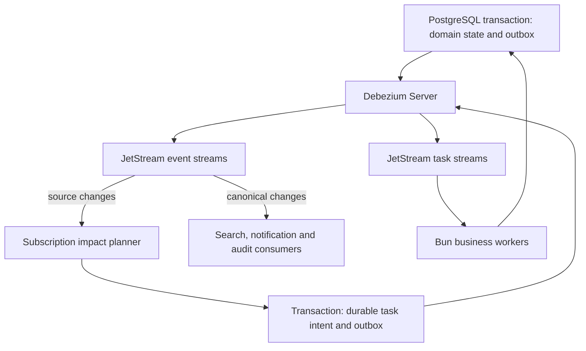

# Event streaming and asynchronous execution

Date: 2026-09-07. Status: **accepted architecture; not implemented or operationally qualified**.
Owners: Main Service, source ingestion, worker runtime and host operations.

The maintainer accepted NATS JetStream as the dedicated event and task transport,
with Debezium Server as the preferred outbox relay to qualify and Bun workers as
business consumers. This document owns that infrastructure decision. The
[source protocol](../report/REZICS-source-integration-and-review-20260906.md#44-generic-source-bindings-and-subscriptions)
owns binding, subscription and adoption semantics; [P10](../plan/operational-refactor-20260906/10-capacity-and-operations.md)
owns workload and recovery qualification. This decision does not close the broader
[catalog design-review gate](../plan/operational-refactor-20260906/00-source-complete-schema.md#design-review-gate)
or authorize code changes, deployment or legacy conversion.

## Decision and alternatives

Use an existing broker for persistence, independent consumption, acknowledgment,
redelivery and bounded replay. PostgreSQL retains transactional business state,
plans, outbox and application receipts; it is not the default transport for all
new event consumers and ready-job queues. Existing specialized queues remain
implementation facts until their owning paths are deliberately integrated.

| Candidate | Fit and selected disposition |
| --- | --- |
| NATS JetStream | Selected for persistent events and competing task consumers with a supported Bun/TypeScript client. Keep business invariants in domain commands. |
| RabbitMQ Streams and Quorum Queues | Strong alternative when traditional queue features dominate; stream retention and queue semantics still require separate designs. |
| Apache Kafka | Reconsider for a dominant long-retained partitioned log, stream-processing or connector ecosystem requirement. |
| Redpanda | Kafka-protocol alternative; account for BSL terms and enterprise features such as Tiered Storage before selecting it. |

This is a fit/operational-complexity decision, not a measured claim that JetStream
is faster than every alternative. Compare equal message sizes, replication,
sync policy, retention and consumer loads. References: [NATS concepts](https://docs.nats.io/concepts/jetstream),
[official Bun/Node transport](https://github.com/nats-io/nats.js),
[RabbitMQ Streams](https://www.rabbitmq.com/docs/streams),
[Quorum Queues](https://www.rabbitmq.com/docs/quorum-queues),
[Kafka](https://kafka.apache.org/41/getting-started/introduction/),
[Redpanda licensing](https://docs.redpanda.com/streaming/current/get-started/licensing/overview/).

Research inspected NATS Server [2.14.6](https://github.com/nats-io/nats-server/releases/tag/v2.14.6),
released 2026-08-27. Pin the tested server/client versions and image digest when
implementation is authorized; do not deploy a floating `latest` tag. Temporal is
a separate future option for durable multi-step workflows with long waits and
compensation, not a replacement for this event transport. See [Temporal's scope](https://docs.temporal.io/temporal).

## Responsibility and data flow

| Component | Authority |
| --- | --- |
| PostgreSQL domain owners | Canonical data, source observations/bindings/subscriptions, check plans, cancellation/revision state, staged work checkpoints, transactional outbox and effective-application receipts. |
| Debezium Server | Capture committed outbox inserts and relay them to JetStream, retaining recoverable connector progress. It does not infer business events from arbitrary table updates. |
| JetStream | Durable transport, bounded event retention, consumer progress, task delivery and redelivery. Broker state does not grant business authorization. |
| Bun workers | Parse versioned messages, plan bounded work, enforce current policy/authority/revisions, call canonical commands and acknowledge durable results. |
| Host operations | Stateful volumes, topology, credentials, monitoring, upgrade/restore and the broker/connector resource budget. |

Subject families separate events from commands. A source observation can trigger
planning; only an accepted canonical change triggers the corresponding search or
public notification update. Event type and consumer filters prevent this diagram
from becoming an unconditional feedback loop.

## Events, tasks and consumers

| Contract | Event stream | Task stream |
| --- | --- | --- |
| Meaning | An identified fact that has happened, such as source-record change or canonical Unit change. | An identified request to fetch, map or apply bounded work. |
| Consumer topology | Independent durable consumers per business purpose and physical stream. | Workers of one purpose share a durable pull consumer and compete for work; consumer filters in a work-queue stream do not overlap. |
| Retention | `LimitsPolicy`; ACK advances that consumer without deleting the event for others. Initial hot-window planning input: 72 hours. | `WorkQueuePolicy`; ACK removes completed work. Failed, expired or cancelled work needs an explicit terminal disposition. |
| Capacity failure | Bound age/bytes; reject excess new writes where needed and propagate backpressure. Retention expiry is independent of ACK progress and must be detectable. | Bound bytes and admission; do not use silent discard-old or implicit expiry to lose unhandled tasks. Use `DiscardNew` on capacity exhaustion and retain durable intent for retry. |

References: [stream retention policies](https://github.com/nats-io/nats.docs/blob/master/nats-concepts/jetstream/streams.md)
and [pull consumption](https://docs.nats.io/learn/jetstream/pull-consumers).

Use bounded pull batches, bytes and outstanding acknowledgments. Scale worker
instances independently of the logical consumer. A SourceSubscription row is
business data, not one broker consumer, stream or permanent timer. Resolve its
impact through indexed/paged source-to-binding lookups and durable fan-out
checkpoints. Large fan-out events may be acknowledged once continuation work is
durably recorded; they must not hold one unbounded transaction open.

Define a typed, versioned envelope with stable event/operation ID, event kind,
source/target reference and owner, relevant aggregate revision, routing epoch,
causation/correlation IDs, occurrence time and a bounded payload or manifest
pointer. Keep the event ID in the body so deduplication does not depend on a
connector forwarding a particular header. Validate untrusted/source data before
constructing native events. No raw source graph, credential or arbitrary SQL is
carried as executable work.

Broker deduplication windows complement durable application receipts; they do not
replace them. ACK only after the local mutation/continuation and its outbox are
committed. Duplicate delivery after a crash must produce one effective mutation.
Recheck subscription/binding/policy versions, current authority and target
revision at final application; a stale worker or a pause/rebind race cannot use
an earlier authorization. Transport redelivery does not itself fence an old
business executor. External delivery uses provider idempotency or explicit
uncertain-result reconciliation rather than claiming exactly-once side effects.

`MaxDeliver` is not a complete dead-letter workflow: exhausted messages can remain
in the stream. Persist failure reason, original event/operation reference and
replay disposition before terminal handling. Bound retry attempts, elapsed time,
delay/jitter, dead-letter bytes and retention. Poison/schema-incompatible work
must not monopolize a consumer or retry indefinitely.

## Transactional outbox and relay

The business transaction writes its state and outbox entry together. The relay
publishes only committed events. JetStream publication acknowledgment precedes
advancing recoverable connector progress; failures may resend the same stable
event ID. Do not issue independent database and broker writes as one logical
operation without this durable boundary.

Prefer the ready-made [Debezium Server JetStream sink](https://debezium.io/documentation/reference/stable/operations/debezium-server.html#_nats_jetstream)
with the [Outbox Event Router](https://debezium.io/documentation/reference/stable/transformations/outbox-event-router.html),
subject to integration qualification. Capture explicitly selected outbox tables,
not the entire domain schema, and test envelope/subject mapping and metadata
preservation. This is new-system outbox relay, not CDC to keep a legacy runtime
alive; the independent offline migration decision remains unchanged.

- Precreate streams with reviewed subjects, file storage, replica count and
  retention; do not inherit the sink's default memory-storage setting or rely on
  basic automatic stream creation for production policy.
- Persist connector offsets and manage one active reader per replication slot.
  Test restart, failover, lost-ack and offset recovery. A restartable single relay
  is not by itself an uninterrupted highly available relay.
- Monitor slot `restart_lsn`, `confirmed_flush_lsn`, WAL bytes/age and relay lag.
  Configure heartbeat/slot limits and a documented catch-up or resnapshot path;
  a stalled connector must not consume unbounded database disk. See [PostgreSQL connector operations](https://debezium.io/documentation/reference/stable/connectors/postgresql.html#postgresql-wal-disk-space).
- Partition/clean outbox and receipts according to delivery/recovery checkpoints
  and replay policy. Cleanup may not remove the only recoverable copy before
  delivery or required archival. Broker backpressure must propagate to bounded
  outbox/WAL admission, not merely move an unbounded queue into PostgreSQL.

If measured connector/replication-slot cost is unsuitable, a bounded PostgreSQL
outbox relay worker is the documented fallback, with the same publication,
idempotency and recovery contract. Record that decision before changing the
integration; JetStream remains the selected broker.

## Scheduling, routing and replay

NATS 2.14 supports [recurring schedules](https://nats.io/blog/nats-server-2.14-release/).
Use broker scheduling for a bounded number of shard wakeups or admitted delayed
messages. PostgreSQL SourceCheckPlan remains the authority for business due time,
pause, freshness and source limits. Workers read due plans through selective
indexes and enqueue bounded work transactionally. A missed or duplicated wakeup
must not lose a due plan or create duplicate effective checks. Do not install
hundreds of millions of broker timers corresponding to Unit subscriptions.

Partition physical streams by stable source-record/target routing keys. Stream
names and consumer counts grow with measured workload shards and business
purposes, not catalog object count. One stream has one write leader; adding
replicas improves fault tolerance, while multiple streams distribute writes.
See [JetStream replication](https://docs.nats.io/learn/topologies/jetstream-in-a-cluster).
Record routing epochs and a checkpointed cutover procedure before changing bucket
placement. There is no global ordering guarantee; concurrent handlers must use
aggregate revision preconditions or explicit per-key serialization where required.

Hot replay is bounded by retained events, not by how long a consumer wants to be
offline. Track the retained floor and oldest unprocessed work. Crossing that
boundary makes the consumer explicitly unhealthy and invokes recovery from an
eligible event archive/outbox or authoritative snapshots and checkpoints; it
must not silently skip to the new head. Search rebuilds use a separate output
generation. Historical replays cannot blindly resend user notifications or
repeat external effects. Source withdrawal/erasure applies to retained payloads,
archives and replay eligibility as well as canonical data.

## Deployment and durability

Follow the [production infrastructure boundary](../operations/production-deployment.md).
The broker is a separate stateful service with pinned versions, stable identities
and dedicated persistent volumes; ordinary API/worker rollouts do not recreate
its data. Host configuration belongs to `../nixos`; relay and consumer process
lifecycle integrates with the existing Nomad boundary when implemented. No new
host topology or resource availability has been verified by this design review.

- Single-node deployment is valid for development/qualification, with explicitly
  limited availability. For production HA, use three independent failure domains
  and three replicas for critical streams and consumer state. Three containers
  sharing one host are not protection against host loss.
- Use file storage and `sync_interval: always` as the critical-event durability
  qualification baseline. Default file writes are not necessarily fsynced before
  ACK; the documented default sync interval is two minutes. Measure throughput
  with the chosen policy rather than quoting Core NATS or relaxed-sync results.
  See [disk synchronization semantics](https://github.com/nats-io/nats.docs/blob/master/nats-concepts/jetstream/README.md).
- Historical [Jepsen tests of 2.12.1](https://jepsen.io/analyses/nats-2.12.1)
  identified data-loss/divergence cases under filesystem/system faults. They do
  not certify or condemn the selected newer version; retain those fault classes
  in qualification and inspect current fixes and upgrade guidance.
- Keep client, cluster and monitoring endpoints on protected internal networks,
  with transport security and scoped publish/consume permissions. Do not expose
  privileged broker credentials to browsers or raw source processors.
- Plan rolling upgrades, quorum loss, damaged-volume replacement, backup/restore
  and version compatibility explicitly. Stateful broker recovery does not inherit
  the stateless application's automatic rollback assumptions.

## Capacity model

These are decimal planning calculations, not benchmarks or hardware promises.
Assume average encoded message size 1 KiB including its envelope, 72-hour event
retention and replication factor 3; exclude broker metadata, receipts, indexes,
WAL, archives, backups and free-space reserve.

| Continuous writes | One copy of message bytes | Three copies |
| --- | ---: | ---: |
| 1,000 messages/s | 265.4208 GB | 796.2624 GB |
| 5,000 messages/s | 1.327104 TB | 3.981312 TB |
| 10,000 messages/s | 2.654208 TB | 7.962624 TB |

For N logical Units, b=2 source bindings/Unit, u=1% of bindings affected daily and
e=6 emitted events/tasks per affected binding, the illustrative arrival rate is
`N * b * u * e / 86400`: about 694 messages/s at N=500M and 4,167 at N=3B.
This is not provider fetch rate; shared acquisition, source overlap, fan-out,
coalescing and retries must be measured separately. Tasks also have different
retention from event logs, so do not apply the event window blindly to all e.

Separately, retaining 500M/3B event records at 1 KiB costs 512 GB/3.072 TB for one
copy or 1.536 TB/9.216 TB for three, before the exclusions above. Domain corpus
size is not the same as hot broker log size. Each growing outbox, subscription,
job-history and receipt relation still needs its own 500M/3B row/index model.

P10 must add actual average/p99 widths, consumer delivery/network amplification,
replication bandwidth, fsync latency/IOPS, concurrency and outstanding-ACK memory,
hot-source/target skew, backlog catch-up, compaction/cleanup, rebuild time and
space. Admission and retention are bounded; source/consumer counts do not live
in one unbounded in-memory map. Use the existing 70% investigation threshold and
the larger of 30% free space or measured restore/rebuild/WAL reserve. Complete
stream/bucket or cluster capacity expansion before forecast growth consumes that
reserve; cross-cluster moves need checkpointed routing and replay evidence.

## Qualification and implementation sequence

1. Finish versioned envelope, source/target references, stream/shard routing,
   outbox/receipt keys and retention/failure contracts under the catalog design
   gate. Broker selection is accepted; these concrete integration details remain
   review work. No source API compatibility layer or legacy import is required.
2. Once implementation is authorized, qualify one path: source check, observation
   plus outbox, relay, event consumer, subscription impact, task stream, canonical
   command, then independent search/notification consumers.
3. Test relay restart and lost publish ACK, duplicate events, worker crash before
   and after commit, expired leases, concurrent pause/rebind, poisoned messages,
   interrupted fan-out, unchanged source checks and out-of-order revisions.
4. Exercise broker node loss, quorum loss, storage pressure/system faults,
   stalled relay/WAL growth and consumer lag beyond retention. Restore must
   detect missing progress and preserve erasure/revocation and effective-once
   business mutations under the documented fault model.
5. Measure 1k, 5k and 10k message/s profiles and bounded bursts with equal message
   sizes, R3, sync policy and independent consumers. Record publication p95/p99,
   delivery lag, steady-state and catch-up throughput, resources and impact on
   P10 foreground/operation SLOs. These rates are test inputs, not promised limits.
6. Pin qualified versions/configuration and actual deployment resources; record
   upgrade/restore and replay procedures before activation. Existing email and
   maintenance jobs are integrated only with their owners' correctness checks.

The current document change runs no broker, connector, migration, benchmark or
deployment. Selected architecture, implementation checks and production
qualification remain distinct evidence states.
