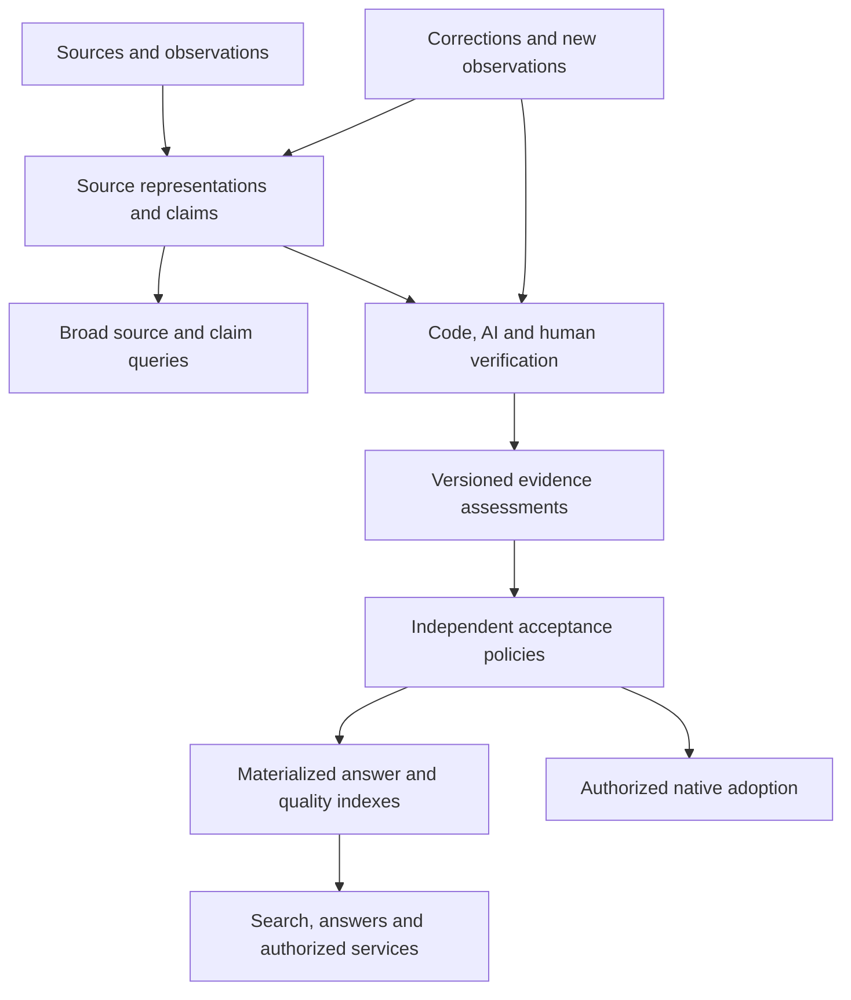

# Information indexing, fact verification and acceptance

Status: selected target, September 15, 2026. This document owns the information
verification workflow, reusable assessments, quality indexes and independent
acceptance choices. Implementation and qualification remain pending under
[M02/M07/M09](../plan/README.md); documenting this target does not activate runtime
work or change the active IAM phase. Subscribe product packaging, prices, service
levels and third-party verifier onboarding remain activation decisions.

## Purpose and ownership

Index a broad range of source descriptions, establish what evidence supports
their claims, and provide useful current answers under explicit acceptance rules.
Share expensive extraction, correspondence and verification work while preserving
the ability to publish competing assessments, challenge decisions and rebuild
permitted results outside REZICS. AI assists this lifecycle; it is not the owner
of facts or the final authorization authority.

| Owner | Responsibility |
| --- | --- |
| [Source interoperability](semantic-interoperability.md), M07 | Source identity, immutable observations/representations, complete supported semantics and source-query coverage before native mapping. |
| [Knowledge contracts](database/README.md#6-names-languages-identifiers-facts-and-relations), M02 | Typed claims, semantic context, evidence/support, assessment meaning and scoped acceptance. |
| [Native domains](database/README.md#5-catalog-domain-model), including M04 | Authoritative domain commands, exact native revisions and adopted effective values. |
| [Search and operations](../plan/modules/search-and-operations.md), M09 | Bounded execution, dependency invalidation, materialized index generations, queries, exchange and recovery. |
| [Subscribe](subscriptions.md), M10 | Offering/plan terms and independent grants for eligible index access or service allocations. |
| [Identity/access](identity-and-access.md) | Actor/Entity representation, operation authority, source disclosure and approved benefit mappings. |

Realm publication/moderation, site scope and factual verification are independent.
A Realm may consume an assessment, but publication approval does not verify a
fact, and a factual disagreement does not itself reject a publication. No Realm
membership or site profile is required to identify a claim, verifier or index.
[Hub execution](database/ai-hub.md) concerns uploaded artifacts and third-party
runtimes; operating a bounded platform verifier does not require that capability.

## Selected architecture and alternatives

Use broad source/claim indexes plus reusable, versioned assessments and explicitly
selected answer indexes. Inclusion records what a source says; acceptance records
what a particular policy currently concludes. High-precision answers can abstain
while the underlying claims remain discoverable under their disclosure policy.
Unmapped domains do not wait for a native entity or a specialist verifier.

| Alternative | Useful property | Why it is not the selected whole-system design |
| --- | --- | --- |
| Verify everything before indexing | Conservative curated catalog | Makes evidence availability and verification cost an admission barrier for the long tail. |
| Broad extraction followed by live RAG for every answer | Flexible exploration | Repeats work and lacks stable assessment, correction and evaluation boundaries unless those are added. |
| One universal confidence score or model majority | Simple ranking | Hides scope, evidence dependence, calibration limits and differences between source and extractor errors. |
| Full P2P multi-writer consensus | Independent operation | Adds semantic/conflict/availability costs without making agreement proof of factual correctness. |
| Broad records, reusable assessments, selectable materialized views | Coverage, reuse and accountable decisions | Selected combination; requires explicit correction, disclosure, capacity and quality qualification. |

Initial hosting may concentrate compute and query infrastructure. Record formats,
issuer identities and acceptance choices must remain separable from that hosting.
Independent views do not imply that all contradictory claims are equally correct;
policies must expose their evidence basis and be evaluated against adjudicated cases.

## Records and invariants

These are logical contracts, not six copies of every native field or a universal
Unit table. Reuse the [dictionary](database/data-dictionary.md#d03-definitions-claims-evidence-and-acceptance)
and source owners with concrete foreign keys or validated reference alternatives.

| Record | Required identity and meaning |
| --- | --- |
| Source observation/representation | Exact source identity, acquisition outcome, observed version/time, retained payload receipt and parser/profile revision. Preserve source statement, qualifier and reference-group correlation. |
| Scoped claim | Immutable issuer claim/revision, typed proposition or exact source statement, semantic context, valid-time meaning and derivation references. An external claim can exist without a native subject mapping. |
| Evidence relationship | Exact claim and observation/span/measurement, supports/refutes relation, extraction method and asserted origin dependencies. The relationship itself is attributable and challengeable. |
| Assessment | Exact claim revision, evidence/input manifest, method revision, executor/issuer, outcomes, quality signals, disclosure and recorded result. New evidence or a changed method produces a new assessment. |
| Acceptance decision | Exact policy revision and assessment basis, scope, selected/contested/unknown/abstained result and predecessor. Native adoption separately invokes its owner's command. |
| Index definition/generation | Stable operated resource, immutable coverage/policy/query contract and a staged generation fixing assessment membership, dependency versions and watermark vector. Rows are derived and rebuildable. |

Keep semantic context, governance scope, access audience and commercial entitlement
separate. Region/language/edition/canon differences cannot be repaired by choosing
a Realm. Observed time, real-world valid time, native recorded time and assessment
time retain different meanings; a later crawl does not automatically supersede an
earlier authoritative announcement.

An index policy can select a source-described answer without allocating a native
identity or writing a native field. Responses identify that selection explicitly.
For native adoption, [source application](catalog-source-lifecycle.md) still pins
binding/mapping, native predecessor, policy and human-override epochs. The elected
native command is the sole effective-field writer; the AI/index service cannot
introduce an independent editable value. Human confirmation of the same value
remains an attributable claim, not a skipped no-op or automatically independent
empirical evidence.

For a native structural field, use an owner-validated read adapter over the exact
native revision and declared property. Its projected proposition is an assessment
input, not a second writable literal assertion. The adapter preserves the native
field's applicability, units, cardinality and disclosure contract.

Content digests identify exact artifacts, not real-world identity or credibility.
Correspondence is a versioned, scoped assertion; similarity and transitive chains
do not authorize merges. Retain ambiguous matches and qualify high-impact false
merges separately from ordinary extraction errors.

## Verification workflow

### 1. Admit and preserve

Acquire under the source owner's rights, network and workload policy. Preserve
immutable observations and supported semantics before expensive verification.
Record malformed, partial, unavailable and unsupported outcomes in coverage;
do not silently remove them from the denominator. Admission uses explicit budgets,
deduplication and abuse controls, without treating publisher volume, popularity,
payment or an AI-authorship detector as evidence of truth or falsity.

### 2. Define a verifiable proposition

Extract an atomic claim with the qualifiers needed to test it. Keep the original
span and extraction version; a plausible paraphrase cannot silently strengthen
the original assertion. Resolve candidate entities and contexts before comparing
values. Unresolved correspondence can stop acceptance without stopping discovery.
Distinguish explicit absence, an unknown value, missing data and a negative claim.

### 3. Select an appropriate method

| Claim class | Preferred verification path | Limit to preserve |
| --- | --- | --- |
| Recomputable quantity or observable artifact property | Re-run the declared calculation/measurement against exact inputs; validate units and procedure. | Correct execution does not establish that the input observations or formula answer the intended question. |
| Institution-defined fact | Inspect the responsible register or exact institutional declaration within its authority. | One institution's authority is field-specific; announced plans differ from observed events. |
| Empirical event or relationship | Find primary records, contextual corroboration and counterevidence; escalate material ambiguity. | Multiple documents may depend on one observation; absence in search is not refutation. |
| Time-varying status | Compare valid-time and supersession evidence, with source-specific refresh policy. | Publication/crawl time alone cannot order truth. |
| Interpretation, rating or classification convention | Attribute the position and version its criteria; validate supporting factual subclaims separately. | Do not manufacture one globally measurable truth from a normative disagreement. |

A method revision declares eligible domains/languages/claim classes, required
inputs, output schema, evidence/search limits, escalation/abstention rules and its
evaluation record. Automatic acceptance is enabled only for a qualified method,
stratum and policy; first-use or out-of-distribution cases remain explicitly
unqualified. Human review is a method with recorded scope and basis, not an
infallible label.

### 4. Retrieve evidence and model dependence

Retrieve both support and counterevidence within bounded work. Preserve exact
observations, spans, source identity and retrieval coverage. Search snippets and
model memory may guide retrieval, but cannot fabricate inspected source evidence.
Source disappearance, failed retrieval and absence of evidence remain distinct.

Record known quotation, copying, syndication and generated-summary dependencies.
An origin group is itself a versioned inference with uncertain membership, not a
permanent union of every similar page. Multiple hosts, authors or model providers
do not prove independent observations. REZICS exports and their derivatives retain
lineage so they are not counted as external corroboration on re-ingestion.
Never penalize an original publisher for an error introduced by an extractor.

### 5. Assess and seal the result

Check entity/context agreement, whether the evidence entails the proposition,
source applicability, conflicts and time validity. Use deterministic checks where
applicable and AI for bounded semantic work. Inputs and retrieved instructions are
untrusted data; they cannot alter tool permissions, evidence requirements or the
acceptance policy. Sensitive evidence cannot be sent to a model endpoint without
the required processing/disclosure authority.

Assessment execution state is separate from its result. A run can be pending,
running, completed, failed, cancelled or superseded; a completed assessment can
find support, refutation, conflict, insufficient evidence or a claim not verifiable
under that method. A provider outage, budget exhaustion or malformed output is not
a negative fact and cannot become successful verification.

Seal an assessment with input digests/references, retrieval outcomes, method/code/
model configuration, checked evidence, structured findings and any permitted
concise explanation. Do not require hidden model reasoning. An output digest
proves which result was recorded; it does not prove correctness or guarantee that
a nondeterministic rerun returns identical output.

### 6. Select answers and maintain them

Apply a versioned acceptance policy to eligible assessments. It declares evidence
requirements by claim class, unresolved-conflict behavior, freshness, permitted
methods and any calibrated thresholds. It may abstain even after an assessment
finds textual support. Do not use a universal minimum number of sources: a
responsible register can suffice for one claim while many copied pages do not.

Maintain indexed reverse dependencies from evidence, correspondence and method
revisions to assessments, decisions and index slices. Source correction, verifier
retraction, method invalidation or identity repair marks affected current outputs
stale/contested/unavailable before their replacement is ready. Fan-out is paged and
coalesced. A source withdrawal removes its own support, preserving independent
human/source support under the existing lifecycle. Split/compensation retains
ambiguity rather than promising perfect automatic undo of later edits.

### Worked example

A publisher announces a Japanese digital release for May 1. Several shops copy
that announcement; a separate publisher lists a Traditional Chinese print release
for June 15. These are two scoped claims, not a majority vote between dates.
The shops do not create several independent confirmations of the digital date.

A later publisher notice reschedules the digital release to May 10. Preserve the
May 1 announcement as historical evidence, select the newer applicable plan for
the digital release, and leave the Chinese print claim unchanged. A later crawl
of a shop's old listing cannot reverse that decision. Actual release still needs
its own evidence; the rescheduling notice proves an announced plan.

## Quality signals and calibration

Publish typed, versioned signals with their evidence and limitations:

| Signal | Meaning |
| --- | --- |
| Entity/context assurance | How the evidence was matched to the exact proposition; unresolved dimensions stay explicit. |
| Evidence support | Direct observation, source entailment or specified inference; preserve known refutation and conflicting assessments. |
| Origin dependence | Known origin groups, derivation links and unknown dependence; never a raw page/model vote count. |
| Temporal applicability | Last check, relevant valid interval, supersession and freshness requirement. |
| Method qualification | Applicable evaluation strata, method version, measured errors and unresolved limitations. |
| Inspectability | Which evidence/procedure the consumer can inspect; restricted, unavailable and unretained evidence remain distinguishable where disclosure permits. |

No universal truth probability or account reputation score is selected. A scalar
ranking is allowed only as the output of a named method/policy; an empirical
probability claim additionally needs calibration against independent adjudication
in the claimed population. Unknown signals are not zero confidence or falsehood.
Issuer identity, human sign-off, popularity and cryptographic validity do not
replace that qualification.

Evaluate accuracy and coverage together. Report source-preservation coverage,
claim-extraction coverage, assessment coverage and answer coverage against their
own declared denominators, plus abstentions, conflicts and inaccessible evidence.
Precision on selected easy answers does not measure the entire source corpus.
Benchmark reference labels have their own evidence, adjudication and valid-time
cut; disagreement or ambiguous ground truth is retained, not forced into accuracy.

Use stratified samples across source, language, property, freshness, risk and
long-tail frequency; report sample sizes, sampling weights and uncertainty.
Hold out origin groups and time periods to reduce derivative leakage. Separate
extractor, entity-matching, retrieval, assessment and final-acceptance errors.
Model self-confidence, agreement with another automated judge and a corpus-level
accuracy interval are not per-claim truth probabilities. Calibration must be
revisited on model/method changes or distribution drift.

Verification scheduling balances expected error impact, downstream reuse, age,
uncertainty and cost. Preserve a separately accounted random/stratified exploration
allocation so popular or paid requests do not consume all long-tail work. Publish
the allocation and coverage effects; exact budgets are workload choices to qualify.
Changing who funds an assessment must not change its evidence criteria or recorded
verdict for fixed inputs and method. Additional funded work may produce a different
assessment through new evidence or another qualified method; record that basis
instead of applying a payment-dependent score adjustment.

## Independent participation and portable assessments

Sources and evaluators can issue immutable records under their own identities.
They append corrections, disputes and supersessions referencing exact records;
they cannot rewrite another issuer's history. A dispute identifies its target,
evidence and basis. Admission and visibility remain policy-controlled; the ability
to publish does not guarantee inclusion or ranking by every operator.

REZICS supplies a versioned default policy and is accountable for its output.
Other operators can issue assessments and policies over the same permitted inputs.
Consumers can choose supported policies and compare their bases. A policy fork
does not acquire authority over the original policy or native owner. Identity and
schema mappings can also be exchanged and challenged instead of forcing all
participants to accept one unchangeable namespace or alignment service.

The first implementation must support versioned import/export of permitted
assessment bundles and a second independent consumer that rebuilds a selected
view. Full P2P replication and cross-database native writes are separate choices.
The exchange profile includes:

- issuer identity, exact claim/source references and semantic vocabulary versions;
- evidence locators/digests, derivation/dependence claims and disclosure/retention
  dispositions, without embedding forbidden payloads or credentials;
- method/configuration and recorded assessment result, policy/decision references
  and explicit source-versus-native selection;
- revision/supersession/retraction links, signature scheme/version where used,
  and key binding/revocation evidence;
- paginated manifests, per-partition change cursors, checksums, coverage/watermark
  vectors and gap-reconciliation semantics.

Verify format, hashes, signature/key binding when present, reference integrity and
current disclosure separately from epistemic acceptance. An unknown signer or
method can remain an untrusted imported record without acquiring native authority.
Identical permitted inputs, recorded assessments and a deterministic policy should
rebuild the same selection; rerunning a model is a new assessment, not that test.
Missing/restricted inputs produce an explicitly partial or non-rebuildable bundle.

Keep assertion, payload availability and legal retention separate. Revocation and
erasure fence local reads, caches, exports and restored data; do not promise to
erase already distributed independent copies. Apply current visibility to digests,
IDs, existence, counts and stubs as well as text. Private source details cannot be
revealed indirectly by an assessment explanation, quality facet or dispute notice.

## Queries, products and Subscribe

### Capability contracts

These logical operations guide later API/SDK/MCP design; they are not claims that
routes, permission keys or persistence adapters already exist. Register actual
permissions through [the access vocabulary](../../libraries/access/README.md).

| Operation | Inputs and observable outcome |
| --- | --- |
| Search source claims | Declared source/semantic scope, typed predicates and cursor; returns source statements, mapping/assessment state and permitted provenance without claiming native adoption. |
| Query accepted answers | Exact index definition and requested/current generation, semantic scope, supported quality predicates and as-of semantics; returns selected values with policy/assessment basis, or explicit abstained/conflicted/stale/unavailable state. |
| Inspect or compare assessments | Exact claim/assessment revisions and permitted evaluator selection; returns evidence relationships and differing outcomes, preserving inaccessible detail boundaries. |
| Request verification | Exact claim/input set, eligible method, disclosure authority, work/cost ceiling and idempotency key; returns an admitted operation or typed rejection, with durable progress/cancellation. |
| Submit assessment/correction | Issuer authority, exact target/input references, method/result or correction basis and expected predecessor; validates and appends, without granting acceptance or editing another issuer. |
| Define/build an index | Operator authority, versioned coverage/policy/query profile and expected generation; stages a bounded build, then conditionally activates a complete generation. |
| Export/import a bundle | Profile/version, permitted scope, immutable manifest and resumable cursor; reports fidelity, omitted/unavailable inputs, gaps and integrity/issuer outcomes. |

Omitted quality filters use the index's declared default; explicit unknown states
are queryable. Unsupported filters are rejected, not dropped. Claim search and
accepted-answer selection are explicit operations/modes; no result silently falls
back to unverified material. As-of-data is not as-of-access: current authorization
still applies to historical results.

Cursors bind normalized query, policy/index generation, sort order, semantic scope
and authorization context; revalidate live disclosure on every page. Use keyset
pagination and response/work budgets; return continuation and incomplete reasons
when the authorized scan budget is exhausted. Counts/facets cannot reveal hidden
claims or mix generations. Denied/hidden targets follow the existing non-disclosure
contract; an unavailable evaluator is distinguishable only when permitted.

Every displayed answer carries a compact policy/version, assessment time and
material status; ordinary users can inspect the supporting evidence or ambiguity.
Advanced consumers can select qualified policies and quality dimensions. Preserve
these semantics across web, API, SDK, exports and AI-consumed results.

### Commercial boundary

Subscribe can grant access to a registered index, permitted detailed assessments,
freshness service, batch/API allowance or bounded on-demand verification. Eligible
People/Entities and other operators can offer such services without a placeholder
Realm. Every cross-owner benefit needs that resource authority's approval.

Payment and gifts affect access/allocation only. They do not change claim truth,
assessment scores, evidence requirements, native adoption authority or correction
priority for already served known errors. Independent paid and complimentary
sources retain the [purchase invariants](subscriptions.md#purchase-and-complimentary-access-independence),
including gifts never blocking a new purchase or changing commercial terms.

Baseline provenance and material unverified/conflicted/corrected states accompany
any result the caller can read. An enhanced evidence analysis may be restricted,
but a known error cannot remain silently advertised as a current answer to a
non-subscriber. This obligation does not expose private evidence. Missing permission
to substantiate a result must be represented at a safely disclosable level or cause
abstention/unavailability under the index contract.

Specialist indexes, deeper evidence analysis, update tracking and verification
allocations are candidate paid products. Exact tiers, pricing, service guarantees,
licensing and public-versus-premium detail are not selected by this architecture.
Existing M10 beneficiary limits remain in force; third-party consumer/workload
sales need their separately activated commercial and authority contracts.

## Execution, capacity and recovery

Use the existing outbox, NATS JetStream scheduling, task intents, lease fencing and
atomic application receipts. A broker acknowledgement is not semantic completion.
Do not introduce a second database-polled scheduler or an unconstrained autonomous
agent loop. Network/model work occurs outside native write transactions; activation
rechecks all required source, method, policy, authority and predecessor fences.
Retries preserve logical operation identity; ambiguous provider execution must be
reconciled or reported before potentially duplicating charged work.

Keep large evidence/input/output manifests in authorized artifact storage with
bounded database references; respect the existing 65,536-byte outbox envelope.
Methods declare finite input bytes, retrieved documents, tool/model calls, tokens,
wall time, attempts, queue depth/age and per-operator concurrency before activation.
Use backpressure and explicit partial/failed outcomes when limits are reached.

Reuse an assessment only when exact claim/input and method revisions, relevant
time assumptions and processing/disclosure domains match. Cache keys and artifact
deduplication cannot merge incompatible private or retention domains. Reusing an
existing permitted assessment is distinct from commissioning a fresh run; service
receipts and quota accounting must describe which operation was delivered.

### Workload envelope

Apply the [capacity policy](data-integrity-and-workload-budgets.md#capacity-planning).
The following are planning assumptions, not measurements or production defaults.
Source bytes and existing claims are accounted for in their source/native owners;
the [interoperability envelope](semantic-interoperability-capacity.md) must be
combined without counting shared records twice.

Let C be claim revisions, a retained assessments per claim, e evidence edges per
assessment and p materialized profile memberships per claim. Additional rows are
`C*a` assessment headers, `C*a*e` evidence edges and `C*p` memberships. At illustrative
`a=2`, `e=3`, `p=2`, that is `10*C`: 5B rows for 500M claims or 30B for 3B claims.
Policy, correspondence, reverse-dependency, receipt and manifest rows are additional.
Never interpret 500M source subjects as 500M claims without a claim-expansion model.

| Growing family, each independently | Assumed heap plus basic index bytes/row | 500M rows | 3B rows |
| --- | ---: | ---: | ---: |
| Assessment header/revision; method qualification membership | 512 | 256 GB | 1.536 TB |
| Evidence/origin-dependency edge; input-manifest entry | 256 | 128 GB | 0.768 TB |
| Acceptance history/result basis; correspondence revision | 384 | 192 GB | 1.152 TB |
| Answer/profile membership; reverse-invalidation edge; generation-manifest entry | 192 | 96 GB | 0.576 TB |
| Execution/application receipt; exchange checkpoint entry | 256 | 128 GB | 0.768 TB |

Decimal units; widths require measurement with actual keys, values and indexes.
The illustrative assessment/edge/membership expansion alone is 1.472 TB / 8.832 TB
at C=500M/3B. One replica plus 2x provisioning per copy makes 5.888 TB / 35.328 TB,
excluding the additional families, source storage, backups and WAL. At 8 KiB of
retained artifacts per assessment, `a=2` adds 8.192 TB / 49.152 TB before object
replication/retention policy. Independent family baselines are not another sum to
add to this scenario.

For daily changed-claim fraction d, assessed fraction f and r assessment runs per
eligible changed claim, assessments/day are `C*d*f*r`. Run count r is separate
from retained-history multiplier a. At illustrative `d=0.001`, `f=0.1`, `r=2`,
this is 100k / 600k runs/day.
At 2k input plus 500 output tokens/run, that is 250M / 1.5B tokens/day. With a
30-second mean run time, Little's-law steady concurrency is about 35 / 209 before
bursts, retries and headroom; three evidence fetches/run add 300k / 1.8M fetches/day.
Price token classes using the selected provider's then-current terms; these figures
are not a provider quote, feasible concurrency commitment or accuracy prediction.

Every completed run also writes result, evidence, dependency and receipt rows;
measure resulting WAL, storage, model/network cost and hot-origin invalidation.
Common-source fan-out can exceed ordinary update rates by orders of magnitude.
Admission therefore reserves bounded work rather than promising to deep-verify
every indexed claim or periodically call a model over the whole corpus.

### Query and rebuild strategy

Use claim-local assessment pages, evidence-leading reverse dependency indexes and
index-generation/semantic-scope-leading accepted-value and quality postings.
Materialize reusable signals once; admit a finite set of operated profiles instead
of precomputing every user's filter combination. Evaluate supported selective
combinations using indexed predicates, with bounded candidate intersection and
hydration. No LLM call is required on an ordinary accepted-answer query.

Partition histories/dependencies by owning claim/source route and generation or
time where justified. Bootstrap and rebuild stream checkpointed partitions;
incremental manifests reuse unchanged slices and never load the corpus in one
process. Avoid all-pairs entity matching and per-revision whole-index recomputation.
An explicit full rebuild is a budgeted resumable job, not recurring query work.

Capture input cuts, build staged slices, catch up changes and atomically switch
the active generation after manifest/fence checks. Failed builds preserve the last
valid generation, but known invalidations and access revocations fence old outputs
immediately; retaining an old generation does not make it safe to serve unchanged.
Invalidate cache keys and use a current dependency/visibility frontier while paged
repair catches up. If that frontier cannot be checked within budget, return an
explicit unavailable/partial result rather than claim a fresh verified answer.

Before deployment, measure selective/dense filters, deep cursors, high-degree
origins, concurrent corrections, queue saturation, replica lag, interrupted builds,
restore and erasure. Record read latency percentiles, throughput, CPU/RAM/network,
storage/WAL and repair latency at declared workload distributions and both scales.
No numeric production SLO is qualified here. When a partition exceeds the measured
envelope, throttle intake, preserve coverage gaps, and move owned slices through a
separately qualified partition/shard cutover; never silently truncate correctness.

## Delivery and qualification

1. Implement the claim/evidence/assessment/decision lifecycle and correction path,
   with broad source queries and initial methods for representative Work, release,
   date and contribution claims. Keep other source domains discoverable.
2. Compare methods and acceptance profiles using independently adjudicated,
   stratified data. Activate automation only for qualified strata; include abstention,
   long-tail coverage, false merges, update latency and cost per useful assessment.
3. Qualify portable bundles with an independent consumer, index recovery and actual
   query/capacity behavior. Productize eligible services through Subscribe only with
   their own fulfillment and disclosure acceptance.

The [verification scenarios](../testing/information-verification.md) specify the
required outcomes and evidence. No scenarios, benchmarks, third-party interoperability
or paid service levels are marked executed by this document. The existing source
proposal and operational code supplies reusable mechanisms, not a completed general
verification system. Model/provider selection and numeric thresholds depend on
representative evaluations at the applicable verification phase.

## Research basis and limits

Primary sources reviewed September 2026, reused from the design discussion. This
document retains the decisions and source links without depending on a temporary
report or machine-local attachment. The selected composition and commercial
boundary are REZICS design decisions, not a claim of one universally proven stack.

| Source | Selected lesson | Applicability limit |
| --- | --- | --- |
| [Automatic End-to-End Data Integration using LLMs, 2026](https://arxiv.org/html/2603.10547v1) | Automate adapter configuration and candidate alignment; evaluate matching and fusion separately. | Games/music/company experiments use flat tables and 1:1 mappings; configuration cost and matching results do not establish whole-system cost or factual accuracy. |
| [AutoSchemaKG, ACL 2026](https://aclanthology.org/2026.acl-long.942/) | Broad schema induction and extraction can expand index coverage. | Construction scale and semantic alignment are not per-claim truth guarantees. |
| [VeriScore, EMNLP 2024](https://aclanthology.org/2024.findings-emnlp.552/) | Identify verifiable claims and evaluate evidence support. | Support under a retrieval procedure differs from real-world truth and coverage of unverifiable claims. |
| [FactCheck, February 2026 preprint](https://arxiv.org/html/2602.10748v1) | Benchmark internal knowledge, RAG and consensus with resource costs; gains vary by setting. | Particular models, English retrieval and three KG datasets; neither its best scores nor failures establish all current model capability. |
| [Correlated Errors in LLMs, ICML 2025](https://proceedings.mlr.press/v267/kim25e.html) | Model/provider diversity does not guarantee independent errors. | Does not show that ensembles never help; assess incremental benefit on the actual task. |
| [PoisonedRAG, USENIX Security 2025](https://www.usenix.org/conference/usenixsecurity25/presentation/zou-poisonedrag) | Retrieved evidence is an adversarial input; preserve provenance and bounded tool authority. | Experimental attack rates are not universal production rates. |
| [Credible Intervals for Knowledge Graph Accuracy Estimation, 2025](https://arxiv.org/abs/2502.18961) | Report uncertainty around sampled KG accuracy. | A corpus estimate is not a probability for each claim or proof under arbitrary sampling/drift. |
| [W3C PROV-O](https://www.w3.org/TR/prov-o/) and [Verifiable Credentials 2.0](https://www.w3.org/TR/vc-data-model-2.0/) | Exchange agent/activity/entity provenance; distinguish integrity and issuer verification from factual truth. | These standards do not select native storage, trustworthy issuers or factual acceptance policies. |
| [Nanopublication infrastructure, 2026](https://knowledgepixels.com/nanopub-ecosystem-paper/) | Separate publication/query services, exact records, local trust choices and selective replication. | Controlled workload reached 400k records on co-located VMs; adversarial trust-layer stress testing remained future work. It does not qualify REZICS capacity or fact correctness. |
| [Data Commons model](https://docs.datacommons.org/data_model.html) | Unified queries can preserve distinct datasets, provenances and dated observations. | Its emphasis on statistical data does not supply arbitrary-domain verification. |
| [OKF v0.2, July 2026](https://cloud.google.com/blog/products/data-analytics/okf-v0-2-adds-trust-signals) | Exchange provenance, verification and freshness signals rather than imposing one credibility score. | Optional vocabulary and proof-of-concept tooling; human/machine flags do not establish calibrated accuracy. |
