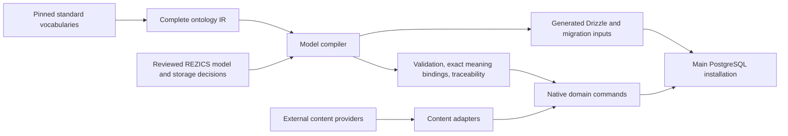

# Standards-driven native modeling

Status: the integrated Resource/model target below was selected on 2026-09-19.
It is a documentation contract, not an implementation or capacity qualification.
The 2026-09-18 compiler scope retains its [executed evidence](../testing/schema.md);
that evidence does not qualify the new naming, model contracts, Space or addressing.
The [plan](../plan/README.md) owns activation and verification timing.

This owner defines the common native model and its compilation boundary.
[Standards adoption](standards-adoption.md) owns external profiles and evidence;
[physical storage](database/resource-storage.md) owns field and table-family choices;
[Space composition](space-composition.md) and
[addressing](resource-addressing.md) own navigation and presentation contracts.

## Native terminology and identity

A **Resource** is a native managed object with stable identity, a logical owner,
an owner-specific lifecycle and declared capabilities. ResourceRef is the shared
reference contract. Generic features do not require a global Resource parent row.
Implementation names and qualified versions are recorded separately in the
[runtime reference](../reference/current-implementation.md).

Resource is a project choice, not an academically mandated name. Web/RDF resource
is broader than the native contract; `schema:Thing`, `prov:Entity`, a database entity
and a REZICS Resource are not automatically equivalent. `qudt:Unit` denotes a
measurement unit. The generic `entity` owner is a Resource implementation without
mandatory specialized domain fields; it is not the superclass or mandatory parent
of all owners. Person/Organization referents use the selected `agent` responsibility;
being described as an Agent grants no login, participation or representation rights.

Logical owners are stable responsibilities, not table names, semantic classes or
storage families. A generic Recipe may gain specialized storage/capabilities while
retaining its logical owner and ID. A true change of referent or logical owner is
an explicit correction, not an incidental consequence of adding a table. Current
registries describing owners as physical must be reconciled during implementation.

| Reference/value | Identity and required distinction |
| --- | --- |
| ResourceRef | Stable logical owner and native ID; optional UUID-only lookup uses a bounded locator, not a scan of every owner. |
| RevisionRef | Exact immutable owner-local version; complete parent keys, distinct from current head and operation attempt. |
| RepresentationRef | Exact language/format/encoding representation of a resource or revision; address and bytes need not share its identity. |
| OccurrenceRef | One use/position/participation within its owning structure; repeated targets remain distinct. |
| FragmentRef | Exact revision/representation plus selector, coordinate unit and resolution state; never an unqualified offset into latest content. |
| DefinitionRef | Stable term identity and precise meaning revision; labels do not identify meaning. |
| ExternalRef | Repository/provider-qualified key or IRI, with source observation scope for anonymous nodes; native adoption is independent. |
| PrincipalRef | Private authentication/accountability identity, separate from public Agent attribution and authority exercised. |
| Typed value | A literal/composite value with declared semantics; not every scalar needs a top-level Resource identity. |

Class, Concept and capability are distinct. Classification assertions and their
scope-specific acceptance can use the governed Tag vocabulary/management surfaces;
community judgments are a different relation and acceptance policy. A SKOS broader
edge does not imply subclass inheritance. Adding a classification neither relocates
storage nor activates a capability. Structural discriminators such as unknown/no-value,
fixed/UUID/slug route targets and value-kind alternatives remain explicit.

## Whole-model coverage

Every existing domain needs a model disposition, including operational and private
state. Completeness is not measured by class, profile or SQL-table counts.

| Native responsibility | Required modeled contracts |
| --- | --- |
| Definitions and descriptions | Class/Concept/Property/Relation definitions, graph and source-node scope, typed logical records, constraints and identity alignments. |
| Claims and knowledge | Assertion, exact evidence, provenance activities, assessments, acceptance decisions, correction/retraction and effective selections. Signature validity and source rank are not acceptance. |
| Language and names | LocalizedText, NameRecord, IdentifierAssignment, independent translation/transliteration, display selection and search comparisons. |
| Values and observations | Exact numbers, QuantityValue, TemporalValue, GeometryValue, Observation and explicit unknown/unsupported states. |
| Catalog | Work/content/version/release/copy grains, recording/track occurrences, software/project/package/build distinctions, Agents, generic entities, groupings and distribution compositions. |
| Documents and media | Document/Variant/Revision, BlockOccurrence, asset/representation/location/use, selectors, publication/adoption and payload availability. |
| Social and personal state | Posts, replies, reviews, polls, ratings, reactions, follows, favorites, progress, messages and delivery; each retains its own state/authority. |
| Spaces and addresses | Shared Space identity, capabilities and role-qualified contexts; mounts, route definitions, namespaces, slug bindings and address preferences. Routes do not allocate a separate page resource. |
| Authority and governance | Private AuthPrincipal, admitted public Agent, representation, role/group grants, policy decisions, enforcement, audit, erasure and recovery. |
| Services and operations | Hub catalog, subscriptions/entitlements, jobs/leases/attempts, receipts, outbox/delivery, projection checkpoints, export and restoration. |

The [dictionary](database/data-dictionary.md) and domain owners supply detailed
keys and commands. A new specialty can use generic descriptions before specialized
operations exist. Each input has an explicit native, descriptive, source-preserved,
lossy or unsupported disposition; absence of a dedicated editor must not prevent
the promised generic create/read/edit/query/export profile.

### Shared value contracts

- LocalizedText retains text, admitted language identity, optional base direction
  and original lexical evidence. Content languages use the IANA/BCP 47 policy,
  independently of the finite UI locale list. Missing language, `und`, `mul`, `zxx`
  and absence of a requested translation remain distinct.
- NameRecord has an occurrence identity, exact revisions, role, language, source,
  scope/validity and derivation. Multiple names in one language are valid. Unicode
  normalization, translation/transliteration and display fallback are separate
  operations. A fallback reports the actual language and selection reason.
- TypedValue preserves zero, false, empty text, missing, unknown, no-value,
  inapplicable, erased and invalid/unsupported input according to its profile.
  Exact decimal/integer values do not pass through an unqualified JavaScript number.
- QuantityValue retains original lexical value, exact number, quantity kind, unit
  definition and precision/uncertainty. Equal dimensions alone do not prove equal
  meaning. Unknown cup systems or density do not justify conversion to mass;
  temperature values and differences require distinct conversion semantics.
- TemporalValue declares instant/interval, precision, uncertainty, calendar/reference
  system and open/unknown endpoints. Valid time, recorded time, phenomenon time,
  result time and operational timestamps are distinct. Scheduling additionally pins
  timezone rules and a policy for ambiguous/nonexistent local times.
- GeometryValue retains CRS, axis/dimension interpretation and original evidence.
  A place is not its geometry; fictional coordinates do not silently become Earth
  latitude/longitude. GeoJSON export must convert or report unsupported geometry.
- Observation relates feature, observed property, procedure/instrument, result and
  relevant times. A source fetch or an assertion about a measurement is not
  automatically the measurement itself.

Source preservation may retain values that a native writer cannot yet interpret.
Comparison, filtering, conversion and full reasoning require individually elected
profiles; retaining a vocabulary does not implement those operations.

## Seven contracts and one model representation

Use typed, declarative TypeScript values as the authoring interface for built-in
native definitions. An interface alone is insufficient runtime validation. Compile
to one serializable, versioned model representation. API-registered definitions
pass the same meta-schema, dependency, review and activation rules; they cannot
submit arbitrary TypeScript, SQL, executable resolvers or validators.

| Contract | Required decisions |
| --- | --- |
| ResourceDefinition | Identity grain, stable logical owner, lifecycle, capability admission and reference behavior. |
| ValueDefinition | Representation, exactness, missing states, language/direction, comparison and supported conversion. |
| RelationDefinition | Occurrence identity, participant roles, eligible reference grains, cardinality, duplicates/order, qualifiers, context roles and evidence/history. |
| ConstraintProfile | Applicable grain/operation, rules, severity and explicit entailment/data-projection assumptions. |
| OperationContract | Current authority, preconditions, state transitions, CAS, idempotency, atomicity, effects and rejected/partial outcomes. |
| StorageBinding | Covered logical scope, physical columns/families, concrete FK proof, codec, unique writer, queries/indexes and replacement contract. |
| ExchangeMapping | Source/target profile versions, direction, transform, residual data, concrete losses and conformance evidence. |

Semantic-definition revision, record revision, operation-contract revision and
storage-binding revision are independent. A release manifest pins their combination;
its digest changing does not mean every predicate acquired a new meaning. No two
active bindings may independently write the same authoritative scope. A derived
projection declares inputs, freshness, disclosure, checkpoints and rebuild behavior.

An illustrative authoring shape follows; these are proposed declaration types, not
an existing SDK or executable migration. The sample separates the stable `program`
logical owner from the `catalog` physical family:

```ts
const credit = {
  key: "https://example.invalid/relations/performance-credit",
  revision: 1,
  identity: "occurrence",
  participants: {
    performedVersion: { reference: "revision", min: 1, max: 1 },
    performer: { reference: "resource", min: 1, max: 1 },
    character: { reference: "resource", min: 0, max: 1 },
  },
  contextRoles: ["semantic-canon", "publication"],
  history: "immutable-revisions",
} as const satisfies RelationDefinition;

const creditStorage = {
  definition: { key: credit.key, revision: credit.revision },
  bindingRevision: 1,
  coverage: { logicalOwner: "program" },
  family: "catalog",
  representation: "generic-relation-family",
  writer: "catalog.relations",
  queries: ["by-performed-version", "incoming-by-performer"],
} as const satisfies StorageBinding;
```

The complete definition also names qualifier/value definitions, role applicability,
ordering, evidence and constraints. The OperationContract supplies actual admission
and transaction behavior. A later native representation keeps the definition when
meaning is unchanged, but versions the binding and its qualification evidence.

First support reviewed bindings and finite command/query templates. Use
[LinkML](https://linkml.io/linkml/intro/overview.html) as a comparison for schema,
mapping and generator capabilities; do not add a parallel YAML authority or replace
the existing TS compiler without a demonstrated gap. JSON Schema 2020-12 and SHACL
profiles are generated/mapped views with explicit supported features. R2RML can
describe relational-to-RDF exports, but does not establish inverse native writes.
The [adoption owner](standards-adoption.md) records these evidence limits.

Physical replacement must prove identity, information and operation preservation
plus a fenced authority cutover. Define logical equality for each value: lists
preserve order, sets use their declared comparison, and occurrences retain IDs.

```text
decode(oldStorage(x)) ==logical decode(newStorage(convert(x)))
```

Exercise legal/rejected writes, visibility, idempotency, revocation and recovery,
not only copied IDs. The current program may rebuild development/test data;
online dual-write and cross-database protocols are not required by this target.
Local-first merging, where elected, cannot bypass current command admission.

### Model admission and qualification

Definitions move through observed, reviewed, admitted, deprecated and retired from
new writes. Retiring new use preserves interpretation of existing revisions.
Changes report read/write/query/export/operation/storage impacts independently.
Artifact version, normative specification version, parser profile and tool support
are separate fields; use pinned inputs and preserve unsupported constructs explicitly.

Maintain one per-field disposition: logical meaning/grain, value/language policy,
constraint owner, authoritative writer, physical binding, supported queries,
exchange loss and test evidence. Extend existing manifests/registries and generators
instead of inventing parallel manually maintained coverage reports.

[Model-contract acceptance](../testing/model-contracts.md) supplies the unexecuted
cross-module cases. The first integrated case combines Recipe, multilingual names,
repeated ingredients/credits, quantities, exact fragments, provenance and two Space
addresses. Existing book, music, software and identity cases remain necessary;
one Recipe fixture cannot qualify every standard or business workflow.

## Authority and automation

| Input/owner | Authority | Automated work | Authored decisions |
| --- | --- | --- | --- |
| RDF/RDFS, selected XSD/OWL, Schema.org, SKOS, PROV-O, Web Annotation, DCMI and BIBFRAME | Meaning of the imported terms and declared axioms | Exact-byte pins, RDF parsing/canonicalization, complete graph and normalized term inventory, hierarchy and property metadata | Selected versions and supported interpretation; no invented equivalence or closed-world constraint |
| REZICS application models | Native referents and admissible operations | Compile types/properties/storage bindings, validation and exchange shapes, Drizzle declarations, traceability and coverage | Grain, cardinality, order, unknown values, edit/evidence semantics, single writer, locality and native projections |
| Native operational owners | Accounts, authorization, queues, leases, delivery and service invariants | Drizzle migration generation and structural inventory | Explicit operational declarations; an ontology does not define account authority or transaction protocols |
| Content adapters | Interpretation of external records | Parse and normalize provider data, preserve occurrence identity and source contracts, call native commands | Mapping/adoption rules and unresolved content; provider SQL/OpenAPI never defines native tables |

Schema compilation does not ingest a Bangumi subject or create a native book.
Content import does not mutate a vocabulary meaning or generate DDL. Their files,
commands, package exports and test denominators have separate owners.



## Semantic rules

- Imported class/property/enum identities and labels remain objects with stable
  UUIDs. Translation edits do not reinterpret meaning. A relationship instance
  has its own identity and revision, independently of its predicate identity.
- Complete selected vocabularies retain all statements, including unrecognized
  OWL axioms. RDFS/OWL entailment declarations are not silently converted into
  SQL validation. Schema.org domain/range hints remain hints until a reviewed
  REZICS rule explicitly narrows the accepted native shape.
- Class inheritance does not create physical parent tables. Account identity is
  independent from a described Person; media occurrence, URL, conceptual asset
  and representation are distinct. Book/Work/Instance/Item grain is explicit.
- Native author/creator credits use identified relations and role definitions;
  audit attribution, locality keys and immutable revision pointers remain columns.
  Existing specialized native credits are authoritative for their domain. An
  open semantic assertion is not an alternative writer for the same accepted fact.
- Evidence/reviews attach to edits or exact assertion revisions. Acquisition
  observations permit replay; they do not introduce a parallel source-book model.
- Datatypes retain exact lexical values and explicit unsupported/invalid states.
  Unknown, no-value, missing, erased and invalid input remain different.

## Definition resolution and caching

Frontend and backend consumers cache resolved definition UUIDs for recurring
queries, including relation and participant-role definitions such as `author`.
Resolve a namespace-qualified stable key once, then reuse the UUID rather than
resolving a display label on every request. A definition UUID identifies meaning;
each relationship occurrence and each exact definition revision has a separate
identity. Compatible revisions and translated labels retain the definition UUID;
an incompatible meaning receives another identity under the dictionary contract.

| Cached value | Key and lifetime |
| --- | --- |
| Stable key to definition UUID | API origin, registry identity epoch, namespace and stable key; retain across ordinary definition revisions. Never silently rebind a stable key to another meaning. |
| Exact definition content | Same registry boundary plus definition UUID and exact revision; immutable meaning content can be reused while disclosure permits. |
| Current revision, activation state and display labels | Separate mutable metadata; revalidate through a registry generation or response validator. Include language and applicable visibility scope in the cache key. |

The registry identity epoch changes when an installation replaces its identity
mapping, not on every vocabulary update. Clients discard mappings when that epoch
or API origin changes; user-scoped metadata follows its own disclosure boundary.
Resolve only the definitions required by a feature, with bounded batch lookup and
cache eviction. A growing user vocabulary is not a mandatory full frontend preload.
Unknown, retired and unavailable definitions remain explicit outcomes; a stale
cache does not authorize a write. The server enforces current admission and the
operation's exact revision/preconditions even when the client already knows the UUID.

For HTTP metadata responses, ETag/If-None-Match permits revalidation without
resending unchanged content, following [HTTP caching](https://www.rfc-editor.org/rfc/rfc9111.html#section-4.3).
This protocol does not make mutable metadata immutable. Definition-cache hits save
resolution work and network requests; relation-result caching has separate
freshness and disclosure rules. [Physical access paths](database/resource-storage.md#relation-query-access-paths)
determine the remaining relation lookup cost. These are target contracts;
[MODEL02 and MODEL40](../testing/model-contracts.md) retain unexecuted acceptance.

## Modeling and generation contract

Standard files compile into a portable ontology IR. Authored model declarations
reference actual source term IRIs and explicitly choose native storage and runtime
constraints. Generated outputs include the Drizzle storage declarations for the
shared semantic model, compiled application rules, source-definition bindings,
exchange shapes and a source-to-model-to-storage trace. The model digest also
pins the reviewed storage DSL, so a changed column or constraint cannot reuse an
unchanged model identity. Hand-authored operational
Drizzle modules remain explicit owners rather than being reverse-engineered into
an allegedly source-derived model. Generators fail on unknown terms, missing
storage targets, ambiguous authority, invalid references and unsupported requested
constraint lowering. Generated files are never input to their own semantic model.

A complete import covers the selected standard's declarations. Native coverage
reports separate dispositions: authoritative native mapping, semantic description,
retained axiom or vocabulary definition. Every native mapping names its referent,
writer and storage path. Generic description support does not claim a complete
business workflow or inference engine.

## Locality and scale

Installed reviewed-model metadata has an explicit admission bound. API-authored
definitions, source graphs and arbitrary user vocabularies do not become bounded
control data merely by name; growing registries need the owning capacity analysis
and selective loading. Images, videos, forum posts,
messages and Wiki revisions allocate IDs locally and have independent write paths.
Logical references never contain a table, database, shard or partition name.
Domain-local relationships can use multiple physical families with one contract.
Per-object/revision predicates and bounded export cursors are required; a global
unbounded scan is not a scaling claim. Keep the repository's 500M/3B local planning
checkpoints while modeling image/video occurrence and revision multiplication at
much larger global scales. No corpus-sized ingestion is required to establish
representation, isolation, portability and rejected-state correctness.

## Evidence and choice limits

[Schema.org's model](https://schema.org/docs/datamodel.html) defines multiple
inheritance and multivalued properties with pragmatic conformance.
[RDFS](https://www.w3.org/TR/rdf-schema/) and
[OWL](https://www.w3.org/TR/owl2-primer/) describe semantics rather than REZICS
transactions. [SHACL](https://www.w3.org/TR/shacl/) supplies shape constraints;
its stable 2017 core is the interoperability baseline, with newer drafts kept
separate. [XSD datatypes](https://www.w3.org/TR/xmlschema11-2/) distinguish lexical
and value spaces. [BIBFRAME](https://www.loc.gov/bibframe/docs/bibframe2-model.html)
provides Work/Instance/Item referents; its ontology artifact version is recorded
separately from the model's name. None of these standards mandates a universal
relational parent, a property-per-column layout or automatic record adoption.

The native model and storage lowering are REZICS engineering decisions, not
conclusions dictated by source prestige. Qualification must exercise generated
storage through real writes and demonstrate loss/unsupported behavior explicitly.

## Implementation and evidence boundary

[Compiler reference](../reference/current-implementation.md#schema-and-artifact-pipeline)
records the actual packages, generated artifacts, current datatype subset and
advisory shape projection. [Executed schema evidence](../testing/schema.md) owns
the earlier fixture results. The [integrated acceptance](../testing/model-contracts.md)
qualifies this target only when its named cases are executed.
