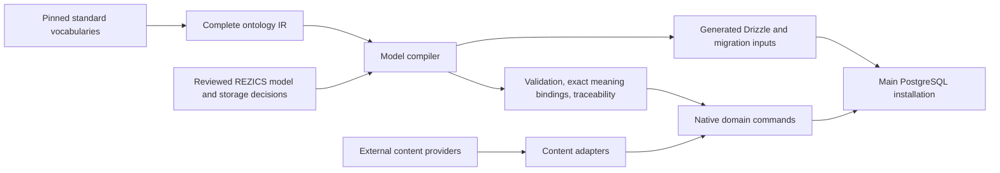

# Standards-driven native modeling

Status: implemented and qualified for the selected schema/compiler scope on
2026-09-18; see [executed evidence](../testing/schema.md). This supersedes the earlier claim
that importing complete vocabularies and moving existing tables completed the
REZICS model. Ontology preservation, native meaning and physical storage require
separate evidence. The execution plan owns the active phase.

## Authority and automation

| Input/owner | Authority | Automated work | Authored decisions |
| --- | --- | --- | --- |
| RDF/RDFS, selected XSD/OWL, Schema.org, SKOS, PROV-O, Web Annotation, DCMI and BIBFRAME | Meaning of the imported terms and declared axioms | Exact-byte pins, RDF parsing/canonicalization, complete graph and normalized term inventory, hierarchy and property metadata | Selected versions and supported interpretation; no invented equivalence or closed-world constraint |
| REZICS application models | Native referents and admissible operations | Compile types/properties/storage bindings, validation and exchange shapes, Drizzle declarations, traceability and coverage | Grain, cardinality, order, unknown values, edit/evidence semantics, single writer, locality and native projections |
| Native operational owners | Accounts, authorization, queues, leases, delivery and service invariants | Drizzle migration generation and structural inventory | Explicit operational declarations; an ontology does not define account authority or transaction protocols |
| Content adapters | Interpretation of external records | Parse and normalize provider data, preserve occurrence identity and source contracts, call native commands | Mapping/adoption rules and unresolved content; provider SQL/OpenAPI never defines native tables |

Schema compilation does not ingest a Bangumi subject or create a native book.
Content import does not mutate a vocabulary meaning or generate DDL. Their files,
commands, package exports and test denominators have separate owners.

## Semantic rules

- Imported class/property/enum identities and labels remain objects with stable
  UUIDs. Translation edits do not reinterpret meaning. A relationship instance
  has its own identity and revision, independently of its predicate identity.
- Complete selected vocabularies retain all statements, including unrecognized
  OWL axioms. RDFS/OWL entailment declarations are not silently converted into
  SQL validation. Schema.org domain/range hints remain hints until a reviewed
  REZICS rule explicitly narrows the accepted native shape.
- Class inheritance does not create physical parent tables. Account identity is
  independent from a described Person; media occurrence, URL, conceptual asset
  and representation are distinct. Book/Work/Instance/Item grain is explicit.
- Native author/creator credits use identified relations and role definitions;
  audit attribution, locality keys and immutable revision pointers remain columns.
  Existing specialized native credits are authoritative for their domain. An
  open semantic assertion is not an alternative writer for the same accepted fact.
- Evidence/reviews attach to edits or exact assertion revisions. Acquisition
  observations permit replay; they do not introduce a parallel source-book model.
- Datatypes retain exact lexical values and explicit unsupported/invalid states.
  Unknown, no-value, missing, erased and invalid input remain different.

## Modeling and generation contract

Standard files compile into a portable ontology IR. Authored model declarations
reference actual source term IRIs and explicitly choose native storage and runtime
constraints. Generated outputs include the Drizzle storage declarations for the
shared semantic model, compiled application rules, source-definition bindings,
exchange shapes and a source-to-model-to-storage trace. The model digest also
pins the reviewed storage DSL, so a changed column or constraint cannot reuse an
unchanged model identity. Hand-authored operational
Drizzle modules remain explicit owners rather than being reverse-engineered into
an allegedly source-derived model. Generators fail on unknown terms, missing
storage targets, ambiguous authority, invalid references and unsupported requested
constraint lowering. Generated files are never input to their own semantic model.

A complete import covers the selected standard's declarations. Native coverage
reports separate dispositions: authoritative native mapping, semantic description,
retained axiom or vocabulary definition. Every native mapping names its referent,
writer and storage path. Generic description support does not claim a complete
business workflow or inference engine.

## Locality and scale

The dictionary/model is bounded replicated metadata. Images, videos, forum posts,
messages and Wiki revisions allocate IDs locally and have independent write paths.
Logical references never contain a table, database, shard or partition name.
Domain-local relationships can use multiple physical families with one contract.
Per-object/revision predicates and bounded export cursors are required; a global
unbounded scan is not a scaling claim. Keep the repository's 500M/3B local planning
checkpoints while modeling image/video occurrence and revision multiplication at
much larger global scales. No corpus-sized ingestion is required to establish
representation, isolation, portability and rejected-state correctness.

## Evidence and choice limits

[Schema.org's model](https://schema.org/docs/datamodel.html) defines multiple
inheritance and multivalued properties with pragmatic conformance.
[RDFS](https://www.w3.org/TR/rdf-schema/) and
[OWL](https://www.w3.org/TR/owl2-primer/) describe semantics rather than REZICS
transactions. [SHACL](https://www.w3.org/TR/shacl/) supplies shape constraints;
its stable 2017 core is the interoperability baseline, with newer drafts kept
separate. [XSD datatypes](https://www.w3.org/TR/xmlschema11-2/) distinguish lexical
and value spaces. [BIBFRAME](https://www.loc.gov/bibframe/docs/bibframe2-model.html)
provides Work/Instance/Item referents; its ontology artifact version is recorded
separately from the model's name. None of these standards mandates a universal
relational parent, a property-per-column layout or automatic record adoption.

The native model and storage lowering are REZICS engineering decisions, not
conclusions dictated by source prestige. Qualification must exercise generated
storage through real writes and demonstrate loss/unsupported behavior explicitly.

## Current implementation decisions

`libraries/schema/model/domains.ts` owns reviewed concept/property rules.
`model/storage.ts` and `model/storage/` own storage layouts; the compiler emits
55 real Drizzle table declarations including metadata, identified relation families,
media, Wiki and description histories. Native layout refactoring used the former
handwritten declarations as mechanical input while preserving reviewed invariants;
that one-time refactor is not a compiler stage or semantic authority. Ongoing edits
are authored in the model, and generated files are output only.

The compiler also checks the named native writers' table/column targets and requires
an ownership decision for each domain. Existing operational modules remain authored
because their authority, lifecycle and query requirements are not consequences of
an ontology. The generated model report names each such owner.

Datatype validation uses an explicit XSD 1.1 subset with exact integer/decimal
lexical handling, calendar bounds, timezones, durations and binary encodings. The
reviewed [rdf-validate-datatype source](https://github.com/zazuko/rdf-validate-datatype/blob/master/src/validators.ts)
on 2026-09-18 had incorrect signed-int endpoints and date regexes without calendar
bounds; it was not adopted as a correctness authority. Unsupported types, including
context-dependent QName/XML processing, remain explicit rather than being silently
accepted. This is not a full XML Schema processor.

SHACL Core projection is advisory and includes a machine-readable lowering report.
RDF direct triples collapse duplicate values, while native relation occurrences
have identities; native ordering, writer authority, CAS and erasure also cannot be
proved by that projection. The portable native model and its actual writer remain
authoritative. Vocabulary class descriptions contain no invented validation rules.

Description commands admit at most 2,048 statement occurrences, 64 declared types
and 8 MiB per revision. Meaning and native-reference checks use batches, not a
query per statement. Reads address one exact object/revision and stop at the
statement budget. The caller owns authentication, disclosure and admission quotas.

At the 500M/3B **revision-row** checkpoints, an additional model UUID and a
16-byte profile key cost approximately 33–40 bytes per populated row before
compression/alignment differences: about 16.5–20 GB / 99–120 GB of heap payload.
This is an estimate, excludes WAL/replication/backups, and is multiplied by the
actual revision rate, not merely the object count. The FK references replicated
model metadata and adds no per-content global identity allocation. The new
meaning guard probes one object/revision and at most the selected 12 vocabulary
releases using their keys; it never scans the corpus. Model selection's metadata
counts are bounded by the installed reviewed model, not content cardinality.

Splitting metadata and content into different databases requires local replicated
model definitions before writes. Remote reference validation, deduplication,
erasure delivery and cutover/rollback remain explicit protocol obligations.
The physical-family transfer fixture exercises IDs and exact content on two
PostgreSQL databases; it cannot establish another engine's transactions, billion-row
throughput or a live cross-service cutover.
