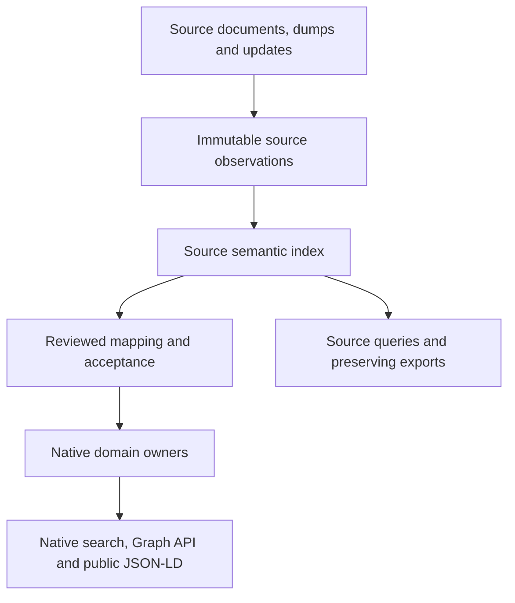

# Schema.org and Wikidata interoperability

Status: standards-driven schema/compiler contracts implemented and qualified,
September 18, 2026. Source-native workflow coverage remains separately qualified.
[Schema modeling](schema-modeling.md) separates standard vocabularies, authored
native decisions/Drizzle lowering, and content adapters. Full vocabulary preservation
is not native-model or whole-source-workflow qualification. The execution plan owns
scope and phase.

The 2026-09-19 [integrated model](schema-modeling.md) and
[standards-adoption matrix](standards-adoption.md) extend the selected target,
not the scope of that executed evidence. This document remains the source-instance
owner for Schema.org/Wikidata; additional vocabulary/value modules and conditional
domain formats have independent profiles and activation. Current artifact counts
do not measure native workflows or all source syntaxes.

Generic descriptions must permit supported instances of previously unmapped classes
such as Recipe without a new physical table or a fabricated unrelated classification.
Pin and report the generic write/read/query/export profile and unresolved semantics.
Source preservation, generic native editing, specialized native mapping and product
operations have separate coverage. [Integrated acceptance](../testing/model-contracts.md)
adds cross-language, occurrence, value, provenance and Space/address cases.

## Meaning of full compatibility

REZICS must ingest, preserve, query and export the complete supported source
model even when a described subject has no native domain mapping. Schema.org and
Wikidata are required interoperability families, alongside existing catalog
sources. Their classes do not dictate native ownership or product operations.

Compatibility is qualified against a manifest, not an unversioned claim:

| Dimension | Required declaration and acceptance |
| --- | --- |
| Vocabulary/model | Pinned vocabulary release, source entity/field/datatype inventory, syntax profiles and parser/mapping versions; every in-scope construct has a disposition. |
| Dataset | Source artifacts, namespaces, document set, revisions, checksums, coverage and acquisition watermarks. A complete pinned dataset differs from a currently synchronized source. |
| Preservation | Original delivered payloads where retention permits, plus source-model semantics including identity, value state, grouping, ordering and provenance. |
| Query | Every supported source property has the minimum operations below, including data without a native mapping. Raw retention alone does not pass this requirement. |
| Native mapping | Reviewed correspondence to existing owners, commands and exact revisions; mapped and unmapped coverage are reported separately. |
| Export | Explicit source-preserving, native-semantic or target-vocabulary profile, with a loss/omission report and a consistent input manifest. |

Schema.org is a vocabulary used across independently published documents. Its
model is extensible and is not intended as a universal ontology. Full vocabulary
support therefore does not establish that every page on the web was acquired.
[Schema.org data model](https://schema.org/docs/datamodel.html)

The Wikidata target includes public current descriptions of Items, Properties,
Lexemes, Forms, Senses and EntitySchemas, all supported datatypes and full
statements wherever the source model admits them. Each acquisition surface must
prove its actual namespace coverage; the word `all` in an artifact name is
insufficient. MediaWiki's complete edit
history, discussion/user pages, Commons MediaInfo and linked file contents are
separate acquisition profiles. Retaining a file reference does not archive its
bytes or inherit their license. Wikidata's structured data uses CC0; linked
resources retain their own rights evidence.
[Wikidata datatypes](https://www.wikidata.org/wiki/Help:Data_type),
[licensing](https://www.wikidata.org/wiki/Wikidata:Licensing)

All required profiles must pass before claiming full compatibility. JSON-LD-first
or Item-only milestones remain explicitly partial. Unsupported future datatypes
or unavailable contexts retain their bytes and diagnostics but block the affected
semantic-coverage claim until qualified; they must not disappear from its denominator.

## Ownership and data flow

The source owner retains original observations and an immutable parsed
representation keyed by observation and parser contract. Search postings and
current heads are rebuildable projections of that representation. M07 owns
parsing/acquisition, M02 owns shared value and mapping semantics, and M09 owns
bounded query/export execution. [Dictionary D14.1](database/data-dictionary.md#d141-source-semantic-representations)
defines their relational responsibilities.

Source nodes identify external descriptions. They are not a universal native
Entity/Unit table, and do not require native REF allocation, accounts, votes or
native editing authority. A source-described chemical, planet, product or lexeme
can be discoverable before any native domain adapter exists. Native adoption continues
through [source lifecycle](catalog-source-lifecycle.md) and domain commands with
concrete foreign keys; no source graph write bypasses native structure or policy.

Acquisition, parsing and rebuild commands require their own current service/intake
authority and provider budgets. They pin input observations, profile and expected
generation, return durable job/coverage receipts, and support idempotent retry and
cancellation. A native proposal grant does not authorize unrelated source intake.

The index describes what each source says. It does not introduce a second editable
native truth. Responses label source claims, native acceptance and mapping state
separately. Repeated independent descriptions can remain distinct search hits;
cross-source grouping requires an explicit correspondence policy and preserves
each contributing description.

[Information verification](information-indexing-and-verification.md) adds a
separate assessment and acceptance layer over these preserved statements. A
statement without a native mapping remains eligible for inspection and assessment;
full-index coverage does not assert full verification coverage. Source discovery
and policy-selected answer queries label different guarantees. Quality filters
consume versioned assessments and cannot rewrite source rank or native values.

This combination preserves the existing [catalog model](database/catalog-model.md):
requiring native promotion before ingestion would exclude unsupported domains;
raw archives would omit usable semantic access. Replacing native ownership with
one triple store would lose its structural guarantees. Retain PostgreSQL as the
initial write authority and object storage for payloads. An RDF/SPARQL engine may
later consume a rebuildable export if measured workloads justify it; selecting
one or exposing arbitrary SPARQL is not required for this contract.

## Identity, values and mappings

- Source identities use provider/repository, record type and exact external key.
  Preserve complete IRIs and original spelling. Known Schema.org HTTP/HTTPS term
  equivalence is a versioned alias policy, not permission to rewrite arbitrary IRIs.
- Anonymous graph nodes are scoped to their input dataset/observation and parser
  contract. Identical blank-node labels from different documents do not identify
  the same thing. Cross-observation correspondence requires evidence.
- Statements and repeated occurrences have independent identity. Do not deduplicate
  them by subject/property/value or use a reference hash as a globally unique key.
  Source IDs remain opaque; local IDs without upstream identity are qualified by
  observation and occurrence path. Original paths/order remain available for replay.
- Values retain datatype and original lexical representation alongside a typed
  comparison representation. Absent, explicit no-value, existential unknown,
  ordinary null, unobserved, failed and erased are distinct states. Parsing cannot
  turn a missing input into a false assertion of nonexistence.
- Mapping revisions distinguish identity correspondence, broader/narrower or
  contextual correspondence, value transformation and unresolved/conflicting
  correspondence. A shared identifier, `sameAs`, sitelink or redirect supplies
  evidence; none alone authorizes native merging, ownership or a Work parent.
- Map source classification to governed Tag/Application evidence, and properties
  to native definition revisions when their meanings agree. `rdf:type`, Wikidata
  instance-of and subclass-of remain distinct relations. A Property can itself
  carry statements; do not reduce its source description to a native field name.

Native mapping pins source statement/observation, mapping contract, target scope
and exact native result. A mapping may preserve only an explicitly declared subset;
its residual source semantics stay queryable. Native acceptance is a separate
decision: a source rank is not trust, permission or accepted truth. Unknown Work,
release, version or lexical correspondence remains unknown.

## Schema.org profile

Pin a published release and its complete machine vocabulary, including retired
terms for interpretation. The release list consulted on September 15, 2026 names
30.0, published March 19, 2026. The developers page distinguishes current terms
from the all-terms artifact including retired terms, and provides HTTP/HTTPS
variants. Use those versioned artifacts rather than the simplified single-parent
display tree or experimental OWL approximation.
[Releases](https://schema.org/docs/releases.html),
[vocabulary artifacts](https://schema.org/docs/developers.html)

The required input profiles are JSON-LD, Microdata and RDFa. JSON-LD is the first
implementation milestone, not the complete syntax gate. Each HTML extractor pins
document URL/base, selected input bytes, extraction locations and processing
profile. Nested items, references across markup and multiple descriptions must
survive extraction. The complete document-set manifest defines acquisition scope.

The JSON-LD profile follows 1.1 processing and preserves named graphs, resolved
IRIs, blank nodes, typed/language/direction-bearing values, reverse properties,
sets and lists. Context resolution records the exact retrieved context and base;
offline replay uses captured contexts. Fetch count, redirects, bytes, expansion
and nesting have admission budgets. Unresolved contexts or unsupported constructs
produce explicit incomplete results. A plain RDF export needs a loss report for
features its chosen RDF profile cannot preserve.
[JSON-LD 1.1](https://www.w3.org/TR/json-ld11/)

Retain raw syntax that processing discards without inventing graph assertions:
ordinary JSON-LD null is not a Wikidata no-value statement. Lists may contain
literal values as well as nodes; JSON literals and direction need their explicit
processing profile. Named/default graph membership remains part of statement
identity and query scope even when two graphs contain the same triple.

Support multiple types and inheritance paths, repeated properties and external
vocabulary. Preserve set/list/container distinctions and repeated ordered
occurrences. Ordinary property arrays do not establish business order. Treat
`domainIncludes`/`rangeIncludes` as vocabulary guidance for diagnosis and reviewed
mapping, not universal closed-world rejection rules. Text where an entity is
expected remains a source value without a fabricated Person. Role intermediates
retain their properties and participants.
[Schema.org conformance and collections](https://schema.org/docs/datamodel.html)

Keep `mainEntity`, `about`, `url`, `identifier` and `sameAs` distinct. A Book/Product
description may describe an external publication specification; neither class
automatically creates a native Work. Offer/Action descriptions do not execute
commerce or application actions. Source ratings remain dated source statistics.

Public landing JSON-LD is the bounded, accepted native projection governed by
[SEO disclosure](unit-landing-seo.md), not automatic republication of imported
markup. Emit only statements supported by that public projection. Vocabulary
validity alone does not establish a search engine's rich-result eligibility.

## Wikidata profile

Acquire complete canonical JSON descriptions as the preservation baseline. Keep
revision metadata, multilingual terms, aliases and sitelinks with badges. A
statement retains its opaque source ID, main snak, qualifiers, reference groups
and preferred/normal/deprecated rank. Qualifiers and reference snaks stay attached
to their exact statement/group and retain repeated values and supplied order
metadata. References without a URL are still structured provenance. Preserve
`value`, `somevalue` and `novalue` independently from missing properties.
[Canonical JSON](https://doc.wikimedia.org/Wikibase/master/php/docs_topics_json.html)

Typed adapters must cover the complete pinned datatype inventory:

| Family | Required preservation and comparison boundary |
| --- | --- |
| Item/Property/Lexeme/Form/Sense/EntitySchema references | Repository-qualified full identity and entity kind; lexical children retain parent identity. |
| Quantity | Exact decimal amount, unit IRI or dimensionless state, lower/upper bounds; retain lexical form and do not use binary floating point as authority. |
| Time | Original time, precision, calendar model, timezone/before/after fields; conversion records its calendar and numbering rule. |
| Globe coordinate | Latitude, longitude, globe and source precision/other supplied fields; do not assume every location is on Earth. |
| Monolingual text and strings | Source language code, text and semantic datatype; normalize a separate matching form. |
| External identifier and URL | Preserve datatype and exact value; validation does not establish identity equality or grant access. |
| Commons media, geo-shape, tabular data | Typed external resource references; fetched bytes require separate observations and rights/availability checks. |
| Mathematical expression and musical notation | Typed notation text; storage does not imply evaluation or rendering. |

These families follow the [datatype inventory](https://www.wikidata.org/wiki/Help:Data_type)
and [JSON datatype encodings](https://www.wikidata.org/wiki/Wikidata:Data_formats/JSON_datatype_encodings).
For time conversion, JSON historical BCE numbering and RDF astronomical numbering
are not interchangeable. Unknown/insignificant month/day and non-Gregorian values
must not become fabricated exact instants. Keep source values even when an elected
native temporal query cannot order them safely.
[Wikibase time encoding](https://doc.wikimedia.org/Wikibase/master/php/docs_topics_json.html)

Lexemes retain lemmas, language, lexical category, Forms with representations and
grammatical features, and Senses with glosses and their own statements. A Form is
not a spelling alias, and a lexical Sense is not automatically a REZICS Tag Sense.
[Lexeme data model](https://www.mediawiki.org/wiki/Extension:WikibaseLexeme/Data_Model)

EntitySchema descriptions retain identity, language terms, ShExC text and exact
revision through a separately inventoried surface. Index their descriptions and
references without silently installing or executing their shapes as native
constraints. Shape validation, if elected, records the exact shape/data cut and
processing budget.
[EntitySchema](https://www.mediawiki.org/wiki/Extension:EntitySchema)

A source-rank view may reproduce Wikidata's best non-deprecated selection: use
preferred statements when any exist for a subject/property, otherwise normal
statements. Keep deprecated statements queryable in the complete source view.
Full RDF and truthy exports are distinct profiles; truthy loses qualifiers and
references and cannot reconstruct the preservation baseline. Full RDF also does
not preserve every JSON presentation order.
[RDF mapping](https://www.mediawiki.org/wiki/Wikibase/Indexing/RDF_Dump_Format),
[dump coverage](https://www.wikidata.org/wiki/Wikidata:Database_download)

## Acquisition and synchronization

Bulk Wikidata acquisition uses checksummed dumps streamed into staged parts;
API reads supply bounded targeted refresh and missing-surface acquisition.
Public WDQS and entity APIs are not the bulk scanning path.
[Official access guidance](https://www.wikidata.org/wiki/Wikidata:Data_access)

Persist change notifications before applying them. Notifications request a fetch
or reconciliation; they are not complete entity payloads. Bind the result to the
revision actually retrieved, deduplicate receipts and prevent late results from
regressing a newer head. Retain a vector of source/partition watermarks and a
per-record revision manifest; dump creation time alone is not an atomic global
snapshot. Establish overlapping change capture for baseline installation, then
reconcile gaps before declaring synchronization current. EventStreams supports
resumption but retains history for a limited, stream-dependent period.
[EventStreams](https://wikitech.wikimedia.org/wiki/Event_Platform/EventStreams_HTTP_Service)

An expired cursor, missing interval or incomplete dump keeps coverage degraded
until a new baseline or explicit inventory reconciliation closes it. Authoritative
delete/restore/redirect evidence uses the source lifecycle; missing query results,
HTTP failures and narrow fieldsets do not imply deletion. Replaying older data
cannot resurrect withdrawn source support. Human adoption and publication keep
their independent revisions and authority.

Schema.org acquisition is provider/document scoped, with bounded crawl/fetch
policy, conditional refresh, redirects and unavailable states. Record provenance
of markup independently from the publisher it names. Source URLs and contexts
use the existing controlled fetch boundary; imports do not execute page actions.

## Minimum query and export contract

Every supported source property, including one without a native mapping, gets:

1. Source identity lookup and generation-bound subject/property pages.
2. Property existence and exact typed-value lookup with stable result keys.
3. Reverse reference lookup and bounded neighborhood traversal.
4. Statement detail with separately paged qualifiers, reference groups and values.
5. Multilingual label/alias discovery preserving the matched form and source.

Exact source equality compares the typed source value under a pinned rule,
including language, unit, calendar or globe where applicable. A matching hash
requires full-value confirmation. Unit conversion, interval overlap, broad text
search, global ordering and ontology inference are separately elected operations.
Existence queries specify main/qualifier/reference role; combined qualifier filters
must match one statement, and reference filters one reference group. Special
value-state queries do not conflate absent with `novalue`.

Requests identify source view, dataset generation, graph scope where applicable,
filters and continuation.
Responses return source record/statement identity, exact observation, mapping
state, supported operations, freshness and complete/partial/unavailable state.
Rejected syntax, unsupported operators, stale cursors and budget exhaustion have
distinct outcomes. The source and native [Graph API](database/relationship-graph.md)
may share traversal machinery, but external node handles never masquerade as REF.
Optional mapping overlays recheck visibility of both sides before disclosure.

Use the [capacity envelope](semantic-interoperability-capacity.md) for bounded
pages, indexed access, skew, ingestion and recovery. High-degree subjects continue
across pages; budgets cannot silently exclude them from full-dataset coverage.
Private source inputs, hidden mappings, counts, snippets and exports follow current
authority, including cache invalidation, revocation and erasure.

The separate
[assessment exchange profile](information-indexing-and-verification.md#independent-participation-and-portable-assessments)
can accompany semantic exports to preserve evaluator, policy, evidence and correction history;
an ordinary vocabulary export does not imply that those records were included.

Semantic export jobs name one of three contracts:

- Source-preserving: original authorized bytes or the equivalent source model for
  the pinned profile; lexical/presentation equality is claimed only for raw bytes.
- Native-semantic: native identity, exact accepted revision, context, evidence and
  decisions through existing domain writers; unmapped source data is separate.
- Vocabulary projection: Schema.org JSON-LD, Wikidata-compatible JSON or declared
  RDF profile with explicit mapped, omitted and unrepresentable fields. Native-only
  records do not receive fabricated Q/P/L/E IDs or imply upstream publication.

No pure Schema.org projection claims to preserve every Wikidata qualifier/rank.
Lossless combined exports require the source representation or an explicitly
versioned extension alongside the projection. Jobs pin input manifests, output
hashes and authority epochs, support cancellation/resumption and stop disclosure
after revocation. No upstream edits are part of this indexing contract.

## Coverage and qualification

Track preservation, source-query support, native mapping and export fidelity as
independent dimensions per field/construct/datatype/profile. Every scoped input
has an observed, indexed, rejected, withheld or unresolved disposition with reason.
Publish both inventory coverage and observed-record coverage; popular predicates
alone cannot hide unsupported model constructs. Unknown future terms remain
source-addressable under known syntax; unknown value semantics remain a gap.

[Source conformance](../testing/source-conformance.md#schemaorg-and-wikidata-acceptance)
owns the acceptance cases. Existing SEO output, VNDB Wikidata links, generic fact
storage or a successful small import do not qualify full interoperability. The
specifications above establish semantics; row widths, parser throughput, index
plans, capacity and recovery remain unmeasured REZICS hypotheses until verification.
