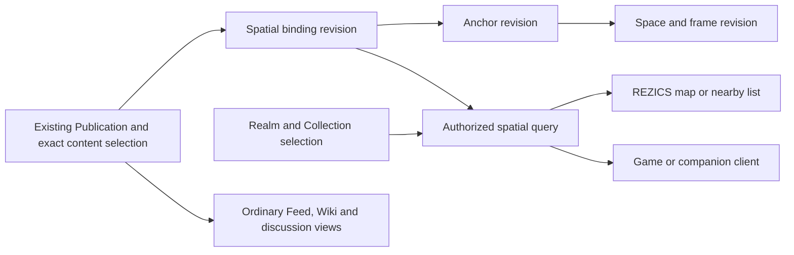

# World comments and spatial views

Status: proposed feature plan for the next product version. This document records design recommendations and activation criteria; no spatial runtime, client integration or release is implemented by this plan. The release number remains unassigned. The [logical feasibility and commercial assessment](world-comments-feasibility.md) records the research evidence, limitations and business rationale behind this proposal.

This is separate from the [current implementation program](../plan/README.md). It adds no work to that program's module checklist or acceptance gates. Its shared dependencies must be qualified before this feature is activated. On activation, reconcile against the then-current implementation, move selected lasting contracts into their architecture owners, and keep this document as the feature's remaining-work plan rather than a second authority for shared concepts.

## Scope assumptions

Minecraft and other selected game integrations operate in verified environments. Automatic discovery or support of arbitrary unverified servers/mod combinations is outside this feature. The separately developed game with full native support is not a dependency and is not considered in this plan. The present decision is based on logical analysis and commercial value; no complex performance-testing program is required. Ordinary integrity and integration checks apply when the feature is implemented.

## 1. Product outcome and retained requirements

Make location another context for existing REZICS content. A person browsing a game Wiki can open its map discussions; someone travelling can open nearby discussions in REZICS; a game client or a dedicated companion application can show the same authorized content. Accounts, publication identities, replies, social relationships, moderation and language handling remain shared.

The requested experience was described in a supplied discussion export. Its durable requirements are captured here, so implementation does not depend on that temporary file:

- Independently generated worlds with an adequately verified matching recipe can share comments about unchanged generated features.
- A particular save or server can also have comments about its own player-created state.
- One location can have several community discussion layers. A game, world or coordinate does not require a single exclusive forum.
- Ordinary REZICS pages, Wiki, Feed, Search, Collections and spatial clients can present one content identity.
- Authors can express a preferred presentation mode; game adapters and renderers provide the actual presentation. Some modes may eventually be commercial.
- Begin with verified Minecraft integration and existing REZICS communities, retain an Earth path, and admit other games through their verified integration profiles. The separately developed game and broad commercial open-world integration are outside the initial scope.
- Preserve logical table ownership for a future database split. Cross-database deployment is not part of this feature's first release.

The source discussion's claims of product novelty, market coverage and commercial permission are not adopted as established facts. The linked research assessment compares primary academic, project and commercial sources; section 17 lists supporting interface references.

## 2. User journeys and release boundary

| Journey | Required behavior | Delivery stage |
| --- | --- | --- |
| Game Wiki to map | Open a map view in an existing Zone, select a world and community layers, read a discussion, then open its ordinary REZICS page with the same identity and replies. | Initial release |
| Leave a world comment | Select an anchor and recipe or instance applicability, compose through the ordinary publication flow, and see the result in both a spatial view and ordinary authorized views. | Initial release |
| Independent saves | Two verified matching fresh worlds share an applicable natural-feature comment; a comment about one player's warehouse remains scoped to that instance. | Initial release |
| Several forums at one place | Change Realm/Collection/query layers without changing the world's identity; overlapping layers deduplicate the same publication while preserving authorized placement context. | Initial release |
| Travel with REZICS | Open a map or nearby list, choose or confirm a location, and participate through the existing account and discussion system. Manual location selection works without GPS permission. | Earth expansion |
| Dedicated or third-party client | A supported client uses the same APIs, produced identities and current access decisions. A client receives no separate social database. | Initial adapter contract; more clients later |
| Developer integration | A game provides world context and semantic object mappings; REZICS supplies authorized discussion and annotation results. | Later SDK qualification |

The first releasable slice is point anchors, recipe/instance isolation, an integrated REZICS list/map view, and the selected verified Minecraft integration. Launch with an existing community and useful curated guide content in a limited set of shared worlds. The purpose is to make existing content more useful and participation more persistent, without depending on another game project or a new standalone social network.

Earth maps, paths/areas, BlueMap integration, moving entities, AR, marketplace execution and commercial-game integrations have separate later gates. Do not promise all of them in the first release or require a standalone application before the REZICS experience works.

## 3. Fit with existing owners

Existing implementation foundations and selected target contracts are different forms of evidence. In particular, the current Post schema does not prove completion of the selected Publication/Document/Thread model. Activate spatial bindings against the qualified publication boundary, not a parallel replacement that would later need to be reconciled.

| Concern | Reuse or extend | Feature boundary |
| --- | --- | --- |
| Authored text, media and translations | [Document, Publication and adoption contracts](../architecture/database/data-dictionary.md#d09-publications-content-slots-threads-reviews-and-polls); current [Post foundation](../../libraries/schema/src/postgres/forum/post.ts) | No `MinecraftPost`, `GeoPost` or duplicate comment body. |
| Identity and generic capabilities | [Logical Resource and reference contract](../architecture/database/README.md); [reference bridge](../../libraries/schema/src/postgres/knowledge/reference-value.ts) | Add eligible spatial resources through the owner registry and capability contract, without restoring a global Resource parent. |
| Knowledge and relationships | [Relationship Graph contract](../architecture/database/relationship-graph.md) | Evidence and semantic landmark relationships use existing assertions/participants. Geometry with indexed structural invariants has a typed spatial owner. |
| Tags, favorites, follow and reports | Existing capability modules and their qualified reference consumers | A map result targets the same publication or named resource as its ordinary view. |
| Realm, Collection and Zone | [Composition contract](../architecture/space-composition.md) | Realm supplies community/governance context; Collection supplies stored curation; Zone supplies navigation and presentation. |
| Queries and Blocks | [Filter documents](../architecture/filter-documents.md); [Block boundary](../../libraries/block/README.md) | A spatial query source and map presentation consume the existing validation and aggregate execution budgets. A map query is not automatically a Dynamic Collection. |
| Language | [Content language support](../architecture/content-language-support.md) | Preserve contribution language, metadata language, availability and provenance. Community translations need no matching official game or book release. |
| Jobs and recovery | [Database operational contracts](../architecture/database/README.md) | Reuse receipts, outbox, bounded jobs, fencing, disclosure and erasure mechanisms. |

A REZICS Work may organize community-contributed game guides or world documentation, including metadata-only or multilingual material. Its virtual publication identity is independent of a playable world, save, seed or coordinate system. Attaching a spatial view neither changes that Work definition nor manufactures a Work for every recipe or coordinate.

## 4. Proposed spatial identities

Names below identify logical table families for design review, not final DDL or public API names. Preserve real foreign keys within the initial database and carry complete owner/revision keys.

| Object | Identity and meaning | Lifecycle and reference boundary |
| --- | --- | --- |
| World recipe | Stable recipe UUID plus sealed canonical generation revisions under an exact adapter contract; broader installation observations are separate. | A digest identifies observed canonical inputs, not native identity, ownership or access. |
| World instance | Stable UUID for an independently maintained save/server, with controller and explicit current epoch. | A seed, display name or server address does not prove control. Forks get their own identity unless an authorized continuity operation explicitly preserves it. |
| Instance epoch | `(instance_id, epoch_id)` with recipe applicability and optional bounded regional generation provenance. | Reset starts a new epoch. Restore/fork/upgrade have distinct operations; old references keep their original meaning. |
| Spatial space | Stable UUID identifying a coordinate namespace. Exactly one typed basis selects a recipe revision, instance epoch, static-map revision or Earth context. | Proposed spatial domain root. A reset or incompatible basis creates a new space; a separately named world/server can remain the same catalog referent. |
| Coordinate frame revision | `(space_id, frame_id, revision)` with dimension/map, axis order, handedness, units, origin, bounds and coordinate kind. | Frozen interpretation. Changing units or axes cannot reinterpret existing coordinates. |
| Spatial anchor revision | `(space_id, anchor_id, revision)` with one supported selector kind, exact frame revision, validity/uncertainty and optional evidence. | Created on demand. Geometry edits append revisions; equal coordinates do not automatically merge anchors. |
| Semantic landmark | An independently cataloged place/entity/resource connected to one or more anchor revisions by contextual location assertions. | Uses the existing eligible reference owner and generic capabilities. A moving NPC keeps its semantic identity while location observations change. |

World matching, semantic/canon context and social audience are independent axes. In particular, recipe applicability means that a comment may make sense in matching worlds; it does not make the comment public or make its Realm accessible.

Expose a maintained space as a logical Resource only through an explicitly registered spatial owner and capability adapter. Recipes, frames, revisions and raw coordinate values do not each receive a social identity by default. Named landmarks can be tagged/followed independently; a raw point is normally a selector addressed through its complete anchor key. No preallocation of all seeds, cells, languages or coordinates is permitted.

## 5. Recipe matching, instance trust and change

An adapter's versioned recipe contract enumerates the inputs it can establish: game/edition, exact generator build, seed encoding, loader, world-generation artifacts, relevant configuration, dimension registries and order-sensitive dependencies. Preserve large integer seeds exactly. Define canonical serialization and hash algorithm alongside the manifest; never hash an arbitrary runtime object representation.

Retain separate generation, semantic, runtime and presentation fingerprints under the verified adapter profile. A new presentation-only installation observation can point to the same canonical generation recipe; it must not create another shared coordinate namespace merely because its full installation manifest changed. Pure presentation changes should not split otherwise matching generated worlds, but an unclassified mod must not be assumed harmless. Record the verified profile and the provenance/applicability of its inputs. Matching generation inputs, controller assurance and current world state are distinct facts; the verified-environment assumption does not merge them.

Use observed recipes within their permitted visibility domain. Publishing a recipe or offering a public shared-space match is explicit. A private seed or recipe digest must not become a public discovery endpoint, URL, analytics dimension or brute-force equality oracle. Clients extract approved world-relevant values rather than uploading complete configuration directories or credentials.

The [.mrpack format](https://support.modrinth.com/en/articles/8802351-modrinth-modpack-format-mrpack) supplies dependency versions, artifact hashes and overrides useful for input acquisition. It does not establish which files affect generation or prove equivalence of two worlds; that remains adapter evidence.

Two saves may explicitly opt into the same verified recipe space while retaining separate instance spaces. A server can attest its own instance context using an established controller binding; knowledge of its seed or address grants no membership. A context outside the admitted integration profile is unsupported until explicitly admitted; it must not silently join a known private server space. Investigating every such environment is not required by this plan.

Comments about generated terrain and comments about player modifications have separate applicability. Mixed-generation worlds preserve per-region provenance when available; otherwise relevant matches become unknown. Compatibility between recipe revisions is an explicit, scoped, evidenced relationship, not equality or an automatic transitive merge. Coordinate transforms also require an exact mapping contract. A scene fingerprint can detect possible drift but cannot prove identity or permission.

## 6. Coordinates and selectors

The common protocol describes space, frame, selector type and interpretation. It does not force every game or Earth into one XYZ coordinate system.

- Initial game support uses bounded point selectors in a declared integer or continuous Cartesian frame. Minecraft dimension IDs participate in the key; identical XYZ in different dimensions does not identify the same point.
- Earth uses an explicit geodetic interpretation. The [geo URI standard](https://www.rfc-editor.org/rfc/rfc5870.html) provides WGS-84 location and optional uncertainty; absent uncertainty is different from zero. API fields must name latitude/longitude explicitly rather than rely on an ambiguous tuple order.
- Later typed selector contracts cover areas, volumes, bounded paths, poses, topological rooms/portals, surfaces and entity-relative anchors. Unsupported kinds return a declared unsupported outcome.
- Each query declares its distance semantics: horizontal distance with an optional vertical band, Euclidean 3-D distance, or geodesic Earth distance with an explicit altitude policy. Coordinate storage alone does not decide what "nearby" means.
- Finite numeric values, dimensionality, unit compatibility, exact frame keys and bounded payloads are validated. Shape-specific fields use typed storage or a bounded, versioned extension contract, not an unrestricted `geometry: unknown` persisted boundary.
- Temporal validity and spatial uncertainty remain explicit. An anchor that is stale, approximate or no longer resolvable is distinguishable from a deleted publication.

Native IDs and revision keys are authoritative. Public HTTPS resource addresses follow [slug addressing](../architecture/resource-addressing.md); slugs and coordinate strings are optional addresses. A proposed `world:` URI is an interoperability question for later work, not a required identity or a newly claimed registered scheme.

## 7. Publication bindings and discussion

Introduce a typed publication-to-anchor binding with its own small head and immutable revisions. A conceptual key is `(publication_id, binding_id, revision)`; a revision pins a complete anchor revision and the published content/adoption cut whose meaning was attached. The publication owner controls attachment and removal. A map never reads a private editor head as the published body.

One publication may have several explicitly authored bindings. Replies reuse the existing Thread/reply structure and inherit a root's spatial context for navigation; they are not copied into a second map thread. An explicit reply anchor belongs to that reply and cannot overwrite the root. The first feed displays root discussions, with reply details loaded through the ordinary discussion API; separately indexed reply markers are a later elected behavior.

Moving a marker appends a binding/anchor revision. Removing a binding removes that spatial appearance while preserving the ordinary publication. Withdrawing the publication stops its current disclosure across all views. A later text edit does not silently change an old exact binding: the author can advance the binding selection, and the presentation must identify the selected revision when it differs from the ordinary current page.

If authors want the current publication to follow a changing content channel, use an explicit adoption/subscription rule and record each resulting selection. Do not achieve this by an unversioned pointer to mutable text. Translation/adoption revisions can share an anchor only through an explicit use; different language views retain provenance and current disclosure.

Publication plus initial bindings should commit atomically in the initial database, or remain a non-public staged operation until sealing. Edits acquire the existing publication/scope authority fences, verify expected versions and complete anchor keys, append durable changes and outbox work, then commit. Spatial reindexing never becomes a second writable authority for content or geometry.

## 8. Social layers and discovery

A spatial layer is a validated query/presentation descriptor over spaces and existing eligible content sources. Realm selection, stored Collection membership, accepted semantic predicates and viewer language/spoiler settings narrow the query. A layer does not own copied publications or grant access to its members.

Multiple communities can present the same space. Realm moderators govern their placements and rules; instance controllers govern their instance integration; neither automatically controls every public discussion about that location. Named-place stewardship and public commentary also remain separate.

An ordinary Zone Page or Dock can host a map query Block and a synchronized list. Only spatially eligible contexts offer that presentation. Saving this query descriptor does not require the optional Dynamic Collection product. If that product is later activated, it can reference the spatial source using its own selected contract.

Empty nearby results can offer labelled navigation to a wider region, world, game or Realm. Expansion is an explicit query with its own bounded continuation, not an invisible query fan-out or a claim that distant results are nearby. A failed, unauthorized or unidentified space is not reported as an empty successful query.

## 9. Query, index and logical storage boundary

The query boundary accepts an exact space/frame context, point/radius or viewport selector, bounded source layers, supported filters, ordering and an opaque continuation. Callers cannot supply SQL, arbitrary predicates or unrestricted traversal. A server-owned spatial source composes with the existing Filter contract rather than introducing a second general filter language.

Store canonical anchor families under their space keys and bindings under their publication keys. Maintain a derived space/frame/cell-to-binding projection for spatial discovery, plus publication-to-binding and anchor-to-binding reverse indexes. This gives different access directions independent owners without making either projection canonical.

For point anchors, prototype a grid/cell candidate index beginning with `(space_id, frame_revision_key, cell_key, order_key, binding_id)`. Cell assignment is a deterministic, versioned projection. Candidate geometry and distance are checked after a conservative cell cover, then current publication, selected content, binding, space and scope access are checked before response hydration. Center-only cell selection is insufficient when it can omit boundary matches. Use selective source predicates and batch remaining access checks; a candidate ceiling alone does not guarantee a useful filled page. A supported candidate plan must actually seek those prefixes; `LIMIT` after an unbounded scan is insufficient.

Proposed initial admission ceilings, subordinate to a query profile declaring cell size, cover method, distance metric and useful-result semantics:

| Budget | Initial ceiling | Overflow behavior |
| --- | ---: | --- |
| Returned root publications | 50 | Continue with a cursor. |
| Spatial layers in one query | 8 | Reject or require a narrower selection. |
| Candidate cells per request | 64 | Coarsen through an explicitly supported plan, narrow the viewport, or use a separate coarse view. |
| Candidate bindings examined | 2,048 total across layers/cells | Return partial results and resumable scan state; do not restart an unlimited fill loop. |
| Serialized response | 256 KiB excluding separately fetched assets | Stop hydration within budget and continue. |
| Binding edits per ordinary command | 8 | Use a separately admitted staged operation for larger changes. |

The default cursor tracks bounded cell streams and a stable ordering tie-breaker. Fix the query center/viewport, space/frame, filter, ordering and relevant generation for the cursor's lifetime; movement starts a new query. A candidate window ordered by distance is not an exact global nearest-neighbor result. Declare approximate ranking or qualify an exact plan before offering that guarantee. Deduplicate publications without losing resumable positions or authorized placement context.

Hot cells need a selective bounded plan or an explicit coarse/partial result. The initial view uses authorized overlay responses and can omit exact cluster counts and server-generated comment tiles. Cluster counts, facets and thumbnails must not disclose hidden content. Stale projections may omit newly allowed results but may not authorize newly hidden ones. Projection jobs use the existing durable event, receipt, generation and fencing contracts; clients refetch by cell changes rather than upload camera poses every frame.

For Earth, evaluate PostGIS radius queries with a matching spatial index and a typed geodetic contract. [ST_DWithin](https://postgis.net/docs/ST_DWithin.html) documents index-aware bounding-box checks and the different distance units for geometry/geography; it does not establish an application work budget. [H3](https://h3geo.org/docs/highlights/indexing/) is a candidate for cell discovery and aggregation, not the authority for exact distances, boundaries or access. Extension installation and final index choice await qualification.

Logical separation is the present requirement: source identities, spatial structures, publication bindings, projection reads and client rendering have explicit owners and stable references. Do not generate a table/database per coordinate, recipe, Realm or renderer. Do not require spatial rows on unrelated REZICS resources. Future physical placement can change behind these boundaries; this plan does not implement shard routing, cross-database FKs or distributed transactions.

## 10. Disclosure, location privacy and governance

The response must satisfy every applicable current authority: publication/content selection, binding, spatial context and requested social source. Publishing a binding also checks that its geometry, recipe, instance association and query parameters can be disclosed to its audience; an empty result does not make those parameters public.

Use the existing access vocabulary and backend engine. During schema design, identify independently grantable space-management and binding-management actions, add only the required keys to the canonical package, and qualify allowed/denied cases. A game adapter assertion or renderer installation cannot grant content rights. New spatial capabilities do not make every existing Resource support coordinates.

For Earth, a published anchor is an intentionally selected subject location, not an automatic record of where the author stood. Request location access only for the relevant user action, preserve manual browsing, and keep live device/camera position outside publication metadata and ordinary analytics. No background movement history or geofence notification service is part of the initial release. Coarse location, uncertainty, delayed posting and private scopes should remain available design choices.

Before Earth activation, elect and test policies for sensitive locations, targeted harassment, minors, location edits, reports and erasure. Sharing private seeds, server details or precise coordinates requires separate disclosure analysis. Notifications reuse existing subscriptions/delivery preferences and do not broadcast a user's presence. Proximity is never an authorization credential.

Erasing sensitive anchor payloads must cover controlled projections, caches, exports and restore frontiers; retained historical references cannot resurrect erased geometry in new server disclosures. Cooperative clients can be instructed to evict cached material, but previously delivered bytes, screenshots and independent copies cannot be retracted. Source removal, binding withdrawal, invalid world context and content erasure are distinct transitions.

## 11. Adapter and renderer contracts

The adapter reports a versioned context: game/build reference, recipe assurance, optional instance/epoch, exact frame/map, supported selector kinds and optional avatar/camera poses. It states which information is unavailable rather than fabricating certainty. Record the supplied verified game, edition, loader and adapter profile at activation; this document selects no mutable "latest" version or universal compatibility promise.

[Mumble Link](https://www.mumble.info/documentation/developer/positional-audio/link-plugin/) demonstrates separate world context, avatar pose and camera pose. Borrow that separation, while retaining per-adapter coordinate contracts. Native integration, documented APIs and permitted client mods are the initial acquisition paths. Memory extraction, anti-cheat bypass and unsupported overlays are not required for the release.

For Minecraft, consume the verified integration's world, dimension, recipe and instance context. Preserve the distinction between shared generated features and instance-specific player changes. The integration contract records the environment providing these values; arbitrary unverified-server discovery and the separately developed game are outside the release. Web browsing remains a useful entry without requiring every reader to enter the game.

Separate a presentation mode's declarative contract from each client's renderer implementation. A mode revision declares parameter types/bounds, accepted anchor kinds, required client capabilities, content/asset uses and a free text/list fallback. Author preference is a hint; the viewer's settings, capability support, accessibility and runtime budgets decide the actual rendering.

The initial implementation uses built-in renderers. No publication carries executable HTML/JavaScript/native payloads. A later third-party renderer package requires a separate installation, provenance, execution and resource-limit contract; signing alone is not a sandbox. Do not implicitly activate the Hub execution product or bypass existing custom-theme execution boundaries.

Clients need marker density limits, distance clipping, overlapping-marker handling, reduced motion, keyboard/list access, author/layer hiding, mute controls and spoiler/language filters. Content remains readable when a preferred renderer is missing, disabled or unavailable. A paid mode cannot buy ranking, bypass moderation or override the viewer's display limits.

Commercial renderers remain a later option. Minecraft's current [EULA](https://www.minecraft.net/en-us/eula) and [Usage Guidelines](https://www.minecraft.net/en-us/usage-guidelines) constrain mod commercialization and verification of external entitlements affecting in-game features. Keep the initial Minecraft integration and renderers free; reassess the actual entitlement flow and then-current platform terms before any paid integration. Do not infer that moving payment to a website makes it permissible.

## 12. Capacity assumptions and qualification

Apply the existing [capacity policy](../architecture/data-integrity-and-workload-budgets.md#capacity-planning): every potentially growing family needs independent 500,000,000-row and 3,000,000,000-row estimates. The following decimal GB/TB arithmetic is an illustrative planning envelope, not measured PostgreSQL storage or a capacity acceptance result.

| Equivalent row role | Heap/payload B per row | Index B per row | 500M rows, heap + indexes GB | 3B rows, heap + indexes TB |
| --- | ---: | ---: | ---: | ---: |
| Space / instance / epoch identity | 192 | 128 | 160 | 0.960 |
| Recipe or frame revision | 2,048 | 160 | 1,104 | 6.624 |
| Point anchor head / revision | 192 | 160 | 176 | 1.056 |
| Publication binding head / revision | 128 | 160 | 144 | 0.864 |
| Cell candidate row | 80 | 112 | 96 | 0.576 |
| Optional regional provenance / landmark-location edge | 128 | 128 | 128 | 0.768 |
| Optional generic reference value | 64 | 96 | 80 | 0.480 |

Equivalent roles must be split into measured physical families before sizing. All persisted heads, histories, supports, references and reverse paths count; treating a revision family as one row is not a measured storage claim. Bounded adapter/renderer configuration can use a justified deployment inventory, but user-created recipes, spaces and frames cannot be assumed to be small control tables.

For an illustrative point-comment mix, assume 1.2 distinct anchors and bindings per publication, one head plus three retained revisions for each, and one current cell entry per binding. Incremental native storage per publication is `1.2 * (4 * 352 + 4 * 288 + 192) = 3,302.4 bytes`: about **1.6512 TB at 500M publications** and **9.9072 TB at 3B publications**. This excludes publication bodies, identity/control families, extra source evidence, generic references, cached results, notifications, assets and operational history; it is not a whole-system total. Geometry spanning cells multiplies candidate rows by its bounded cell coverage, which is why paths/areas require their own capacity gate.

Index write amplification includes every current candidate/reverse index plus new immutable history and outbox/receipt rows. Never materialize every comment once for every viewer, Realm layer, language slot or compatible instance. Serve recipe-space comments by an explicit shared query rather than copying them into each matching save. Large geometry and media require separate payload budgets and object-storage accounting when elected.

Complex performance tests are not part of the present research or a new prerequisite added by this proposal. Retain the row estimates, bounded read/write ownership and ordinary verification required by the affected implementation owners. The important logical distinction is that request limits bound admitted work but do not guarantee complete results or a particular latency.

The research assessment illustrates this with `2,048 * 1% = 20.48` expected eligible candidates: residual filters can under-fill a 50-item page. Query profiles must therefore include selective source predicates and honest continuation. The exact admission values and physical index choice remain implementation details to qualify when needed; no throughput, latency or full-corpus capacity acceptance is claimed here.

## 13. Delivery stages

No stage below has been executed by writing this plan. Initial-release acceptance consists of W0-W3; W4-W5 are independently activated expansions.

| Stage | Work | Exit evidence |
| --- | --- | --- |
| W0: scope and specify | Read the main-program result; specify spatial ownership, exact bindings, distance/applicability and ordinary integrity cases under the verified integration profile. Identify an existing community, initial curated content and maintainer job. | Coherent logical examples, a clear content-supply path and explicit commercial hypotheses; no duplicate social identity or dependency on the separately developed game. |
| W1: native persistence | Implement recipes, instances/epochs, spaces, frames, anchors, bindings and current spatial projections using ordinary native commands and existing durability mechanisms. | Fresh PostgreSQL installation, state transitions, FK/uniqueness/concurrency, revocation, event retry and restore/erasure tests. |
| W2: integrated API and Web | Add bounded spatial queries, ordinary publication attachment commands and a map/list query Block in REZICS. Use existing identity, Feed, Wiki, Tag, moderation and language consumers. | Stateful produced-ID flows, disclosure/cursor tests, generated contracts, affected TypeScript checks and scoped Storybook screenshot review. Full-application rendered QA follows the repository's explicit-request boundary. |
| W3: verified integration and community release | Connect the verified Minecraft environment to shared publications and built-in free presentation; release to an existing opt-in community with curated applicable content. | Same-publication behavior, instance/epoch isolation and ordinary integration checks; meaningful cross-view use and maintainer feedback. No complex benchmark or separate game project is required. |
| W4: Earth and richer maps | Add Earth nearby/map entry, manual/GPS choice, map-provider decision, BlueMap integration where useful, then bounded areas/paths. | Geodetic edge cases, privacy/erasure, actual provider policy, accessibility and expanded geometry workload tests. AR is not a prerequisite. |
| W5: ecosystem | Qualify SDK stability, semantic/moving anchors, additional games and independently reviewed optional renderer distribution/commercial flows. | Per-adapter conformance, resource isolation, compatibility and platform-policy evidence; no universal-game or AAA capacity claim without measurements. |

The [current program's backend acceptance](../plan/backend-acceptance.md) remains its own gate. W0 must identify any missing Publication, exact-reference, Realm, access or durability contracts needed here rather than presume that existing schemas have qualified them. This feature neither delays unrelated main-program work nor circumvents its selected foundation.

## 14. Acceptance scenarios

These are planned cases, not passing test results.

| ID | Required outcome |
| --- | --- |
| WC01 | Create through one client; ordinary Feed, Wiki/Collection view and map return the same publication identity and authorized revision. Replies and votes are shared. |
| WC02 | Attach two points to one publication; remove or move one without copying/deleting its content or changing the other binding's history. |
| WC03 | Two independent fresh saves with verified matching recipe inputs can share a recipe-applicable comment; instance-applicable comments remain isolated. |
| WC04 | Different generator inputs, unknown world-affecting mods or incomplete manifests cannot produce a verified match; a qualified presentation-only change does not unnecessarily split matching spaces. |
| WC05 | Same XYZ in different dimensions/frames is distinct; NaN, infinity, incompatible units and incomplete revision keys are rejected. |
| WC06 | Reset, restore, fork and mixed-generation upgrade preserve original references and explicit applicability; old comments do not silently become current-world facts. |
| WC07 | Knowing a seed, recipe digest, server address or copied instance identifier cannot disclose a private space or grant controller authority. |
| WC08 | Several Realm layers share coordinates with independent governance. Duplicated placements produce one publication result with only authorized contexts. |
| WC09 | Community translations use the same spatial context through exact adoptions; language choice cannot expose unpublished content or imply official translation. |
| WC10 | Binding edits race with publication, space and Realm revocation: successful commands obey the existing authority fences and stale decisions fail. |
| WC11 | Hidden or withdrawn content is absent from map markers, cluster counts, snippets, caches, exports and ordinary views; removal of a map binding alone preserves its ordinary publication. |
| WC12 | Dense hotspots and selective filters stop at declared work/byte budgets and resume correctly; pan/filter/generation changes reject incompatible cursors. |
| WC13 | Duplicate and reordered events converge; stale projection workers cannot activate a generation; recovery does not resurrect erased precise geometry. |
| WC14 | Unknown/disabled/paid renderer falls back to readable content. Untrusted parameters cannot execute code, fetch private assets or exceed client density/audio budgets. |
| WC15 | Unavailable location permission or adapter context has a usable manual/list flow, distinct from an empty successful nearby query. |
| WC16 | Earth tests preserve uncertainty, longitude wrapping, polar behavior and explicit altitude interpretation; the author does not acquire a public movement trail by posting. |
| WC17 | Generic Tag/favorite/report and related-resource flows use the registered spatial/publication references; adding an adapter or game does not require new comment tables or per-game capability services. |
| WC18 | A named entity can have changing/multiple contextual positions without rewriting prior anchors; unproven transforms remain unresolved. Required when semantic anchors activate. |
| WC19 | Ordinary restore/erasure and projection replay preserve the feature's identities and disclosure states; the proposal does not introduce an additional complex performance-testing gate. |
| WC20 | Web/game clients use ordinary request authentication and scoped integration credentials; camera telemetry and renderer availability never become publication permissions. |

## 15. Decisions to close at activation and future edit map

| Decision | Recommended starting position | Evidence needed before dependent implementation |
| --- | --- | --- |
| Initial game integration | Use the verified Minecraft environment and subsequently other admitted game profiles. The separately developed game is excluded. | Record the existing integration contract; do not reopen universal environment discovery as a requirement. |
| Spatial owner registration | A maintained space is the eligible root; frames/anchors are typed child/revision references; catalog landmarks reuse eligible existing owners. | Capability and FK/registry review against the completed main program. |
| Recipe equivalence and privacy | Canonical generation inputs and world applicability under the verified profile; explicit public sharing. | Logical distinction among generation, instance state and audience; existing profile evidence and disclosure rules. |
| Published selection behavior | Bind exact published/adopted revisions; any follow-current behavior uses recorded selection updates. | Qualified Publication/adoption API and author-edit/withdrawal tests. |
| Spatial query implementation | Selective bounded discovery with a declared distance metric; typed Earth queries when activated. | Logical query examples and ordinary implementation checks appropriate to the selected index; no complex performance study now. |
| Web maps and map data | Provide a list/manual-coordinate path independently of a third-party map provider. | Actual tile/data licensing, attribution, provider limits and rendering requirements. |
| Paid renderer distribution | Deferred; free initial Minecraft rendering and a readable fallback everywhere. | Chosen platform terms, entitlement model, execution isolation and commercial scope. |

When this plan is activated, update the owning database dictionary/reference/capacity contracts, publication/adoption and Realm integration, Filter/Block sources, client contract and tests in coherent changes. New runtime code should live under an owning spatial service, with Web implementation under the existing [feature organization](../architecture/web-feature-organization.md); game adapters have separate packages/clients only when implemented. Do not create those directories or reserve package names as part of this planning task.

Preserve the current primary plan while preparing this feature. No active progress status, schema migration, generated API, dependency, application server or client build is changed by this document.

## 16. Commercial value and release priorities

The [commercial assessment](world-comments-feasibility.md#commercial-value) distinguishes evidence from business hypotheses. ArcGIS Hub already combines map/list discussion and organizational collaboration in a paid product, while Discourse offers paid community operations and MapGenie illustrates practical consumer map/notes workflows. These are category precedents, not REZICS revenue or conversion evidence.

The first value proposition is that existing REZICS knowledge becomes useful at the relevant place and discussion continues outside the map/game. Prioritize current game/Wiki readers, guide authors and maintained shared-world communities. Verified environments can still be empty when each person has a different seed; begin with a small set of repeatedly used worlds and curated guides rather than depending on universal spontaneous comments.

Offer exact-location discussion alongside clearly labelled general game/topic material, preserving the difference in applicability. Initial curation must retain credit and accurate anchors; it cannot infer coordinates from arbitrary prose. Dedicated applications and more games are distribution options after the integrated REZICS flow provides recurring value.

The first direct-payment hypothesis is a maintainer/team workflow: batch binding edits, review and collaboration, update assistance, export/backup convenience and supported integrations. Basic readability, safe access control and ordinary participation remain baseline. Defer a renderer marketplace and assess any Minecraft-related charging flow against the actual applicable terms; external billing is not automatic permission.

Validate commercial value with lightweight maintainer conversations and a workflow walkthrough: identify the recurring problem, who maintains the content, the time saved and the budget owner. Later opt-in usage can distinguish useful new reading/replies/contributions and return use from merely shifting existing page views. Track empty results and maintenance/moderation burden. No price or revenue forecast is selected before those inputs exist.

Earth should initially serve an existing local group, event or curated place collection. A general nearby-stranger network, precise AR, broad external-game contracts and the separately developed game are not dependencies for proving this feature's initial REZICS value.

## 17. Primary design references

Checked on 2026-09-12. These sources support interfaces and constraints; the REZICS model and staged release choices above are design recommendations rather than claims prescribed by the sources.

| Reference | Decision supported |
| --- | --- |
| [W3C Web Annotation Data Model](https://www.w3.org/TR/annotation-model/) | Separate content bodies, targets, selectors and target state. A custom spatial selector still needs its own precise contract; adopting this separation is not a claim of full W3C conformance. |
| [Mumble Link integration](https://www.mumble.info/documentation/developer/positional-audio/link-plugin/) | Keep game/server/map context and avatar/camera poses distinct in adapters. |
| [Modrinth Modpack Format](https://support.modrinth.com/en/articles/8802351-modrinth-modpack-format-mrpack) | Acquire dependency versions, file hashes and overrides without treating a modpack as proof of world equivalence. |
| [BlueMap markers](https://bluemap.bluecolored.de/wiki/customization/Markers.html) | External marker/layer presentation is a practical integration path. Do not inherit administrator-trusted HTML as a public UGC execution model. |
| [RFC 5870: geo URI](https://www.rfc-editor.org/rfc/rfc5870.html) | Geodetic location and explicit uncertainty semantics. |
| [PostGIS ST_DWithin](https://postgis.net/docs/ST_DWithin.html) and [H3 indexing](https://h3geo.org/docs/highlights/indexing/) | Evaluate exact distance predicates separately from cell candidate/aggregation indexes. |
| [Minecraft EULA](https://www.minecraft.net/en-us/eula) and [Usage Guidelines](https://www.minecraft.net/en-us/usage-guidelines) | Reassess any actual commercial Minecraft integration before activating it; external payment is not automatically an exception. |
