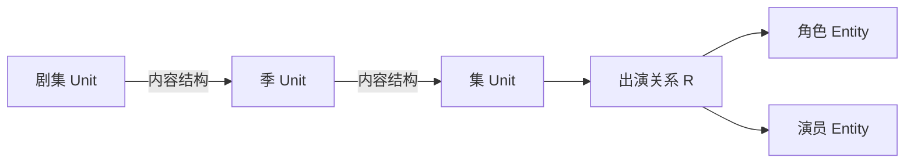

# REZICS：内容结构、关系与复杂查询的数据模型

**Operational implementation supplement (2026-09-06):** [language and authority audit](REZICS-language-and-authority-audit-20260906.md) specifies multiple named forms, standard language identity and revision-scoped officialness missing from the earlier model. [Selected decisions](REZICS-operational-refactor-decisions-20260906.md) and [P01/P03/P06](../plan/operational-refactor-20260906/README.md) supply lifecycle, migration and discovery acceptance; no implementation is claimed here.

日期：2026-09-06。状态：研究后形成的设计建议，尚未实施完整迁移或通过容量验收。

本文集中处理字段存储、内容对象粒度、content-structure、Tag、关系引用和高级查询。[平台总体方案](REZICS-动态元信息与渐进扩展架构-20260905.md)继续负责产品方向、Work／具体版本、通用 Unit、统一 Entity 身份及 Access 代理；[Catalog 领域边界与实施分期](REZICS-Catalog领域边界与实施分期-20260906.md)统一负责全领域归属、商品／GPU／算力／课程等扩展与启用范围。本文不重复维护全域表组清单。

文中的**当前实现**来自本地源码核对；**采用方向**是本轮模型决定；**待验证**表示仍需实现方案、代表性执行计划或性能数据。示意表名不等于已经创建的数据库对象。仓库源码检查基线为 `df453cf5c74e42d17a3e6ea16d9571e2e99acfbd`。

上述源码基线是原研究记录；新的有范围源码核对和各领域状态见[Catalog 专题 §1](REZICS-Catalog领域边界与实施分期-20260906.md#1-如何区分决定与交付状态)。动态关系、结构穿透、Tag 演进和查询投影的完整改造均不可仅凭本文视为已经交付；“已确认方向”不自动把所有未来领域纳入本轮实现。

## 1. 核心决定

| 问题 | 采用方向 |
| --- | --- |
| 固定字段还是动态字段？ | 常见稳定属性使用有类型的固定字段；长尾属性使用动态定义和值。对象关联区分领域拥有的固定结构与可治理的动态语义关系，见 §2.4；统一描述接口不强迫统一物理存储。 |
| content-structure 的职责？ | 组织季、集、章节、载体和曲目出现位置。关系绑定具体内容或必要的出现语境，顶层查询按明确规则穿透组成结构。 |
| media 是否拆分？ | 区分书籍出版、影视／节目、音乐编目、软件分发等领域结构；音频／视频内容与文件资源另外辨别，不把 music 和 video 当作两个互斥且包揽一切的类别。 |
| 全部 Catalog 怎样划分？ | 按身份与业务结构选模型，按访问与增长方式选存储；分类、同 ID 扩展、独立对象、表组和分片分别判断。完整地图与未来范围见 Catalog 专题。 |
| Tag 是否重做？ | 保留概念、Path、Expression、Application、检索推导的区别，改进历史与退役、热点增量维护及词表治理边界。 |
| creditAttribution 与 subjectAssociation 是否合并？ | 统一关系身份、定义、参与者、作用域、证据和修订契约；保留贡献、出现、主题、设定等明确语义，专门读取视图和领域约束仍可存在。 |
| Role 是否仍写死在 SQL？ | 移除硬编码的业务角色清单；角色通过受治理定义扩展。真实外键、值形状和必要的不变量继续保留。 |
| 关系能否作为另一关系的对象？ | 支持稳定 RelationRef 和精确 RelationRevisionRef；引用、查询与推导分别定义，不为每条关系自动创建完整 Unit。 |
| 搜索怎么演进？ | PostgreSQL 主导关系与全文协同。独立搜索必须证明其承担的查询子集和成本；OpenSearch 不是必然终点，机器配置不是替代关系执行能力的证据。 |

整体链路是：

```text
内容对象及版本
  → content-structure 中的有序出现
  → 具体内容上的角色、演职、主题及其他关系
  → 受控的穿透查询和可重建查询投影
  → 用户可理解的结果及匹配依据
```

## 2. 字段、对象与物理表分别作决定

### 2.1 固定核心字段、动态长尾属性、动态对象关系

| 数据 | 推荐存储 | 明确的语义归属 |
| --- | --- | --- |
| 页数、字数 | 固定有类型字段，必要时加来源记录 | 具体出版／文本版本及统计口径；不能直接归给整个系列 |
| ISBN and other external identifiers | Typed, namespace-scoped identifier claims, allowing multiple values | Target the exact publication/content identity; retain validation and source evidence without inferring identity equality. |
| 内容时长 | 固定字段 | 具体录音／剪辑或声明的版本；技术测量时长另有资源对象 |
| 季号、集号、曲目号 | 结构位置的固定字段或领域扩展 | 某个编号体系和收录语境，不能用 fractional position 代替 |
| 预计集数 | 固定且语义明确的字段 | 对相应节目或季的声明，可未知 |
| 已收录集数 | 派生统计 | 根据已声明的内容组成和计数范围计算 |
| 作者、角色、演员、世界观 | 动态谓词／角色定义与关系实例 | 指向有身份的对象，保留具体语境 |
| 冷门规格、自定义编目字段 | 动态属性定义和有类型的值 | 声明适用类、数据类型、单位、数量及查询能力 |
| 软件依赖、安装兼容条件 | 专属结构和可执行契约 | 具体包版本、原生生态语义及环境组合 |
| 来源观察、冲突或限定事实 | 有版本的来源／断言结构 | 保留谁在何时对哪个对象或关系作了什么声明 |

例如 `book_publication.page_count = 320` 不需要展开成一条实体到实体的边，更不需要为数字 320 创建 Entity。动态属性可以保存数量、文本、日期等有类型的值；关系的目标则是对象或关系引用。

固定字段仍可以被统一登记和描述，用于表单、API、校验与查询规划。内置描述从权威类型／schema 生成或校验一致性；长尾字段从定义记录取得。不要维护两份互相独立的字段清单，也不允许普通配置任意改写内置字段的含义或 SQL 绑定。

Wikibase 将属性、值、限定词和来源组合表达，而没有要求某一种底层表布局。本方案参考它的表达能力，采用适合事务、筛选和维护的混合存储。[Wikibase 数据模型](https://www.mediawiki.org/wiki/Wikibase/DataModel)

### 2.2 单一写入权威

来源 A 声明 320 页、来源 B 声明 328 页，可以同时保存；当前采纳值供详情和页数筛选读取，并指向被采纳的依据。编辑操作必须经同一拥有者完成，不允许独立修改“动态页数”和“固定列页数”形成两个事实源。

无多来源需求的普通字段无需强制创建完整证据链。来源原文中的特殊表述，例如“xii＋320 页”，在不能无损归一前保留原文，明确固定数值的统计含义，不为了填列而丢掉信息。

长期稳定、约束明确且常用于查询的动态属性，可以经受控迁移提升为专属字段或类型索引：先回填和校验，再切换唯一写入端，旧表示成为兼容读取或历史来源。不能长期双写两份独立权威。

### 2.3 拆分判据

依次回答以下问题：

1. **是不是同一个被指称对象？** 独立录音、具体出版物或剪辑版本可有不同身份，即使字段相同。
2. **字段是否随出现位置变化？** 集号、轨道编号、某次署名应归位置／关系，不必创建另一个内容对象。
3. **是否有独立约束、生命周期和查询？** 这决定是否需要领域结构或同 ID 扩展表。
4. **只是分类不同吗？** 动画／真人等表现分类不自动要求两套季集模型。
5. **能否从已有数据可靠计算？** 派生统计应有口径和维护方式，不与人工声明混用。

新增对象与新增表是不同决定；字段数量本身不是唯一拆表标准。同一对象可以组合适当的领域资料及播放能力，不因拥有两类资料就复制两个互不关联的主页。

本节用于判断字段与内容粒度。新领域是否复用模型、增加规格表、建立独立对象或扩展重表组，统一使用[Catalog 专题 §2](REZICS-Catalog领域边界与实施分期-20260906.md#2-统一拆分规则)；GPU／产品、计算服务、图片／视频等实例由该专题维护。

### 2.4 Fixed structural relations and dynamic semantic relations

**Required contract, clarified 2026-09-07.** Static/fixed describes the structural
contract and its invariant-enforcing writer, not immutable data. Dynamic describes
governed, versioned predicates/roles, not arbitrary unvalidated edges or a single
physical graph table. Both kinds can change, retain history and cite evidence.

The [provider-independent capabilities and Edition decision](REZICS-Catalog领域边界与实施分期-20260906.md#23-provider-independent-native-model)
govern this classification. A source object or table name does not establish a
native level. Publication/distribution composition must support checked members
across domain owners, while grouping membership remains a different relationship.
No mandatory Work-to-Edition-to-Release hierarchy is selected.

| Category | Relations covered | Authoritative storage and constraints |
| --- | --- | --- |
| Fixed identity structure | Owner identity to same-object subtype/extension | Owner-local PK/FK and eligibility checks; no global `unit` parent; semantic class membership does not change storage ownership. |
| Fixed publishing structure | Publication/text-version coverage; serialization installment and volume/chapter occurrences | Publishing-owned coverage/composition records with explicit grain, multiplicity and ordering. A publication need not have an invented Work; attribution remains a separate semantic relation. |
| Fixed cross-domain distribution composition | A released package containing, for example, a game version, art-book publication and soundtrack | One identified container and authoritative composition writer; concrete member FKs, occurrence identity, quantity/order, lifecycle and bounded mutation. A set of covered Works is not an ordered list of occurrences. |
| Fixed music structure | Release to release group; release to medium; medium to track occurrence; occurrence to recording | Music-owned keys and occurrence rows; preserve local IDs, repeated recordings, source numbering and order. |
| Fixed program/content structure | Declared series/season/episode or chapter containment; occurrence to content | Composition-owned parent/order/target records, concurrency-safe acyclicity and bounded mutation; numbering and editorial grouping membership are different facts. |
| Fixed credit presentation | Artist-credit group to ordered credited names/participants | Music-owned presentation structure retains credited-as text and join phrases. It does not replace performer/composer relations to works or recordings. |
| Fixed operational references | Source record to observations/bindings; evidence to an exact revision; scoped identifier/name targets | Source/name/identifier/evidence owners enforce identity, revision, target and uniqueness rules. Provider identity and an asserted fact have separate meanings. |
| Fixed executable structure | Package-version dependencies and installation compatibility | Software/package-owned constraints and ecosystem version semantics. A graph projection cannot independently modify them. |
| Dynamic contribution | Author, translator, director, composer, performer, developer, publisher | Identified owner-local relations with governed roles, target scope, dates, credited-as text, evidence and revisions. Do not put a global author/publisher field on every Work. |
| Dynamic contextual participation | Character appearance; actor portraying a character in a subject, episode, release or language version | One relation binds all participants and context; conjunctions cannot match unrelated edges. |
| Dynamic derivation and chronology | Adaptation, translation derivation, revision, prequel/sequel, alternative version; recording performance of a Work | Governed predicates and qualifiers preserve direction, scope, partial coverage and source meaning. Do not infer formal containment or identity equality. |
| Dynamic grouping and subject matter | `set_in_universe`, `part_of_franchise`, `part_of_series`, `about`; continuity/canon/branch membership | Independently identified grouping objects, distinct predicates, evidence and named order profiles when needed. Shared member/order machinery is structural; the membership meaning remains governed data. |

Typed scalar values, including page count/duration, and long-tail typed properties
are a separate category; a numeric value is not an object relationship. Derived
counts, reverse edges and search projections are rebuildable reads of their
authority. For every fixed structure exposed through the relation API, route
mutations to its owner; never store a second independently writable dynamic edge.

This table fixes the classification and representative families. It is **not** the
completed four-source field inventory. Before DDL acceptance, P01/P04 must classify
every pinned source path as fixed structure, dynamic relation, typed value or
derived/source observation, and record the concrete table/column or definition
revision, owner command, cardinality, FK/validation, lifecycle, query/export and
fixture. New source roles can extend reviewed definitions; new executable shapes
or structural invariants require versioned code and, where needed, migrations.

World/universe, franchise and series are required in the current schema stage,
including native source-free creation and query/export. Their semantics and
acceptance cases are owned by [the platform report §5](REZICS-动态元信息与渐进扩展架构-20260905.md#5-世界观ip系列work-与具体版本)
and [P01](../plan/operational-refactor-20260906/01-catalog-and-relations.md).
The [physical identity contract](REZICS-source-complete-catalog-schema-20260906.md#41-logical-unit-and-owner-local-physical-identity)
replaces the former global-parent assumption for all relation target families.

## 3. Catalog 的领域边界

**本节保留与内容结构和查询直接相关的领域摘要。** Catalog 指全部编目，书籍出版表组以 `publishing` 描述职责，不再单独称为 `catalog`。全领域归属与当前／未来交付状态以[Catalog 专题 §3](REZICS-Catalog领域边界与实施分期-20260906.md#3-catalog-全领域归属地图)为准；这里的对象名和表名均是待实施设计。

### 3.1 不将领域、对象角色和资源形态压成一个枚举

| 维度 | 例子 |
| --- | --- |
| 编目领域 | 书籍出版、音乐、影视／节目、软件 |
| 对象角色 | 系列、季、集、影片、发行组、发行、录音、包版本 |
| 内容形态 | 文本、音频、视频、可执行内容 |
| 收录位置 | 某季中的第几集、某张唱片上的第几轨 |
| 技术资源 | 文件、流、编码音轨、字幕资源 |

Music 与 Video 并不互斥。MV 具有音乐和视听资料；有声书涉及文本与朗读录音；播客是音频但不必属于音乐领域。因此，media 可以保留为产品总入口或共同接口，其重字段不应继续由一张表包揽。

EBUCorePlus 将节目、季、集等 EditorialObject 与文件、流等 MediaResource 分开。这里采用其事实归属的区分，不照搬全部本体或部署组件。[EBUCorePlus §5.4.1](https://tech.ebu.ch/files/live/sites/tech/files/shared/tech/tech3397.pdf)

### 3.2 推荐的逻辑对象与存储拥有者

| 领域 | 必要逻辑对象 | 物理组织建议 |
| --- | --- | --- |
| 书籍 | 具体读本／出版版本，按需识别的 Work／表达 | 保留有类型的出版与文本资料，内容组成交给结构 |
| 影视／节目 | 影片、节目系列、季、集、短片；必要的具体录制／剪辑版本 | 先共享紧凑领域资料和明确类型策略，稳定专属字段用同 ID 扩展 |
| 音乐 | 发行组、具体发行、录音，按需识别的乐曲内容 | 发行组、发行和录音有不同语义结构；载体和 Track 位置使用结构扩展 |
| 软件 | 软件项目、宿主与功能扩展关系 | 插件是扩展作用，不是与软件互斥的根类型；按已有软件能力逐步实施 |
| 包与发布 | 包坐标、版本、依赖、产物关联 | 未来按需；使用原生生态契约，可关联软件、模型和资源包，不强制项目与包一对一 |
| 技术资源 | 文件、流及媒体技术参数 | 独立资源记录，绑定具体内容／版本，不取代内容身份 |

当前 `media` 混合了 `runtimeMinutes`、`episodeCount`、`seasonCount`；当前 `audio`／`video` 已是 Unit，主要存放时长。重构前必须确认它们代表的内容粒度，不能把现有 audio／video 直接重新解释为文件表。[当前媒体结构](../../services/main/src/services/database/schema/media.ts)

影片、季和集需要独立可引用的身份及验证规则，但不因此要求每一种角色都有一张空表。另一方面，MusicBrainz 的 Release Group、Release、Recording 不能因为字段相似就合并；它们的身份和关联结构不同。[发行组](https://musicbrainz.org/doc/Release_Group)

Book、Music、Program 等逻辑域不必各有独立进程或数据库。第一阶段仍为同一 PostgreSQL 内有明确拥有者的表组，沿用 `public` schema；具体物理命名、Unit kind 迁移和 SDK 在实施契约中完成。

## 4. Content Structure：组织内容并支持穿透

### 4.1 内容身份与出现身份

采用下列职责：

```text
ContentStructure
  id、owner_unit_id、kind、revision

ContentOccurrence
  id、structure_id、parent_occurrence_id
  content_unit_id、position、structural_role

按需的领域位置扩展
  episode_placement：编号体系、原始集号及可查询数值
  music_track：原始轨号、当次标题／署名等
  medium：载体格式、盘面等
```

名称为逻辑示意。已有 `content_structure_node.id` 就是稳定的出现身份，不需要另造一份等价 ID。一个内容对象可有多次出现；属性只在一个拥有者中写入，例如 Track 扩展不再另存一份可独立修改的内容引用或排序。

普通集应有稳定内容 Unit，季中的位置另有 occurrence ID。改变季号或调整顺序不会改变该集身份。某部影片作为节目的一集收录时，可复用内容身份；出现不同剪辑或发行时再明确版本，而不是仅按“第几集”重新识别内容。

音乐中的 Track 正适合这种位置语义：同一个 Recording 可以出现在多个发行的不同曲目位置，标题、印刷编号和署名可不同。MusicBrainz 的 Track 本身有标识，但不享有其所有实体关系能力；REZICS 可以基于明确需求支持对位置的引用。[Track 定义](https://musicbrainz.org/doc/Track)

仅用于组织的 Disc 1 等分组不必天然拥有完整社交 Unit。是否增加轻量分组载荷，要单独修改当前必填 `content_unit_id` 和类型约束，不能直接把外键变可空后忽略其余消费者。

### 4.2 正式支持作品到具体内容的查询



图示强调关系绑定具体集，作品层按组成规则查询。正式契约需要说明：

- 哪些结构 kind 和成员角色允许穿透；导航和普通相关链接不自动成为内容组成。
- 同一结构内的父链，以及引用子 Unit 正式内容结构的展开方式。
- 选择当前结构还是固定修订；是否覆盖完整内容或仅选编部分。
- 在何处停止、如何去重、如何返回经过的集／位置／关系作为匹配依据。

建议各聚合维护自己的直接组成，例如系列管理季、季管理集、发行管理载体与曲目。顶层可以取得组合视图，不要求手工复制所有子目录。若某实例采用一个结构保存完整层级，也使用同样的内容与出现语义，避免建立第二种查询语言。

正式目录本身可以是内容组成的权威记录；若某种结构仅用于展示，则不能凭挂载一个链接推导正式收录。每个 kind 的领域绑定必须唯一，避免另有一张可独立修改的 contains 表与目录冲突。

### 4.3 查询穿透与进度传播分别定义

当前 `ContentStructureKindPolicies` 明确只计算显式 Chapter 或 Video／Audio 出现的进度，不递归被引用 Book／Media 的内部结构。这个规则不自动禁止关系穿透查询，也不能被当作现成的关系遍历实现。[当前策略](../../services/main/src/services/content-structure/contracts.ts)

作品可以查询“哪些集由 A 扮演 C”，但读完其中一集不代表整个季或合订本完成。跨版本进度还需要内容对齐。结构查询、关系归属和消费状态保持分别可解释。

当关系只描述某次收录或编排，使用 OccurrenceRef；需要固定历史证据时带修订。普通集的演职优先绑定集／版本 Unit，不能仅依赖一个以后可能换内容的目录位置。

### 4.4 当前实现的优点和限制

已有独立聚合与修订头、节点稳定 ID、同结构父引用、兄弟排序索引和内容反向索引，应保留。当前邻接表适合局部成员修改；不默认换成高写放大的全局 closure table 或嵌套集。

但 `loadContentStructureSnapshot` 加载整份结构，主要编辑路径还会取得修改前后的快照。相关 schema 的 nodes 数组不提供一个可据此证明任意大结构都安全的上界。单结构节点数 m 必须独立于全库行数 N 评估。[完整快照读取](../../services/main/src/services/content-structure/storage.ts#L178)、[批量编辑](../../services/main/src/services/content-structure/batch.ts)

Structure 历史已有增量和检查点，当前策略包含 32 层链深及字节阈值；不能误写成每次修订都复制全部内容。仍需处理的是全量加载、比较、检查点和恢复成本。Unit 的 manifest 历史与 Structure 的增量历史也不是同一模型。[Structure 历史](../../services/main/src/services/content-structure/history.ts)、[历史策略](../../services/main/src/services/content-structure/contracts.ts)

采用方向是按父节点和修订分页、节点级命令、局部差异以及大结构的分段检查点；回填和恢复可分批准备后原子切换可见版本。不能用平面截断列表冒充完整树，也不能将整树接口换名后继续一次性加载全部节点。

### 4.5 循环与顺序的待定边界

当前明确允许父循环，读取使用 visited set 并为非根可达节点补充确定顺序。这是已实施的容错语义，不是本次发现一个必然死循环的 bug。[结构契约](../architecture/content-structure-history.md)、[阅读顺序](../../services/main/src/services/content-structure/book-reading.ts)

建议按结构种类评审：草稿可容错；正式章节目录优先验证无环的父层级；导航跳转本身可以成环。若产品保留父循环作为有效功能，则需明确图展开语义。**这项发布策略仍需领域用例确认，不能因本文发布而直接增加或删除数据库约束。**

跨结构穿透也需要访问集合、允许边类型及工作预算。结构位置使用 fractional position 解决排序，不把其字符串当作季号、集号或轨号；频繁插入导致键增长时，采用有界分段重排和游标失效规则。

## 5. 统一关系实例，保留清楚的语义边界

### 5.1 如何处理 creditAttribution 和 subjectAssociation

当前两者都有独立 UUID，但都有固定业务 role 清单，并通过端点与 role 唯一约束限制重复。`subjectAssociation` 还将 context 限在 Wiki Post 等现有用途，不能直接当成已经具备任意世界观、版本或分集语境的接口。[当前关系结构](../../services/main/src/services/database/schema/entity.ts)、[当前上下文验证](../../services/main/src/services/units/association-context.ts)

Use shared relation identity, definitions, revisions, participants, scopes and
evidence. Under the [breaking replacement baseline](../plan/operational-refactor-20260906/00-source-complete-schema.md#breaking-replacement-baseline),
replace old interfaces and update retained consumers directly; do not keep old
read/write adapters for compatibility or duplicate overlapping facts.

| 语义族 | 例子 | 不能隐式等同的关系 |
| --- | --- | --- |
| 创作贡献 | 作曲、编剧、翻译、制作、表演 | 被提到、被描写、拥有发布权 |
| 出现／扮演 | 角色出现在某集；演员在该版本中扮演该角色 | 演员参与作品、角色参与作品两个互不相关的存在条件 |
| 主题 | 文章讨论某个世界观；纪录片研究某人 | 故事发生在该世界；该人创作了纪录片 |
| 设定 | 某作品设定于某宇宙；角色属于某连续性 | 属于同一个品牌、同一个书单或同一社群 |
| 组成／衍生 | 收录、部分覆盖、改编、修订 | 目录里出现一个普通链接 |
| 来源／论证 | 来源支持、反驳、记录某个断言 | 该网页与对象存在一个外部 URL 关联 |

不再只用 `related_subject` 承担所有未想清楚的关系。通用机制允许扩展，但每个新谓词必须说明端点／参与角色、必要语境、方向、重复和查询语义。

### 5.2 取消硬编码业务 Role 清单，保留真实数据约束

“导演、编剧、作曲”等业务角色应是可治理定义。增加合法角色不要求修改 SQL CHECK 或 PostgreSQL enum，也不应继续受代码中另一份写死的业务角色列表限制。

仍保留定义外键、引用对象存在、参数形状、值类型及必要的本地唯一约束。FK 到角色定义表只保证引用存在，不阻止通过定义数据增加角色。引用种类等底层协议判别仍可是有版本的有限集合，不能将“去掉业务枚举”误解成删除所有约束。

定义至少包括命名空间、稳定 ID、不可变 revision、参与角色、允许对象类／值类型、限定词与重复规则、显示信息及查询能力。复杂语义由经过实现的验证器处理，不能把任意 SQL／脚本作为可上传的角色定义。

### 5.3 基础结构和写入归属

```text
RelationInstance
  id、definition_revision_id、owner_unit_id
  subject_ref、object_ref、context_ref、current_revision、state

RelationParticipant            多参与方或额外角色，按需存在
  relation_id、role_definition_id、ordinal、target_ref、credited_as

RelationScope                  分集、版本、位置、时间等明确范围
RelationRevision               不可变修订
RelationEvidence               来源或反驳的精确绑定
```

普通二元关系可把常用端点放在主行中，不强制另外制造两条 participant 行。出演等多参与方关系仍有完整角色绑定和索引；高频查询可用专门投影。

owner 是事务、生命周期和分片归属，不必等于语义主语。例如“演员 A 在某集扮演 C”可以以演员为语义主语，以该集为关系拥有者。必须固定明确的拥有规则，不能在读取方向改变时又产生一份反向权威。

总体报告的 assertion 是通用事实框架，本文 RelationInstance 是其中的关系实例。实现应复用一个身份与修订核心，按拥有者或语义需要扩展；不要额外创建第二套可独立写入同一事实的 assertion／relation 系统。

专属结构仍是自己的权威。曲目指向录音、包版本依赖、正式内容组成，可以通过关系接口读取，但修改必须进入其拥有者。不能同时修改领域字段和另一份等价动态边。

### 5.4 关系引用及修订引用

推荐有类型的引用契约：UnitRef、OccurrenceRef、RelationRef、RelationRevisionRef、SourceRevisionRef。需要时还可用稳定字段标识加对象修订来标明某个固定字段的证据目标。

- RelationRef 用于跟踪一条关系的当前状态。
- RelationRevisionRef 固定当时的参与者、语境、值与定义版本，适合来源、审核、引用及推导依据。
- 原有 UUID 可以继续使用；不为每条关系自动新增完整 Unit、主页、本地化和社交记录。
- 需要独立讨论或治理关系时，可复用适当的资源能力，但先明确权限拥有者，不凭“能引用”推导“拥有全部 Unit 行为”。

参与者或语境改变时，必须明确是替换关系还是产生新修订；旧来源不会自动支持新组合。普通关系引用也不自动证明被引用关系真实、已采纳或对当前用户可见。

RDF 1.2 将 triple terms 和 reification 纳入模型，说明关系陈述可以被其他陈述引用；截至本次核对，它是 Candidate Recommendation Snapshot。这里借鉴其表达区分，不要求改用 RDF 存储。[RDF 1.2](https://www.w3.org/TR/rdf12-concepts/)

### 5.5 来源身份、来源证据与推导依赖分别处理

1. **外部标识关联**：本地对象与某源站记录的对应关系，保留来源命名空间及原 ID。
2. **来源证据**：某次来源观察支持或反驳某项关系／字段断言。
3. **推导依赖**：某个已定义规则使用了哪些输入修订产生派生结果。

固定字段的证据可以通过字段标识、对象修订或被采纳来源断言关联，不要求每个 `page_count` 都先变成独立关系 Unit。原始 JSON／Infobox 用于无损保留和重放，不自动等于规范事实。

一次查询经过多条边，仅得到查询结果，不自动创建新的事实。只有已定义的推导规则才可以生成派生记录；它应携带规则版本、语境和可撤回的支持信息。不要保存所有可能推导路径或把一般相关性升级为作者、正典或兼容保证。

## 6. 用 Bangumi 与 VNDB 校验表达能力

### 6.1 分集演职

Bangumi `547888` 的演职资料按全系列编号标明部分参与范围，例如脚本条目出现 67、70、73、76 等编号。这要求稳定分集对象、编号体系和参与范围分别存在；不能用目录数组下标替代集号。[Bangumi 条目](https://bangumi.tv/subject/547888)

配音实例可表达为“演员 A—角色 C—版本 W—分集 E”，所有过滤条件必须绑定同一个关系实例。若一项职责覆盖多个集，可以使用同一关系的作用域子行，也可以按来源实际断言粒度拆成多个实例；不能在查询时丢掉这种关联性。

### 6.2 角色歌不是简单的作品间相似链接

ONE PIECE `975` 的关联页包含角色歌类别；《一撃必中》条目标明乌索普与山口胜平，并有主曲和 instrumental 曲目。演职与角色信息不能因位于同一发行页，就无条件复制到每个曲目。[作品关联页](https://bgm.tv/subject/975/relations)、[单曲条目](https://bgm.tv/subject/123984)

推荐模型示例：

```text
R1：乌索普在 ONE PIECE 中的出现／角色语境
R2：某个具体表演以乌索普身份呈现，实际表演者为山口胜平
    recording_or_track_ref 指向相应内容
    portrayal_context_ref 可以引用 R1
S1：某个来源修订支持 R2 的具体修订
```

若资料明确该表演基于某次配音或具体版本，可以再引用那条关系；不是所有角色歌都必须属于某一集。作品页的角色歌列表来自明确的角色歌／表演事实和语境，不由“演员为角色配过音”与“演员有其他歌曲”随意做乘积推导。

### 6.3 VNDB 的可取经验和边界

本次通过官方 API 查询 `v11`（Fate/stay night），核对到角色与配音者的配对，例如 Saber 与 Kawasumi Ayako，并保留 staff 的署名别名 ID。其文档将人物身份与署名别名区分，说明参与关系需要保留当次署名；角色在作品中的角色等级和剧透信息还可随 release 改变。[VNDB API](https://api.vndb.org/kana)

另一个重要限制是 `editions.eid` 在该 API 中仅用于某 VN 的演职组织，不保证跨编辑稳定。REZICS 不应直接将这种局部 ID 当作全局 Edition 或 Relation 身份；来源映射需要带来源对象和修订语境。

参考的是它公开的模型与查询契约。本次没有证明 VNDB 内部 SQL、索引或当前性能，也不把其所有枚举、分页或数据获得条件视为 REZICS 的最佳实践。

## 7. Tag：保留语义分层，改进生命周期和增量维护

### 7.1 已有设计应保留什么

当前 Tag 系统区分：概念、不可变 Path、Expression、Path Sense、按 authority 采用的 Application，以及可重建的 Effective Tag。Path 成员不会被全部当成对象标签，直接、蕴含和 retrieval-only 匹配也分别记录。这些是核心资产。[当前模型](../architecture/tag-paths.md)

以下能力应继续保留：稳定概念 ID、多位置路径、语境与来源、Realm／全局分离、剧透判断、可追溯的匹配解释、限定的读取页和重建任务。不要为了和关系统一，就退回字符串数组或一个无语义的大标签表。

当前 `tag_expression_argument` 引用 Tag，而非任意 Entity。它可以与一般关系共享定义／修订／证据组件，但不意味着现有 Tag Expression 已能直接表达任意出演关系。是否共用更底层的语义组件，应保持已有身份和行为，不先创建第二份相同命题系统。[Expression 结构](../../services/main/src/services/database/schema/tag-expression.ts)

### 7.2 历史不可变不等于当前关系永远 active

当前 SQL 禁止被 Path 使用的词表节点／边退役，关系必须保持 immutable and active。它保护了历史引用，也可能阻止修正当前词表。[当前生命周期检查](../../services/main/src/services/database/schema/postgres/tag-path.sql#L286)

采用方向：Path 继续引用不可变关系修订；当前词表可退役旧边；历史 Path 保持可解释。新 Path 和新采用操作检查当前有效性，已有 Application 是否继续采纳则由 Expression 和治理规则决定。

这个改变需要迁移定义状态、Path 采用校验和查询语义，不能只删除数据库 guard。也不应同步重写所有历史 Application。当前检索推导本来就与 Path 的纯位置分开，应利用这层隔离减少不必要更新。

相应地，当前可采用的公共位置数与历史存在的位置数要有明确口径。退役影响位置可用性时，相关投影按有界任务更新并呈现其状态，不能继续使用旧计数假装路径仍可新采用，也不能在一次词表修改中遍历全部历史使用者。

### 7.3 词表治理与路径数量

当前关系图修改使用一把全局 advisory lock 和递归环检查。这可以关闭并发成环窗口，但扩展能力取决于图规模和修改频率，不能只把它称为“小定义数据”就认为永久有界。

建议按受治理的词表／scheme 设计图和并发范围，跨词表映射明确区别于层级边；不能在拆开锁以后继续宣称未经验证的全局无环。只登记实际使用的 Path，不枚举多父图中全部可能路径。

当前 Path 最长 16、推导可达 Expression 和有效输出也有上限。这些是现有实现边界，不是所有来源本体天然满足的事实；输入超过边界时需要显式扩展、分段表达或标记未支持，不能截断后声称完整导入。[容量契约](../architecture/tag-path-capacity.md)

### 7.4 差额维护和热点

当前已提供 Expression 推导重建队列和按 Unit／authority 路由的投影刷新。保留这些能力；热点对象需要逐步改为按来源变化维护引用计数和差额，而不是每次重算该对象的全部有效标签。

同一命题可能被多个 Path Application 支持。删除一个来源不代表撤回命题；必须判断是否仍有有效支持，分别维护 primary、entailed、retrieval-only 等类别。定义变化也按 generation、队列、有限批次和重试处理。

已有 `tag_public_position_stat` 提供公共位置数量的直接查询，应保留，而不是重新在请求中扫描 Path 成员。热门 Tag／Expression 的计数锁和 WAL 仍需单独测量；平均负载不能证明热点安全。

### 7.5 查询语义

区分直接采用、规则蕴含、仅召回扩展、明确否定与缺少记录。`NOT hasTag(X)` 需要说明是“在当前可见来源中没有采纳 X”，而非自动证明对象在现实中不具有 X。

普通属性可动态描述，但不应为了复用标签就把数值、具体演员、版本和全部结构位置都转换成 Tag。Tag 负责概念分类及其表达，一般关系负责有身份对象之间的事实，共享机制不等于取消边界。

## 8. 多层查询与全文检索共同设计

### 8.1 关系执行环境是架构核心

REZICS 的高级查询包含关系、语境、结构组成、标签推导、权限、排序和文本条件。采用 PostgreSQL 主导的关系—全文协同，保留 PGroonga；外部引擎是经过验证后可承担部分查询的实现，不是预定替换目标。

查询应尽可能在可联合规划和读取必要关系的环境中执行。即便前面有独立 Search 服务进程，后面仍可以是 PostgreSQL 及其索引；服务边界不等于必须采用文档搜索引擎。

用户反馈过独立搜索后的严重性能回退。本报告没有取得该次变更的计划、数据与日志，因此不认定具体事故根因；以下分析解释需要避免的成本和语义风险。

### 8.2 固定 Top-K 加后过滤为什么危险

若远端按文本返回 K 个候选，再回 PostgreSQL 验证复杂关系，通过率 s 很小时会持续拿不到足够结果。在近似均匀、相互独立的简化假设下，获得 k 项需要检查约 k/s 个候选。k=20、s=10^-6 时约为两千万项，仅 16 字节 ID 就约 320 MB，尚不含传输编码、分数和往返；实际相关性和排序可能使行为更差。

将 K 扩大十倍不是一般解。先在 PostgreSQL 枚举全部关系匹配 ID 再发送给外部引擎，也可能转为巨大中间集合。必须根据选择性、关联性和排序要求选择计划，不能把任何一侧的全量结果当作廉价输入。

OpenSearch 有 nested、parent/child 及其他连接能力，不能简单说它完全不能 JOIN；但这些能力不等于任意关系 SQL 的执行特性，官方也指出相应成本。[OpenSearch 连接查询](https://docs.opensearch.org/latest/query-dsl/joining/index/)、[has_child 成本](https://docs.opensearch.org/latest/query-dsl/joining/has-child/)

### 8.3 高级查询必须保留“同一关系”约束

以下两个命题不同：

```text
存在同一出演关系 R：演员=A 且角色=C 且分集=E

存在出演关系 R1：演员=A
且存在出演关系 R2：角色=C
且存在出演关系 R3：分集=E
```

Query AST 必须显式保留变量绑定、存在范围和关联键。编译为同一关系的连接／EXISTS 条件，不能将多个角色或版本字段拆成互不相关的数组过滤。标签、来源和剧透条件也要明确属于对象、关系还是某个参与者。

“世界观中由 A 为 C 配音的角色歌”可先根据最有选择性的演员／角色／歌曲文本找到关系，再验证作品语境和结构归属。不同语境中的同名对象或不同集的条件不能交叉拼接。

### 8.4 常用穿透查询的索引和投影

| 访问方式 | 示意索引／投影 |
| --- | --- |
| 对象的直接关系 | `(owner_unit_id, predicate_id, sort_key, relation_id)` |
| 按参与者查关系 | `(role_definition_id, participant_unit_id, relation_id)` |
| 按分集／版本限定 | `(scope_kind, scope_unit_id, relation_id)` |
| 查引用某条关系的关系 | `(target_relation_id, predicate_id, relation_id)` |
| 查询作品下的集 | 有范围的 `(root_unit_id, descendant_unit_id, scope)` 组成投影 |
| 由集反查作品 | 相应反向索引，保留所选版本／结构语境 |
| 高频角色歌列表 | `(work_id, character_id, music_unit_id, performance_id)` 等受控读取投影 |

这些不是要求全部预建。每个索引和投影都由实际查询、分布与维护成本证明。一般二元边继续使用主行端点；高频多参与方关系可以有紧凑的类型化读取投影，保留原关系 ID。

作品—季—集的穿透只维护需要的根与后代关系，不为全站所有边建立任意传递闭包。重复收录、剪辑和多版本要保留语境；根映射不是一份没有范围的祖先集合。

投影需要明确的权威输入、规则版本、删除／撤回传播和 generation。多条来源或多条路径支持同一结果时，去掉一个支持不一定删除结果；同时避免枚举所有证明路径。复杂重算按键入队并分批执行，不将巨大反向更新塞进一次编辑事务。

资料变更期间，查询必须明确接受何种延迟。要求当前精确结果时，使用相应当前关系或通过校验的投影；不能用过期投影遗漏结果后宣称结果完整。权限与受限内容不能靠旧投影授权，结果及匹配解释均要满足可见性。

### 8.5 选择计划，而不是只设候选数上限

| 负载 | 优先尝试 |
| --- | --- |
| 文本稀有 | 文本索引定位，再做有索引的关系验证 |
| 关系条件稀有 | 关系种子定位，再验证文本及其他条件 |
| 各单项宽、组合稀有 | 在关系引擎中联合选择连接顺序，必要时用专用投影 |
| 高频固定多跳 | 读取有明确语境和来源的增量投影 |
| 大范围否定、全图分析 | 寻找选择性锚点；超出交互预算时进入有状态的后台精确查询 |

使用索引统计、热点分布、有限探测和已观察成本选择候选源。为相关字段维护必要统计，但 PostgreSQL 18 的扩展统计目前不直接用于表间 JOIN 选择率估计，不能把 CREATE STATISTICS 当成所有复杂连接的修复方法。[PostgreSQL 统计](https://www.postgresql.org/docs/18/sql-createstatistics.html)

当前代码中 `filter/sql.ts` 的正向 AND 候选选择第一项，避免全量求交；它是安全的候选超集，但未必成本最低。`search/service.ts` 的部分集合组合仍会生成 INTERSECT／去重 UNION，之后才进行有限候选探测。需要评估外层 LIMIT 是否被前置集合运算阻挡；NOT MATERIALIZED 也不是自动的工作量证明。[候选策略](../../services/main/src/services/filter/sql.ts#L410)、[集合组合](../../services/main/src/services/search/service.ts#L836)、[候选探测](../../services/main/src/services/search/service.ts#L2058)

这些是需要执行计划验证的代码路径，不是已经实测的性能缺陷。当前 4,096 候选、50,000 postings、超时和完整过滤都是有价值的保护；候选条数上限仍不能单独证明每次候选验证、关联展开或前置物化的成本有界。[当前 Search](../../services/main/src/services/search/README.md)

### 8.6 完整性、排序、计数和权限

统一查询契约至少声明：

- 当前使用的对象／结构／关系语境及读取一致性；不能假定多次探测与后续读取天然属于同一个快照。
- 哪些条件已经在索引／关系计划执行，哪些需要剩余验证。
- 稳定排序与游标依据；当前的更新时间 relevance 不能等同于已经实现文本相关性排序。
- 是结果确已耗尽，还是本次扫描预算耗尽；不能把后者返回为“没有匹配结果”。
- 总数是精确值、下界、估计还是不可提供；排序／过滤之后才有相应结果语义。
- 匹配理由、计数和派生关系不暴露未授权的前提事实。

对高成本任务，可以保持同一语义查询语言而使用不同执行等级：交互式有预算计划、后台精确查询、明确标记的近似召回。不能为了及时返回，悄悄丢弃关系条件或把近似结果称为完整精确集合。

### 8.7 独立检索的准入条件

起步仍用当前双机和 PostgreSQL／PGroonga。需要增加检索资源时，依次评估：索引与查询修正、按领域或容量拆索引、适合的关系检索读节点，以及具备必要关系读模型的独立服务。所用 PGroonga 版本的复制、备份和恢复方式须单独验证。

如果另行采用 OpenSearch，只将已证明可表达且可运行的查询子集交给它；不支持的高级关系查询路由回关系引擎。对外可以仍是同一个 Search API，但内部不能假装所有后端具备相同能力。

是否增加一台 64 GB 检索机是评测和采购问题，不证明应迁移引擎。准入至少包括：语义等价、关联约束、完整性、排序分页、权限撤回、代表性峰值、索引维护及故障恢复。仅比较单条全文查询延迟不能通过。

当未来按数据拥有者分库，还需要单独设计查询的数据共置／复制和路由。写入可分片不意味着任意跨分片关系连接已经高效；必要的关系读模型及其新增存储、更新传播和可见性成本必须进入预算。

### 8.8 研究依据的适用范围

VBASE（OSDI 2023）研究固定 Top-K 接口与关系操作组合的局限，支持关注联合执行而非固定候选后过滤。2026 年 filtered vector search 实验进一步表明，过滤检查和数据访问成本可能改变算法优劣。[VBASE](https://www.usenix.org/conference/osdi23/presentation/zhang-qianxi)、[2026 年实验](https://arxiv.org/abs/2603.23710)

这些研究并不是 REZICS 关键词与关系查询的现成实现或容量证明。SIGMOD 2025 的 PostgreSQL 优化器研究及复现实验也提醒应同时检查基数估计、计划和执行组件，而不是只换一种索引。[作者复现实验](https://github.com/db-tu-dresden/SIGMOD25-PostgreEval)

## 9. 容量、偏斜和维护预算

### 9.1 按关系单独规划

以下使用十进制 GB／TB。行宽包含假设的 heap 与必要索引，不是当前实测，不含副本、备份、WAL 和所有历史正文。每种数据族分别检查五亿行及三十亿行；不能将五亿对象等同于全库五亿行。

| 数据族 | 示例 B/行 | 5 亿行 | 30 亿行 |
| --- | ---: | ---: | ---: |
| 结构出现节点 | 192＋128＝320 | 160 GB | 960 GB |
| 有范围的内容归属投影 | 96＋96＝192 | 96 GB | 576 GB |
| 关系实例主行 | 160＋128＝288 | 144 GB | 864 GB |
| 额外参与者／作用域行 | 96＋80＝176 | 88 GB | 528 GB |
| 关系引用 | 80＋80＝160 | 80 GB | 480 GB |
| 来源证据绑定 | 96＋96＝192 | 96 GB | 576 GB |
| 修订头，内容另计 | 160＋96＝256 | 128 GB | 768 GB |
| 标签采用记录 | 128＋96＝224 | 112 GB | 672 GB |
| Effective Tag | 64＋64＝128 | 64 GB | 384 GB |
| 专门关系查询投影 | 96＋96＝192 | 96 GB | 576 GB |
| 动态属性值 | 96＋96＝192 | 96 GB | 576 GB |

固定整数列本身可能只需少量字节，但实际成本包含行布局、空值位图、更新和索引，不能由此声称固定列总成本精确为某个常数。现有关系已有 UUID；RelationRef 的建立重点是引用契约，不应无故再复制一份完整身份外壳。

设 M 为出现节点数、H 为平均需要维护的查询根数，内容归属投影约为 M×H，而不是无条件给所有祖先生成记录。若示例 H=2，则五亿／三十亿节点对应约十亿／六十亿投影行，按 192 B 约 192 GB／1.152 TB。实际重复收录、结构深度和根范围必须测量，不能将 H=2 当成通用上界。

关系总数 R、额外参与者均值、作用域数量、证据数量和历史修订数分别作为乘数。一个三方出演不等于三条互不关联的二元事实；同时也不能忽略它的子行和反向索引。

### 9.2 不能被全库总量掩盖的热点

至少分别测量：单结构节点数 m、单对象关系出度、热门演员及角色的反向规模、一个作品的多版本／多根重复出现、热门 Tag／Expression 写入，以及单个筛选条件的选择性。

对结构读取，比较数千、数万及更大的单结构，而非仅增加小结构数量。对关系过滤，覆盖 10^-2、10^-4、10^-6 等选择性及正／负相关分布。对 Tag，覆盖典型有效输出和接近现有上限的情况，测每次源变更触及的行、缓存、锁与 WAL。

示例起始画像可沿用 100 次/s 混合读、20 次/s 前台修改、50 对象/s 导入，并增加五倍突发和热点测试。它们是验证输入，不是已证明双机能满足的承诺。导入一个对象可能产生多条关系、证据和索引更新，不能按对象数冒充行写入数。

### 9.3 请求与后台工作的界限

请求路径限制实际候选、参与者／作用域探测、分片扇出、读取字段和执行时间。后台定义更新、内容归属重建、来源撤回及历史恢复使用有状态的有限批次、重试和背压；任何队列都不能无界增长。

需要关注慢查询的 planning time、估计与实际行数、共享块访问、临时文件、连接池等待、锁等待、WAL、索引体积、缓存驻留、投影 generation／队列年龄和恢复时长。

全量结构快照、大型推导集合或大量关系的重建，超出交互预算时必须走可恢复操作。分页限制不能变成永久语义上限；不能为了继续运行而截掉合法参与者、分集范围或源属性。

容量不足时按表组及有意义的聚合键分区／分片，并为所需查询安排共置或投影。当前双机不是上述完整五亿／三十亿关系负载的验收配置；本报告给出增长路径，不替代采购和实测验收。

## 10. 代表性验收矩阵

| 案例 | 正确性要求 | 性能／维护观察 |
| --- | --- | --- |
| 剧集 → 季 → 集 → 出演 | 按正式组成穿透，返回原集和关系依据 | 两个查询方向的索引和扇出，不整树装入应用 |
| 演员在 E1、角色在 E2 | 不错误匹配“同一出演关系” | 相关 EXISTS／JOIN 是否绑定同一实例 |
| 67–77 等全系列编号 | 不等同于本季数组下标或排序键 | 编号筛选与结构位置索引分别证明 |
| 同录音出现在两个发行 | 内容身份复用，当次轨号／署名独立 | 修改一个位置不重写全部发行 |
| 角色歌与 instrumental 同发行 | 不把发行级署名自动应用到所有曲目 | 查询投影来自明确事实，不生成笛卡尔积 |
| 引用关系及引用历史修订 | 当前跟踪与历史证据语义不同 | 修订变更不会无界改写所有引用 |
| 固定页数字段与多源冲突 | 单一采纳／写入路径，来源可追溯 | 不预建每字段一份完整社交对象 |
| 大结构的局部修改 | 稳定出现 ID、正确顺序和冲突检测 | 是否仍读前后完整快照、检查点与恢复峰值 |
| Path 所用边退役 | 历史可解释，新采用符合当前规则 | 不同步更新全部使用者，不破坏当前 DAG 检查 |
| 多 Path 支持同一 Expression | 删除一个支持不会误撤命题 | 差额／引用计数与完整重算结果一致 |
| 高度选择性关系＋常见文本 | 不因固定远端 K 漏掉匹配 | 候选传输、实际验证量与计划选择 |
| 大集合 INTERSECT／UNION | 结果正确，明确资源预算 | 外层 LIMIT 前是否发生大量物化／去重 |
| 权限、剧透和来源撤回 | 结果与匹配解释均不泄漏受限前提 | 索引落后、撤权后读取及回放顺序 |
| 独立检索服务 | 已声明查询子集等价，其他查询可靠路由 | 端到端尾延迟、维护、数据复制和故障恢复 |

数据库验证使用代表性分布、超过内存的工作集与 `EXPLAIN (ANALYZE, BUFFERS)` 等证据。小数据单次快查询、纯全文 benchmark 或只出现某个索引名，都不足以证明复杂查询或规模目标通过。

本次没有执行这些容量与行为测试；矩阵是后续实现验收要求。

## 11. 文档和实施顺序

**以下是待实施的依赖顺序，不是完成记录。** 按具体任务推进现有能力；产品／GPU、计算服务、课程、3D／AI 等未来领域不构成本节的前置要求。它们的启用条件和完整交付判据见[Catalog 专题 §7](REZICS-Catalog领域边界与实施分期-20260906.md#7-实施分期与完成判据)。

1. 固定字段归属、领域角色及引用种类；确认每项事实的唯一写入权威。
2. 用季／集、唱片／曲目及给出的 Bangumi／VNDB 案例定义结构和关系契约，先证明关联语义。
3. Implement addressable relation revisions/scopes and governed role definitions with target data constraints. Upstream source mappings remain required; legacy REZICS compatibility mappings do not.
4. 扩展 content-structure 的穿透查询与大结构读写路径；进度规则独立验收。
5. 演进 Tag 退役与投影维护，保留原有命题、来源和 authority。
6. 改进关系—全文计划、代表性索引和受控投影，完成上述矩阵；再讨论独立检索或分布式部署。

Use generated replacement DDL, one target writer and versioned new contracts;
retain released SQL as history. The stopped site's approximately 400k old records
belong to separate offline conversion, not online backfill or runtime compatibility.
The current schema milestone does not wait for that converter. Maintain actual
implementation evidence separately from the research direction.

[总体报告](REZICS-动态元信息与渐进扩展架构-20260905.md)保留这些主题的摘要和引用，本文负责字段、结构、关系与查询细节；[Catalog 专题](REZICS-Catalog领域边界与实施分期-20260906.md)负责全领域拆分及实施分期。本文中的性能数字均为明确假设或测试输入，尚未取得既往独立搜索性能事故的实测材料，也没有作生产变更。
