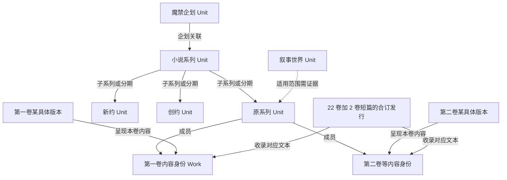
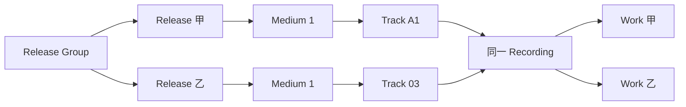
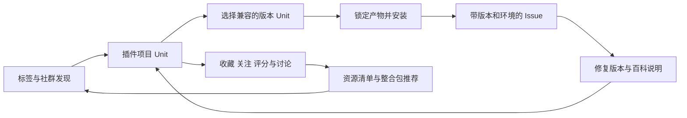
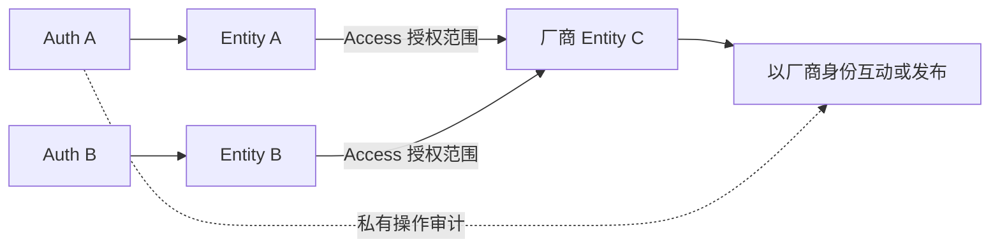

# REZICS：动态元信息模型与单库分表的渐进扩展方案

**Operational implementation supplement (2026-09-06):** [selected decisions and issue register](REZICS-operational-refactor-decisions-20260906.md) and the [implementation program](../plan/operational-refactor-20260906/README.md) add VNDB, standard content-language identity, scoped official-name/translation provenance, sustainable review and destructive migration/cutover planning. This report remains the semantic baseline; its examples do not imply delivered features.

初稿日期：2026-09-05。本报告已移入 `docs/report`，持续直接修订已提交的文件，涵盖世界观／IP／系列、Work 与具体版本、动态属性、通用 Unit，以及 Profile／Entity 合并后的统一参与身份与 Access 代理机制。本文为待实施的架构建议，不表示相关模型已全部落地。

**2026-09-06 专题整理：** 字段、content-structure、Tag、关系引用及复杂查询的详细设计由[《内容结构、关系与复杂查询的数据模型》](REZICS-内容结构关系与查询模型-20260906.md)维护；整个 Catalog 的领域地图、商品／GPU／算力／课程等边界及实施分期由[《Catalog 领域边界与实施分期》](REZICS-Catalog领域边界与实施分期-20260906.md)维护。本报告保留平台方向和部署演进。阅读顺序与主题分工见[报告索引](README.md)。

**实施状态：** “采用”“步骤”表示设计决定或依赖顺序，不表示已交付或要求下一任务实施所有领域。当前源码基础、已确认待实施、未来按需和待验证范围集中列于[Catalog 专题 §1](REZICS-Catalog领域边界与实施分期-20260906.md#1-如何区分决定与交付状态)。其中 Profile／Entity 合并、完整包生态和新增产品／服务等领域尚未完整落地；未来领域不会成为现有作品与关系改造的隐含前置工作。

## 1. 这次明确采用的决定

**第一阶段：一个 PostgreSQL 实例、一个业务数据库、按数据归属分表，继续使用 PGroonga。设计重点是完整表达能力、清晰的数据归属，以及未来能只扩展最重的部分。**

**产品模型采用“具体版本可直接消费、Work 按需识别、组织关系独立、Unit 能力共同复用”。** 书籍、插件、包版本、世界观和系列只要是用户会独立收藏、讨论、评价或共建知识的对象，就应拥有稳定的 Unit 身份；这与其物理表是否相同无关。

具体决定如下：

| 问题 | 推荐决定 |
|---|---|
| 动态关系做到什么程度？ | 可治理的动态类型、谓词、属性与限定词；独立关系实例；多参与方与上下文；来源、时间、顺序、原样署名、冲突与修订 |
| 字段是否全部动态化？ | 不采用全量动态属性存储。稳定核心属性使用固定有类型字段，长尾属性动态定义；对象关系使用动态谓词，统一描述接口不强迫统一表布局 |
| 内容结构和领域关系怎样配合？ | content-structure 组织季／集、章节、载体／曲目；关系绑定具体内容或位置语境，顶层按正式组成规则穿透查询 |
| 能否承载 MusicBrainz、Bangumi？ | 把两者的公开元信息模型列为完整兼容目标，提供逐项结构映射与往返验收；不能以“原始 JSON 没丢”代替原生支持 |
| 世界观、IP 和系列是什么关系？ | 共享 Unit、动态关系和组织能力；按指称、成员语义、连续性及排序规则区分，具体见第 5 节 |
| 是否全面强制引入 Work？ | 不强制每个对象先有 Work。具体版本可直接建档；需要跨版本内容身份或来源明确提供 Work 时建立，并说明其范围 |
| 为什么继续保留通用 Unit？ | 让插件、包和其他对象复用收藏、标签、评分、讨论、百科、issue 和贡献能力，而不只是复用数据库字段，具体见第 9 节 |
| Profile 与 Entity 是否合并？ | **合并对外身份及主体表模型。** 编目主体与互动主体统一为 Entity；私有 AuthUser 保留，代表权由 Access 显式控制，见 §9.8–9.13 |
| Catalog 内部怎样拆，Market 放哪里？ | Catalog 覆盖全部编目；按身份、领域结构和维护负载划分表组。软件项目与包发布分别归属；商品／GPU、服务／算力、图片、视频等沿同一规则扩展。Market 独立引用 Catalog 对象，不拥有它们的公共事实 |
| 各领域数据量不均匀怎么办？ | 领域表组独立增长，重表再按稳定键分区／分片。一个领域未来可以占几十个分片，另一个继续留在原库 |
| 现在要不要分库？ | 不需要。先分表，保留本地事务和真实外键；明确未来迁出时必须同行的表和引用 |
| 现在要不要 OpenSearch？ | 不需要，也不作为必然演进终点。PostgreSQL 主导关系与全文协同，独立检索须证明具体查询子集、完整性及端到端成本，硬件只提供评测条件 |
| 整体产品还成立吗？ | 成立。书单、讨论、百科、资源使用围绕同一对象衔接，物理存储位置不成为用户要理解的概念 |

这里区分四件事：**统一元信息协议、统一用户体验、同一张表、同一个数据库。前两项是长期目标，后两项是可以随规模变化的实现选择。**

## 2. 研究依据及“完整承载”的定义

本次重点核对了：

- MetaFusion：已有本地源码，提交 `57ffc7d1a597142aa30a116638affea86f4c0097`，尤其关系字典、时序关系和运行时验证。
- MusicBrainz Server：提交 `cff977f0ba8f06d5fa594e7590f6a134b1a5a22c` 的 SQL 定义，配合官方实体、署名及关系文档。
- Bangumi Server：提交 `60fdc32daf1d717f8446bad75fd2c3dc44805642` 的关系类型、领域模型和 Infobox API；开发数据库结构使用 `bangumi/dev-env` 提交 `789e2131df0545f3dc024db7f34faa5eff2c0bcf` 作交叉核对。开发库文件不等同于未经公开的生产全库。
- 当前 REZICS：提交 `a10468276e66b734d8678a6ce07670a63ef90baf` 的 Unit、署名、主题关系与搜索实现；并沿用已经阅读的 PostgreSQL 分库讨论作为待修正背景。
- 本次修订在 `86339bd10` 所在工作树重新核对了 `unit_variant`、Series、收藏／关注、评分及标签结构；参考 Wikidata 的书籍与虚构世界模型、IFLA LRM 2024-07，以及出版社对《魔法禁书目录》分卷、合订与网络分发的实际描述。研究资料与本报告的产品选择分别表述。
- 统一身份修订另外核对了 `profile`、`entity`、Auth、Access、所有权认领和请求级 Authorization。该修订改变了原先对“编目 Entity／参与 Profile”的划分；本文保留的 Profile 用语只在说明现有实现或迁移来源时使用。

“完整承载”应同时满足：

1. **表达完整**：来源公开的对象、字段、关系、限定信息和原始标识都能表达，不把几个不同概念强制合并。
2. **使用完整**：这些信息能被读取、展示、查询、修订、导出；不是只有一个无法理解的归档 JSON。
3. **来源可还原**：保留来源语义和编码。标准化后的展示可以更好，但不能因此丢失原有顺序、别名、空值状态、关系方向或无法解析的原文。
4. **规模可延续**：对象增加不会要求重写全站；关系多的对象允许分页及分批编辑，而不是设一个小的永久总量上限。

范围是两者公开的元信息与必要的编辑、分类、收藏等关联模型。来源没有开放的私密数据不能被架构“补出来”。本报告给出目标结构及验收标准；尚未实现并运行全量导入器，因此不会将设计可表达说成已经完成全量兼容。

## 3. MetaFusion 的动态性：需要继承，也需要补足

MetaFusion 已把关系名称、正反向文案、允许的端点类型、对称／层级标记和属性描述放入 `relation_types`；关系实例带独立 ID、限定符、起止日期和 ended 状态。它的运行时验证会检查端点存在、类型是否允许、层级环及日期。这个方向值得继承。[关系定义](https://github.com/MoeclubM/MetaFusion/blob/57ffc7d1a597142aa30a116638affea86f4c0097/deploy/init_db/13_relation_types_governance.sql)、[运行时验证](https://github.com/MoeclubM/MetaFusion/blob/57ffc7d1a597142aa30a116638affea86f4c0097/backend/internal/ontology/ontology.go)

但需要看到实现边界：

- 字典中的实体细分类可以扩展，关系端点的物理类别仍由代码中的 work、artist、release、franchise、canonical_entry 等分支识别。增加真正的新端点类别仍可能需要改代码。
- 关系有一个 `qualifier` 字符串及属性 JSON；“拥有属性描述字段”不自动证明完整的属性类型、重复值、嵌套结构和数量约束已经被执行。
- 检查到的关系验证入口没有接收完整 attributes 值，因此不能仅据该入口宣称实现了所有 JSON 属性 schema 的约束。
- 源码对层级关系做环检查；不能据文档中的“DAG”字样，把所有关系都理解成必须无环。
- 唯一键包含端点、关系类型和单个 qualifier，不能自然表达任意数量的来源断言、重复任职区间、作品语境和语言版本组合。[开放关系迁移](https://github.com/MoeclubM/MetaFusion/blob/57ffc7d1a597142aa30a116638affea86f4c0097/deploy/init_db/20_franchises_and_open_relations.sql)

**REZICS 应采用“可配置的语义定义＋经过验证的关系实例＋必要的领域结构”，而不是只把 role 枚举换成数据库字符串。**

## 4. 动态模型应达到的具体能力

### 4.1 将物理类别、语义类别和可执行能力分开

建议区分三层：

- **物理表组**：决定数据在哪里、由谁写入，例如作品、主体、软件、视频。数量较少，通过代码和迁移管理。
- **语义类别**：例如作曲者、唱片厂牌、乐器、机体、引擎插件、量化模型；采用带命名空间的定义，可继承、组合和逐步扩展，不必每种新类别都建表。
- **可执行能力**：例如可安装、可付费发布、可渲染预览。涉及状态机、权限和执行行为，必须由实现过的模块提供，不能靠用户添加一个类别或属性就获得。

新增“某种乐器”“新的演职角色”“某个社群的设定关系”，应通常只需要增加受治理的定义。新增“一个此前没有支持的包协议”则需要实现适配器；这属于新行为，不应伪装成纯配置。

`unit.kind` 可以继续作为稳定的产品／协议判别，不把每一种语义类别都塞进这个枚举。语义类别以受控定义及归属内的类别成员记录表达。是否需要新物理表，由字段、查询、生命周期和规模决定。

### 4.2 定义层：至少包括这些信息

| 定义对象 | 必要信息 |
|---|---|
| `semantic_class` | 稳定 ID、命名空间、父类／允许组合、描述、显示名、状态与版本 |
| `predicate_definition` | 稳定 ID、属性或关系的种类、正反向语义、参与角色、允许的对象类或值类型 |
| `predicate_revision` | 不可变定义版本；约束、允许限定词、属性结构及解释规则 |
| `qualifier_definition` | 数据类型、可重复性、顺序、计量单位、所需对象类型、允许值及其层级 |
| `relation_role_definition` | 多参与方关系中的角色，如表演者、角色、作品、版本、场地 |
| `source_definition_mapping` | 来源定义的完整标识和版本，与 REZICS 定义的 exact／broader／narrower／unmapped 映射 |
| `display_profile` | 某类对象常见字段和关系的展示／编辑方式，不决定数据是否能够存在 |

定义具有平台或社群命名空间。公共定义需要审查和弃用流程；社群可以试验自己的定义，再申请映射到公共定义。显示名称改动不能改变谓词身份，源码或数据库中也不能按中文文案判断业务语义。

定义更新采用新 revision，既有实例保留它当时所依据的版本。改变属性类型或端点范围时，有重新验证和迁移过程；不要修改一行定义后使所有历史数据在没有记录的情况下改变含义。

这里可以借鉴 SHACL 的形状、数据类型和属性约束思想，但第一阶段无需引入 RDF 存储或完整 SHACL 执行环境。[W3C SHACL](https://www.w3.org/TR/shacl/)

### 4.3 实例层：关系必须具有自己的身份

一个关系实例不只是 `(subject, predicate, object)`。推荐的共同结构为：

```text
assertion
  id                         稳定关系／事实身份
  owner_unit_id              谁拥有这条事实及其事务
  predicate_revision_id      使用哪个定义版本
  subject_ref                语义主语，不必等于 owner
  object_ref 或 typed_value  二元关系目标或属性值
  context_ref                作品、版本、世界观、文章等主要语境，可空
  governance_scope           公共或具体社群的治理范围
  valid_time                 适用时间，支持不完整和未知
  status / revision          候选、接受、争议、撤回等及修订

assertion_qualifier           可重复、可排序的限定值
assertion_participant         多参与方及其角色；需要时存在
assertion_evidence            支持或反驳它的来源观察
assertion_revision            修订、作者、理由和历史
```

这是共同契约，后文将按表组落表；**不是要求全站只创建一张永久承载所有领域的 assertion 大表。** 普通二元事实使用主行的快速列；只有多参与方才增加 participant 行，不为每条普通边强制制造多个中间对象。

也不要求将所有固定属性逐项转换为 assertion 行。关系实例、关系修订、结构出现和来源修订使用明确的引用种类；普通关系引用跟踪当前状态，历史证据固定到具体修订。现有 creditAttribution／subjectAssociation 的 UUID 可以沿用，不为每条关系再创建完整 Unit。引用关系、查询关系链、推导新事实分别定义，详见[专项报告 §5](REZICS-内容结构关系与查询模型-20260906.md#5-统一关系实例保留清楚的语义边界)。

必须支持：

- 同一对端点多条关系，例如同一艺人两次加入同一乐队，日期不同；同一演员在不同作品和语言版本中配同一角色。
- 限定词可为实体引用、文本、带语言文本、整数、精确小数、带单位数值、日期结构或受控复合值。
- 属性可有多个值，限定词也可重复；顺序在有语义时必须保留。
- 独立记录原样署名、来源端点文字和排序，而不是把这些信息覆盖到实体的全局名称。
- 有些事实涉及三方或更多参与者；作品、人物、角色都能作为可查询的真实引用，而不是藏进一个说明字符串。
- 来源支持与来源反驳分开。多源冲突可以保存；公共或社群的当前选择另有审核状态。

不要设置全局 `UNIQUE(subject, predicate, object)`。来源幂等键可以使用来源关系 ID，或来源记录版本、字段路径与出现次序；规范事实去重需要考虑语境、时间、限定词及重复出现的语义。散列可以帮助找重复，不能不检查内容就把散列相同当作同一事实。

### 4.4 时间、缺失与原文需要表达真实状态

需要区分：未提供、明确未知、明确无值、存在但尚未解析。它们不能一律变成空字符串或一个默认日期。

日期允许年、年月、完整日期、缺年份的月日，以及保留原始表述的未解析日期。Bangumi 的生日可能只有月日；节目播出时间可能是文本。不能为了塞入 `date` 而补一个虚假的年份。

起止日期和 `ended` 分开：已结束但结束日期未知是合法状态。适用时间与系统观察／录入时间分开；只有需要历史裁决的事实才承担完整的时间历史成本，不给每个无关字段强加复杂双时间查询。

“身高从 178 cm 变为 181 cm”这类字段至少保留原始结构和表述；有可靠语境时才拆成两个带时间／版本的测量断言。不能直接归一成单一 181 cm 并丢失前一状态。

### 4.5 图约束按谓词定义，不能统一要求 DAG

| 关系 | 推荐规则 |
|---|---|
| 明确结构包含 | 在声明的结构范围内禁止环；支持顺序及多父关系时明确语义 |
| 相互合作、某些对应关系 | 对称；同一事实提供两种读取方向，不维护两份可独立修改的权威边 |
| 续作／改编／影响／关联 | 以具体语义判定；不能仅因是“关系”就要求整图无环 |
| 等价与身份合并 | 审核后的身份操作，不能由任意用户添加一条相似关系自动触发 |
| 包依赖 | 保留生态语义；不能通用地禁止循环或多版本共存 |
| 安装兼容 | 由具体版本及环境条件表达，不自动认定具有传递性 |

关系定义中的上下位分类，不自动意味着对所有实例执行传递闭包。反向标签也不证明可以推导其他事实。

对真的需要禁止环的结构，写入验证必须防止并发竞态：在相应结构范围内串行化修改或校验结构版本。搜索达到工作预算仍无法证明无环时，进入待验证流程，不能当作已通过。禁止环的性质不能靠无限递归请求来换取。

MusicBrainz 的 `entity0_cardinality`／`entity1_cardinality` 包含 Few／Many 等提示编码；不能将其数值 0／1 直接解释成数据库“最多零个／一个”。REZICS 应分别保存来源提示和真正执行的数量约束；关系属性的 min／max 又是另一种含义。[MusicBrainz 关系类型示例](https://musicbrainz.org/relationships/artist-work)

### 4.6 动态定义仍需要强校验

请求先解析受控的值类型，再加载它指向的定义 revision，验证端点类别、角色、限定词、数量和语境，最后进入拥有者的事务。数据库负责真实外键、局部唯一性、值形状及基本状态约束。

导演、编剧等业务 Role 清单从固定 SQL CHECK／enum 和代码枚举中退出，改为受治理定义。角色定义 FK 与底层引用形状约束仍保留；新增角色不应再要求改 DDL。贡献、出现、主题和设定共享关系契约但保持不同含义，不能全部退化为 related_subject。

定义表达能力和实际执行能力要对应：某种复杂约束尚未实现时，明确标记为无法验证或仅提示，不能在类型层宣称已保证。运行时不接受用户提供的 SQL、代码或任意解释器脚本作为谓词约束。

原始来源快照用于恢复、重放和未来补映射；未知字段进入有状态的待映射区。**在未知字段尚不能原生读取、编辑和导出前，该项兼容状态应为未完成。**

每页 100 条、每次修改 100 条可以是请求预算；不能因此限制一张专辑最多 100 轨、一个人物最多 100 个作品或一条复杂名单只能有 100 个成员。大对象通过分页、子行、分批导入和不可变清单处理。

### 4.7 固定核心字段、动态长尾属性、动态对象关系

**页数、字数、具体内容时长等常见稳定属性，默认使用固定有类型字段；长尾编目属性使用动态定义和值；作者、演员、角色、世界观等关联使用动态关系定义。** 固定字段可以有统一属性描述和来源，不要求展开成逐字段的关系行。数值 320 无需成为 Entity。

字段归属先明确：页数和 ISBN 归具体出版版本；内容时长归录音／剪辑；季号、集号和轨号归相应位置与编号体系；预计集数是声明，已收录集数是结构统计；编码和分辨率归文件／流资源。完整映射见[专项报告 §2](REZICS-内容结构关系与查询模型-20260906.md#2-字段对象与物理表分别作决定)。

多来源可以各自声明不同页数，当前采纳值供详情和筛选使用，并保留依据；这些修改由同一拥有者完成。不能出现两份可独立编辑的固定页数与动态页数权威。内置字段语义或存储变更仍需受控迁移，长尾字段才通过新增定义扩展。

因此继续保留领域契约，并按正确的对象粒度重构 `book`、`software`、`media`。统一事实接口与 Wikibase 式表达能力可以并存于这种存储选择中，而不意味着全量 EAV。[Wikibase 数据模型](https://www.mediawiki.org/wiki/Wikibase/DataModel)

## 5. 世界观、IP、系列、Work 与具体版本

### 5.1 世界观、IP 和系列共享机制，但指称可以不同

这里的“世界观”指可被作品共同使用的虚构世界／叙事设定；“IP”优先按用户通常所指的作品品牌或跨媒体企划理解，使用 franchise 语义。具体权利、授权和地区期限仍由权利记录表达，不从“属于某 IP”自动推导。

| 对象 | 主要回答的问题 | 成员与组织特点 |
|---|---|---|
| 世界观／虚构宇宙 | 哪些作品、角色、地点及设定属于同一叙事背景？ | 需要连续性、正典／分支及来源语境；通常没有唯一总顺序 |
| IP／Franchise | 哪些内容属于同一作品品牌、企划或跨媒体生态？ | 可跨作品系列和世界线；企划关系与叙事发生关系分开 |
| Series／系列 | 哪些作品或发行构成某种持续、编排或编号关系？ | 可以有子系列、卷号、出版顺序、推荐阅读顺序和明确的收录规则 |
| Collection／书单 | 某位用户或社群为某个目的选了什么？ | 有策展者、选择理由及可变次序；不自动声明正式系列归属 |
| Realm／社群 | 哪些人按什么规则共同交流和编辑？ | 拥有治理和成员关系；可以围绕任意上述对象活动 |

用户指出的共同点成立：它们都可能需要成员、子群、关联、别名、时间和来源，也都需要收藏、关注、讨论与百科。因此复用通用 Unit、动态关系及组织组件，没有必要各写一套孤立系统。

但“机制相同”不意味着可以忽略谓词：`part_of_series`、`set_in_universe`、`part_of_franchise`、`about` 表达不同事实。一个解说某世界观的视频可能只是讨论它；同一品牌的不同改编也不必属于同一连续性。Wikidata 分别使用 P179、P1434、P8345 表达这几类关联；这是参考其语义区别，不是照搬所有社区约束。[系列](https://www.wikidata.org/wiki/Property:P179)、[虚构宇宙](https://www.wikidata.org/wiki/Property:P1434)、[Franchise](https://www.wikidata.org/wiki/Property:P8345)

**实现建议：使用共享的 Grouping／组织能力和语义类，不为三个名称新建三套数据库。** 当前 `series` 已有可扩展的 kind，种子也使用 franchise；可以作为重构起点。扩展为有谓词、语境及顺序配置的成员关系，不能只用目前 `series_release` 的单一关系和顺序替代全部组织语义。[当前 Series](../../services/main/src/services/database/schema/series.ts)

物理上可沿用／演进 `series` 表，或在一次明确迁移中改为更合适的 grouping 表名；逻辑上，虚构宇宙、系列与 IP 是可独立引用的 Unit。相同名称不能决定合并。若同一个被指称对象确实兼有系列与整体创作属性，可以组合语义类；若指称不同，保留不同 ID。页面可把相关对象组合展示，无需强迫用户先访问几页空目录。

### 5.2 Work 的边界确实不是由数据库决定的

IFLA LRM 2024-07 明确把 Work 边界与编目惯例、文化背景和用户需要联系起来；它既允许整体创作与其中部分分别成为 Work，也区分实体创作内容与汇集选择的创作。因而“每卷一定是 Work”或“全系列只能是一个 Work”都不是可以无条件套用的规则。对汇集，模型允许在有需要时再独立描述 aggregating work。[LRM 2024-07 作者公开全文，§4.1.3、§5.7](https://www.researchgate.net/publication/388155920_IFLA_Library_Reference_Model_A_Conceptual_Model_for_Bibliographic_Information)

Wikidata 的书籍实践常用 Work／Edition 两层安排属性，而非要求每个条目在界面中逐级展开四层；它提供了有价值的简化参照，但不能单凭 Wikidata 的某个 Item 分组就裁定 REZICS 的全部版本边界。[Wikidata Books](https://www.wikidata.org/wiki/Wikidata:WikiProject_Books/en)

本报告把 **Work 定义为“具有明确创作范围、可独立引用的内容身份”**，不是所有对象的必经父节点，也不等于系列、标题、ISBN、某个源站条目或默认版本。至少记录范围类型、范围说明、来源依据及与组成／衍生对象的关系。

推荐的建档规则：

- 独立创作或被可靠来源稳定识别的卷、篇、影片、乐曲，可以建立 Work。
- 一个有可识别整体创作身份的多部分内容，可以同时有整体 Work 和部分 Work，以组成关系连接；仅为了导航集合若干卷时，建立 Series 就足够。
- 单纯把同一文本拆成两册、换装帧、重排版或合装，不自动产生新的内容 Work。
- 独立改写、改编或新的创作可以形成相关的新 Work；翻译、修订等细分按领域规则及来源证据判断，不能只用相似度阈值裁定。
- 章节不是默认都要有 Work；具有独立创作或引用价值的短篇、章节才按需识别。
- 增补内容、扩大收录范围与改版需要分别描述；如果“第一卷”变成“前三卷整体”，不能修改同一 Work 的范围后让原有评分和引用悄悄改变对象。

### 5.3 最终选择：具体版本优先，Work 按需识别

| 方案 | 好处 | 本报告的选择 |
|---|---|---|
| 只保留主要版本及变体 | 建档和消费直接，额外对象少 | 保留其导航便利，但不足以表达合订、部分覆盖和跨版本内容身份 |
| 每个条目强制 Work → Expression → Manifestation → Item | 对严格编目具有完整层次 | 不作为 REZICS 普遍的建档前置条件 |
| 具体版本可独立存在，需要时建立 Work 与内容对应 | 用户可立即使用，复杂关系可逐步澄清 | **采用** |

新建一个可明确消费的图书版本、视频发行或软件版本时，不要求先回答它属于哪个终极 Work。资料中应能明确语言、版本说明、覆盖内容和可用来源；Work 对应不确定时，保持待确认状态，不创造一个只是复制标题的空父对象。

当需要统一多个版本的内容评价、跨译本导航、作品级百科，或者来源明确提供 Work 时，再建立／接入有范围的 Work Unit。MusicBrainz 原生 Work 即使目前没有关联录音也应保留，这不是“只有出现第二个版本才允许建 Work”。

Expression 也按实际需要独立：例如同一译文被多种出版物复用，需要保存共同译者、文本修订或覆盖关系时，可独立识别；普通单一版本不用为了形式完整先创建一层空节点。源模型有明确 Expression 时仍须无损承载。

本报告的 Series 是广义的作品／发行组织能力。它不能与 LRM 中针对连续汇集出版讨论的 serial work 直接画等号；网络按章发布，也不自动把小说变成那种期刊式汇集对象。源模型的细分通过语义映射保留，不强制所有领域采用相同的抽象层数。

### 5.4 用《魔法禁书目录》检验

先区分真实事实与建模选择：电击文库的系列目录同时列出原系列、新约、创约及相关作品，作者站也使用篇章／系列导航；这证明存在多种组织视角，不证明它们必须是同一个 Work。[出版社目录](https://dengekibunko.jp/product/index/)、[作者官方导航](https://dengekibunko.jp/author/kamachikazuma/kiseki/index.html)

Yen Press 的 Old Testament Omnibus 明确收录原系列 22 卷及 2 卷短篇，有独立 ISBN、出版日期和页数。这是实际存在的合订发行，不是本报告虚构的例子。[出版社合订本记录](https://yenpress.com/titles/9781975351588-a-certain-magical-index-the-old-testament-omnibus-edition)

推荐表示：

| 对象 | 表示方法 | 不应自动作出的结论 |
|---|---|---|
| “魔禁”跨媒体企划 | Franchise Unit | 全部成员共享同一连续性或都是一部小说的版本 |
| 共同叙事世界及必要的分支 | Universe／连续性语境 Unit | 品牌相同就自动为同一正典 |
| 小说总系列、原系列、新约、创约 | Series 及子系列／分期关系，可有不同排序 | 子系列是前一卷的 variant；全系列是一个固定页数对象 |
| 某一卷的创作内容 | 范围明确的 Work，可按需建立 | 换纸张或把本卷拆成上下册就新增两部创作 |
| 某一卷的日文版、某译本具体出版物 | 具体 Book／Edition Unit，关联该卷内容 | 所有译本页数、进度或译文质量相同 |
| 收录 22＋2 卷的合订本 | 独立 Edition／Release Unit，加有序内容收录关系 | 它只是第一卷的 variant，或等于完整 IP |
| 整体编选所体现的创作 | 需要独立描述时加 Aggregating Work | 必须取代被收录各卷的内容身份 |



图中为了可读性省略了译文等中间对象。实现时合订本应尽可能关联实际收录的表达／版本及其内容范围，不能仅凭与同一 Work 相连就断言采用了同一译文。图也没有断言各分支的正典关系，应按可靠来源记录。

### 5.5 合订、拆分、网络版需要内容覆盖关系

增加有序的内容收录／覆盖结构，至少包括容器 Unit、目标内容引用、覆盖方式（完整／部分／选编／未知）、范围选择器、顺序、来源及修订。范围选择器优先引用稳定章节／内容节点；保留无法解析的原始范围，不能仅用易变页码认定等价。

正式内容组成可由 content-structure 的出现记录及领域扩展承载；`release_content_member` 表示需要提供的语义／读取结构，不意味着必须再建一张与目录独立可写的 contains 表。目录、覆盖和关系视图的单一权威绑定见[专项报告 §4](REZICS-内容结构关系与查询模型-20260906.md#4-content-structure组织内容并支持穿透)。

- **合订**：一个发行收录多个内容／表达；可单独收藏和评价装帧、译文及编辑质量。
- **拆分**：一个内容在多个发行中分别呈现。只覆盖上半部的版本，不可作为“完整作品默认版本”的候选。
- **重新编排**：顺序变化、增删和重写分别记录；不能只保留一个 `variant_of`。
- **网络版**：先识别发布渠道、具体文本与修订。纸本内容在网站分章提供，可以只是另一种分发／呈现；独立连载并改写，则需要文本演变和内容对应，必要时建立相关新 Work。

《创约》确有电击官方网络阅读入口，但“能在网上阅读”不能证明它是一套内容不同、先于文库创作的 Web 小说版本。本报告不把这个推断当成事实。[官方网络阅读入口](https://dengekibunko.jp/novecomi/novel/16818093074802518071/)

合订版和拆分版还影响消费状态：读完其中一卷，不能自动把整本合订本标为已读；不同译本的百分比和页码不能直接迁移。跨版本进度换算需要明确的内容对齐证据，未知部分保持未知。

### 5.6 “主要版本”保留为选择策略，和内容身份分开

当前 REZICS 的 `unit_variant` 是受约束的主版本—变体星型关系：同类、直接指向主要目标，组大小有预算；公开变体还依赖主要目标的可见状态。它提供了简单明确的导航，但没有表示“合订收录哪些内容”“拆分覆盖哪一段”的结构。[变体结构](../../services/main/src/services/database/schema/unit.ts#L354)、[星型约束](../../services/main/src/services/database/schema/postgres/unit-variant-integrity.sql)、[生命周期规则](../../services/main/src/services/units/variant-policy.ts)

保留“默认给用户哪个版本”的产品能力，采用可解释的选择策略：先尊重用户明确选择，再考虑可访问性、语言／地区、完整覆盖、版本质量与社群偏好。选择结果携带策略和具体 Unit ID；安装／阅读一旦开始，固定实际版本和必要的修订，不因推荐版本改变而悄悄换内容。

元信息的显示语言与实际内容语言分别处理：翻译了一个标题，不等于出现新的译本；双语出版物也不必仅因包含两种语言就拆成两个发行 Unit。需要时，一个版本关联多份文本／表达，阅读状态固定实际选择的内容语言及修订，不能由界面本地化回退悄悄替换。

需要分别命名以下选择，避免共用一个 main 字段：

| 选择 | 含义 |
|---|---|
| Work 的推荐版本 | 哪个具体版本适合当前用户消费该范围的内容 |
| 系列的开始／继续入口 | 按某种阅读顺序，从哪卷开始或接着读 |
| 聚合页的代表封面 | 用哪个图像展示这个聚合对象 |
| 某个市场的推荐发行渠道 | 按环境和策略推荐哪个包版本 |

它们都不应充当不可变身份。更换代表版本不会迁移所有收藏、改写书评对象或删除旧版本。

### 5.7 关系与范围的最低契约

| 关系／结构 | 用途 |
|---|---|
| `part_of_series` 与有序成员 | 成员归属、卷号和按 profile 定义的次序 |
| `part_of_franchise` | 品牌／企划归属，来源可追溯 |
| `set_in_universe`／`from_universe` | 作品叙事或角色设定的世界语境 |
| `continuity_relation` | 正典、重启、平行分支等，由明确来源／社群语境限定 |
| `realizes_work`／内容对应 | 具体表达／版本与有范围的内容身份对应 |
| `release_content_member` | 合订、拆分、选编、章节覆盖及其顺序 |
| `translation_of`／`revision_of`／`adaptation_of` | 区别翻译、修订、改编；支持直接引用已知具体对象 |
| `presentation_preference` | 当前展示／消费建议，不参与身份合并 |

不要求这些都成为不同的物理关系系统。通用断言与领域结构使用已经定义的单一权威绑定。排序应属于一个明确的排序 profile，例如出版顺序、故事时间或社群推荐顺序，而不是声明宇宙中的所有对象有同一个总序。

### 5.8 迁移采用按记录澄清，避免批量造空 Work

现有 Book 记录的实际粒度不能仅从表名证明；有的来源条目可能代表整套系列，有的有明确 ISBN 和页数。迁移先识别每条记录的范围，保留现有 ID 和使用记录，再补充具体类型、内容对应及语境。未明确的记录保留可用的编目入口和待澄清状态。

对已有变体关系分类处理：明确同范围版本的，建立内容对应；合订／拆分的，转为覆盖关系；改编的，使用衍生关系；关系不明的，保留来源和待审核状态。不要自动把每个旧 Main 都变成 Work，也不要将旧 Main 的评分全部搬到新 Work。

“主版本下架导致其他版本不能公开”的现有耦合，在新契约中应重新设计为各版本自己的生命周期与读取权限。是否保留旧语义到迁移完成必须显式决定；不能仅删除约束而遗漏相关服务、历史恢复、语言证据、搜索折叠和合并逻辑。

资料表示与用户结果应一同验收。2024 年 *Presenting Compounds to End Users in Search Results* 通过原型和用户研究讨论复合书目结果，报告同时呈现组成与汇集对象的价值；本次依据公开摘要和可检索结果说明使用它，不将其视为 REZICS 的实测结论。[论文](https://doi.org/10.1080/01639374.2024.2369903)

## 6. MusicBrainz：逐项承载，不强行套通用作品链

### 6.1 第一项修正：Release Group 不是音乐 Work

MusicBrainz 的 Work 是创作内容层面的作品，Recording 是具体录音，Track 是某个媒介上的出现。Release Group 汇集相关发行，Release 是具体发行，Medium 是该发行中的媒介。录音可以出现在多个发行的不同曲目中，一个录音也可以关联多个 Work。

这些结构在官方 SQL 中分别存在，不能把 Release Group 与 Work 合并，也不能将 Track 与 Recording 合并。[MusicBrainz 核心 SQL](https://github.com/metabrainz/musicbrainz-server/blob/cff977f0ba8f06d5fa594e7590f6a134b1a5a22c/admin/sql/CreateTables.sql)



图中的 Recording → Work 是带类型和限定信息的关系，例如完整演奏、部分演奏或串烧组成；不是要求每个录音恰好有一个作品父节点。

### 6.2 完整映射清单

| MusicBrainz 能力 | REZICS 应提供的结构 | 丢失信息的错误简化 |
|---|---|---|
| Artist，包括不同主体类型 | 统一 Entity 及语义类别，来源 Artist 标识保留；可在取得授权后以同一身份参与互动 | 所有 Artist 都等于自然人，或导入 Artist 就自动获得登录与代表权 |
| Label | 厂牌／出版标识主体，并可关联经营组织 | 所有厂牌都直接等于一家法律实体公司 |
| Area、Place | 区域、地点主体及地理属性、关联 | 仅保存无法引用的一段地名文本 |
| Event | 活动对象、时间、地点、取消状态、节目单等 | 把活动当作某个作品的一个日期字段 |
| Instrument | 乐器对象、类型及描述 | 只有一个不可扩展的乐器字符串枚举 |
| Work、Recording | 分开的对象类别与扩展表 | 用一个“音乐作品”对象替代二者 |
| Release Group、Release | 发行组与具体发行 | 与 Work 合并，或只保留一个 releaseDate |
| Medium、Track | 发行内有序媒介、曲目出现、位置和原始编号 | Track 等于音频文件；A1、03 等编号丢失 |
| Artist Credit | 独立署名组合与有序成员、原样名称和 join phrase | 用无序作者 ID 列表拼接，导致封面署名变化 |
| 同一对象的不同署名 | Release／Recording／Track 等各自引用署名组合 | 改了某个艺人别名后自动改写全部来源署名 |
| 发行地区与日期 | 发行事件子表；地区未知状态保留 | 每个发行只能有一个国家和一个日期 |
| 厂牌与目录号 | 可重复的发行厂牌／目录记录；允许有目录号但厂牌未确认 | 全部塞入单个 publisher 字段 |
| 主类型、次类型、包装、语言、文字系统、媒介格式 | 定义字典与有类型的属性／专属列 | 只保存“音乐”一个分类 |
| ISRC、ISWC、条码、MBID、CD TOC 等 | 有命名空间和来源的标识；技术结构有相应扩展 | 所有标识都当无条件全局唯一身份，或只留一个 externalId |
| Alias、排序名、消歧说明 | 别名记录保留类型、语言、主要标记及有效期等 | 简单字符串数组无法承载全部语义 |
| Series 和成员次序 | 系列对象、成员关系、来源编号、排序策略 | 把系列一律当父作品，忽略集合和排序性质 |
| Relationship Type / Attribute Type | 定义、层级、允许属性、来源完整编码及版本 | 只挑作曲、演奏几个角色硬编码 |
| 关系属性及属性原样署名／文本值 | 可重复限定词与属性值结构 | 用单个 qualifier 覆盖多种属性 |
| 关系起止、ended、link_order、端点署名 | 关系实例上的时间、排序和端点展示信息 | 二元边相同就合并，导致时间与署名丢失 |
| URL、注释、标签、流派、评分、集合 | 有类型的链接／正文／分类／统计或个人集合模型 | 把外部聚合评分当成 REZICS 用户真实投票 |
| 编辑、来源标识及合并重定向 | 来源修订与本地审核分开，保留外部身份和重定向 | 导入后无法解释当前资料来自哪个来源版本 |

上述领域模型的解释还可对照 [官方实体说明](https://musicbrainz.org/doc/MusicBrainz_Entity)、[Artist Credits](https://musicbrainz.org/doc/Artist_Credits)、[署名规范](https://musicbrainz.org/doc/Style/Artist_Credits)、[关系说明](https://musicbrainz.org/doc/Relationships) 和 [关系属性目录](https://musicbrainz.org/relationship-attributes)。

映射中的“动态结构”不排斥领域结构。录音、发行组和署名组合需要明确的身份、约束与索引；载体和 Track 出现可由 content-structure 加音乐专属扩展表达。不要既在目录保存内容引用和顺序，又在另一张曲目表独立维护同一事实。演奏关系绑定具体录音／版本；把全部技术参数、顺序和署名都展开成三元组没有必要。[专项领域与结构设计](REZICS-内容结构关系与查询模型-20260906.md#3-catalog-的领域边界)

### 6.3 一个实际可检验的例子

假设某录音由艺人 A 与 B 演唱，在专辑甲中排为 A1，在合辑乙中排为 03；两次曲目标题略有不同；唱片上署名为 `A feat. B`。录音演奏了 Work X 和 Work Y，A 在其中演奏两种乐器，其中一种乐器使用了特殊的原样署名。

正确表示应同时有：

- 一份 Recording，两份 Track，各自有标题、编号、位置和所属 Medium。
- Track 所属的两个 Release 及其 Release Group；不能因为复用录音就把发行组也合并。
- 有序 Artist Credit，分别保存 A、B 的身份、当次署名与 ` feat. ` 连接词。
- Recording 到两个 Work 的独立关系及部分／串烧等限定信息。
- A 到 Recording 的表演关系及两个乐器属性；乐器属性自身的 credited-as 信息不能丢失。

验收时应能查询“这个录音出现在哪些发行中”，也能还原两份曲目单和原样署名。如果只能展示一个统一作品标题，这个例子就没有被完整承载。

## 7. Bangumi：核心难点是语境、关联及有序 Infobox

### 7.1 Subject 不应机械映射成统一 Work

Bangumi 的公开类型包括书籍、动画、音乐、游戏和三次元。不同 Subject 的粒度可以是系列、具体条目或其他编目单位。导入时保存完整来源 Subject 身份，并按信息证据映射到作品、系列、发行或软件项目。

映射暂不确定时，仍应有可以原生查询和编辑的来源编目条目，状态明确；不能为了立即归一而把每个音乐 Subject 自动判成 MusicBrainz Work，或因同名就合并。[Subject 类型](https://github.com/bangumi/server/blob/60fdc32daf1d717f8446bad75fd2c3dc44805642/internal/model/subject_type.go)、[Subject 开发结构](https://github.com/bangumi/dev-env/blob/789e2131df0545f3dc024db7f34faa5eff2c0bcf/sql/schema/chii_subjects.sql)

### 7.2 完整映射清单

| Bangumi 能力 | REZICS 对应能力 | 必须保留的细节 |
|---|---|---|
| Subject 与类型／平台 | 来源条目、原生对象映射、动态语义类和平台关系 | 来源 ID、类型、原名／中文名及粒度 |
| Episode | 可独立引用的分集／章节及有序归属 | 类型、disc、排序号、名称、时长与播出原文、描述；不强制整数顺序 |
| Person | 人、公司、团体等统一 Entity，多种职业／活动关系；可启用参与能力 | 原类型与职业信息保留；导入不会自动建立 Auth 绑定或控制权 |
| Character | 角色、机体、舰船、组织等虚构主体 | 虚构／现实语境、类别与别名 |
| Subject ↔ Subject | 动态谓词与来源类型映射 | 前后传、改编、主线／番外、不同世界观、版本等、方向和排序 |
| Person ↔ Subject | 演职关系 | 职位、作品、参与集数和说明 |
| Character ↔ Subject | 出场关系 | 主角／配角、出场集数、顺序与剧透语境 |
| Person ↔ Character ↔ Subject | 配音／表演关系实例 | 三个真实引用；不能省略具体作品 |
| 人物／角色间关联 | 动态关系及治理语境 | 原类型、反向标记、结束、剧透及评论等可获得字段 |
| Infobox | 有序字段与嵌套值 AST，加标准化属性映射 | 重复键、重复值、子键、原顺序及未解析文本 |
| Alias、简介、图片 | 别名、正文修订和图像引用 | 语种、来源键、原始结构及出处 |
| Tag、meta tag、评分及收藏统计 | 分类断言、来源统计快照 | 来源统计与 REZICS 自身社区行为分开 |
| 条目／分集收藏、评论、索引列表及修订 | 个人状态、讨论、策展与修订模型 | 外部用户身份不冒充本地已认证账户；公开范围以取得渠道为准 |

其中三方配音结构不仅是设想：当前 Bangumi 的领域类型明确具有 Character、Person、Subject 三个成员；开发表还保留了作品中的角色形态说明。[关系领域模型](https://github.com/bangumi/server/blob/60fdc32daf1d717f8446bad75fd2c3dc44805642/domain/relation.go)、[配音表](https://github.com/bangumi/dev-env/blob/789e2131df0545f3dc024db7f34faa5eff2c0bcf/sql/schema/chii_crt_cast_index.sql)

演职及出场语境分别可核对 [演职关联](https://github.com/bangumi/dev-env/blob/789e2131df0545f3dc024db7f34faa5eff2c0bcf/sql/schema/chii_person_cs_index.sql)、[角色出场](https://github.com/bangumi/dev-env/blob/789e2131df0545f3dc024db7f34faa5eff2c0bcf/sql/schema/chii_crt_subject_index.sql)。

关系类型应从来源完整定义中映射，而不是手写几个常见中文名称。保留来源类别、原始 type ID、方向及定义版本；不同上下文中的相同数字不自动等价。[Bangumi 关系定义](https://github.com/bangumi/server/blob/60fdc32daf1d717f8446bad75fd2c3dc44805642/pkg/vars/relations.go.json)

### 7.3 Infobox 不能直接变成普通 JSON object

Bangumi 当前转换代码以字段数组和嵌套值数组输出 Infobox；字段值可以是文本或带可选子键的值列表。因此应保留以下结构：

```text
字段出现 0：key=别名
  值出现 0：subkey=英文名，value=Name A
  值出现 1：subkey=英文名，value=Name B
  值出现 2：无 subkey，value=另一个别名
字段出现 1：key=生日，value=12月5日
字段出现 2：key=身高，value=178cm→181cm
```

`{ "英文名": "..." }` 会覆盖重复子键；普通字典也不能可靠承担全部字段顺序与重复出现。建议以原文和有序 AST 为可还原记录，常用字段再映射到别名、日期和测量等原生结构。两者通过字段路径与 revision 对应，编辑后明确更新映射或标记待重新解析，不允许两份互相矛盾的可写权威值。[Infobox 结构](https://github.com/bangumi/server/blob/60fdc32daf1d717f8446bad75fd2c3dc44805642/openapi/components/wiki_v0.yaml)、[实际转换实现](https://github.com/bangumi/server/blob/60fdc32daf1d717f8446bad75fd2c3dc44805642/internal/pkg/compat/wiki.go)

### 7.4 三方配音关系的具体存储

“人物 A 在动画 S 的日语版第 1–3 集，为角色 C 的幼年形态配音”可以表达为：

```text
predicate       = voice_performance
owner           = 动画 S（或已建立的具体配音版本）
subject         = 人物 A
object          = 角色 C
context         = 动画 S 的相应版本
qualifiers      = language: ja；portrayal: 幼年
episode_scope   = 可解析的集数引用／范围，加原始来源表述
evidence        = 来源记录及字段路径
```

同一个 A 在另一作品 S2 配 C，是另一关系实例。另一位演员 B 在中文版配 C，也是另一实例。查询角色、演员或动画页面都能找到相应关系，并清楚显示语境。

只描述某一集时，直接绑定该集／版本；跨多集时，作用域仍属于同一出演实例。作品页通过正式 content-structure 组成取得这些关系，结果保留来源集和关系依据，不复制成各层独立的出演事实。角色歌及“关系引用关系”的例子还需保留关联变量，详见[专项报告 §6](REZICS-内容结构关系与查询模型-20260906.md#6-用-bangumi-与-vndb-校验表达能力)。

这里 `owner` 与语义主语不同：关系从 A 指向 C，但需要随动画的演职资料一起保存和迁移。**必须把关系的存储拥有者作为显式设计，而不是简单规定所有边永远跟主语走。**

## 8. 中心插件市场与所有资源索引：怎样归属

**状态：已确认方向，完整包分发及新领域能力未来按需实施。** 全领域边界和启用条件以[Catalog 专题 §3–4](REZICS-Catalog领域边界与实施分期-20260906.md#3-catalog-全领域归属地图)为准；本节保留平台能力和软件分发的摘要。

### 8.1 metadata 是对象的资料能力，不是所有资料的一个巨型业务域

一个插件本身有项目、作者、版本、依赖、兼容性、许可和文档，这些都是软件元信息。它既可以被编进资源清单、拥有百科和讨论，也可以被某个市场展示或由 REZICS 托管。

推荐结构：

```text
SoftwareProject                    软件身份、作者、宿主和社区引用
  ↔ PackageCoordinate              有依据时建立项目与发布坐标关联
       └─ PackageVersion           原生 manifest、依赖、兼容条件
            └─ Artifact 关联       产物、外部下载或镜像

MarketplaceListing                 独立展示／交易对象，引用编目身份

REZICS 托管时额外启用
  └─ 发布者授权、上传会话、发布状态、隔离审核、配额及审计
```

**索引世界上的插件，先增长的是软件项目、包坐标、版本和兼容知识；经营一个托管市场，再增加发布和分发能力。二者共享同一套项目及包资料，不需要复制成“metadata 中一个插件、market 中另一个插件”。**

插件是扩展宿主的角色，Package 是发布／安装身份，两者不互斥也不等同。项目、包和仓库不强制一对一；只有包资料时不凭空制造上层项目。包与发布表组也可服务 AI 权重、地图和资源包；它不永久从属于软件项目表。Web 软件、网站和具体服务实例按被描述对象区分，详见[Catalog 专题 §4.3–4.4](REZICS-Catalog领域边界与实施分期-20260906.md#43-软件插件包与文件)。

如果只是镜像同一个来源版本，新增镜像产物绑定和取得证据；如果重新发布到另一个注册表命名空间，则产生另一个包坐标。相同字节不证明同一发布身份。

`MarketplaceListing` 负责市场的组织与展示，不拥有软件的全部公共事实。发布权限负责谁能够向某个命名空间提交版本，不等于有权独占其公共百科或删除用户评论。

### 8.2 宿主、依赖和兼容不能混为一个标签

一个插件可以同时支持多个宿主或多个版本；一个项目也可能发布 Python、npm 或引擎原生格式的不同包。至少分清：

- 项目层 `extension_for`：它意图扩展哪个软件／引擎。
- 版本层兼容条件：宿主版本、加载器、运行时、ABI、操作系统、CPU、客户端／服务端侧等。
- 版本层依赖：需要哪个包、版本约束、依赖类别、是否允许并存、冲突及可选功能。
- 产物层条件：实际提供哪个平台／格式的文件。

兼容条件要保存组合关系。例如“Windows + x86-64”与“Linux + ARM64”两种构建，不能展开成互相独立的 OS 和架构列表后误判还支持“Windows + ARM64”。

通用动态关系可以表达和展示这些知识；安装器使用经过验证的版本约束 AST、原生 manifest 和生态适配器。社区填写“兼容某版本”不自动获得可执行安装保证。2026 年 ICFP 的包管理形式模型支持共同表达核心，但不同生态的求解语义仍须保留。[Package Managers à la Carte](https://arxiv.org/abs/2602.18602)

### 8.3 各种索引怎样处理

Catalog 的范围包括作品、创作者、软件、包、图片、视频、3D、AI 模型、实物产品、课程、事件和服务。完整归属地图统一见[Catalog 专题 §3](REZICS-Catalog领域边界与实施分期-20260906.md#3-catalog-全领域归属地图)，不再在本节维护另一份领域清单。

GPU 复用产品型号并增加硬件规格；计算服务复用服务定义并增加计算规格；实物、运行资源和高频采样另有身份或存储。图片／视频内容、平台投稿和技术文件分别识别；创作者、平台账号及上传者关系不能混同。新语义类别、同 ID 扩展、独立对象、表组和分片的判断规则见[Catalog 专题 §2](REZICS-Catalog领域边界与实施分期-20260906.md#2-统一拆分规则)。

跨领域对象可以关联。例如某个创作者的视频介绍了一款 Blender 插件，插件提供了一个 3D 资源包。通过关系及共同引用连起来，不把三个对象合并成一个泛化“资源”，也不强迫它们永远位于同一数据库。

## 9. 为什么分表后仍要保留通用 Unit

### 9.1 Unit 是平台能力的共同对象契约

**插件使用 REZICS 的价值，包括直接进入已经存在的收藏、关注、标签、评分、讨论、百科、问题反馈和贡献网络。** 如果各领域只共享存储与登录，却分别建立一套社交对象和内容系统，接入成本及用户体验都会割裂。

Unit 负责明确“用户正在收藏、评价、讨论或改进的究竟是什么”。它比 Work 更广：世界观、IP、系列、创作者、图书版本、软件项目、包发布版本、百科页面和 issue，都可能是 Unit；其中只有具有相应创作内容身份的对象才需要 Work 语义。

最小共同契约包括：稳定 ID 与可解析引用、对象粒度和语义类型、生命周期与可见性、所属数据拥有者、当前展示摘要，以及可以被哪些平台能力操作。正文、技术参数、版本算法及状态机由各自领域负责。

Unit 是逻辑契约，既不要求所有字段进入一张表，也不要求未来所有对象永远依赖一台数据库。第一阶段共享真实 `unit` 外键；将来分表组存储后，通过有界引用解析和能力接口维持同样的用户语义。

2026 年 Semantic Units Framework 强调可引用的身份、意义边界和上下文可以独立于具体数据库技术；它是概念研究，未给出实装或用户效果验证，也不等同于 REZICS 的 Unit。本报告只参考这种明确边界的思想，不据此把每条元信息断言都升级为完整社交 Unit。[研究及其限制](https://www.nature.com/articles/s41597-026-07588-3)

### 9.2 哪些对象需要 Unit，哪些不需要

| 对象 | 推荐处理 |
|---|---|
| 世界观、系列、IP、Work、具体出版版本、插件项目 | 有独立身份及平台交互，作为 Unit |
| 需要单独反馈、引用、评分或固定安装的包发布版本 | 作为可寻址 Unit，复用能力并保留版本语境 |
| 包坐标、来源条目 | 需要独立跟踪和用户交互时作为薄 Unit；与同一软件项目关联，不误当同一发布身份 |
| Wiki 页面、公开 issue、讨论主题 | 独立内容身份，具有自身历史、权限和状态 |
| 图像／模型变体等可独立使用资源 | 按其是否有独立使用与反馈语义识别；字节相同不自动合并身份 |
| 文件分块、缓存、抓取尝试、计数、关系限定词、普通字段值 | 属于子数据或技术记录，不为复用平台能力而制造完整 Unit |

“作为 Unit”不要求为每种对象预先生成所有能力的记录。没有人收藏，就没有相应收藏行；未启用 issue 功能，就不创建空问题板；没有人工编辑，就不预建整套百科及历史。

### 9.3 共同能力必须按对象粒度使用

| 能力 | 默认目标及使用方式 | 跨层级行为规则 |
|---|---|---|
| 收藏／关注 | 默认收藏想长期跟踪的作品、系列或插件项目；也可明确收藏具体版本 | 关注项目可订阅新发布；不产生“自动收藏全部历史版本” |
| 书单／资源清单 | 指向策展目标 Unit，保存推荐理由 | 安装整合包另外保存确定版本与摘要，不能仅依赖可变清单 |
| 标签 | 项目／作品的主题用途、社群分类及个人组织 | 继承显示需注明来源和适用范围；版本兼容不能靠无条件继承 |
| 评分与书评 | 对明确的 Work、版本、项目或发行评分，保留 Realm／语境 | 不把译本质量、发行质量和内容评价合成同一含义不明的分数 |
| 讨论 | 主题指向对象，并可附版本、章节、剧透或环境 | 聚合页可以展示相关讨论，但不改写帖子的原始主对象 |
| 百科 | 文章引用对象，可限定世界线、版本与社群 | 同一对象可有多种知识视图，不能因为共享 ID 就强制共享编辑规则 |
| Issue | 所属项目、受影响版本、环境、复现信息及解决版本 | 生命周期由 issue 模块负责；不能把普通评论数量当未解决问题数 |
| 内容进度／使用状态 | 具体版本及必要的内容结构修订 | 只有可靠内容对齐才允许跨版本换算，不自动传播到系列／合订整体 |
| 贡献与信任 | 明确贡献者、对象、修改和审核状态 | 编辑公共资料不等于获得软件发布权；不同来源的评分不冒充本地用户行为 |

现有实现已经提供了可复用基础：`unit_follow` 和 `collection_item` 指向 Unit；`unit_tag`、Realm／个人标签提供不同分类语境；评分当前按 Profile、Unit 和 Realm 组织。统一身份后的目标是按行动 Entity、目标 Unit 和 Realm 组织评分等行为，私有操作者留在审计中。这些能力可以扩展给软件对象，无需复制成互相割裂的 book_favorite、plugin_favorite、model_favorite 系统。[关注](../../services/main/src/services/database/schema/follow.ts)、[合集](../../services/main/src/services/database/schema/collection.ts)、[标签](../../services/main/src/services/database/schema/tag.ts)、[评分](../../services/main/src/services/database/schema/score.ts)

新增 issue 的工作流、跨版本反馈和其他尚未实现的能力仍需要对应模块及契约。共同 Unit 提供可复用入口，不自动证明所有功能已经完成，也不要求取消当前评分的 Realm 语义另造一套评分系统。

### 9.4 标签对模组是核心发现能力

模组用户的任务通常不是精确输入包名，而是找“能满足某种玩法和使用条件的组合”。REZICS 应把现有标签与社群分类能力直接开放给模组／插件项目，支持按用途、玩法、题材、机制和用户偏好发现资源。

例如一个用户可以在特定游戏社群中寻找“偏探索、支持某种玩法、适合自己的整合包风格”的模组，再按游戏版本和加载器筛选，再查看相关 issue、百科和整合包清单。这里标签组织偏好，结构化版本条件保证所查询的适用环境，社区反馈补充真实使用经验。

需要保持四种信息的区别：

1. **项目的用途与主题标签**：可以跨版本具有持续意义。
2. **版本的机器可判断条件**：宿主、加载器、依赖和具体产物平台，由版本契约及可信来源表达。
3. **社群或整合包中的判断**：如某配置下资源开销较高、与某组合存在问题，带环境和证据。
4. **个人标签与清单**：服务于用户自己的组织方式，不写成全站唯一事实。

已有 Tag／Path 和 Realm 上下文应在这里复用。项目页可以综合展示，但每项信息保留作者、来源或治理范围。不要把“社区打了兼容标签”当成依赖求解成功，也不要因某个旧版本的问题标签就永久否定所有新版本。

Tag 模型保留概念、Path、Expression、Application 和检索推导分层，演进重点是历史与当前退役、热点差额维护和词表治理范围；不在统一关系时退回字符串标签或强迫所有领域关系变成 Tag。当前限制及迁移建议见[专项报告 §7](REZICS-内容结构关系与查询模型-20260906.md#7-tag保留语义分层改进生命周期和增量维护)。

### 9.5 一次完整的插件使用路径



这条路径说明，插件市场不是平台旁边一个只负责下载的独立站点。它使用同一对象身份和协作网络；作者发布、用户反馈、社群知识和资源发现相互衔接。即使某个包只被 REZICS 索引、文件仍由外部注册表提供，也可以使用这些能力。

同样，不能把同一插件在多个市场的展示各建成无关联项目。市场 Listing 和包来源坐标保留自己的身份，通过明确证据关联到项目；项目改名或市场迁移不应使已有收藏、讨论和百科失效。

### 9.6 接入协议：包客户端与平台能力互相衔接

兼容注册表接口负责客户端要求的 manifest、版本和下载语义；REZICS API／SDK 额外提供包坐标到 Unit 的解析、对象摘要、标签／关系查询、收藏、讨论、issue 和知识入口。

普通 npm 客户端仅修改 registry 地址，不会自动增加标签搜索或社群界面。使用者可以通过 REZICS 页面获得这些能力；游戏启动器、插件浏览器和引擎市场可通过 SDK 集成相同能力。协议兼容和能力接入应分别验收，不能宣传改一个 URL 就让任意软件出现整套社区界面。

### 9.7 能力复用不等于权限混用

能力策略按对象类型、生命周期、上下文及当前用户决定。API 中返回的 capabilities 用来帮助界面呈现，实际执行仍重新验证权限。世界观管理员、社群管理员、项目维护者和包发布者分别拥有相应权限，不因它们引用同一个 Unit 就互相继承管理权。

类型级能力可以复用配置或处理器；按对象的开关使用稀疏例外，不为几十亿对象写满一张“对象 × 所有能力”的配置矩阵。收藏、标签、评分等实例数据按既有拥有者键增长，项目热门计数仍使用有预算的增量聚合。

因此，**长期保留 Unit 的理由是稳定的产品对象与共同能力契约。按领域分表乃至分库，仍然可以保持这项契约；Work 则只是部分 Unit 的一种内容身份语义。**

### 9.8 决定：Profile 与 Entity 合并为统一的对外主体

**采用统一 Entity。作家、厂商、工作室、普通参与者不再因为“最早来自编目还是注册”而使用两种主体模型。** 同一个作家 Entity 可以既是书籍的作者，又发布书单、参与讨论、回复读者、提出 issue；同一个厂商 Entity 可以发布软件、回复问题并维护自己的公共空间。

最终模型取消 `profile` 作为另一种独立主体表及 Unit 身份类别。原 Profile 的公开身份和参与语义合入 `entity`，必要的参与状态可放在实体行或同 ID 的稀疏扩展中；后者只是存储优化，不能再形成第二个 Profile ID、第二份主页或平行的关注网络。

Entity 在元信息中被描述，在互动中作为行动者，引用同一个稳定 ID。认领或启用互动不创建“该作家的用户版 Entity”。它原有的作品关联、被收藏关系、百科入口和讨论引用继续有效。

这是一个产品模型决定，不要求所有 Entity 都自动发言。人物、组织等可以启用行动能力；地点、乐器等通常只被描述。虚构角色及服务代理若需参与，采用明确的身份呈现与能力规则，不能让任意编目对象天然拥有投票和发布权限。ActivityStreams 的 Actor 词汇本身包括 Person、Organization、Group、Application 和 Service，说明互动主体并不限于自然人；本报告不因此要求立即实现联邦协议。[ActivityStreams Actor 类型](https://www.w3.org/TR/activitystreams-vocabulary/#actor-types)

### 9.9 Auth 是私有登录主体，Entity 是对外行动身份

当前 `profile` 通过必填且唯一的 `auth_user_id` 绑定认证用户；公开标题等资料已由 Unit 承担。当前 Entity 另外保存类型与 verified 等信息。因此可以统一公开主体，而不把密码、邮箱、OAuth token 和会话塞入公共实体资料。[当前 Profile](../../services/main/src/services/database/schema/profile.ts)、[当前 Entity](../../services/main/src/services/database/schema/entity.ts)、[当前 Auth](../../services/main/src/services/database/schema/auth.ts)

推荐结构如下，名称是目标契约示意，实施时沿用仓库命名和迁移流程：

```text
unit
  └─ entity                    统一公开主体，同一个 Unit ID
       kind / semantic classes
       participation_state     未启用、活跃、暂停等，区别于目录可见性

users / accounts / sessions     私有 Auth 主体、登录方式和会话
  └─ entity_auth_binding        私有的直接身份绑定

Access                         现有权限、角色、作用域、邀请、撤销机制
  └─ 某直接身份可代表某 Entity 执行限定操作的受保护授权

操作记录
  acting_entity_id             对外以谁的身份行动
  performed_by_auth_user_id    实际认证操作者，私有
  authorization_evidence      本次依据的绑定／授权及其版本，私有
```

注册时可以维持“一个 AuthUser 默认直接绑定一个自用 Entity”的简单产品约定，多个登录提供方继续绑定同一个 AuthUser。代表多个作家或公司通过 Access 实现，不能靠切换一列 `auth_user_id` 实现交接。将来需要多自用身份时，也通过明确的绑定或代表权处理，不据此建立第二套用户 Entity 类型。

“是否绑定 Auth”表达了一部分差异，但不足以单独决定能否互动：

直接登录绑定、对外身份验证标记、目录资料质量和代表授权分别记录。现有 `entity.verified` 之类的显示状态不直接授予权限；修改普通元信息不能改变认证绑定或代表权。

| Entity 状态 | 可以发生什么 |
|---|---|
| 已编目，无直接绑定、无代表授权 | 可以被引用、收藏、讨论，不能凭空发言 |
| 直接绑定 Auth 且行动能力有效 | 操作者可以按相应权限以该身份参与 |
| 没有自己的 Auth，但有合法管理者 | 例如厂商，由授权成员代表它回复 issue、维护清单或发布 |
| 有绑定／授权但参与能力暂停 | 目录资料可继续存在，不能因此绕过暂停参与 |

厂商无需一份所有员工共用的密码。成员分别登录，由 Access 管理代表权；GitHub 的组织通过个人登录和角色共同管理资源，提供了这部分机制的成熟参照，但 REZICS 进一步允许组织 Entity 作为明确的互动署名。[GitHub 组织模型](https://docs.github.com/en/organizations/collaborating-with-groups-in-organizations/about-organizations)

### 9.10 通过同一 Access 系统代表其他 Entity 行动

例如 AuthUser A 直接绑定 Entity A，AuthUser B 直接绑定 Entity B。A、B 都可以获得厂商 Entity C 的限定代表权。A 负责回复社区问题，B 负责版本发布，C 无须直接绑定 Auth。



这里只复用 Access 的权限机制；关系仍需区分语义。公共编目中的“任职于”“经纪人”“创始人”是资料断言，不直接成为代表权；有效权限必须来自经过验证的绑定或受控 Access 授权。可以把授权按可见性呈现为“由某团队管理”，但公开关系图不成为绕过授权的入口。

一次请求至少验证：

1. 认证得到实际操作者 P，凭据和账户状态有效。
2. 从 P 的直接绑定身份出发，存在以 E 执行本次动作及范围的有效代表权，或满足直接自用规则。
3. E 的参与能力和状态允许该动作。
4. E 对目标资源的领域权限成立，操作没有超出代表授权及 API 凭据范围。
5. 针对操作者及行动身份的封禁、限额等约束均被执行。

目标资源权限可以来自 E 本身的项目所有权或角色，不要求操作者另外以个人身份取得同一资源权限；但代理也不能借 E 的身份绕过操作者级封禁或放大 token 的 API scope。

前台的“当前身份”必须进入服务端请求上下文，并在每次操作验证；不能只修改帖子 `authorId`。权限缓存、上传所有者、通知、任务和后台执行都要携带身份上下文。授权撤销后，新操作和尚未执行的代理任务重新验证，旧帖子仍保留其原来的对外署名。

默认不让代表权自动传递：A 能代表 B、B 能代表 C，不自动允许 A 代表 C。第一版使用直接绑定加一次受控代表授权，避免把一般实体关系图变成无界权限推导。后续若支持团队继承或代理链，必须显式定义可委派范围、深度及撤销语义。

公开内容标明行动 Entity，私有审计同时记录实际操作者和授权依据。RFC 8693 对 delegation 和 impersonation 的区分支持保留实际代理者这一原则；此处借鉴其语义，不要求当前系统新增 Token Exchange 服务。[RFC 8693 §1.1](https://www.rfc-editor.org/rfc/rfc8693.html#section-1.1)

### 9.11 代表权、资料编辑与安全管理分别授权

这是现有 Access 接入时最重要的修正。当前请求级 Authorization 绑定 `profileId`，Unit 的直接所有权又是可以覆盖某些限制的高优先级权限来源。**不能在合表后让编目 Entity 的维护者自动获得“以这个 Entity 发言”或授予别人这种权力。** [现有授权引擎](../../services/main/src/services/authorization/README.md)

使用同一 Access 引擎，为“代表该 Entity 行动”和“管理代表授权”建立受保护的独立安全边界；启动权限来自直接绑定、新参与身份的受控创建或已审核的认领。普通 `unit.update`、资料所有权、元信息协作角色和一般 `unit.access.manage` 不能自动扩展成代表权管理。需要调整当前所有权优先规则的适用范围，不能机械复用 owner override。

新增原子权限、可授予对象、作用域和管理条件应统一进入 `@rezics/access` 的唯一词汇与规则源。此处描述所需能力，不在报告中建立另一份可执行权限枚举。现有认领流程的状态、证据和审计可以复用，但其当前结果是 Unit 所有权；需要专门的代表权结论，不能把两者当成同一个动作。[Access 契约](../../libraries/access/README.md)、[当前所有权认领](../../services/main/src/services/database/schema/ownership-claim.ts)

同样，能以厂商身份回复 issue 不等于可以发布包、转移命名空间、管理代表者或接管某个 AuthUser。平台级管理和登录安全操作固定由真实认证主体及专门授权执行，不从可切换的行动 Entity 继承。

普通注册或登录只证明能够控制该认证主体，不自动证明是已编目的作家、厂商或品牌。既有 Entity 的控制权需要可审核的认领／授权。未绑定 Auth 的编目记录仍是完整 Entity；新增组织或化名也不因名字相同而自动合并到已存在的真实主体。

统一类型不要求合并所有指称相同或相似的实例。化名可以保持独立公开身份，管理者之间的私有关联不因元信息合并而公开。普通 Entity 合并／重定向不能自动合并认证账户、继承代表权或重定向安全主体；涉及参与身份的合并要另外校验绑定、控制者及有效授权。

认证解绑、认证账户删除、代表权转移、Entity 参与暂停和目录删除有不同生命周期。移除一个员工不能删除厂商及其帖子；作家不再登录，也不应导致作品作者关联消失。原始操作者审计在允许的保留范围内可追溯，不随新管理者上任而改写。

撤销最后一位有效控制者时，需要进入明确的停用或恢复流程；不能留下一个仍可行动却没有可恢复控制权的身份。这个流程不禁止用户注销，也不把目录维护者自动提升为接管者。

### 9.12 统一互动身份，保留个人与团队的数据边界

| 数据或行为 | 合并后的拥有者／规则 |
|---|---|
| 帖子、回复、书单、issue、公开贡献 | 对外作者为 acting Entity；代理操作者留在私有审计 |
| 收藏、关注、标签、评分 | 按实际行动 Entity 保存，作家或组织可以参与；沿用目标 Unit 和 Realm 等既有语境 |
| 团队收件箱和内部清单 | 属于组织 Entity 的受控资源，只有获相应权限的管理者可读 |
| 登录邮箱、密码、会话、OAuth、API 凭据、恢复设置 | 归私有 AuthUser／安全域，不属于可编辑的公共 Entity 资料 |
| 界面偏好、个人私密进度、个人屏蔽 | 按实际用途明确归私有账户或自用 Entity；管理组织不会自动暴露或复制这些记录 |
| 平台管理权限 | 绑定实际认证主体和安全授权；不因某人代表一个实体而继承其后台权力 |

一般评分唯一性从当前 `(Profile, Unit, Realm)` 演进为 `(acting Entity, target Unit, Realm)`。组织可以表达立场，但全站热度和推荐不能简单将同一操作者控制的每个身份当成彼此独立的自然人支持；限额、反滥用和聚合策略可以利用受保护的操作者信息，不能公开泄露代理关系。合并后的投票和影响力口径须在迁移中明确，不靠修改表名默认成立。

这使作者从“仅被索引”到“亲自或由团队参与”能够沿同一 Entity 发生：同一主页既展示作品与来源，也展示其明确署名的互动；读者和社群原有的收藏、讨论及标签关系持续有效。

### 9.13 对现有实现的迁移方案

此次是文档决定，不在本轮执行数据库变更。目标迁移如下：

1. 将旧 Profile 映射到相同 Unit ID 的 Entity，保留公开资料、创建历史和已经存在的参与记录；类型按证据确认，不因来源是 Profile 就永久建立另一种“用户 Entity”。
2. 将 `profile.auth_user_id` 移入私有直接绑定结构；注册时间、参与启用时间与最早编目时间分别保留。为原自用身份建立明确的代表依据，不为所有旧 Entity 的资料所有者批量授予代表权。
3. 将参与者、成员、内容署名、收藏、评分、标签、所有权及领域授权中的 Profile 引用按语义迁移到 Entity；认证、安全、平台管理和操作者审计按私有 Auth 主体迁移。不能对全部 `profileId` 做机械重命名。
4. 将请求 Authorization 改为同时持有实际认证主体与选定行动 Entity。当前单 `profileId` 的缓存和决策绑定不再足够；领域访问、账户限制、后台任务及上传路径同步迁移。
5. 保留已有 Entity 与旧 Profile 的不同 ID，除非经过明确的身份合并流程。已知是同一作家时，合并要处理双方控制权、历史署名、评分去重和地址重定向，不能凭名称自动完成。
6. 已有日志仅在有依据时回填真实 Auth 操作者；无法证明的旧代理情况标记历史未知，不伪造代理者或授权链。
7. 更新公开 Unit kind、`/user` 等现有地址、API／SDK、账户设置、邀请、成员关系、认领及历史恢复契约。按 v1 之后的版本化迁移保留必要的旧地址解析，不恢复 pre-v1 兼容结构。
8. 完成允许／拒绝、多人代理、撤权、私密隔离和身份合并测试后，退出旧 Profile 主体表。迁移期间只有一个明确权威写入路径，不能长期让 Profile 与 Entity 各自独立维护同一身份。

第一阶段仍然是单库分表。统一 Entity 的资料和互动身份，不表示把 Auth 的私密凭据和全部行为日志塞进 Entity 行，也不要求立即拆出身份微服务。

## 10. 第一阶段的分表方案

### 10.1 一个数据库，物理表组独立

继续使用 `public` schema 和 snake_case。**本节是待实施的存储组织方向，不是现存表清单。** Catalog 是全部编目的上层名称；书籍出版表组称为 `publishing`，不再与其余领域并列称为 `catalog`。示意名称不自动重命名当前表，也不新增兼容别名。

| 职责范围 | 归属原则 | 实施范围 |
|---|---|---|
| 公共语义定义 | 定义版本、显示配置与治理；不承载所有关系实例 | 已确认，待实施；不按无上界的小表假设设计 |
| Catalog 各领域表组 | 当前资料、必要来源、修订、关系和查询投影有明确拥有者；领域结构可以组合 | 现有作品与主体按任务改造；[完整领域地图](REZICS-Catalog领域边界与实施分期-20260906.md#32-建议表组与启用条件)逐项标注未来范围 |
| 认证与安全 | Auth 凭据、会话、私有绑定与受保护审计；公开 Entity 与私有操作者分别表达 | 当前有基础；统一参与与代表权按 §9 迁移，不能当成已实现 |
| 社群知识 | 空间、百科文章、修订、讨论与治理由社群模块拥有 | 复用现有能力；不为每个 Catalog 领域另建一套社群 |
| 参与与策展 | 收藏、关注、清单和进度按实际行为稀疏存储 | 按目标对象粒度接入；不预建全部空状态 |
| 资产与运行数据 | 文件登记与绑定共享机制；重文件放对象存储；运行数据与保留策略单独设计 | 有基础的能力继续使用；全域资产规模、实时容量和遥测不视为已交付 |
| Market | 独立交易对象引用 Catalog 身份，不接管公共元信息写入权威 | 未来按需；交易模型不纳入本次编目重构范围 |

这些是基于语义和潜在负载建立的初始边界，不是永远固定的本体分类。分类不同、稳定规格不同、身份不同、维护负载不同及容量不同，分别对应不同层次的拆分，不能机械地每类一表或一库。

逻辑拥有者与可组合资料能力不要求 MV 创建两份内容身份，也不要求季、集、影片各有一张空表。固定字段和动态扩展的细节由[结构与查询报告 §2–4](REZICS-内容结构关系与查询模型-20260906.md)维护；全域归属与例外由 Catalog 专题维护。

可以先只实现当前作品、主体、社群及必要的软件表。图片、视频等新领域落地时，沿同一规则加入；不必为未来所有类别提前制造空服务。

### 10.2 动态关系统一逻辑接口，按拥有者表组存放

推荐用同一份经过审查的 schema 模板定义以下同构表，按需要生成迁移及类型：

```text
publishing_assertion           software_assertion           video_assertion
publishing_assertion_qualifier software_assertion_qualifier video_assertion_qualifier
publishing_assertion_evidence  software_assertion_evidence  video_assertion_evidence
publishing_assertion_revision  software_assertion_revision  video_assertion_revision
...
```

模板共享的是结构与约束，不是创建一个任意字符串拼表名的 SQL 接口。物理表选择由服务端登记的表组控制，用户只提交经过验证的对象及谓词引用。

这些名称仅示意未来按拥有者建立的同构表，不代表已有 SQL 或一次建齐的清单。音乐录音的演奏关系归音乐资料拥有者，软件功能关系归软件，包版本的安装约束归包领域，人物间隶属关系归主体。相同谓词可以出现在不同拥有者表组；每条关系只有一个主存拥有者，反向导航是索引或可重建投影。

第一批按实际改造范围建立必要结构，例如书籍出版与主体，再随软件／包能力加入对应领域；不用提前创建全部未来表组。每组从开始记录 owner，并维护完整迁出清单。**不推荐提前把所有未来关系长期汇集到一个没有拥有者的巨大 graph 表中。**

### 10.3 稳定 Unit 身份保留，重字段与重索引按拥有者拆开

起步保留 `unit` 的稳定 UUIDv7 与真实本地外键，并保持第 9 节的平台能力契约。公共外壳控制为必要的身份、生命周期与归属入口；正文、来源观察、领域属性、关系及专用搜索文档按表组保存。当前完整 Unit 的所有排序／全文索引不能自动复制给每条薄索引对象。

对已经是 Unit 子类型的表，继续遵守 `id` 同时为主键和直接 `unit.id` 外键的仓库规则。原生可独立引用对象可以是薄 Unit；抓取尝试、属性值、计数、文件分块等子行无需成为 Unit。

在现阶段不为避免未来工作而取消外键。但要承认：将来迁出一个表组时，相关 Unit 外壳、本地化和子表外键需要一起迁移，跨组外键需要改为有状态的引用契约。**“以后只改连接字符串”不是本方案的承诺。**

为降低迁移代价，第一天就做到：

1. 每个对象和关系有明确 owner；语义主语、产品类型、物理归属分别表达。
2. 每个模块只写自己的表，跨模块修改经过接口；同库事务依然可以在明确的应用操作中协调。
3. 记录哪些外键属于表组内部、哪些跨组；生成并验证迁出清单。
4. 普通详情读取可以使用同库联接，但跨组联接集中在有名字的读取接口中；未来可替换为有界批量读取，禁止散落在任意页面业务中。
5. 来源身份通过薄登记表保证跨导入器的唯一性；来源正文和历史留在拥有表组，不汇集到一个持有所有领域长 JSON 的公共来源表。
6. 核心对象操作不需要扫描全站关系图；反向导航有适合的索引或投影。

全局薄 `unit` 本身仍有容量成本，后文将它计入，而不是将它当成永远小的配置表。未来可以按 owner 建本地身份表，同时保留旧 UUID 地址的定位映射；实际分区方案必须重新检查主键和外键，不在本次单库阶段偷偷改变现有保证。

### 10.4 同库阶段哪些事情保持简单

本地事务内更新当前资料和搜索投影即可，不必先引入消息平台。共享定义、稳定 ID 和本地索引也不需要远程 RPC。

推荐现在保存对象 revision、来源 revision、删除标记、投影版本及批量回填进度。产生跨进程订阅或外部搜索时，再启用事务 outbox 和幂等消费者；不要为了未来的 Kafka 先让每次普通页面更新经历一整套分布式链路。

对需要人工审核的修改，保留现有内容历史与贡献机制。动态元信息的编辑是带证据的变更，不等于允许用户通过任意属性更改发布权限或账户归属。

### 10.5 通用图接口与领域表不能形成双重权威

有些谓词的数据由动态 assertion 表拥有；有些则是领域结构的图形表示。例如 `track → recording` 可由内容出现位置和曲目扩展拥有，`package_version → dependency` 由依赖结构拥有。关系视图不能另有一条可独立编辑的等价权威边。

建议为受治理的谓词登记只读的存储绑定：`native_assertion` 或 `domain_projection`。前者通过通用断言写入；后者只能调用对应领域操作更新，然后生成图查询结果。普通用户不能改这个绑定。

因此统一关系查询可以看到“某轨道使用某录音”“某包依赖另一个包”，但不允许同时改领域外键和另一份独立 graph 边。署名组合与演职贡献也应保留语义区别：封面上的主要 Artist Credit 不等于一份完整的制作人员列表。

来源身份另需一个可靠的唯一性入口：起步可用薄 `source_identity(source, object_type, external_id, unit_id, owner_family)` 表实现全局复合唯一约束，避免两个导入器将同一来源对象分配到不同表组。它不存长正文或全部来源历史。

这张表同样可能很大，必须计入容量；未来按完整来源复合键分片。归属确定后，语义重新分类不直接再创建一个身份。跨库阶段，来源登记与目标创建使用 pending／ready 状态及可恢复流程，未 ready 的对象不发布不可解析链接；现在仍可以用一个本地事务完成。

### 10.6 Content Structure 与关系穿透

content-structure 组织具体内容的收录和位置，包括作品—季—集、发行—载体—曲目。出演等关系绑定实际内容或必要的位置语境；作品查询按正式组成穿透，并保留来源集、关系和版本范围，不把结果复制成各层独立事实。

当前进度契约只处理显式内容出现，不递归被引用 Book／Media 的内部结构；它不等于未来的关系穿透契约。新增遍历必须声明结构 kind、允许边、修订、范围、去重和成本。当前全量快照读取及父循环容错也需按领域用例分别评审，不能把本报告建议直接当成已经改变的实现。[专项结构设计](REZICS-内容结构关系与查询模型-20260906.md#4-content-structure组织内容并支持穿透)

## 11. 不均匀增长怎样扩展

### 11.1 按表组隔离负载，按聚合键分散容量

假设未来视频占 70% 的数据，图片占 20%，其他内容合计 10%。不应平均分配九台机器给九个领域；应允许视频表组占多个分片，图片占另一些分片，作品与主体继续共享一台数据库。

再假设绝大多数插件来自一个注册表或一个宿主。也不能按 `registry = npm`、`host = Blender` 分成一个永久分片，否则最大的生态仍然集中在一台机器。

长期分布键的候选方向如下，均待具体工作负载、唯一约束和查询验证；产品、服务、课程等新增领域的画像见[Catalog 专题 §6](REZICS-Catalog领域边界与实施分期-20260906.md#6-不均匀增长的规划与验证边界)：

| 数据 | 建议按什么分散 | 为什么不按另一个直观键 |
|---|---|---|
| 插件／包及其版本、依赖 | 包聚合 ID 或规范化坐标的稳定桶；极端大包再按版本分散并保留包级目录 | 只按宿主／注册表会形成超级大分片，包本身也不能假设永远小 |
| 创作者主体 | 主体 ID | 不按职业、国家等低基数类别分配全部数据 |
| 平台账号 | 来源账号稳定身份 | 来源平台本身不能是唯一分片键 |
| 图片、视频发布 | 发布对象 ID 或完整来源身份 | 不把某超级频道的全部内容永久绑在一个主分片 |
| 3D／AI 项目与版本 | 项目／版本聚合键，按具体写入一致性需求选择 | 不按文件格式或模型任务这种低基数字段分片 |
| 元信息断言、限定词、历史 | `owner_unit_id` 的稳定桶 | 不按谓词把“所有作者关系”集中到一个节点 |
| 世界观／系列成员与版本内容覆盖 | 组织对象或发行容器的 ID，热点列表再分段 | 不把一个巨大 IP 下的全部内容、个人行为和文件永久绑在同一分片 |
| 普通讨论 | 根主题 ID | 超大主题另有分段；一个大社群不独占一个永远无法再拆的分片 |
| 收藏、关注、使用进度 | 行动／拥有者 Entity ID；私有账户设置按 AuthUser ID | 目标很热门也不让所有写入争抢同一个权威计数行；组织代理不会复制操作者的个人状态 |
| 搜索投影 | 领域及实际索引大小，再按桶分散 | 不让图片和视频填满一本书的搜索工作集 |

稳定散列桶到物理分片的映射独立管理。增加机器时搬部分桶，而不是改变 `hash(key) % 机器数` 导致全量重定位。第一阶段只需定义键、owner 和批量迁移接口；不需要现在部署分布式路由服务。

### 11.2 重表的拥有者要跟随完整资料包

将视频迁出时，应一起迁移它的必要身份外壳、当前文本、来源、别名、断言、限定词、证据、修订、索引投影与产物引用。不能只把 `video` 表迁出，剩下几十亿文本和边仍在一个共享 metadata 库里。

同理，软件项目资料与包版本／依赖分别拥有明确表组；哪个表组变重，就连同其必要身份、资料和投影扩展。不能因为包属于软件生态而永久绑定两者的容量。跨组所需查询先安排共置或读模型。公共谓词定义可以保留在公共定义存储或按 revision 缓存；实例关系不能因此被迫留在定义库。

真实的数据库提取顺序按观测决定：可能首先是视频，也可能是搜索、包版本或个人行为。不存在“主体一定小”“分类一定最后拆”的固定排序。

### 11.3 创作者页面怎样看跨表组作品

初期用本地、选择性良好的反向索引即可，例如 `(target_creator_id, predicate_id, sort_key, owner_unit_id)`。不为未来分库立即复制全部关系。

跨库后，创作者页面读取一个可重建的“被哪些对象署名／提及”的反向投影；权威仍在相应作品、软件或视频表组。它是统一视图，不代表事实只能存到主体库。

超级创作者的反向列表可以进一步分段，按时间窗口及必要的散列条带分散；读取通过目录和游标限制每次扇出。巨量出度并不会因为主键用了 hash 就自动消失，热门计数和反向目录都要单独观测。

列表、图探索和推荐必须有请求预算。若要导出某人的全部数千万关系，使用后台导出，而不是把全部邻居塞进一次 API 或浏览器画布。

### 11.4 分表、分区、分库不是同一阶段

1. **现在分表**：隔离资料、来源、关系、个人状态和搜索的写入职责，按需建立索引。
2. **重表分区或增加独立同构表**：为维护、索引边界和有界回填服务，仍在一库。
3. **迁出最重的表组**：增加独立资源和故障隔离，同时证明所需关系查询的数据共置、复制或路由；其内部仍可用 PostgreSQL 和 PGroonga。
4. **表组内部继续分片**：通过稳定聚合键扩容，其他轻表组保持原样。
5. **有需要再增加或替换检索实现**：按可验证的查询子集决定，保留高级关系查询能力，与业务分库分别验收。

PostgreSQL 原生分区不是自动跨机器分片；分区表的主键和唯一约束还必须满足分区键要求。第一阶段不随意为每个字段或来源创建几千个空分区。[PostgreSQL 18 分区规范](https://www.postgresql.org/docs/18/ddl-partitioning.html)

**分表能改善归属和维护，但不能让同一台机器突然拥有更多 RAM、IOPS 或磁盘。** 它的长期价值，是在资源真的不足时只移动需要扩展的部分。

## 12. 搜索：关系与全文协同，独立检索需要额外证明

本节按 2026-09-06 的专项研究修订。高级关系查询、结构穿透、候选成本及验收由[内容结构、关系与查询专项报告 §8](REZICS-内容结构关系与查询模型-20260906.md#8-多层查询与全文检索共同设计)详细说明。OpenSearch 不再被描述为达到某个机器配置后的默认迁移目标。

### 12.1 当前采用 PostgreSQL 与 PGroonga

RS8000 承担 PostgreSQL 与 PGroonga，RS4000 承担应用、API 和有预算的后台任务。保留本地关系查询、权限检查、候选预算、游标及中文查询扩展。搜索文档可按表组和容量逐步拆分，但不能因拆出全文索引而丢失复杂关系执行能力。[当前搜索契约](../../services/main/src/services/search/README.md)

同一 Search API 可以由不同执行路径服务。契约必须同时描述文本、关系变量与语境、结构穿透、排序、分页、完整性和授权；不能只抽象成“关键词进、前 K 个 ID 出”。当前进度规则、目录读取和关系穿透也要分别验证。

### 12.2 性能问题先定位到完整执行计划

远端固定 Top-K 再回 PostgreSQL 过滤，在关系条件高度选择性时会漏掉结果或产生大量候选和往返；反向传输全部 SQL 匹配 ID 也可能产生巨大中间集合。应按选择性从文本或关系索引启动，必要时使用有范围的查询投影。

候选条数、AST 节点数和超时是保护机制，不单独证明前置集合运算、每个候选的多层关系验证或排序有界。现有部分集合路径及种子选择应通过代表性 EXPLAIN 核对，不能将外层 LIMIT 当成全部工作量上限。

OpenSearch 提供连接类能力，但不因此等价于任意关系 SQL 的执行环境。[官方连接说明](https://docs.opensearch.org/latest/query-dsl/joining/index/)

### 12.3 容量与延迟阈值触发评测，不直接触发换引擎

p95／p99 超标、搜索长期挤压 OLTP、索引维护或恢复窗口不足，应触发查询、索引、容量和拓扑评估。已有 500 ms／1.5 s 等目标与资源占比只是规划输入，需根据真实查询和硬件校准。

Groonga 的具体表类型、键空间和单索引上限仍需监控；官方列出全文索引 256 GiB 的大小上限。可以继续将约 128／200 GiB 作为提前处置单索引的建议线，但须核对实际版本和生成结构。达到处置线可以先拆 PGroonga 投影或增加合适的关系检索资源，不自动改用 OpenSearch。[Groonga 限制](https://groonga.org/docs/limitations.html)

### 12.4 独立检索资源与查询准入

| 情况 | 推荐动作 |
| --- | --- |
| 当前双机仍满足完整查询目标 | 保持 PostgreSQL＋PGroonga，按实际需要优化和分表 |
| 需要独立检索资源 | 评测具有必要关系数据、索引和一致性约定的 PostgreSQL 检索节点／读模型；验证扩展的复制与恢复支持 |
| 计划试验 OpenSearch | 先限定可表达的查询子集及路由方式，验证关联、排序分页、权限、完整性和维护成本 |
| 已限定子集需要独立试验机 | 原先的 16 vCPU、64 GB RAM、2 TB NVMe 可作预算锚点，不能作架构适配或容量已达标的证明 |
| 已形成必须容错的独立搜索服务 | 再按该实现规划副本、故障域、控制节点与单节点故障后的容量，不把多个进程视为多个故障域 |

因此，增加一台 64 GB 机器只能提供评测条件。复杂查询仍需 SQL 关系环境时，应保留或扩展该能力；即便某类发现查询交给 OpenSearch，高级关系查询也可以继续由关系引擎处理。

### 12.5 所有派生索引都计入完整成本

使用实际主索引大小、必要关系读模型、复制份数、新旧索引重建、维护余量和故障后容量计算所需资源。索引文件、关系副本、更新传播、权限撤回及恢复时间共同进入预算，不能仅统计一份文本索引。

不同引擎的索引宽度不可直接互换。对未明确支持的多层查询，不得以遗漏条件、截断 ID 集或隐藏扫描未完成状态换取看似更低的延迟。

### 12.6 通过准入后才执行迁移

在适用查询集通过等价性和性能验证后，使用可靠 outbox／CDC、快照水位、增量重放及版本屏障维护独立投影；对象与关系删除、来源撤回、权限变化及投影重建一并验收。不能用自增 ID 分配顺序替代事务提交顺序。

切换按查询能力进行，保留明确的回退路径及其数据同步状态。整个过程中只认定已实际证明的查询覆盖和性能，不将外部服务存在视为升级完成。[专项验收矩阵](REZICS-内容结构关系与查询模型-20260906.md#10-代表性验收矩阵)

## 13. 动态模型与不均匀数据的容量预算

### 13.1 每一种增长关系都单独计算

以下为十进制 GB／TB；行宽是规划占位值，包含简化的 heap 和必要索引，**不是实际测量或性能承诺**。实际 UUID、索引数、JSON、TOAST、填充率和修订分布会改变结果。

| 数据族 | 示例 heap＋索引 B/行 | 5 亿行 | 30 亿行 |
|---|---:|---:|---:|
| 薄 Unit／主体／来源账号外壳 | 160＋80＝240 | 120 GB | 720 GB |
| 来源身份／定位映射 | 80＋80＝160 | 80 GB | 480 GB |
| 动态断言主行 | 144＋96＝240 | 120 GB | 720 GB |
| 限定词／多参与方子行 | 80＋48＝128 | 64 GB | 384 GB |
| 断言证据绑定 | 80＋48＝128 | 64 GB | 384 GB |
| 修订头，正文另计 | 192＋96＝288 | 144 GB | 864 GB |
| 当前文本／本地化 | 600＋200＝800 | 400 GB | 2.4 TB |
| 软件包版本 | 384＋128＝512 | 256 GB | 1.536 TB |
| 包依赖／兼容条件索引行 | 96＋64＝160 | 80 GB | 480 GB |
| 反向关系投影／文件绑定 | 80＋48＝128 | 64 GB | 384 GB |
| 收藏、进度、列表成员或授权关系 | 64＋64＝128 | 64 GB | 384 GB |
| 事件／来源观察头 | 480＋120＝600 | 300 GB | 1.8 TB |
| 系列／世界观等有序成员及语境 | 112＋64＝176 | 88 GB | 528 GB |
| 发行内容覆盖／拆分与合订映射 | 144＋80＝224 | 112 GB | 672 GB |
| 当前推荐版本／展示选择 | 80＋48＝128 | 64 GB | 384 GB |
| Issue 与受影响版本／环境关联 | 96＋64＝160 | 80 GB | 480 GB |
| 私有直接 Auth—Entity 绑定 | 80＋48＝128 | 64 GB | 384 GB |
| Access 代表授权及生命周期记录 | 112＋80＝192 | 96 GB | 576 GB |
| 语义定义及其修订的示例均值 | 896＋128＝1,024 | 512 GB | 3.072 TB |

定义、成员和权限也不自动是有固定总量上界的“小表”。定义缓存按 ID／命名空间读取并限制内存；不能随社群自定义数量增长而把全部定义读进每个进程。真正有上界的部署配置，才按已声明上界计入。

Work、系列与世界观各自新增的 Unit 外壳按第一行计入，正文和事实按对应数据族计入，不能因为抽象对象没有文件就计为零成本。原有 N 个版本新增 W 个 Work 时，需要新增 W 份身份及实际版本对应关系；不假设必须 W=N。平台能力记录按真实用户行为稀疏产生，不为 N 个 Unit 乘上全部能力数预建状态。

统一 Entity 也不要求为每个被索引的人物创建 AuthUser、会话或代表授权；按实际注册与管理关系产生行。权限按目标 Entity、受权主体、动作及作用域建立选择性索引，管理身份列表分页；请求中只解析当前选定身份，不先加载此用户能代表的全部实体或遍历任意元信息关系图。

双身份审计会增加存储。如果已有事件宽度没有包括实际 Auth 操作者、授权依据及版本，可先额外预留约 48 B／事件；五亿／三十亿事件分别约增加 24 GB／144 GB，另计索引和保留期。实际宽度须测量。切换身份的缓存键、撤权延迟、热门机构的授权查询和后台任务重新验证都应进入并发资格测试。

世界观、系列、Work 与版本之间的页面组合采用有界直接关系读取。递归后代、跨版本去重评分、内容覆盖统计等若成为常用能力，按明确口径维护增量投影；禁止在一次收藏／评价中同步遍历全部后代或给所有子对象写一份行为。调整推荐版本通常只更新选择记录，不批量迁移用户行为。

### 13.2 薄来源索引与精细编目应分开估算

不能假设所有视频都像一张细致编辑的音乐发行，也不能假设 MusicBrainz 级记录都只有标题和两个标签。

两个示例：

**薄来源对象**：身份 240 B＋来源映射 160 B＋短文本 800 B＋平均 0.5 条关系＋0.25 条限定词＋0.5 条证据绑定。

`240 + 160 + 800 + 0.5×240 + 0.25×128 + 0.5×128 = 1,416 B/对象`

**精细编目对象**：相同基础 1,200 B＋平均 20 条动态断言＋10 条限定词＋20 条证据绑定。

`1,200 + 20×240 + 10×128 + 20×128 = 9,840 B/对象`

| 场景 | 5 亿对象 | 30 亿对象 |
|---|---:|---:|
| 薄索引权威结构，不含历史和文件 | 708 GB | 4.248 TB |
| 精细编目权威结构，不含历史和文件 | 4.92 TB | 29.52 TB |
| 精细编目再加 30% 规划余量 | 6.396 TB | 38.376 TB |
| 搜索投影及相关索引若合计平均 2 KB／对象 | 1 TB | 6 TB |

这里 2 KB 是搜索总体宽度假设，必须测量当前多语言展开及全部相关 PGroonga 索引，不能只统计一份 SQL 文本。若选择外部检索实现，重新测量其索引、必要关系读模型及更新传播成本，不假设两个引擎的索引大小相同。

精细编目示例中，五亿对象已经意味着一百亿断言；三十亿对象意味着六百亿断言。历史版本、多语言、关系证据和反向投影还会再增加。动态模型能够表达全部信息，但它的成本必须通过分表、稀疏子行、专属结构和后续分片控制。

其中 20 条断言是丰富关系／长尾事实的估算，不代表把固定页数、标题和每个稳定字段都展开为属性行。结构出现、关系引用和穿透投影的新预算与验证边界见[专项报告 §9](REZICS-内容结构关系与查询模型-20260906.md#9-容量偏斜和维护预算)。

这不要求把每个普通字段都变成 assertion。稳定的名称、轨道结构、发布状态及依赖结构可以有专属存储；只有存在事实、限定或来源语义时才使用相应断言。也不要求每个薄来源对象都预先生成全部百科、本地化和修订空行。

### 13.3 插件生态的增长不能只看项目数

举例：100 万插件项目，平均 20 个版本，每版本平均 8 条依赖，就有 2,000 万版本和 1.6 亿依赖行。按表中占位宽度，版本约 10.24 GB、依赖约 25.6 GB，尚未计项目资料、manifest、索引扩展、历史和文件。

这个例子不是对世界插件总量的预测，而是说明：同样一百万项目，版本和依赖分布不同，存储与查询成本可以相差很大。热门生态的版本密度和刷新频率也会高得多。

维度应独立记录：项目数、版本数、依赖边数、关系限定词数、来源观察数、平均和高分位出度、二进制大小、更新率及查询热度。机器分配依据这些指标，而不是均匀分配给“软件、图片、视频”几个名字。

### 13.4 读写、并发与维护预算

建议第一轮资格验证使用一个明确的起始画像：100 次/s 混合读取、20 次/s 前台修改、50 对象/s 来源处理，从 32 个并发客户端开始；再分别测试 5 倍突发、超大创作者及热门包。它是需要验证的负载，不是声称双机已经能完成。

精细编目的一次导入可能修改几十行和多套索引。50 对象/s 不等于 50 行/s；应分别统计事务、行修改、索引写入和 WAL。通过字段差异及来源摘要避免未变化对象的整份重写。

假设平均每次成功业务修改产生 8 KB WAL，2,000 次/s 就约为 1.38 TB/日。该值仅用于说明持续写入的量级，实际须测。若所有三十亿对象每 30 天刷新一次，平均约需 1,157 对象/s，尚未包括新数据和重试；因此必须做增量及分层刷新，并受来源取得条件约束。

核心查询约束：

- 对象详情按 owner／ID；关系列表按 `(owner_unit_id, predicate_id, sort_key, id)` 有界读取。
- 反向关系使用选择性索引；不能每次查创作者时扫描所有作品表。
- 关联查询最多读取明确数量的候选；深图遍历、全站重新分类和全量导出进入后台。
- 全站精确统计和高成本 facet 不在普通请求中全量计算。
- 编辑采用 revision 比较和有界变更，不用一条全对象 JSON 更新争抢所有并发修改。
- 后台导入有独立连接池、并发、重试和磁盘预算；队列积压时降速，不无限积压或丢弃已承诺的修改。

索引读取通常更接近 `O(log N + k)`，复杂过滤还加候选验证成本；分表不会把它变成绝对常数。索引重建、VACUUM、备份恢复、分片搬迁和反向投影回填都计入正常运营预算。

动态字段的类型索引先覆盖真实查询，例如 `(predicate_id, object_ref, owner_unit_id)` 或受控数值范围索引。避免为每个自定义谓词自动建一套独立索引，也避免全局 JSON GIN 作为一切问题的默认答案。

### 13.5 双机与长期基线的关系

本方案遵守五亿行规划基线和三十亿行估算，给出了按拥有者水平扩展的路径。它不将当前双机认定为能保存全部精细元信息、全部历史与搜索的最终配置。

第一阶段单库分表仍然合理，因为**表达模型与归属从第一天正确，计算和存储容量按实际增长增加**。当磁盘余量、I/O、尾延迟、清理／重建或恢复窗口出现持续不足，应在下一轮大规模导入前增加资源或减少已明确允许省略的派生数据。

不能为了继续塞进双机而悄悄丢弃 MusicBrainz 的限定词或 Bangumi 的语境。可以调整采集覆盖范围、冷热层和派生索引；完整导入的语义必须保留。若上线验收本身要求在双机上承载全部五亿精细记录，则需先调整资源或验收约束，不能由本报告替代该确认。

## 14. “完整承载”如何验收

### 14.1 建立覆盖清单，而不是只检查几个样例

每个来源和 schema 版本维护一份可机器检查的 mapping manifest：

```text
source object / field / relation / attribute definition
  → target structure
  → parsing and normalization rule
  → source identity and evidence rule
  → read / edit / export behavior
  → fixture and expected round-trip result
  → status: supported / lossless-only / unmapped / unavailable
```

`lossless-only` 表示原始内容没有丢失，但尚不能完整使用；它不算原生兼容通过。`unavailable` 表示来源渠道没提供，不能用生成内容补齐。新增来源定义时触发差异报告，不能默默把未知角色归到“其他”。

从同一源码版本导出的对象类型、字段、关系类型和属性类型，都要进入清单。MusicBrainz 关系定义的 UUID、Bangumi 的类别和数值编码按来源保存，映射不到公共语义的定义先放来源命名空间，而不是丢弃它。

### 14.2 最少需要这些验收场景

| 场景 | 通过条件 |
|---|---|
| 固定属性与动态扩展共存 | 页数等核心列、长尾属性和对象关系语义明确；同一事实只有一个写入权威 |
| 作品—季—集穿透出演关系 | 演员、角色和分集绑定同一关系，查询返回实际来源，不因跨层级错误拼接 |
| 关系引用及来源修订 | 当前跟踪和历史证据分别可解释，不强制每条关系创建完整 Unit |
| Tag 历史关系退役与热点维护 | 历史仍可解释，当前采用规则明确；来源撤回不会误删仍有支持的命题 |
| 独立建档一个具体版本，尚未建立 Work | 可消费、收藏、讨论和标注来源；不会强迫生成空 Work |
| 同名的世界观、IP 和系列 | 可共用关系及呈现组件；身份、成员谓词与不同顺序保持明确 |
| 多部分整体与各卷同时有创作身份 | 内容范围及组成关系明确；不会因“都叫 Work”自动合并 |
| 《魔禁》22＋2 卷合订与单卷并存 | 保留合订发行和实际内容覆盖；不是第一卷的 variant，也不把读完一卷记为读完整套 |
| 网络分章与纸本来源并存 | 区分同文本分发与独立改写；不因渠道不同自动新建或合并 Work |
| 推荐主版本发生改变或下架 | 原版本 ID、收藏、书评与进度不变；按权限和策略重新选择入口 |
| 插件项目接入 Unit 能力 | 可复用标签、收藏、评分、讨论、百科和有状态 issue；未实现能力不伪装可用 |
| 项目标签和特定版本的兼容问题 | 来源、Realm／环境及适用范围明确，不把旧版问题永久扩散到所有版本 |
| 已编目的作家取得参与授权 | 使用原 Entity ID 发言，作品署名、关注、标签及百科引用保持有效；认领前不能代其行动 |
| 厂商无直接 Auth，由两位成员管理 | 成员分别登录、按各自 Access 范围代表厂商；撤销一人不影响另一人及历史内容 |
| 只有作家资料编辑／Unit 管理权限 | 不能以作家身份发帖、授予代表权或接管登录凭据 |
| 社区运营可回复但无版本发布权限 | 可以在允许范围回复 issue，发布版本和管理代表者被拒绝 |
| 切换身份或使用旧缓存、旧 token、待执行任务 | 服务端验证实际操作者、行动 Entity、凭据及当前授权；撤权后不能继续代理 |
| 操作者或行动 Entity 被暂停 | 不因切换另一身份、资源所有权或普通元信息授权而绕过对应限制 |
| 个人私密资料与组织管理共存 | 组织管理者只见获授权的组织资源，公共 Entity 接口不泄漏 Auth 绑定或个人私密记录 |
| Entity 合并、Auth 解绑或最后控制者退出 | 不自动继承安全权限、删除全部公共作者关系或改写历史署名；停用／恢复路径明确 |
| 一个 Recording 出现在两份发行 | 两份 Track 与发行结构保留，录音身份只一份 |
| 一个录音对应多个 Work | 每条关系和部分／串烧属性可查询、修改、导出 |
| 多艺人署名与不同署名组合 | 原样名称、成员顺序、连接词及组合身份可还原 |
| 同一艺人两段乐队任职 | 两个有效期共存；不会因端点相同覆盖 |
| 多乐器及属性 credited-as | 限定词层级、多值、特殊署名及类型约束完整 |
| 地区发行日期不完整、结束日期未知 | 不填假日期，ended 和缺失状态正确 |
| 同一角色在不同作品／语言中配音 | 作品、演员、角色及版本语境完整，三种入口查到正确关系 |
| Bangumi 不同类型的关联编码 | 原方向、类型及排序还原；不因名称相似误合并 |
| 重复键与嵌套 Infobox | 字段和子值数量、顺序、文字不丢；编辑后保持映射一致 |
| 小数章节号及未解析时长／日期 | 不截成整数或默认值，来源表述保留 |
| 插件宿主与平台组合 | 只匹配真实支持的组合，不生成错误笛卡尔积 |
| 新增一种合法演职关系 | 仅添加并发布定义即可录入、校验、展示及导出，无须改 role 枚举 |
| 非法端点、缺少必需语境、过多限定值 | 在声明的验证边界拒绝；类型与数据库保证一致 |
| 新定义改变属性类型 | 历史 revision 可读；现有数据不被无记录重解释 |
| 超多轨道、成员或关系 | 分页及批次工作，不以接口预算截掉总数据 |
| 来源更新、删除及规范对象合并 | 幂等、可追溯；来源发布不因规范对象合并而被无故删除 |
| 一个表组迁移到另一数据库 | ID、资料、关系、证据与历史齐全，用户引用不失效 |
| 搜索后端更换 | 权限、过滤、语言、删除及游标契约有明确对应；排序差异经过评测 |

上述是必须实现的测试计划，本次没有假装已经运行通过。数据库资格验证还需使用代表性长尾与热点数据、超出内存的工作集，检查实际行宽、全部索引大小、`EXPLAIN (ANALYZE, BUFFERS)`、并发更新和恢复。

对高度选择性的混合查询、大集合运算、结构穿透和独立检索，按[专项验收矩阵](REZICS-内容结构关系与查询模型-20260906.md#10-代表性验收矩阵)逐项验证。服务器资源充足或普通全文延迟低，不能单独视为复杂关系查询通过。

## 15. 与当前 REZICS 的具体差距和重构顺序

### 15.1 当前最先要修正的模型

当前 `credit_attribution` 的 role 使用受代码约束的集合，并且 `(sourceUnitId, creditedUnitId, role)` 唯一。它不足以直接承载重复任职、完整多限定词或三方配音；现有 `subject_association` 也不能代替全部领域关系。[现有关系结构](../../services/main/src/services/database/schema/entity.ts)

推荐迁移方式：

- 演职事实逐步进入带定义 revision、owner、语境、限定词与证据的断言模型。
- Artist Credit 单独建立有序组合结构，避免和演职事实混淆。
- `subject_association` 所表达的“关于某主体”仍然有价值，可以作为明确谓词及其现有产品行为保留／迁移；不要把作者、被讨论对象和角色出演合并成一种关系。
- 现有 Tag／Path 是分类与社区语境能力，不能独自承担发行结构、三方配音或包依赖；可以通过受治理映射参与新模型。
- 当前 `unit_localization` 与统一搜索文档逐步按拥有者移出重数据，保留明确的兼容读取边界，避免新旧字段同时可写。

### 15.2 建议按这个顺序实施

**状态与范围：以下是待实施的依赖顺序，不是已经完成的任务，也不是一次性建设全部领域的要求。** 现有能力、新领域接入与容量扩展分期以[Catalog 专题 §7](REZICS-Catalog领域边界与实施分期-20260906.md#7-实施分期与完成判据)为准。每次只实施明确范围；GPU、服务、课程等未来模型不成为前四步的前置条件。

**步骤一：完成语义契约和验收样本。** 固定语义类、谓词定义、关系实例、owner、证据、时间、署名及 Infobox AST；用 MusicBrainz、Bangumi 及完整承载验收章节的案例检查缺口。先证明模型能承载，再批量迁移。

这一步同时固定第 5 节的内容范围、Grouping、Work 可选建立、版本覆盖和推荐入口规则，以及第 9 节的 Unit 能力与目标粒度。首先以《魔禁》的单卷、合订和系列路径检验；不要默认每条旧 Book 都是具体版本或抽象 Work。需要扩展的结构包括 `release_content_member`、带排序 profile 的成员关系、展示选择和版本化 issue 语境，具体表名与 API 在实施 ADR 中确定。

统一身份契约也在这里确定：Profile 合入 Entity、Auth 私有绑定、行动 Entity 与真实操作者、代表授权、认领与安全边界。同步评审现有 Access 的 owner 优先规则，避免普通编目所有权获得身份接管能力。

**步骤二：在同一 PostgreSQL 中建立表组。** 先服务现有作品、主体和社群。保留真实外键，建立 owner 与来源唯一性，迁移现有署名和相关资料。生成 API 契约与 SDK，不手改生成代码。

按 §9.13 先落实身份引用和授权上下文的迁移，使普通用户、作家与厂商能使用同一 Entity 契约参与；私有 Auth 及平台安全权限保持独立。建立允许／拒绝测试后再开放多人代理，不把合并主体表当成已经实现安全代理。

保留共同收藏／关注、标签、评分与讨论的数据身份，通过领域适配扩展新对象；不为插件、世界观和书籍复制互不相通的能力系统。旧 `unit_variant` 的退出需要同步更新星型约束、生命周期、语言证据、合并、历史恢复和搜索，而不是在迁移中只改一条关系表。

**步骤三：落实两个来源的映射与治理。** 对 MusicBrainz 和 Bangumi 的公开 schema 建完整覆盖清单；来源语义保留与公共身份对齐分开。完成代表性往返样本，再增加覆盖规模。

**步骤四：将现有搜索组织成可按表组维护的 PGroonga 投影。** 保留权限、分页、预算与恢复能力。先把常用关系检索和用户发现做好，不部署 OpenSearch。

同时按专项报告落实字段存储、内容出现和关系修订契约、Tag 生命周期演进及穿透查询。优先验证相关条件绑定、候选选择和前置集合成本；只有查询能力与实际成本已经证明，才评估独立检索。不要先将全文移出，再尝试通过无限扩大候选数补回关系能力。

**步骤五：未来按需增加软件／插件及包能力。** 软件项目、宿主关系与包发布分别归属；包坐标、版本、兼容条件和依赖保留生态契约。有真实托管需求时增加发布流程；以实际客户端验证，不宣称任意生态只改 URL 就能接入。

**步骤六：未来按需启用其他 Catalog 领域。** 图片／视频索引扩展、3D、AI 模型、实物产品／GPU、服务／算力、课程和事件按真实范围接入。采用 Catalog 专题的复用／扩展／独立对象判据，不逐类预建所有表，也不复制账户、社群和百科系统。

**步骤七：依据观测扩容。** 先维护性分区／拆索引；然后只提取最重表组；搜索是否迁移独立决策。不是等一切达到十亿规模才首次准备搬迁，也不是现在就搭全部分布式服务。

### 15.3 迁移和恢复仍有硬要求

使用新增迁移、keyset 回填、可恢复进度和分桶对账。保持一个明确权威写入端；后续跨库时使用可靠增量、写入围栏及路由切换。切换后的回滚必须处理新写入，不能直接指回落后的旧表。

当前 v1.0.0 兼容基线与 RomVer 规则继续适用；破坏性持久化契约使用明确版本和迁移方案，已发布迁移不改写。不会因本报告重构而恢复 pre-v1 兼容结构。

数据恢复是平台可靠性的基础，先确保权威库的异机备份与完整恢复演练。PGroonga／后续 OpenSearch 可重建不等于元信息、编辑历史和用户数据可丢失。备份恢复所需时间和迁移余量进入容量判断。

## 16. 整体产品与资本意义，如何保留

这套设计服务于整体产品：用户从书单进入明确内容范围及合适版本，继续阅读或到外部来源，参加有语境的讨论，再把答案整理进百科；插件用户从标签与社群发现项目，收藏、比较评价、选择版本安装，并将问题与解决办法留在同一项目的知识和反馈网络中。创作者和编辑者的贡献可以被更多对象及页面复用。

动态关系带来的实际价值是：一次准确的演职、版本、来源或兼容关系，可以改善搜索、对象页、百科引用、清单与使用路径。物理分表不会要求用户切换多个产品，也不会阻止不同社群围绕同一对象建设不同文章。

社群解释与公共事实分开：同一个角色可有不同社群的世界观说明；同一个模组可有不同版本的攻略。社区谓词、文章和讨论都保留治理范围，避免把任意社群意见提升为全站唯一事实。官方身份认领、包发布权和公共知识编辑权分别授权。

融资时应证明：使用这些准确关系之后，用户更容易找到所需内容、回访更多、编辑知识被后来者使用；插件与托管能力能让实际开发者减少维护成本并愿意付费。支持多少谓词或表组是技术能力，不单独等于市场证明。

对资本最有意义的扩展性是：增加一个真实领域或客户时，可以复用身份、关系、来源、社群、百科和分发能力，同时只扩展它消耗的存储与计算。单库起步降低早期成本，按拥有者分表降低后续扩大单个领域的代价，两者并不冲突。

统一 Entity 进一步连接供给与交流：已经被索引的作家或厂商，在取得授权后可以沿原有身份进入社区，而不是从零建立一份与作品关系分离的用户主页。团队可以安全代运营，读者和用户面对的是连续的作者／厂商身份及可核查贡献。这是产品能力，需通过实际参与和持续使用验证价值。

## 17. 最终结论与证据边界

**推荐采用：可治理的动态语义定义，支持多参与方和来源语境的关系实例，配合明确的领域结构；具体版本可直接消费，Work 按范围和需求识别；世界观、IP 与系列复用组织机制；通用 Unit 维持跨领域的平台能力。Profile 合入统一 Entity，使被编目主体也能获授权参与；私有 Auth 与实际操作者保留，代表行为由 Access 控制。第一阶段单库分表并保留 PGroonga，未来按数据拥有者和稳定聚合键独立扩展。**

MusicBrainz／Bangumi 的完整承载应成为模型验收标准：署名组合、录音与曲目、发行与发行组、限定属性、三方配音、参与集数、有序 Infobox 等都必须明确建模。全面元信息采集的目标不能靠一个万能 JSON 字段或一张任意图边表代替。

插件、创作者、3D、图片和视频都拥有自己的元信息。**统一 Unit 让它们共同使用收藏、标签、评分、讨论、百科与 issue；数据拥有者让它们能够独立扩展。** 不将所有 metadata 作为一个必须共同扩容的巨大容器，也不把一个领域永远限制在一台机器上。

本次维护总体报告、结构与查询专题、Catalog 边界与分期专题及阅读索引，未修改业务代码、废案或原始 PostgreSQL 报告。新增表名、行宽、硬件档位和性能阈值均为设计建议；没有执行 schema 迁移、生产操作、全量导入或容量基准，也没有把双机认定为通过五亿／三十亿行生产验收。
