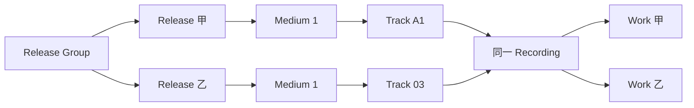

# REZICS：动态元信息模型与单库分表的渐进扩展方案

日期：2026-09-05。本文是新方案，独立于 `(废案)REZICS-整体架构与增长方案-20260905.md`；废案文件保持原样。

## 1. 这次明确采用的决定

**第一阶段：一个 PostgreSQL 实例、一个业务数据库、按数据归属分表，继续使用 PGroonga。设计重点是完整表达能力、清晰的数据归属，以及未来能只扩展最重的部分。**

具体决定如下：

| 问题 | 推荐决定 |
|---|---|
| 动态关系做到什么程度？ | 可治理的动态类型、谓词、属性与限定词；独立关系实例；多参与方与上下文；来源、时间、顺序、原样署名、冲突与修订 |
| 能否承载 MusicBrainz、Bangumi？ | 把两者的公开元信息模型列为完整兼容目标，提供逐项结构映射与往返验收；不能以“原始 JSON 没丢”代替原生支持 |
| 插件市场要不要与 metadata 拆开？ | 不建立一个统管所有元信息的巨大 metadata 业务库。软件条目的资料、版本和关系由软件表组拥有；发布权限、托管和交易是其额外能力 |
| 各领域数据量不均匀怎么办？ | 领域表组独立增长，重表再按稳定键分区／分片。一个领域未来可以占几十个分片，另一个继续留在原库 |
| 现在要不要分库？ | 不需要。先分表，保留本地事务和真实外键；明确未来迁出时必须同行的表和引用 |
| 现在要不要 OpenSearch？ | 不需要。先完善现有搜索投影、相关性和预算；搜索负载及独立机器预算同时满足条件后再迁移 |
| 整体产品还成立吗？ | 成立。书单、讨论、百科、资源使用围绕同一对象衔接，物理存储位置不成为用户要理解的概念 |

这里区分四件事：**统一元信息协议、统一用户体验、同一张表、同一个数据库。前两项是长期目标，后两项是可以随规模变化的实现选择。**

## 2. 研究依据及“完整承载”的定义

本次重点核对了：

- MetaFusion：已有本地源码，提交 `57ffc7d1a597142aa30a116638affea86f4c0097`，尤其关系字典、时序关系和运行时验证。
- MusicBrainz Server：提交 `cff977f0ba8f06d5fa594e7590f6a134b1a5a22c` 的 SQL 定义，配合官方实体、署名及关系文档。
- Bangumi Server：提交 `60fdc32daf1d717f8446bad75fd2c3dc44805642` 的关系类型、领域模型和 Infobox API；开发数据库结构使用 `bangumi/dev-env` 提交 `789e2131df0545f3dc024db7f34faa5eff2c0bcf` 作交叉核对。开发库文件不等同于未经公开的生产全库。
- 当前 REZICS：提交 `a10468276e66b734d8678a6ce07670a63ef90baf` 的 Unit、署名、主题关系与搜索实现；并沿用已经阅读的 PostgreSQL 分库讨论作为待修正背景。

“完整承载”应同时满足：

1. **表达完整**：来源公开的对象、字段、关系、限定信息和原始标识都能表达，不把几个不同概念强制合并。
2. **使用完整**：这些信息能被读取、展示、查询、修订、导出；不是只有一个无法理解的归档 JSON。
3. **来源可还原**：保留来源语义和编码。标准化后的展示可以更好，但不能因此丢失原有顺序、别名、空值状态、关系方向或无法解析的原文。
4. **规模可延续**：对象增加不会要求重写全站；关系多的对象允许分页及分批编辑，而不是设一个小的永久总量上限。

范围是两者公开的元信息与必要的编辑、分类、收藏等关联模型。来源没有开放的私密数据不能被架构“补出来”。本报告给出目标结构及验收标准；尚未实现并运行全量导入器，因此不会将设计可表达说成已经完成全量兼容。

## 3. MetaFusion 的动态性：需要继承，也需要补足

MetaFusion 已把关系名称、正反向文案、允许的端点类型、对称／层级标记和属性描述放入 `relation_types`；关系实例带独立 ID、限定符、起止日期和 ended 状态。它的运行时验证会检查端点存在、类型是否允许、层级环及日期。这个方向值得继承。[关系定义](https://github.com/MoeclubM/MetaFusion/blob/57ffc7d1a597142aa30a116638affea86f4c0097/deploy/init_db/13_relation_types_governance.sql)、[运行时验证](https://github.com/MoeclubM/MetaFusion/blob/57ffc7d1a597142aa30a116638affea86f4c0097/backend/internal/ontology/ontology.go)

但需要看到实现边界：

- 字典中的实体细分类可以扩展，关系端点的物理类别仍由代码中的 work、artist、release、franchise、canonical_entry 等分支识别。增加真正的新端点类别仍可能需要改代码。
- 关系有一个 `qualifier` 字符串及属性 JSON；“拥有属性描述字段”不自动证明完整的属性类型、重复值、嵌套结构和数量约束已经被执行。
- 检查到的关系验证入口没有接收完整 attributes 值，因此不能仅据该入口宣称实现了所有 JSON 属性 schema 的约束。
- 源码对层级关系做环检查；不能据文档中的“DAG”字样，把所有关系都理解成必须无环。
- 唯一键包含端点、关系类型和单个 qualifier，不能自然表达任意数量的来源断言、重复任职区间、作品语境和语言版本组合。[开放关系迁移](https://github.com/MoeclubM/MetaFusion/blob/57ffc7d1a597142aa30a116638affea86f4c0097/deploy/init_db/20_franchises_and_open_relations.sql)

**REZICS 应采用“可配置的语义定义＋经过验证的关系实例＋必要的领域结构”，而不是只把 role 枚举换成数据库字符串。**

## 4. 动态模型应达到的具体能力

### 4.1 将物理类别、语义类别和可执行能力分开

建议区分三层：

- **物理表组**：决定数据在哪里、由谁写入，例如作品、主体、软件、视频。数量较少，通过代码和迁移管理。
- **语义类别**：例如作曲者、唱片厂牌、乐器、机体、引擎插件、量化模型；采用带命名空间的定义，可继承、组合和逐步扩展，不必每种新类别都建表。
- **可执行能力**：例如可安装、可付费发布、可渲染预览。涉及状态机、权限和执行行为，必须由实现过的模块提供，不能靠用户添加一个类别或属性就获得。

新增“某种乐器”“新的演职角色”“某个社群的设定关系”，应通常只需要增加受治理的定义。新增“一个此前没有支持的包协议”则需要实现适配器；这属于新行为，不应伪装成纯配置。

`unit.kind` 可以继续作为稳定的产品／协议判别，不把每一种语义类别都塞进这个枚举。语义类别以受控定义及归属内的类别成员记录表达。是否需要新物理表，由字段、查询、生命周期和规模决定。

### 4.2 定义层：至少包括这些信息

| 定义对象 | 必要信息 |
|---|---|
| `semantic_class` | 稳定 ID、命名空间、父类／允许组合、描述、显示名、状态与版本 |
| `predicate_definition` | 稳定 ID、属性或关系的种类、正反向语义、参与角色、允许的对象类或值类型 |
| `predicate_revision` | 不可变定义版本；约束、允许限定词、属性结构及解释规则 |
| `qualifier_definition` | 数据类型、可重复性、顺序、计量单位、所需对象类型、允许值及其层级 |
| `relation_role_definition` | 多参与方关系中的角色，如表演者、角色、作品、版本、场地 |
| `source_definition_mapping` | 来源定义的完整标识和版本，与 REZICS 定义的 exact／broader／narrower／unmapped 映射 |
| `display_profile` | 某类对象常见字段和关系的展示／编辑方式，不决定数据是否能够存在 |

定义具有平台或社群命名空间。公共定义需要审查和弃用流程；社群可以试验自己的定义，再申请映射到公共定义。显示名称改动不能改变谓词身份，源码或数据库中也不能按中文文案判断业务语义。

定义更新采用新 revision，既有实例保留它当时所依据的版本。改变属性类型或端点范围时，有重新验证和迁移过程；不要修改一行定义后使所有历史数据在没有记录的情况下改变含义。

这里可以借鉴 SHACL 的形状、数据类型和属性约束思想，但第一阶段无需引入 RDF 存储或完整 SHACL 执行环境。[W3C SHACL](https://www.w3.org/TR/shacl/)

### 4.3 实例层：关系必须具有自己的身份

一个关系实例不只是 `(subject, predicate, object)`。推荐的共同结构为：

```text
assertion
  id                         稳定关系／事实身份
  owner_unit_id              谁拥有这条事实及其事务
  predicate_revision_id      使用哪个定义版本
  subject_ref                语义主语，不必等于 owner
  object_ref 或 typed_value  二元关系目标或属性值
  context_ref                作品、版本、世界观、文章等主要语境，可空
  governance_scope           公共或具体社群的治理范围
  valid_time                 适用时间，支持不完整和未知
  status / revision          候选、接受、争议、撤回等及修订

assertion_qualifier           可重复、可排序的限定值
assertion_participant         多参与方及其角色；需要时存在
assertion_evidence            支持或反驳它的来源观察
assertion_revision            修订、作者、理由和历史
```

这是共同契约，后文将按表组落表；**不是要求全站只创建一张永久承载所有领域的 assertion 大表。** 普通二元事实使用主行的快速列；只有多参与方才增加 participant 行，不为每条普通边强制制造多个中间对象。

必须支持：

- 同一对端点多条关系，例如同一艺人两次加入同一乐队，日期不同；同一演员在不同作品和语言版本中配同一角色。
- 限定词可为实体引用、文本、带语言文本、整数、精确小数、带单位数值、日期结构或受控复合值。
- 属性可有多个值，限定词也可重复；顺序在有语义时必须保留。
- 独立记录原样署名、来源端点文字和排序，而不是把这些信息覆盖到实体的全局名称。
- 有些事实涉及三方或更多参与者；作品、人物、角色都能作为可查询的真实引用，而不是藏进一个说明字符串。
- 来源支持与来源反驳分开。多源冲突可以保存；公共或社群的当前选择另有审核状态。

不要设置全局 `UNIQUE(subject, predicate, object)`。来源幂等键可以使用来源关系 ID，或来源记录版本、字段路径与出现次序；规范事实去重需要考虑语境、时间、限定词及重复出现的语义。散列可以帮助找重复，不能不检查内容就把散列相同当作同一事实。

### 4.4 时间、缺失与原文需要表达真实状态

需要区分：未提供、明确未知、明确无值、存在但尚未解析。它们不能一律变成空字符串或一个默认日期。

日期允许年、年月、完整日期、缺年份的月日，以及保留原始表述的未解析日期。Bangumi 的生日可能只有月日；节目播出时间可能是文本。不能为了塞入 `date` 而补一个虚假的年份。

起止日期和 `ended` 分开：已结束但结束日期未知是合法状态。适用时间与系统观察／录入时间分开；只有需要历史裁决的事实才承担完整的时间历史成本，不给每个无关字段强加复杂双时间查询。

“身高从 178 cm 变为 181 cm”这类字段至少保留原始结构和表述；有可靠语境时才拆成两个带时间／版本的测量断言。不能直接归一成单一 181 cm 并丢失前一状态。

### 4.5 图约束按谓词定义，不能统一要求 DAG

| 关系 | 推荐规则 |
|---|---|
| 明确结构包含 | 在声明的结构范围内禁止环；支持顺序及多父关系时明确语义 |
| 相互合作、某些对应关系 | 对称；同一事实提供两种读取方向，不维护两份可独立修改的权威边 |
| 续作／改编／影响／关联 | 以具体语义判定；不能仅因是“关系”就要求整图无环 |
| 等价与身份合并 | 审核后的身份操作，不能由任意用户添加一条相似关系自动触发 |
| 包依赖 | 保留生态语义；不能通用地禁止循环或多版本共存 |
| 安装兼容 | 由具体版本及环境条件表达，不自动认定具有传递性 |

关系定义中的上下位分类，不自动意味着对所有实例执行传递闭包。反向标签也不证明可以推导其他事实。

对真的需要禁止环的结构，写入验证必须防止并发竞态：在相应结构范围内串行化修改或校验结构版本。搜索达到工作预算仍无法证明无环时，进入待验证流程，不能当作已通过。禁止环的性质不能靠无限递归请求来换取。

MusicBrainz 的 `entity0_cardinality`／`entity1_cardinality` 包含 Few／Many 等提示编码；不能将其数值 0／1 直接解释成数据库“最多零个／一个”。REZICS 应分别保存来源提示和真正执行的数量约束；关系属性的 min／max 又是另一种含义。[MusicBrainz 关系类型示例](https://musicbrainz.org/relationships/artist-work)

### 4.6 动态定义仍需要强校验

请求先解析受控的值类型，再加载它指向的定义 revision，验证端点类别、角色、限定词、数量和语境，最后进入拥有者的事务。数据库负责真实外键、局部唯一性、值形状及基本状态约束。

定义表达能力和实际执行能力要对应：某种复杂约束尚未实现时，明确标记为无法验证或仅提示，不能在类型层宣称已保证。运行时不接受用户提供的 SQL、代码或任意解释器脚本作为谓词约束。

原始来源快照用于恢复、重放和未来补映射；未知字段进入有状态的待映射区。**在未知字段尚不能原生读取、编辑和导出前，该项兼容状态应为未完成。**

每页 100 条、每次修改 100 条可以是请求预算；不能因此限制一张专辑最多 100 轨、一个人物最多 100 个作品或一条复杂名单只能有 100 个成员。大对象通过分页、子行、分批导入和不可变清单处理。

## 5. MusicBrainz：逐项承载，不强行套通用作品链

### 5.1 第一项修正：Release Group 不是音乐 Work

MusicBrainz 的 Work 是创作内容层面的作品，Recording 是具体录音，Track 是某个媒介上的出现。Release Group 汇集相关发行，Release 是具体发行，Medium 是该发行中的媒介。录音可以出现在多个发行的不同曲目中，一个录音也可以关联多个 Work。

这些结构在官方 SQL 中分别存在，不能把 Release Group 与 Work 合并，也不能将 Track 与 Recording 合并。[MusicBrainz 核心 SQL](https://github.com/metabrainz/musicbrainz-server/blob/cff977f0ba8f06d5fa594e7590f6a134b1a5a22c/admin/sql/CreateTables.sql)



图中的 Recording → Work 是带类型和限定信息的关系，例如完整演奏、部分演奏或串烧组成；不是要求每个录音恰好有一个作品父节点。

### 5.2 完整映射清单

| MusicBrainz 能力 | REZICS 应提供的结构 | 丢失信息的错误简化 |
|---|---|---|
| Artist，包括不同主体类型 | 主体及语义类别，来源 Artist 身份独立保留 | 所有 Artist 都等于自然人或 REZICS 登录账号 |
| Label | 厂牌／出版标识主体，并可关联经营组织 | 所有厂牌都直接等于一家法律实体公司 |
| Area、Place | 区域、地点主体及地理属性、关联 | 仅保存无法引用的一段地名文本 |
| Event | 活动对象、时间、地点、取消状态、节目单等 | 把活动当作某个作品的一个日期字段 |
| Instrument | 乐器对象、类型及描述 | 只有一个不可扩展的乐器字符串枚举 |
| Work、Recording | 分开的对象类别与扩展表 | 用一个“音乐作品”对象替代二者 |
| Release Group、Release | 发行组与具体发行 | 与 Work 合并，或只保留一个 releaseDate |
| Medium、Track | 发行内有序媒介、曲目出现、位置和原始编号 | Track 等于音频文件；A1、03 等编号丢失 |
| Artist Credit | 独立署名组合与有序成员、原样名称和 join phrase | 用无序作者 ID 列表拼接，导致封面署名变化 |
| 同一对象的不同署名 | Release／Recording／Track 等各自引用署名组合 | 改了某个艺人别名后自动改写全部来源署名 |
| 发行地区与日期 | 发行事件子表；地区未知状态保留 | 每个发行只能有一个国家和一个日期 |
| 厂牌与目录号 | 可重复的发行厂牌／目录记录；允许有目录号但厂牌未确认 | 全部塞入单个 publisher 字段 |
| 主类型、次类型、包装、语言、文字系统、媒介格式 | 定义字典与有类型的属性／专属列 | 只保存“音乐”一个分类 |
| ISRC、ISWC、条码、MBID、CD TOC 等 | 有命名空间和来源的标识；技术结构有相应扩展 | 所有标识都当无条件全局唯一身份，或只留一个 externalId |
| Alias、排序名、消歧说明 | 别名记录保留类型、语言、主要标记及有效期等 | 简单字符串数组无法承载全部语义 |
| Series 和成员次序 | 系列对象、成员关系、来源编号、排序策略 | 把系列一律当父作品，忽略集合和排序性质 |
| Relationship Type / Attribute Type | 定义、层级、允许属性、来源完整编码及版本 | 只挑作曲、演奏几个角色硬编码 |
| 关系属性及属性原样署名／文本值 | 可重复限定词与属性值结构 | 用单个 qualifier 覆盖多种属性 |
| 关系起止、ended、link_order、端点署名 | 关系实例上的时间、排序和端点展示信息 | 二元边相同就合并，导致时间与署名丢失 |
| URL、注释、标签、流派、评分、集合 | 有类型的链接／正文／分类／统计或个人集合模型 | 把外部聚合评分当成 REZICS 用户真实投票 |
| 编辑、来源标识及合并重定向 | 来源修订与本地审核分开，保留外部身份和重定向 | 导入后无法解释当前资料来自哪个来源版本 |

上述领域模型的解释还可对照 [官方实体说明](https://musicbrainz.org/doc/MusicBrainz_Entity)、[Artist Credits](https://musicbrainz.org/doc/Artist_Credits)、[署名规范](https://musicbrainz.org/doc/Style/Artist_Credits)、[关系说明](https://musicbrainz.org/doc/Relationships) 和 [关系属性目录](https://musicbrainz.org/relationship-attributes)。

映射中的“动态结构”不排斥领域表。例如 `music_recording`、`music_release_group`、`release_medium`、`release_track` 和 `credit_line_member` 应存在明确的结构、约束和索引。用通用关系表达“录音由谁演奏”很合适；把媒介轨道顺序、署名拼接和所有技术参数全部拆成三元组，会增加复杂度和联接成本。

### 5.3 一个实际可检验的例子

假设某录音由艺人 A 与 B 演唱，在专辑甲中排为 A1，在合辑乙中排为 03；两次曲目标题略有不同；唱片上署名为 `A feat. B`。录音演奏了 Work X 和 Work Y，A 在其中演奏两种乐器，其中一种乐器使用了特殊的原样署名。

正确表示应同时有：

- 一份 Recording，两份 Track，各自有标题、编号、位置和所属 Medium。
- Track 所属的两个 Release 及其 Release Group；不能因为复用录音就把发行组也合并。
- 有序 Artist Credit，分别保存 A、B 的身份、当次署名与 ` feat. ` 连接词。
- Recording 到两个 Work 的独立关系及部分／串烧等限定信息。
- A 到 Recording 的表演关系及两个乐器属性；乐器属性自身的 credited-as 信息不能丢失。

验收时应能查询“这个录音出现在哪些发行中”，也能还原两份曲目单和原样署名。如果只能展示一个统一作品标题，这个例子就没有被完整承载。

## 6. Bangumi：核心难点是语境、关联及有序 Infobox

### 6.1 Subject 不应机械映射成统一 Work

Bangumi 的公开类型包括书籍、动画、音乐、游戏和三次元。不同 Subject 的粒度可以是系列、具体条目或其他编目单位。导入时保存完整来源 Subject 身份，并按信息证据映射到作品、系列、发行或软件项目。

映射暂不确定时，仍应有可以原生查询和编辑的来源编目条目，状态明确；不能为了立即归一而把每个音乐 Subject 自动判成 MusicBrainz Work，或因同名就合并。[Subject 类型](https://github.com/bangumi/server/blob/60fdc32daf1d717f8446bad75fd2c3dc44805642/internal/model/subject_type.go)、[Subject 开发结构](https://github.com/bangumi/dev-env/blob/789e2131df0545f3dc024db7f34faa5eff2c0bcf/sql/schema/chii_subjects.sql)

### 6.2 完整映射清单

| Bangumi 能力 | REZICS 对应能力 | 必须保留的细节 |
|---|---|---|
| Subject 与类型／平台 | 来源条目、原生对象映射、动态语义类和平台关系 | 来源 ID、类型、原名／中文名及粒度 |
| Episode | 可独立引用的分集／章节及有序归属 | 类型、disc、排序号、名称、时长与播出原文、描述；不强制整数顺序 |
| Person | 人、公司、团体等主体，多种职业／活动关系 | 原类型和职业信息；不能直接当 REZICS 用户 |
| Character | 角色、机体、舰船、组织等虚构主体 | 虚构／现实语境、类别与别名 |
| Subject ↔ Subject | 动态谓词与来源类型映射 | 前后传、改编、主线／番外、不同世界观、版本等、方向和排序 |
| Person ↔ Subject | 演职关系 | 职位、作品、参与集数和说明 |
| Character ↔ Subject | 出场关系 | 主角／配角、出场集数、顺序与剧透语境 |
| Person ↔ Character ↔ Subject | 配音／表演关系实例 | 三个真实引用；不能省略具体作品 |
| 人物／角色间关联 | 动态关系及治理语境 | 原类型、反向标记、结束、剧透及评论等可获得字段 |
| Infobox | 有序字段与嵌套值 AST，加标准化属性映射 | 重复键、重复值、子键、原顺序及未解析文本 |
| Alias、简介、图片 | 别名、正文修订和图像引用 | 语种、来源键、原始结构及出处 |
| Tag、meta tag、评分及收藏统计 | 分类断言、来源统计快照 | 来源统计与 REZICS 自身社区行为分开 |
| 条目／分集收藏、评论、索引列表及修订 | 个人状态、讨论、策展与修订模型 | 外部用户身份不冒充本地已认证账户；公开范围以取得渠道为准 |

其中三方配音结构不仅是设想：当前 Bangumi 的领域类型明确具有 Character、Person、Subject 三个成员；开发表还保留了作品中的角色形态说明。[关系领域模型](https://github.com/bangumi/server/blob/60fdc32daf1d717f8446bad75fd2c3dc44805642/domain/relation.go)、[配音表](https://github.com/bangumi/dev-env/blob/789e2131df0545f3dc024db7f34faa5eff2c0bcf/sql/schema/chii_crt_cast_index.sql)

演职及出场语境分别可核对 [演职关联](https://github.com/bangumi/dev-env/blob/789e2131df0545f3dc024db7f34faa5eff2c0bcf/sql/schema/chii_person_cs_index.sql)、[角色出场](https://github.com/bangumi/dev-env/blob/789e2131df0545f3dc024db7f34faa5eff2c0bcf/sql/schema/chii_crt_subject_index.sql)。

关系类型应从来源完整定义中映射，而不是手写几个常见中文名称。保留来源类别、原始 type ID、方向及定义版本；不同上下文中的相同数字不自动等价。[Bangumi 关系定义](https://github.com/bangumi/server/blob/60fdc32daf1d717f8446bad75fd2c3dc44805642/pkg/vars/relations.go.json)

### 6.3 Infobox 不能直接变成普通 JSON object

Bangumi 当前转换代码以字段数组和嵌套值数组输出 Infobox；字段值可以是文本或带可选子键的值列表。因此应保留以下结构：

```text
字段出现 0：key=别名
  值出现 0：subkey=英文名，value=Name A
  值出现 1：subkey=英文名，value=Name B
  值出现 2：无 subkey，value=另一个别名
字段出现 1：key=生日，value=12月5日
字段出现 2：key=身高，value=178cm→181cm
```

`{ "英文名": "..." }` 会覆盖重复子键；普通字典也不能可靠承担全部字段顺序与重复出现。建议以原文和有序 AST 为可还原记录，常用字段再映射到别名、日期和测量等原生结构。两者通过字段路径与 revision 对应，编辑后明确更新映射或标记待重新解析，不允许两份互相矛盾的可写权威值。[Infobox 结构](https://github.com/bangumi/server/blob/60fdc32daf1d717f8446bad75fd2c3dc44805642/openapi/components/wiki_v0.yaml)、[实际转换实现](https://github.com/bangumi/server/blob/60fdc32daf1d717f8446bad75fd2c3dc44805642/internal/pkg/compat/wiki.go)

### 6.4 三方配音关系的具体存储

“人物 A 在动画 S 的日语版第 1–3 集，为角色 C 的幼年形态配音”可以表达为：

```text
predicate       = voice_performance
owner           = 动画 S（或已建立的具体配音版本）
subject         = 人物 A
object          = 角色 C
context         = 动画 S 的相应版本
qualifiers      = language: ja；portrayal: 幼年
episode_scope   = 可解析的集数引用／范围，加原始来源表述
evidence        = 来源记录及字段路径
```

同一个 A 在另一作品 S2 配 C，是另一关系实例。另一位演员 B 在中文版配 C，也是另一实例。查询角色、演员或动画页面都能找到相应关系，并清楚显示语境。

这里 `owner` 与语义主语不同：关系从 A 指向 C，但需要随动画的演职资料一起保存和迁移。**必须把关系的存储拥有者作为显式设计，而不是简单规定所有边永远跟主语走。**

## 7. 中心插件市场与所有资源索引：怎样归属

### 7.1 metadata 是对象的资料能力，不是所有资料的一个巨型业务域

一个插件本身有项目、作者、版本、依赖、兼容性、许可和文档，这些都是软件元信息。它既可以被编进资源清单、拥有百科和讨论，也可以被某个市场展示或由 REZICS 托管。

推荐结构：

```text
SoftwareProject
  ├─ 项目资料、作者、宿主关系、文档与讨论引用
  ├─ PackageCoordinate（来源／注册表＋生态＋命名空间＋名称）
  │    └─ PackageVersion
  │         ├─ 原生 manifest、依赖、兼容条件
  │         └─ Artifact / 外部下载引用 / 镜像副本
  └─ MarketplaceListing（一处或多处市场中的展示）

REZICS 托管时额外启用
  └─ 发布者授权、上传会话、发布状态、隔离审核、配额及审计
```

**索引世界上的插件，先增长的是软件项目、包坐标、版本和兼容知识；经营一个托管市场，再增加发布和分发能力。二者共享同一套项目及包资料，不需要复制成“metadata 中一个插件、market 中另一个插件”。**

如果只是镜像同一个来源版本，新增镜像产物绑定和取得证据；如果重新发布到另一个注册表命名空间，则产生另一个包坐标。相同字节不证明同一发布身份。

`MarketplaceListing` 负责市场的组织与展示，不拥有软件的全部公共事实。发布权限负责谁能够向某个命名空间提交版本，不等于有权独占其公共百科或删除用户评论。

### 7.2 宿主、依赖和兼容不能混为一个标签

一个插件可以同时支持多个宿主或多个版本；一个项目也可能发布 Python、npm 或引擎原生格式的不同包。至少分清：

- 项目层 `extension_for`：它意图扩展哪个软件／引擎。
- 版本层兼容条件：宿主版本、加载器、运行时、ABI、操作系统、CPU、客户端／服务端侧等。
- 版本层依赖：需要哪个包、版本约束、依赖类别、是否允许并存、冲突及可选功能。
- 产物层条件：实际提供哪个平台／格式的文件。

兼容条件要保存组合关系。例如“Windows + x86-64”与“Linux + ARM64”两种构建，不能展开成互相独立的 OS 和架构列表后误判还支持“Windows + ARM64”。

通用动态关系可以表达和展示这些知识；安装器使用经过验证的版本约束 AST、原生 manifest 和生态适配器。社区填写“兼容某版本”不自动获得可执行安装保证。2026 年 ICFP 的包管理形式模型支持共同表达核心，但不同生态的求解语义仍须保留。[Package Managers à la Carte](https://arxiv.org/abs/2602.18602)

### 7.3 各种索引怎样处理

| 目标 | 主要对象与结构 | 独立增长的重数据 |
|---|---|---|
| 全部创作者 | 人／组织／品牌、来源账号、身份关联、作品及参与关系 | 来源账号记录、反向作品列表；不把每个上传者直接认定为作者 |
| 全部插件 | 软件项目、宿主、包坐标、版本、依赖与兼容矩阵 | 包版本、依赖边、来源刷新及下载统计 |
| 3D 模型 | 创作项目、修订、网格／材质／骨骼资料、格式产物 | 版本、预览、二进制与派生处理 |
| 图片 | 作品、投稿、图片组成、来源账号与署名 | 投稿和图片数量、重复检测、尺寸及文件引用 |
| 视频 | 创作对象、平台发布、频道、分集／组成、录制和演职关系 | 平台投稿、文本、字幕和流媒体产物 |
| AI 模型 | 模型项目、权重修订、基础模型／适配器、模型卡与评测 | 权重产物、变体、评测记录和依赖 |

跨领域对象可以关联。例如某个创作者的视频介绍了一款 Blender 插件，插件提供了一个 3D 资源包。通过关系及共同引用连起来，不把三个对象合并成一个泛化“资源”，也不强迫它们永远位于同一数据库。

## 8. 第一阶段的分表方案

### 8.1 一个数据库，物理表组独立

继续使用 `public` schema 和 snake_case。下面是表组组织建议，表示数据归属，不是要求立即建齐每张空表或启动对应微服务。

| 表组 | 主要领域表举例 | 与它一起归属的数据 |
|---|---|---|
| 公共定义 | `semantic_class`、`predicate_definition`、`predicate_revision`、来源定义映射 | 定义版本、显示配置和治理；不承载所有关系实例 |
| 作品 `catalog` | 作品、表达／版本、发行组、发行、媒介、曲目、系列 | 本组文本、别名、署名、断言、证据、历史、搜索文档 |
| 主体 `entity` | 人、组织、角色、地区、地点、活动、乐器；`platform_identity` | 本组身份资料、类成员、账号关联、来源和搜索文档 |
| 软件 `software` | 项目、宿主、包、版本、依赖、兼容、市场展示、托管发布状态 | 本组元信息、动态断言、来源、版本产物引用和搜索 |
| 3D `model3d` | 项目、修订、格式及结构扩展 | 本组资料、来源、关系、文件绑定与搜索 |
| 图片 `image` | 作品／投稿、组成、图像技术资料 | 本组文本、来源、关系、图像引用与搜索 |
| 视频 `video` | 视频内容、平台发布、组成、字幕引用 | 本组来源、资料、演职、关系与搜索 |
| AI 模型 `ai_model` | 模型项目、权重版本、变体、模型卡、评测 | 本组资料、关系、来源、产物引用与搜索 |
| 社群知识 | 空间、百科文章、修订、讨论、审核 | 本组正文、治理、贡献、通知事件及搜索 |
| 个人与策展 | 书单／资源清单、收藏、关注、进度 | 按列表或个人拥有的状态及排序 |
| 资产 | 上传、blob 登记、存储位置及绑定 | 字节放对象存储，绑定随拥有者；存储登记本身也可分片 |

这是基于潜在负载建立的初始边界，不是永远不能改变的本体分类。语义类别新增通常不增加物理表组；出现显著不同的存储或维护负载时，才增加或调整表组。

可以先只实现当前作品、主体、社群及必要的软件表。图片、视频等新领域落地时，沿同一规则加入；不必为未来所有类别提前制造空服务。

### 8.2 动态关系统一逻辑接口，按拥有者表组存放

推荐用同一份经过审查的 schema 模板定义以下同构表，按需要生成迁移及类型：

```text
catalog_assertion           software_assertion        video_assertion
catalog_assertion_qualifier software_assertion_qualifier video_assertion_qualifier
catalog_assertion_evidence  software_assertion_evidence video_assertion_evidence
catalog_assertion_revision  software_assertion_revision video_assertion_revision
...
```

模板共享的是结构与约束，不是创建一个任意字符串拼表名的 SQL 接口。物理表选择由服务端登记的表组控制，用户只提交经过验证的对象及谓词引用。

这样音乐录音的演奏关系跟随作品表组，软件兼容关系跟随软件表组，人物之间的隶属关系跟随主体表组。相同谓词可以出现在不同拥有者的表组里；谓词定义不决定全站必须使用同一物理表。

第一批按实际启用的领域建立同构关系表，例如先建 catalog 与 entity，再随软件能力加入 software；不用提前创建全部未来表组。每组从开始记录 owner，并维护完整的迁出清单。**不推荐提前把所有未来关系长期汇集到一个没有拥有者的巨大 graph 表中。**

### 8.3 稳定 Unit 身份保留，重字段与重索引按拥有者拆开

起步保留 `unit` 的稳定 UUIDv7 与真实本地外键。将它控制为必要的身份、生命周期与归属入口；正文、来源观察、领域属性、关系及专用搜索文档按表组保存。当前完整 Unit 的所有排序／全文索引不能自动复制给每条薄索引对象。

对已经是 Unit 子类型的表，继续遵守 `id` 同时为主键和直接 `unit.id` 外键的仓库规则。原生可独立引用对象可以是薄 Unit；抓取尝试、属性值、计数、文件分块等子行无需成为 Unit。

在现阶段不为避免未来工作而取消外键。但要承认：将来迁出一个表组时，相关 Unit 外壳、本地化和子表外键需要一起迁移，跨组外键需要改为有状态的引用契约。**“以后只改连接字符串”不是本方案的承诺。**

为降低迁移代价，第一天就做到：

1. 每个对象和关系有明确 owner；语义主语、产品类型、物理归属分别表达。
2. 每个模块只写自己的表，跨模块修改经过接口；同库事务依然可以在明确的应用操作中协调。
3. 记录哪些外键属于表组内部、哪些跨组；生成并验证迁出清单。
4. 普通详情读取可以使用同库联接，但跨组联接集中在有名字的读取接口中；未来可替换为有界批量读取，禁止散落在任意页面业务中。
5. 来源身份通过薄登记表保证跨导入器的唯一性；来源正文和历史留在拥有表组，不汇集到一个持有所有领域长 JSON 的公共来源表。
6. 核心对象操作不需要扫描全站关系图；反向导航有适合的索引或投影。

全局薄 `unit` 本身仍有容量成本，后文将它计入，而不是将它当成永远小的配置表。未来可以按 owner 建本地身份表，同时保留旧 UUID 地址的定位映射；实际分区方案必须重新检查主键和外键，不在本次单库阶段偷偷改变现有保证。

### 8.4 同库阶段哪些事情保持简单

本地事务内更新当前资料和搜索投影即可，不必先引入消息平台。共享定义、稳定 ID 和本地索引也不需要远程 RPC。

推荐现在保存对象 revision、来源 revision、删除标记、投影版本及批量回填进度。产生跨进程订阅或外部搜索时，再启用事务 outbox 和幂等消费者；不要为了未来的 Kafka 先让每次普通页面更新经历一整套分布式链路。

对需要人工审核的修改，保留现有内容历史与贡献机制。动态元信息的编辑是带证据的变更，不等于允许用户通过任意属性更改发布权限或账户归属。

### 8.5 通用图接口与领域表不能形成双重权威

有些谓词的数据由动态 assertion 表拥有；有些则是领域结构的图形表示。例如 `track → recording` 由曲目结构表拥有，`package_version → dependency` 由依赖结构拥有。

建议为受治理的谓词登记只读的存储绑定：`native_assertion` 或 `domain_projection`。前者通过通用断言写入；后者只能调用对应领域操作更新，然后生成图查询结果。普通用户不能改这个绑定。

因此统一关系查询可以看到“某轨道使用某录音”“某包依赖另一个包”，但不允许同时改领域外键和另一份独立 graph 边。署名组合与演职贡献也应保留语义区别：封面上的主要 Artist Credit 不等于一份完整的制作人员列表。

来源身份另需一个可靠的唯一性入口：起步可用薄 `source_identity(source, object_type, external_id, unit_id, owner_family)` 表实现全局复合唯一约束，避免两个导入器将同一来源对象分配到不同表组。它不存长正文或全部来源历史。

这张表同样可能很大，必须计入容量；未来按完整来源复合键分片。归属确定后，语义重新分类不直接再创建一个身份。跨库阶段，来源登记与目标创建使用 pending／ready 状态及可恢复流程，未 ready 的对象不发布不可解析链接；现在仍可以用一个本地事务完成。

## 9. 不均匀增长怎样扩展

### 9.1 按表组隔离负载，按聚合键分散容量

假设未来视频占 70% 的数据，图片占 20%，其他内容合计 10%。不应平均分配九台机器给九个领域；应允许视频表组占多个分片，图片占另一些分片，作品与主体继续共享一台数据库。

再假设绝大多数插件来自一个注册表或一个宿主。也不能按 `registry = npm`、`host = Blender` 分成一个永久分片，否则最大的生态仍然集中在一台机器。

推荐的长期分布键：

| 数据 | 建议按什么分散 | 为什么不按另一个直观键 |
|---|---|---|
| 插件／包及其版本、依赖 | 包聚合 ID，或完整规范化包坐标的稳定散列 | 只按宿主／注册表会形成超级大分片 |
| 创作者主体 | 主体 ID | 不按职业、国家等低基数类别分配全部数据 |
| 平台账号 | 来源账号稳定身份 | 来源平台本身不能是唯一分片键 |
| 图片、视频发布 | 发布对象 ID 或完整来源身份 | 不把某超级频道的全部内容永久绑在一个主分片 |
| 3D／AI 项目与版本 | 项目／版本聚合键，按具体写入一致性需求选择 | 不按文件格式或模型任务这种低基数字段分片 |
| 元信息断言、限定词、历史 | `owner_unit_id` 的稳定桶 | 不按谓词把“所有作者关系”集中到一个节点 |
| 普通讨论 | 根主题 ID | 超大主题另有分段；一个大社群不独占一个永远无法再拆的分片 |
| 收藏、关注、个人进度 | Profile ID | 目标很热门也不让所有写入争抢同一个权威计数行 |
| 搜索投影 | 领域及实际索引大小，再按桶分散 | 不让图片和视频填满一本书的搜索工作集 |

稳定散列桶到物理分片的映射独立管理。增加机器时搬部分桶，而不是改变 `hash(key) % 机器数` 导致全量重定位。第一阶段只需定义键、owner 和批量迁移接口；不需要现在部署分布式路由服务。

### 9.2 重表的拥有者要跟随完整资料包

将视频迁出时，应一起迁移它的必要身份外壳、当前文本、来源、别名、断言、限定词、证据、修订、索引投影与产物引用。不能只把 `video` 表迁出，剩下几十亿文本和边仍在一个共享 metadata 库里。

同理，软件扩展时迁出软件资料、包版本、依赖及兼容关系。公共谓词定义可以保留在公共定义服务或按 revision 缓存；软件实例关系不能因此仍被迫留在公共定义库。

真实的数据库提取顺序按观测决定：可能首先是视频，也可能是搜索、包版本或个人行为。不存在“主体一定小”“分类一定最后拆”的固定排序。

### 9.3 创作者页面怎样看跨表组作品

初期用本地、选择性良好的反向索引即可，例如 `(target_creator_id, predicate_id, sort_key, owner_unit_id)`。不为未来分库立即复制全部关系。

跨库后，创作者页面读取一个可重建的“被哪些对象署名／提及”的反向投影；权威仍在相应作品、软件或视频表组。它是统一视图，不代表事实只能存到主体库。

超级创作者的反向列表可以进一步分段，按时间窗口及必要的散列条带分散；读取通过目录和游标限制每次扇出。巨量出度并不会因为主键用了 hash 就自动消失，热门计数和反向目录都要单独观测。

列表、图探索和推荐必须有请求预算。若要导出某人的全部数千万关系，使用后台导出，而不是把全部邻居塞进一次 API 或浏览器画布。

### 9.4 分表、分区、分库不是同一阶段

1. **现在分表**：隔离资料、来源、关系、个人状态和搜索的写入职责，按需建立索引。
2. **重表分区或增加独立同构表**：为维护、索引边界和有界回填服务，仍在一库。
3. **迁出最重的表组**：增加独立资源和故障隔离；其内部仍可用 PostgreSQL 和 PGroonga。
4. **表组内部继续分片**：通过稳定聚合键扩容，其他轻表组保持原样。
5. **有需要再替换搜索引擎**：与业务分库可以独立发生。

PostgreSQL 原生分区不是自动跨机器分片；分区表的主键和唯一约束还必须满足分区键要求。第一阶段不随意为每个字段或来源创建几千个空分区。[PostgreSQL 18 分区规范](https://www.postgresql.org/docs/18/ddl-partitioning.html)

**分表能改善归属和维护，但不能让同一台机器突然拥有更多 RAM、IOPS 或磁盘。** 它的长期价值，是在资源真的不足时只移动需要扩展的部分。

## 10. 搜索：现在使用 PGroonga，什么时候迁移 OpenSearch

### 10.1 第一阶段的明确配置

RS8000 承担 PostgreSQL 与 PGroonga；RS4000 承担应用、API 和有预算的后台任务。没有外部 OpenSearch，也不以它作为动态模型重构的前置条件。

当前 REZICS 已有事务内搜索投影、4,096 候选预算、50,000 postings 预算、完整权限检查、游标和中文查询扩展，应保留这些经过设计的约束。[当前搜索契约](D:/rezics-repos/rezics/services/main/src/services/search/README.md)

需要修改的是边界：让搜索文档能按表组拥有并重建，而不要求全部领域永远共用一个物理 `unit_search_document` 索引。第一阶段可只增加当前启用领域的投影，后续重领域使用独立投影表和索引；同一个 Search 接口在内部组织有限分支。

在没有验证当前 PGroonga 版本与 PostgreSQL 原生分区组合的索引创建、查询和恢复行为前，可使用明确的独立投影表，不把未验证的分区透明性当成保证。

### 10.2 先建立可替换的搜索契约

搜索请求描述领域、文本、结构化过滤、排序、游标和预算；结果返回候选对象、匹配信息及明确的总数语义。不要让公共 API 直接暴露某一个引擎的私有查询 DSL。

每份投影携带对象 revision、projection version、lifecycle／可见性信息和删除状态。现在用本地事务维护；未来可通过 outbox 更新外部引擎。索引匹配始终不是当前授权证明。

当前公开 relevance 的实现按更新时间和 ID 排序。应建立搜索任务与人工相关性样本，在 PGroonga 阶段评估可行的标题、别名、准确身份和领域匹配排序；**改进相关性不等于必须立刻换引擎**。新的排序也需要候选预算和游标语义，不能对所有命中实时打分排序。

动态属性不意味着每一个新属性都立刻建立全库 GIN、向量或全文索引。定义可以声明可查询能力：按对象读取、精确关系过滤、数值范围、全文或仅展示。需要新增全库检索能力时，先构建对应类型索引／投影并完成回填，再公开该过滤；不能把“索引尚未完成”退化为无界全表扫描。

MusicBrainz 的乐器关系、Bangumi 的特定作品配音等常用查询，应通过结构化关系索引解决，而不是全部转换为一段全文。

### 10.3 推荐的迁移判据：负载门槛与资源门槛同时满足

以下是给 REZICS 的**初始决策阈值**，需要结合实测调整，不是数据库产品的保证值。

出现以下任一持续情况，开始独立搜索评测，而不是立即切换：

- 在真实峰值和过滤分布下，经过合理索引、查询与并发优化后，搜索仍持续超出约定目标，例如 p95 500 ms、p99 1.5 s。
- 搜索与索引维护长期占用约 30% 以上数据库 CPU 或 I/O 预算，并影响正常编辑／读取；扩大发布导入会进一步挤压 OLTP。
- 一个领域需要的模糊检索、分面、相关性或混合召回能力，在现有实现中的开发和运行成本明显高于独立搜索，且有评测证据。
- 索引重建、恢复和维护已经超出允许窗口，分表／拆索引仍不能解决故障影响范围。

Groonga 本身也有硬边界：不同表类型有不同记录数上限，全文索引大小上限为 256 GiB。对**单个实际 Groonga 索引**建议在约 128 GiB 即开始容量处置，在逼近约 200 GiB 前完成拆分或切换。还要同时看键空间、术语数量和具体表类型，不只看 SQL 表行数。128／200 是本报告设置的预警值；256 GiB 来自官方限制。[Groonga 限制](https://groonga.org/docs/limitations.html)

遇到单索引边界，可以先拆 PGroonga 投影，并不自动等于必须迁移 OpenSearch。若只增长了图片文件大小，应扩对象存储，也不是搜索迁移理由。

### 10.4 到什么服务器配置，我推荐启用 OpenSearch

服务器型号与代际仍未确认。下表使用实际内存／CPU／磁盘预算描述；不要只按 RS 产品名称判断。

| 阶段 | 相对当前双机增加的资源 | 推荐动作 |
|---|---|---|
| 当前双机 | 无 | PostgreSQL＋PGroonga；先分表、独立投影和限流 |
| 单库尚能满足目标 | 即使现有 RAM 仍有空闲 | 继续使用现有方案，不因空闲或行数达到某整数而迁移 |
| 首次独立搜索试点 | **新增一台专用搜索机：建议 16 vCPU、64 GB RAM、2 TB 本地 NVMe**；现有数据库和应用预算保留 | 在触发负载条件后做影子索引和比较；可先单节点，明确无搜索 HA |
| 更低成本的试验条件 | 专用 8 vCPU、32 GB、1 TB NVMe，且索引与负载较小 | 可以做有边界的试验；通过实测决定是否承载业务，不把它称为固定生产最低配置 |
| 搜索成为需要故障容忍的正式服务 | 规划独立数据节点；例如 3×16 vCPU／64 GB／2 TB，加 3 个 2–4 vCPU／4–8 GB 的专用 cluster-manager 节点 | 副本跨故障域，按单节点故障后的容量和查询负载验收；小控制节点规格也是待测预算 |

**我的推荐迁移起点是“当前两台主机之外，有一台可独立分配的 64 GB 搜索机，并且已有持续负载或功能收益证据”。** 这提供清晰的预算锚点；不是说 32 GB 无法运行 OpenSearch，也不是到了第三台机器就必须迁移。

单节点独立搜索可以是早期可接受的运营选择，但须接受恢复停机。三台混合角色节点也可以作为成本折中试验，不能把它等同于负载隔离的正式集群。OpenSearch 官方对大多数生产场景推荐三台独立 cluster-manager 节点，并强调按实际负载做基准；三名投票节点可以容忍一名失效。[集群规划](https://docs.opensearch.org/latest/tuning-your-cluster/)、[投票与故障容忍](https://docs.opensearch.org/latest/tuning-your-cluster/discovery-cluster-formation/voting-quorums/)

内存必须同时覆盖 JVM、堆外和文件缓存；以约一半可用内存作为 heap 的起始评测方向，而不是把整机 RAM 分给 JVM。磁盘采用适合搜索 I/O 的本地存储。[官方安装与内存建议](https://docs.opensearch.org/latest/install-and-configure/install-opensearch/index/)

### 10.5 不用“多少条就换”的原因，以及可复算预算

用实际测试得到的主索引大小 P 决策。若要同机保留旧索引并重建新索引，可暂按：

`所需可用数据空间 ≈ P × (1 + 副本数) × 2 × 1.2`

其中 2 表示新旧索引同时存在，1.2 是示例额外维护余量；若另租临时节点回填，或实际合并成本不同，应重算，不能视为引擎常数。

以单节点 2 TB 盘、稳态及维护预算不超过约 70% 为例，无副本且原地完整重建时，按上式主索引 P 最多约 583 GB；我会更保守地先按 **300–500 GB 主索引**规划该试点。它可能对应很多短标题，也可能只对应较少的长文本，不能固定换算成一个通用对象数。

三台 2 TB 数据节点、1 份副本，若要求故障一台后仍有余量重新建立副本，剩余两台共 4 TB × 70% 的预算下，稳态 `P × 2 × 1.2` 需不超过约 2.8 TB，即 P 约不超过 1.17 TB。若还要在故障状态完整双写重建，则需要再减半或增加临时容量。搜索吞吐可能在磁盘之前达到极限。

因此，即使配置达到了“3×64 GB”，六 TB 主索引也不能因为节点数看起来足够就宣称能运行。达到五亿／三十亿目标时，按实际主索引字节数、副本、故障和重建预算继续加节点。

### 10.6 迁移步骤

当迁移条件成立，再实现并启用事务 outbox 或可靠 CDC；用一致快照和提交水位回填外部投影，重放增量，校验更新／删除、权限、语言、结构化过滤与相关性，然后切换 Search 实现。

不能用“已读最大自增事件 ID”假定事务按该顺序提交；消费者需要可靠领取／确认或提交日志水位。重复和乱序消息通过对象 revision、幂等键和 tombstone 处理。回退到旧引擎必须明确它是否仍跟进全部写入。

近期 filtered vector search 研究说明过滤条件和执行集成会显著影响检索表现，但不能据此推导某个 RAM 数值就是迁移门槛；REZICS 的语言、宿主版本、权限和动态属性组合需要自己的评测。[2026 年 PostgreSQL 兼容系统检索实验](https://arxiv.org/abs/2603.23710)

## 11. 动态模型与不均匀数据的容量预算

### 11.1 每一种增长关系都单独计算

以下为十进制 GB／TB；行宽是规划占位值，包含简化的 heap 和必要索引，**不是实际测量或性能承诺**。实际 UUID、索引数、JSON、TOAST、填充率和修订分布会改变结果。

| 数据族 | 示例 heap＋索引 B/行 | 5 亿行 | 30 亿行 |
|---|---:|---:|---:|
| 薄 Unit／主体／来源账号外壳 | 160＋80＝240 | 120 GB | 720 GB |
| 来源身份／定位映射 | 80＋80＝160 | 80 GB | 480 GB |
| 动态断言主行 | 144＋96＝240 | 120 GB | 720 GB |
| 限定词／多参与方子行 | 80＋48＝128 | 64 GB | 384 GB |
| 断言证据绑定 | 80＋48＝128 | 64 GB | 384 GB |
| 修订头，正文另计 | 192＋96＝288 | 144 GB | 864 GB |
| 当前文本／本地化 | 600＋200＝800 | 400 GB | 2.4 TB |
| 软件包版本 | 384＋128＝512 | 256 GB | 1.536 TB |
| 包依赖／兼容条件索引行 | 96＋64＝160 | 80 GB | 480 GB |
| 反向关系投影／文件绑定 | 80＋48＝128 | 64 GB | 384 GB |
| 收藏、进度、列表成员或授权关系 | 64＋64＝128 | 64 GB | 384 GB |
| 事件／来源观察头 | 480＋120＝600 | 300 GB | 1.8 TB |
| 语义定义及其修订的示例均值 | 896＋128＝1,024 | 512 GB | 3.072 TB |

定义、成员和权限也不自动是有固定总量上界的“小表”。定义缓存按 ID／命名空间读取并限制内存；不能随社群自定义数量增长而把全部定义读进每个进程。真正有上界的部署配置，才按已声明上界计入。

### 11.2 薄来源索引与精细编目应分开估算

不能假设所有视频都像一张细致编辑的音乐发行，也不能假设 MusicBrainz 级记录都只有标题和两个标签。

两个示例：

**薄来源对象**：身份 240 B＋来源映射 160 B＋短文本 800 B＋平均 0.5 条关系＋0.25 条限定词＋0.5 条证据绑定。

`240 + 160 + 800 + 0.5×240 + 0.25×128 + 0.5×128 = 1,416 B/对象`

**精细编目对象**：相同基础 1,200 B＋平均 20 条动态断言＋10 条限定词＋20 条证据绑定。

`1,200 + 20×240 + 10×128 + 20×128 = 9,840 B/对象`

| 场景 | 5 亿对象 | 30 亿对象 |
|---|---:|---:|
| 薄索引权威结构，不含历史和文件 | 708 GB | 4.248 TB |
| 精细编目权威结构，不含历史和文件 | 4.92 TB | 29.52 TB |
| 精细编目再加 30% 规划余量 | 6.396 TB | 38.376 TB |
| 搜索投影及相关索引若合计平均 2 KB／对象 | 1 TB | 6 TB |

这里 2 KB 是搜索总体宽度假设，必须测量当前多语言展开及全部相关 PGroonga 索引，不能只统计一份 SQL 文本。迁移 OpenSearch 后也要重新测量，不假设两个引擎的索引大小相同。

精细编目示例中，五亿对象已经意味着一百亿断言；三十亿对象意味着六百亿断言。历史版本、多语言、关系证据和反向投影还会再增加。动态模型能够表达全部信息，但它的成本必须通过分表、稀疏子行、专属结构和后续分片控制。

这不要求把每个普通字段都变成 assertion。稳定的名称、轨道结构、发布状态及依赖结构可以有专属存储；只有存在事实、限定或来源语义时才使用相应断言。也不要求每个薄来源对象都预先生成全部百科、本地化和修订空行。

### 11.3 插件生态的增长不能只看项目数

举例：100 万插件项目，平均 20 个版本，每版本平均 8 条依赖，就有 2,000 万版本和 1.6 亿依赖行。按表中占位宽度，版本约 10.24 GB、依赖约 25.6 GB，尚未计项目资料、manifest、索引扩展、历史和文件。

这个例子不是对世界插件总量的预测，而是说明：同样一百万项目，版本和依赖分布不同，存储与查询成本可以相差很大。热门生态的版本密度和刷新频率也会高得多。

维度应独立记录：项目数、版本数、依赖边数、关系限定词数、来源观察数、平均和高分位出度、二进制大小、更新率及查询热度。机器分配依据这些指标，而不是均匀分配给“软件、图片、视频”几个名字。

### 11.4 读写、并发与维护预算

建议第一轮资格验证使用一个明确的起始画像：100 次/s 混合读取、20 次/s 前台修改、50 对象/s 来源处理，从 32 个并发客户端开始；再分别测试 5 倍突发、超大创作者及热门包。它是需要验证的负载，不是声称双机已经能完成。

精细编目的一次导入可能修改几十行和多套索引。50 对象/s 不等于 50 行/s；应分别统计事务、行修改、索引写入和 WAL。通过字段差异及来源摘要避免未变化对象的整份重写。

假设平均每次成功业务修改产生 8 KB WAL，2,000 次/s 就约为 1.38 TB/日。该值仅用于说明持续写入的量级，实际须测。若所有三十亿对象每 30 天刷新一次，平均约需 1,157 对象/s，尚未包括新数据和重试；因此必须做增量及分层刷新，并受来源取得条件约束。

核心查询约束：

- 对象详情按 owner／ID；关系列表按 `(owner_unit_id, predicate_id, sort_key, id)` 有界读取。
- 反向关系使用选择性索引；不能每次查创作者时扫描所有作品表。
- 关联查询最多读取明确数量的候选；深图遍历、全站重新分类和全量导出进入后台。
- 全站精确统计和高成本 facet 不在普通请求中全量计算。
- 编辑采用 revision 比较和有界变更，不用一条全对象 JSON 更新争抢所有并发修改。
- 后台导入有独立连接池、并发、重试和磁盘预算；队列积压时降速，不无限积压或丢弃已承诺的修改。

索引读取通常更接近 `O(log N + k)`，复杂过滤还加候选验证成本；分表不会把它变成绝对常数。索引重建、VACUUM、备份恢复、分片搬迁和反向投影回填都计入正常运营预算。

动态字段的类型索引先覆盖真实查询，例如 `(predicate_id, object_ref, owner_unit_id)` 或受控数值范围索引。避免为每个自定义谓词自动建一套独立索引，也避免全局 JSON GIN 作为一切问题的默认答案。

### 11.5 双机与长期基线的关系

本方案遵守五亿行规划基线和三十亿行估算，给出了按拥有者水平扩展的路径。它不将当前双机认定为能保存全部精细元信息、全部历史与搜索的最终配置。

第一阶段单库分表仍然合理，因为**表达模型与归属从第一天正确，计算和存储容量按实际增长增加**。当磁盘余量、I/O、尾延迟、清理／重建或恢复窗口出现持续不足，应在下一轮大规模导入前增加资源或减少已明确允许省略的派生数据。

不能为了继续塞进双机而悄悄丢弃 MusicBrainz 的限定词或 Bangumi 的语境。可以调整采集覆盖范围、冷热层和派生索引；完整导入的语义必须保留。若上线验收本身要求在双机上承载全部五亿精细记录，则需先调整资源或验收约束，不能由本报告替代该确认。

## 12. “完整承载”如何验收

### 12.1 建立覆盖清单，而不是只检查几个样例

每个来源和 schema 版本维护一份可机器检查的 mapping manifest：

```text
source object / field / relation / attribute definition
  → target structure
  → parsing and normalization rule
  → source identity and evidence rule
  → read / edit / export behavior
  → fixture and expected round-trip result
  → status: supported / lossless-only / unmapped / unavailable
```

`lossless-only` 表示原始内容没有丢失，但尚不能完整使用；它不算原生兼容通过。`unavailable` 表示来源渠道没提供，不能用生成内容补齐。新增来源定义时触发差异报告，不能默默把未知角色归到“其他”。

从同一源码版本导出的对象类型、字段、关系类型和属性类型，都要进入清单。MusicBrainz 关系定义的 UUID、Bangumi 的类别和数值编码按来源保存，映射不到公共语义的定义先放来源命名空间，而不是丢弃它。

### 12.2 最少需要这些验收场景

| 场景 | 通过条件 |
|---|---|
| 一个 Recording 出现在两份发行 | 两份 Track 与发行结构保留，录音身份只一份 |
| 一个录音对应多个 Work | 每条关系和部分／串烧属性可查询、修改、导出 |
| 多艺人署名与不同署名组合 | 原样名称、成员顺序、连接词及组合身份可还原 |
| 同一艺人两段乐队任职 | 两个有效期共存；不会因端点相同覆盖 |
| 多乐器及属性 credited-as | 限定词层级、多值、特殊署名及类型约束完整 |
| 地区发行日期不完整、结束日期未知 | 不填假日期，ended 和缺失状态正确 |
| 同一角色在不同作品／语言中配音 | 作品、演员、角色及版本语境完整，三种入口查到正确关系 |
| Bangumi 不同类型的关联编码 | 原方向、类型及排序还原；不因名称相似误合并 |
| 重复键与嵌套 Infobox | 字段和子值数量、顺序、文字不丢；编辑后保持映射一致 |
| 小数章节号及未解析时长／日期 | 不截成整数或默认值，来源表述保留 |
| 插件宿主与平台组合 | 只匹配真实支持的组合，不生成错误笛卡尔积 |
| 新增一种合法演职关系 | 仅添加并发布定义即可录入、校验、展示及导出，无须改 role 枚举 |
| 非法端点、缺少必需语境、过多限定值 | 在声明的验证边界拒绝；类型与数据库保证一致 |
| 新定义改变属性类型 | 历史 revision 可读；现有数据不被无记录重解释 |
| 超多轨道、成员或关系 | 分页及批次工作，不以接口预算截掉总数据 |
| 来源更新、删除及规范对象合并 | 幂等、可追溯；来源发布不因规范对象合并而被无故删除 |
| 一个表组迁移到另一数据库 | ID、资料、关系、证据与历史齐全，用户引用不失效 |
| 搜索后端更换 | 权限、过滤、语言、删除及游标契约有明确对应；排序差异经过评测 |

上述是必须实现的测试计划，本次没有假装已经运行通过。数据库资格验证还需使用代表性长尾与热点数据、超出内存的工作集，检查实际行宽、全部索引大小、`EXPLAIN (ANALYZE, BUFFERS)`、并发更新和恢复。

## 13. 与当前 REZICS 的具体差距和重构顺序

### 13.1 当前最先要修正的模型

当前 `credit_attribution` 的 role 使用受代码约束的集合，并且 `(sourceUnitId, creditedUnitId, role)` 唯一。它不足以直接承载重复任职、完整多限定词或三方配音；现有 `subject_association` 也不能代替全部领域关系。[现有关系结构](D:/rezics-repos/rezics/services/main/src/services/database/schema/entity.ts)

推荐迁移方式：

- 演职事实逐步进入带定义 revision、owner、语境、限定词与证据的断言模型。
- Artist Credit 单独建立有序组合结构，避免和演职事实混淆。
- `subject_association` 所表达的“关于某主体”仍然有价值，可以作为明确谓词及其现有产品行为保留／迁移；不要把作者、被讨论对象和角色出演合并成一种关系。
- 现有 Tag／Path 是分类与社区语境能力，不能独自承担发行结构、三方配音或包依赖；可以通过受治理映射参与新模型。
- 当前 `unit_localization` 与统一搜索文档逐步按拥有者移出重数据，保留明确的兼容读取边界，避免新旧字段同时可写。

### 13.2 建议按这个顺序实施

**步骤一：完成语义契约和验收样本。** 固定语义类、谓词定义、关系实例、owner、证据、时间、署名及 Infobox AST；用第五、六、十二节的案例检查缺口。先证明模型能承载，再批量迁移。

**步骤二：在同一 PostgreSQL 中建立表组。** 先服务现有作品、主体和社群。保留真实外键，建立 owner 与来源唯一性，迁移现有署名和相关资料。生成 API 契约与 SDK，不手改生成代码。

**步骤三：落实两个来源的映射与治理。** 对 MusicBrainz 和 Bangumi 的公开 schema 建完整覆盖清单；来源语义保留与公共身份对齐分开。完成代表性往返样本，再增加覆盖规模。

**步骤四：将现有搜索组织成可按表组维护的 PGroonga 投影。** 保留权限、分页、预算与恢复能力。先把常用关系检索和用户发现做好，不部署 OpenSearch。

**步骤五：增加软件／插件的实际资料能力。** 宿主、包坐标、版本、兼容条件和依赖独立建模；有真实托管需求时增加发布流程。以一个实际客户端验证，不先宣称任意生态只改 URL 就能接入。

**步骤六：扩充新的数据表组。** 图片、视频、3D、AI 模型按照自身资料及负载加入。语义定义可复用；不复制账户、社群和百科系统。

**步骤七：依据观测扩容。** 先维护性分区／拆索引；然后只提取最重表组；搜索是否迁移独立决策。不是等一切达到十亿规模才首次准备搬迁，也不是现在就搭全部分布式服务。

### 13.3 迁移和恢复仍有硬要求

使用新增迁移、keyset 回填、可恢复进度和分桶对账。保持一个明确权威写入端；后续跨库时使用可靠增量、写入围栏及路由切换。切换后的回滚必须处理新写入，不能直接指回落后的旧表。

当前 v1.0.0 兼容基线与 RomVer 规则继续适用；破坏性持久化契约使用明确版本和迁移方案，已发布迁移不改写。不会因本报告重构而恢复 pre-v1 兼容结构。

数据恢复是平台可靠性的基础，先确保权威库的异机备份与完整恢复演练。PGroonga／后续 OpenSearch 可重建不等于元信息、编辑历史和用户数据可丢失。备份恢复所需时间和迁移余量进入容量判断。

## 14. 整体产品与资本意义，如何保留

这套设计仍服务于整体产品：用户从书单进入正确作品与版本，继续阅读或到外部来源，参加有语境的讨论，再把答案整理进百科；创作者和编辑者的贡献可以在更多对象及页面中复用。

动态关系带来的实际价值是：一次准确的演职、版本、来源或兼容关系，可以改善搜索、对象页、百科引用、清单与使用路径。物理分表不会要求用户切换多个产品，也不会阻止不同社群围绕同一对象建设不同文章。

社群解释与公共事实分开：同一个角色可有不同社群的世界观说明；同一个模组可有不同版本的攻略。社区谓词、文章和讨论都保留治理范围，避免把任意社群意见提升为全站唯一事实。官方身份认领、包发布权和公共知识编辑权分别授权。

融资时应证明：使用这些准确关系之后，用户更容易找到所需内容、回访更多、编辑知识被后来者使用；插件与托管能力能让实际开发者减少维护成本并愿意付费。支持多少谓词或表组是技术能力，不单独等于市场证明。

对资本最有意义的扩展性是：增加一个真实领域或客户时，可以复用身份、关系、来源、社群、百科和分发能力，同时只扩展它消耗的存储与计算。单库起步降低早期成本，按拥有者分表降低后续扩大单个领域的代价，两者并不冲突。

## 15. 最终结论与证据边界

**推荐采用：可治理的动态语义定义，支持多参与方和来源语境的关系实例，配合明确的领域结构；第一阶段单库分表并保留 PGroonga，未来按数据拥有者和稳定聚合键独立扩展。**

MusicBrainz／Bangumi 的完整承载应成为模型验收标准：署名组合、录音与曲目、发行与发行组、限定属性、三方配音、参与集数、有序 Infobox 等都必须明确建模。全面元信息采集的目标不能靠一个万能 JSON 字段或一张任意图边表代替。

插件、创作者、3D、图片和视频都拥有自己的元信息。**需要统一的是描述、引用和协作能力；需要独立增长的是具体资料与工作负载。** 不将所有 metadata 作为一个必须共同扩容的巨大容器，也不把一个领域永远限制在一台机器上。

本文的新文件是本次交付。废案文件与原始 PostgreSQL 报告不作修改。所有新增表名、行宽、硬件档位和性能阈值均为设计建议；没有执行 schema 迁移、生产操作、全量导入或容量基准，也没有把双机认定为通过五亿／三十亿行生产验收。
